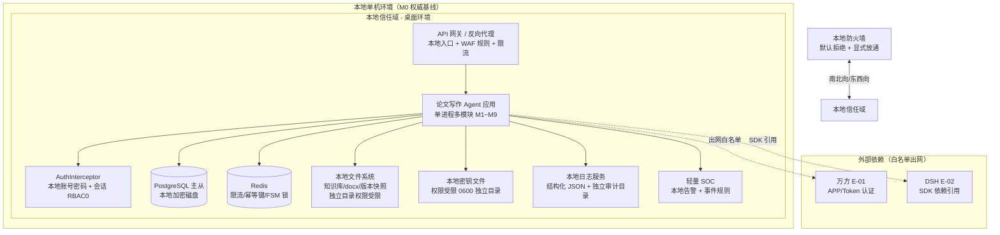

# AICoding 架构设计 · 安全设计

> **现行名称与依赖裁决：** 产品名称为 **Deep Thesis**。当前实现不保存或调用 DeepSeek-Harness 凭据；文中 DSH 密钥与网络节点属于早期架构假设，现行密钥边界以 DeepSeek API 配置和代码实现为准。

> 本文档为《AICoding 架构设计》核心产物之一，对应**《安全架构设计模版》**。
> **安全设计 Owner**：security-architect（严守正），Phase 5 / Gate = **G5**。
>
> **演进式双轨写法说明（用户核心约束）**：系统 MVP 优先**本地单机桌面化**，后续可 Tauri 套壳，云端 SaaS 为远期演进。因此本文档按 **M0 / M1 / M2** 三档演进描述安全基线：
>
> | 档位 | 部署形态 | 安全基线口径 |
> | --- | --- | --- |
> | **M0（MVP 基线）** | 本地单机桌面化（单进程多模块 + 本地 PostgreSQL + Redis + 本地文件系统） | 本地密钥文件 + 本地防火墙 + 本地轻量 WAF 规则 + 轻量 SOC；**本文档权威基线** |
> | **M1（机构推广）** | 私有化单机 / 局域网部署 | 在 M0 基础上强化：堡垒机、集中日志、机构级账号体系 |
> | **M2（远期演进）** | 云端 SaaS（多租户 VPC / 云 KMS / 云 WAF 集群 / 完整 SOC） | 云 KMS + 云 WAF + 堡垒机 + 完整 SOC；**仅作为演进蓝图，不作 M0 硬性基线** |
>
> **引用关系**：本文档对《系统设计》§7 安全设计做**深化承接**；§5（网络与基础设施安全）中与平台相关的 VPC / 子网 / CIDR 拓扑骨架以 `platform-architect` 为权威方，本文档按拓扑落实 WAF / IAM / 安全组策略；安全组规则、WAF 规则、密钥分级、审计字段与保留期、审计维度以本文档（security）为权威方。

---

## 1. 安全总体架构

### 1.1 安全总体架构图

> **总览**：本文档以 **M0（本地单机桌面化）** 为权威基线叠加安全组件，**M2（云端 SaaS）仅作为演进蓝图说明**，不将其强约束绑定到 MVP。下表为 M0 实际涉及的安全组件清单，M2 演进组件以「演进蓝图」列示。

**M0 安全总体架构（本地单机桌面化）**：

**M2 云端 SaaS 演进蓝图（不作 M0 硬性基线）**：

| 演进组件 | M0（本地，权威基线） | M2（云端演进蓝图，仅说明） |
| --- | --- | --- |
| 信任域划分 | 本地单机 = 单一信任域（本地防火墙 + 进程隔离 + OS 级权限） | DMZ VPC + 业务 VPC + DevOps VPC 三级信任域 |
| 流量入口 | 本地 API 网关 + 本地 WAF 规则 | 公网 LB（TLS 终结）+ 云 WAF + DDoS 高防 |
| 密钥管理 | 本地密钥文件（权限受限，非代码库） | 云 KMS 白盒 + 凭据管理中心（SSM） |
| 数据存储加密 | 本地磁盘加密 + 敏感字段本地密钥文件加密 | 云 KMS 托管 + 对象存储 SSE / 数据库 TDE |
| 运维通道 | 本地运维（本机 shell + 受限账号） | 堡垒机（运维日志全录）+ 安全审计（DBAudit） |
| 安全运营 | 轻量 SOC（本地日志 + 告警） | 完整 SOC（CLS 集中日志 + 云安全监控 + 攻防演练） |
| 多租户隔离 | 会话绑定式逻辑隔离（session_id） | 物理隔离（独立 VPC / 独立库）+ 逻辑隔离（RBAC + 行级） |

### 1.2 威胁模型

> **总览**：采用 **STRIDE** 方法识别威胁，每条威胁必须映射到第 2~7 章的某项缓解措施，形成「威胁—缓解措施映射表」。本文档针对 **M0 本地单机桌面化** 场景建立基线，同时标注 **M2 云端演进** 时新增的威胁面。

#### 1.2.1 STRIDE 威胁清单（M0 权威基线）

| 威胁类别（STRIDE） | 典型攻击方式 | 涉及资产 / 接口 | 是否成为 M0 现实威胁 | 对应缓解措施章节 |
| --- | --- | --- | --- | --- |
| 仿冒（Spoofing） | 本地明文存储密码被读取；本地密钥文件被越权读取；万方 app-token / DSH api-key 泄露后伪造身份调用 | 本地账号、本地密钥文件、万方（E-01）app-token | 是（本地单机但密钥文件权限/明文密码是主要风险面） | §2.1 身份认证（bcrypt 哈希、本地密钥文件权限管控）+ §6 密钥管理 |
| 篡改（Tampering） | 本地数据库/知识库/配置文件被非授权修改；审计日志被删除；FSM 状态被篡改绕过合规红线 | PostgreSQL、本地文件系统、t_guardrail_log、t_fsm_state | 是（本地单机，文件系统与 DB 暴露面由 OS 权限决定） | §3 数据安全 + §4.1 输入安全（参数化/签名）+ §7.2 审计日志不可篡改 |
| 否认（Repudiation） | 用户否认"我提交了某引用/某环节结论"；管理员否认"我改过某配置"；缺少操作留痕 | 业务操作、Guardrail 命中、知识库操作、配置变更 | 是（合规红线需留痕，学位追溯关键） | §7.2 审计日志（谁/何时/对什么/做了什么/结果/来源 IP + 独立目录防篡改） |
| 信息泄露（Information Disclosure） | 日志明文打印 app-token / api-key / 密码；前端 URL 携带 token；导出 docx 未经授权读取 | 日志、本地密钥文件、docx 导出、知识库跨会话读取 | 是（敏感字段 L4：密码哈希、万方 app-token、DSH api-key） | §3 数据安全（分级/传输/存储脱敏）+ §4.2 输出安全 + §7.2 日志敏感字段排查 |
| 拒绝服务（DoS） | 本地单机资源耗尽（CPU/内存/磁盘）；万方取数被单用户高频调用导致计费超支；Redis 幂等键洪泛 | 本地进程、万方配额、Redis | 是（本地单机资源有限；万方为计费 API 是预算风险） | §4.3.2 防刷限流 + §3.5.3 限流约定（引用系统设计）+ §5.2 流量管控 + §3.2.M7 全局配额管控 |
| 权限提升（Elevation of Privilege） | 水平越权（IDOR：访问他人 session 的知识库/任务）；垂直越权（writer 越权访问 reviewer/manager 看板）；本地进程拿到不应访问的密钥 | session_id 隔离、RBAC 角色、本地密钥文件 | 是（RBAC0 + 会话绑定式隔离是核心防线） | §2.2 授权与权限控制（RBAC0 + 越权防护）+ §4.3.1 越权防护 |

#### 1.2.2 STRIDE → 缓解措施映射表

| STRIDE 类别 | 威胁点 | 缓解措施（映射到章节） | 关键控制点 |
| --- | --- | --- | --- |
| 仿冒（S） | 本地账号密码明文 | §2.1.1/§2.1.2：bcrypt 加盐哈希存储；登录失败锁定；密码策略 12 位+复杂度 | 密码永不明文入库；登录 5 次失败锁 15 分钟 |
| 仿冒（S） | 万方 app-token 泄露 | §6.1：app-token 入本地密钥文件（权限受限）；§6.3：严禁入代码/日志/URL | 密钥文件 0600 权限、独立目录；上线前密钥扫描 |
| 篡改（T） | FSM 状态 / 知识库被改 | §3.3.3：DB 最小权限、禁止业务直连 root；§3.2.M7.5：t_wanfang_query_log fabricated 恒 false | 写接口幂等 + DB 权限最小化 |
| 篡改（T） | 请求参数被篡改 | §3.2.4：接口签名 HMAC-SHA256 + nonce + timestamp 防重放；§4.1：参数化查询/CSRF | 写入类接口幂等 + 防重放 |
| 篡改（T） | 审计日志被删除 | §7.2：审计日志独立目录、与业务存储物理隔离、追加写、权限受限 | 日志不可篡改；合规红线日志 ≥ 5 年 |
| 否认（R） | 合规红线无留痕 | §7.2.4：t_guardrail_log 全量记录（谁/何时/什么/结果）；§1.2.3 红线日志独立目录 ≥ 5 年 | 学位追溯关键数据，不随普通日志清理 |
| 信息泄露（I） | 日志打印敏感字段 | §4.2.1 统一异常处理（不暴露堆栈）；§8.2.2 日志硬性要求（禁止打印敏感明文） | 日志敏感字段红线 |
| 信息泄露（I） | 导出 docx / 跨库读取越权 | §2.2.4：数据归属校验（session_id）；§3.3.5：导出审批 + 水印；§3.2.M9：跨库读取需用户显式授权 | 数据级行级归属校验 |
| DoS | 万方计费超支 | §3.2.M7.5：全局日/月配额上限（2000 次/天、50000 次/月）；触顶降级 + P2 告警 | 配额计数用 Redis 原子计数 |
| DoS | 本地资源耗尽 | §5.2：本地入口限流 + 单会话/单 IP/单用户限流；§3.5.3：限流红线 | 超限返回 C429001 |
| DoS | 重保接口刷频 | §3.5.3：万方取数/HITL 确认单用户 5 次/分钟，锁 15 分钟 | 敏感接口重保限流 |
| 权限提升（E） | 水平越权（IDOR） | §2.2.4 / §4.3.1：每个查询/修改接口必须校验资源归属（session_id）；列表+详情双检 | 归属校验在 DAO 层强制 |
| 权限提升（E） | 垂直越权 | §2.2.1：RBAC0（writer/reviewer/manager）；§4.3.1：RBAC + 接口拦截器双层校验 | 接口级权限标签 @require_role |
| 权限提升（E） | 本地进程越权读密钥 | §6.1：密钥文件权限受限（0600）；§6.3：需要密钥的模块按最小权限获取 | 密钥读取最小化 |

#### 1.2.3 M2 云端演进新增威胁（仅标注，不作 M0 基线）

| STRIDE | M2 新增威胁 | 演进缓解（M2 方案） |
| --- | --- | --- |
| 仿冒（S） | 公网仿冒登录 / AKSK 泄露 | 云 SSO / OIDC + MFA；KMS 白盒保护 AKSK + CAM 策略限制 |
| 篡改（T） | VPC 东西向渗透 | DMZ / 业务 / DevOps VPC 分区 + 云防火墙东西向策略 |
| 信息泄露（I） | 云存储 / 对象存储泄露 | 云 KMS 托管 + 对象存储 SSE / CSE + 私有桶预签名 URL |
| DoS | 公网 DDoS / CC | DDoS 高防 + 云 WAF 集群 |
| 权限提升（E） | 云账号被接管 | 子账号 + 权限分离 + 高敏权限分离 + 堡垒机运维 |

---

## 2. 身份与访问管理（IAM）

> **本节基准**：M0 本地单机桌面化，自建本地账号体系。认证方式 ≥ 2 种（账号密码 + 会话 Token 双重校验；M2 演进叠加 SSO / OIDC）。

### 2.1 身份认证（Authentication）

#### 2.1.1 用户登录

**M0 基线**：

- **多种登录方式**：本地**账号密码**（主登录方式）+ **本地会话**（登录成功后建立 Session，写入 session_id）。MVP 阶段本地单机，不启用手机验证码/邮箱验证码/第三方 OAuth（本地无外发短信/邮箱通道，避免增加外部依赖）。
- **图形验证**：MVP 本地单机、高危接口（登录）可配置本地图形验证码，防止脚本爆破（本地进程内）。管理端看板（/manager/guardrail）登录强制图形验证。
- **MFA / 2FA**：MVP 本地单机**不强制启用 MFA**（与《系统设计》§7.2.1 一致，避免引入外部 OTP 通道）；但为**高敏操作**（导出 docx、批量删除、Guardrail 配置变更、密钥变更）提供**二次确认**（见 §4.3.5）。**M2 演进**：接入统一 SSO / OIDC，管理端子账号强制 MFA（密码 + OTP）。

**M2 演进补充**：接入统一 SSO（OIDC / SAML / CAS），支持机构统一账号；管理端、敏感操作、控制台子账号强制 MFA。

#### 2.1.2 密码策略（量化阈值）

> **说明**：《系统设计》§7.2.1 已冻结「最小长度 12；复杂度（大小写 + 数字 + 符号）」，本文档以此为准，其余项按本地单机基线设定。

| 项 | 基线值（M0 权威值） |
| --- | --- |
| 最小长度 | ≥ 12 位（本地账号，权威值） |
| 复杂度 | 同时包含数字、大写字母、小写字母、特殊符号（大小写 + 数字 + 符号，权威值） |
| 加密传输 | 本地 HTTP（进程内/本机回环）；外网入口（M1/M2）前端 RSA 加密提交，密文传输 |
| 加密存储 | **bcrypt 加盐哈希**；禁止 MD5 / SHA1 / 明文 |
| 更换周期 | 默认 90 天提醒（可配置） |
| 重复限制 | 不允许使用最近 5 次的密码 |
| 失败锁定 | **连续失败 5 次锁定 15 分钟**（权威值；与 §3.5.3 重保接口锁定一致） |
| 自动登出 | 30 分钟无操作自动登出（配置项；HITL 敏感操作中断需重新登录） |
| 注册策略 | 不允许用户自行注册，仅管理员创建；改密需原密码验证（本地自建账号） |

#### 2.1.3 会话管理

- **Token 类型**：本地 **Session ID**（写入 Cookie `HttpOnly + Secure` + `SameSite=Lax`），**禁止 URL 携带 token**；前端路由守卫用 `meta.requireAuth` + `meta.roles` 拦截（引用 §3.5.5）。
- **有效期**：**会话 Token 8h**（权威值，与《系统设计》§7.2.1 一致），提供续期与主动注销接口（Session 注销 / 续签机制）。
- **会话绑定式隔离**：与会话强绑定 session_id（引用 §2.2.3 多租户隔离）。同会话（同 session_id）访问其专属任务、知识库、版本快照；跨会话访问需用户显式授权。
- **互踢机制**：管理端同账号仅允许单设备登录，新登录踢掉旧会话，异地登录需提示。
- **风险登录**：异地 / 异常登录二次验证；本地单机无异地概念，但对「非常用设备 IP、连续失败、夜间高频登录」记录登录异常日志并触发告警（引用 §7.1 登录异常监控）。

### 2.2 授权与权限控制（Authorization）

#### 2.2.1 权限模型

默认采用 **RBAC0**（用户—角色—权限）。本系统三种角色：**writer（学生/写作者）**、**reviewer（导师/审阅者）**、**manager（院校学位管理者）**，与《系统设计》§7.2.5、§2.1、§3.5.5 前端路由角色严格一致。权限粒度敏感场景（如知识库跨会话读取、导出 docx、Guardrail 看板）叠加 **ABAC**（属性条件 = session_id 归属 + 资源角色）。

**角色—权限矩阵**：

| 角色 | 前端路由（引用 §3.5.5） | 核心权限 | 禁止事项 |
| --- | --- | --- | --- |
| writer（学生/写作者） | `/workbench` `/workbench/rings/:ringNo` `/workbench/hitl` `/workbench/template` `/workbench/kb` | 创建任务、上传模板、十环节执行、敏感环节 HITL 提交、知识库读写（增/读，不可删改已有条目） | 不可访问 reviewer 待确认 / manager 看板；不可跨会话读其他库 |
| reviewer（导师/审阅者） | `/reviewer/pending` | 待确认队列处理、敏感环节确认（环节 2/4/8/10 放行/打回） | 不可修改学生内容产物 |
| manager（院校学位管理者） | `/manager/guardrail` | 合规留痕看板、Guardrail 日志查看 | 不可修改学生内容产物与 FSM 状态 |

#### 2.2.2 权限维度

- **接口级**：本地 API 网关统一鉴权 + 接口签名（HMAC-SHA256，见 §3.2.4）；`AuthInterceptor`（FastAPI 中间件）拦截 + 角色标签 `@require_role`（引用 §3.4 跨模块公共能力）。
- **数据级**：行级（按归属人 / **session_id** / 租户）、列级（字段脱敏，见 §3.3.5）。
- **功能级**：菜单、按钮、操作细粒度控制（前端路由 `meta.roles` + 后端接口角色标签双层）。

#### 2.2.3 多租户隔离

**M0 基线：逻辑隔离（会话绑定式）**。隔离字段 = `session_id`（引用《系统设计》§4.1 全局数据约定与 §7.2.5）。每个用户会话拥有专属任务、专属知识库（kb_bound_session 表会话强绑定）、专属版本快照；Agent 默认仅读写当前绑定知识库，**禁止跨会话访问**，仅用户手动挂载其他独立知识库后才开放跨库读取（引用 _runtime_meta §8.1/§8.2 内容硬性隔离规则）。

**M1/M2 演进**：M1 私有化单机/局域网，默认物理隔离（独立实例/独立库）；M2 云端 SaaS 支持独立 VPC / 独立库（物理隔离）+ RBAC + 行级（逻辑隔离）双重。

#### 2.2.4 越权防护

- **水平越权（IDOR）**：每个查询 / 修改接口必须校验资源归属（session_id）。知识库实体、任务、版本快照、docx 导出均做归属校验；列表与详情接口双层校验（引用 §3.2.M9 跨库读取需用户显式授权）。
- **垂直越权**：由 RBAC0 + 接口拦截器双层校验（`@require_role`）；写入使用 DB 唯一索引 / 归属唯一键兜底。

### 2.3 云账号与云资源访问

> 本节为 **M2 云端演进**（SaaS）方案；**M0 本地单机不涉及云账号**，标注为「不适用（本地单机，无云资源）」。

#### 2.3.1 账号策略

M2 演进：使用子账号访问云资源，**禁止直接使用主账号**，禁止为主账号创建访问密钥（AKSK）。M0 标注：不适用（本地单机，无云账号）。

#### 2.3.2 权限分离

M2 演进：人员权限（密码 + MFA，控制台 / 堡垒机使用）与服务权限（AKSK / Token，应用调用使用）分离。M0 标注：不适用（本地自建账号 + 本地密钥文件，无云 AKSK）。

#### 2.3.3 高敏权限分离

M1 演进：高敏操作（Guardrail 配置变更、密钥变更、批量导出）账号权限与低敏隔离；M0 通过本地 OS 用户权限 + 密钥文件权限（0600）隔离实现。

---

## 3. 数据安全

### 3.1 数据分级

> **说明**：本系统业务数据含用户密码、万方 app-token、DSH api-key、论文内容、知识库、Guardrail 合规日志等。按敏感等级 L1~L4 分级，并据此确定加密 / 脱敏 / 审计策略。

| 等级 | 类别 | 本系统示例 | 处理策略 |
| --- | --- | --- | --- |
| L1 | 公开 | 产品介绍、公开 API 文档（/api/v1/... 文档） | 无特殊管控要求 |
| L2 | 内部 | 业务配置、FSM 运行状态、环节进度、内部流程 | 需内部鉴权（登录 + 角色）访问 |
| L3 | 敏感 | 论文任务、选题、文献池、大纲、章节草稿、润色稿、引用映射、排版稿、知识库实体、万方取数日志 | 加密传输、脱敏展示、访问审计；本地单机本地存储 |
| L4 | 高敏 | 用户密码（bcrypt 哈希）、万方 app-token、DSH api-key、Guardrail 合规红线日志（t_guardrail_log） | 基于本地密钥文件加密、强脱敏（不展示）、严格审计；合规日志独立目录防篡改，保留 ≥ 5 年 |

**敏感字段处理策略表**（对齐《系统设计》§7.2.2）：

| 字段 | 分级 | 存储策略 | 展示策略（脱敏） | 导出策略 |
| --- | --- | --- | --- | --- |
| 用户密码 | L4 | **bcrypt 加盐哈希**（不可逆） | 不展示 | 禁止导出 |
| 万方 app-token | L4 | **本地密钥文件（权限受限 0600，非代码库）** | 不展示 | 禁止导出 |
| DSH api-key | L4 | **本地密钥文件（权限受限 0600，非代码库）** | 不展示 | 禁止导出 |
| 论文内容（草稿） | L3 | 本地文件系统 + 本地磁盘加密 | 界面正常展示 | 导出 docx 需用户权限校验 |
| 知识库实体 | L3 | 本地独立目录（与业务存储隔离） | 界面正常展示 | 批量引用导出需权限 + 审计 |
| Guardrail 合规日志 | L4 | 独立目录防篡改追加写 | 看板按 manager 角色展示 | 禁止导出，保留 ≥ 5 年 |

### 3.2 数据传输安全

#### 3.2.1 公网访问

**M0 基线**：本地单机桌面化，本地回环/局域访问走 HTTP；对外暴露（M1/M2 需要公网 / LAN 访问时）全链路 "HTTPS / TLS 1.2+"，禁用 SSLv3、TLS 1.0/1.1。

#### 3.2.2 服务内部访问

**M0 基线**：本地单机，模块间**进程内调用**，不启用 mTLS（引用《系统设计》§6.3 内部 mTLS 不启用）。模块间通过进程内事件 + 同步调用交互，无跨网络传输。

**M2 演进**：高敏感、跨租户访问启用 mTLS 双向证书认证，认证服务访问身份。

#### 3.2.3 数据库连接

**M0 基线**：本地 PostgreSQL，连接走本机回环 / 本地套接字；本地磁盘加密。数据库账号最小权限、禁止业务直连 root。

**M2 演进**：高敏感、跨租户访问启用 SSL（MySQL / PostgreSQL / MongoDB 内置功能）。

#### 3.2.4 接口签名

**M0 基线**（本地 API 网关对外接口，含 M1/M2 外部集成的签名防线）：采用 **HMAC-SHA256 防篡改 + nonce + timestamp 防重放**。调用方持有密钥（入本地密钥文件），对请求体关键字段 + nonce + timestamp 做 HMAC 签名，网关侧校验；nonce 在 Redis 中短期去重（5 分钟），timestamp 超时（±5 分钟）拒绝，防重放。

**签名基线**：

| 项 | 取值 |
| --- | --- |
| 算法 | HMAC-SHA256 |
| 防重放 | nonce（唯一，Redis 去重 5 分钟）+ timestamp（±5 分钟窗口） |
| 密钥 | 本地密钥文件（权限受限）；签名密钥与认证密钥分离 |
| 覆盖字段 | 请求方法 + 路径 + 请求体关键字段 + nonce + timestamp |
| 应用范围 | 本地 API 网关对外接口；M7 万方取数等外部集成接口 |

#### 3.2.5 传参禁忌

> **禁忌**（适用于 M0 及全部演进档位）：

- **禁止 URL（GET 参 / 路径）携带 token、AKSK、app-token、api-key、手机号等敏感信息**；
- 敏感数据一律走 POST / PUT body + HTTPS（M1/M2）；本地单机走 JSON body；
- 会话 Token 放 Cookie（`HttpOnly + Secure + SameSite`），不放 URL；
- 日志禁止打印敏感字段明文（万方 app-token / DSH key / 用户密码）。

### 3.3 数据存储安全

#### 3.3.1 加密存储（仅敏感数据需要）

- **对称加密**：AES-256（业务侧大数据量，M2 演进用于对象存储 / 大数据量；M0 本地敏感字段用本地密钥文件加密）。
- **非对称加密**：RSA（密钥交换、签名）。
- **落盘加密**：M0 本地磁盘加密（OS 级 LUKS / BitLocker）+ 本地文件系统；DB 本地磁盘加密。**全库不启用 TDE**（本地单机，与《系统设计》§7.2.2 一致）。**M2 演进**：数据库、对象存储（COS）启用服务端加密（SSE）；高敏数据使用客户端加密（CSE）。
- **密钥管理**：M0 用**本地密钥文件**（权限受限，**禁止硬编码到代码或配置文件**）；M2 演进用 KMS 托管。

#### 3.3.2 敏感字段单向哈希加盐

密码、token 摘要等不可逆字段：**bcrypt 加盐哈希**（用户密码）；万方 app-token / DSH api-key **不入库明文**，仅以密文形式入本地密钥文件，DB 不存储其明文（引用 §3.1 敏感字段处理策略表）。

#### 3.3.3 数据库安全

- 账号最小权限；**禁止业务直连 root**；运维使用单独账号（本地 PostgreSQL 权限分离）。
- 开启慢查询日志、审计日志；日志独立存储（本地独立目录，M2 演进至 CLS / COS）。
- 启用 SSL 连接（M1/M2）、备份加密。本地单机数据库审计开启（引用 §7.2.3 数据库审计维度）。

#### 3.3.4 文件存储安全

涉及敏感文件（用户上传 Word 模板、docx 产物、知识库文件）存储与分享时：

- 本地文件系统启用权限受限目录（独立目录，用户级权限 0700 目录 / 0600 文件）；
- 敏感文件访问需 session_id 归属校验（禁止跨会话访问）；
- **M2 演进**：启用服务端加密（SSE）；私有桶 + 预签名 URL（短有效期）；防盗链（Referer 校验）；上传文件病毒扫描 / 类型校验（魔数 + 扩展名 + 大小）。

**M0 文件类型校验**（本地上传 Word 模板）：扩展名白名单（.docx）+ 魔数校验 + 大小限制（如 ≤ 50MB）+ 随机重命名（避免路径穿越）。

#### 3.3.5 数据使用安全

- **展示脱敏**：本系统不直接展示手机号 / 身份证 / 银行卡（无此类业务敏感字段），但对论文内容中的作者姓名（若含隐私）、知识库实体做必要的界面遮蔽；对敏感字段（app-token / api-key）**一律不展示**。示例：万方取数 token `wanf****abcd`。
- **数据导出管控**：导出 docx 走审批流（M0 为登录 + 角色权限校验；M1/M2 增加导出审批流）+ 水印（操作人 + 时间）+ 行数限制 + 操作审计。引用生成（批量引用导出）需用户权限 + 审计。
- **数据销毁**：知识库 / 会话删除后本地保留 7 天回收站，支持恢复，逾期永久清除（引用 _runtime_meta §8.1 回收站机制）；逻辑删除 + 定期物理销毁；明确过期数据清理策略。

#### 3.3.6 数据备份与异地容灾

| 存储类型 | 备份策略（M0/M1 本地基线） | M2 演进 |
| --- | --- | --- |
| PostgreSQL（主从） | 周期性备份，跨地域备份至 COS（M1/M2）；本地做定期全量 + WAL 增量 | 跨地域备份至对象存储 |
| Redis | RDB + AOF，按 RPO 选择性异地 | 跨 Region 复制 |
| 本地文件系统（知识库/docx/版本快照） | 本地 RAID1 + 定期备份到本地/异地存储 | 对象存储跨地域复制 |

**RPO / RTO**：RPO ≤ 6h；RTO ≤ 30min（引用《系统设计》§5.3 SLA、§2.5 质量目标 Q5）。每年 ≥ 1 次灾备演练。

#### 3.3.7 隐私合规

> **说明**：本系统面向国内教学 / 科研场景，用户为校内学生 / 导师 / 院校管理者。

- **个人信息保护**：遵循《个人信息保护法》、《数据安全法》；本系统涉及用户账号信息与论文内容，属论文场景，**不采集**手机号、身份证、银行卡等强敏感个人信息（MVP 本地单机，无支付 / 实名实体）。如后续（M1/M2 机构推广）接入机构统一账号 / OIDC 需做个人信息权责与最小化采集设计。
- **GDPR / 数据出境**：本系统**数据本地驻留**（M0 本地单机、M2 部署在境内），**不涉及数据出境**；如未来需跨境传输（论文库或第三方），必须做数据出境合规评估。
- **用户同意机制**：隐私政策 + 用户明示同意；数据最小化采集；可被遗忘权（数据删除请求处理流程——回收站删除后彻底清除，见 §3.3.5）。
- **学术合规**：合规红线（t_guardrail_log）独立于普通日志，保留 ≥ 5 年（学位追溯），防篡改（引用《系统设计》§8.2.1）。

---

## 4. 应用安全

> **说明**：本章涉及输入 / 输出防护、业务逻辑安全、第三方与供应链安全。M0 本地单机桌面化，应用为 FastAPI 后端 + 前端（后续 Tauri 套壳），对外暴露面小（本地回环 / 局域网），但 OWASP 防护不可省略。

### 4.1 输入安全

> **说明**：以 OWASP Top 10 为典型风险场景，结合本系统（Web / API + fastapi + docx 处理 + 用户上传模板 + 万方/DSH 外部集成）实际暴露面梳理。每项均为**明确防护措施**，非泛化描述。

| 风险（OWASP） | 防护措施（针对本系统的具体实现） |
| --- | --- |
| **A02 失效的认证** | 登录失败锁定（5 次锁 15 分钟）+ bcrypt 哈希 + 会话绑定 session_id + AuthInterceptor 统一鉴权 + 路由守卫 `meta.requireAuth`；密码策略 12 位+复杂度 |
| **A01 注入（SQL 注入）** | 强制参数化查询（SQLAlchemy ORM 参数绑定 / PreparedStatement）；动态字段（order by / group by）使用白名单模板校验；禁止字符串拼接 SQL |
| **A03 注入（XSS）** | 输出编码（HTML / JS / URL 转义）+ CSP 策略（`default-src 'self'`）+ Cookie `HttpOnly + Secure`；前端对用户内容（笔记/文献）做转义渲染 |
| **A04 不安全设计（CSRF）** | CSRF Token（本地会话防跨站请求）+ SameSite Cookie（`SameSite=Lax`）+ 关键操作二次验证（导出 docx、批量删除、Guardrail 配置变更） |
| **A04 不安全设计（越权）** | 水平越权（IDOR）：每个查询/修改接口校验资源归属（session_id）；垂直越权：RBAC0 + 接口拦截器双层校验；列表与详情接口双检 |
| **A03 注入（命令注入）** | 系统禁用动态命令执行；如需调用（如 docx 工具、外部 SDK）使用白名单参数化数组形式；禁止通过用户输入拼接 shell 命令 |
| **A08 软件和数据完整性（反序列化）** | 禁用危险反序列化（fastjson autoType、Jackson @class）；Python 侧禁用 `pickle.loads` 处理不可信数据；docx 解析用受控库（docxtpl / python-docx） |
| **A10 SSRF** | URL 白名单（仅允许万方 endpoint、DSH endpoint，引用 §6.2.2 出口白名单）+ 内网 IP 黑名单；禁止外部重定向 |
| **A05 安全配置错误（文件上传）** | 类型校验（扩展名 .docx 白名单 + 魔数校验）、大小限制（≤ 50MB）、随机重命名、隔离存储目录；禁上脚本/可执行文件 |
| **A05 安全配置错误（XXE）** | 关闭 XML 外部实体解析（DTD）；docx (OOXML) 解析禁用外部实体 |
| **A06 脆弱过时组件 / A09 日志敏感泄露** | 详见 §4.4 供应链安全与 §4.2 输出安全 |

> **说明**：模板共 9 个常见 OWASP Top 10 条目（SQL 注入、XSS、CSRF、命令注入、反序列化、SSRF、文件上传、XXE、开放重定向）+ 本系统新增「越权（A01/A04 不安全设计）」与「失效认证」「敏感日志泄露」共 12 项，每项均有明确、非泛化的防护措施。

### 4.2 输出安全

#### 4.2.1 统一异常处理

错误码及信息提示，**禁止暴露堆栈、SQL、内部路径**。统一错误响应结构（引用 §3.5.1）：`{ code, msg, msgI18n, data, traceId, tenantId, timestamp }`；业务错误（A 类）返回 HTTP 200 语义失败，系统错误（B 类）返回 5xx，客户端错误（C 类）返回 4xx。禁止把 Python traceback / SQL 语句 / 内部路径返回给前端。

#### 4.2.2 调试信息

调试信息（debug、stacktrace）**严禁出现在生产响应中**。本地开发可开启，但 M0 正式交付 / M1 机构推广禁用；异常日志中 ERROR 级别包含堆栈给运维排查，但界面只返回标准化错误消息。

### 4.3 业务逻辑安全

#### 4.3.1 越权防护

水平越权（IDOR）每个接口必检（数据归属校验 session_id）；垂直越权由 RBAC0 + 接口拦截器双层校验。知识库 / 任务 / 版本快照 / docx 导出均做归属校验；跨库读取需用户显式授权（引用 §2.2.4、§3.2.M9）。

#### 4.3.2 防刷防爬

限流（IP / 用户 / 接口三维度，引用 §3.5.3：全局 500 QPS、单会话 50、单 IP 100、单用户 30）、滑动验证码（登录）、设备指纹（M1/M2）。

#### 4.3.3 防薅羊毛 / 防计费超支

万方为计费 API，防预算超支：全局日调用上限（2000 次/天）、全局月调用上限（50000 次/月），触顶自动降级至「人工输入查新结论」并触发 P2 告警（引用 §3.2.M7.5 全局配额管控）。行为分析（结合 SOC 告警）。

#### 4.3.4 幂等性

防重复提交（前端 token + 后端唯一键幂等键 `X-Idempotency-Key` / `bizReqNo`）。写入类接口强制幂等（引用 §3.5.2）；FSM 推进 / 回退 / 万方取数 / docx 生成强制幂等（`bizReqNo`）。

#### 4.3.5 关键业务二次验证

导出 docx、批量删除、Guardrail 配置变更、密钥变更、用户角色变更等需二次确认（本地会话二次校验 / M1/M2 短信 / MFA）。对齐《系统设计》§7.1 敏感操作。

### 4.4 第三方与供应链安全

> 针对本系统引入的第三方组件进行安全性评估。

- 第三方组件漏洞扫描（公司组件安全扫描），CICD 强制门禁：Python 依赖（fastapi / sqlalchemy / redis / python-docx / docxtpl）纳入依赖漏洞扫描（pip-audit 等），M1/M2 在 CICD 强制门禁。
- **开源协议合规审查**：docx 相关库（docxtpl、openxml-audit）有 GPL / LGPL 条款，需评估商业风险（M1/M2 商用推广时重点核查）。
- 第三方服务接入安全评估：万方（E-01）为计费 API（app/token 认证），DSH（E-02）为 SDK 依赖引用（不 fork、不大改，见 _runtime_meta §6.1）；评估其数据传输、存储位置、合规资质。
- 供应商安全管理：合同含数据保护与审计条款；定期复评。
- 镜像源 / Maven 仓库 / NPM 仓库使用「内网镜像 + 白名单」，避免被投毒（M0 本地用可信 PIP 源，锁定版本；M1/M2 内网镜像）。

---

## 5. 网络与基础设施安全

> **说明**：本章按演进式双轨描述。**M0 本地单机桌面化**为权威基线（无云 VPC / 子网 / CIDR），**M2 云端 / M1 私有化**为演进蓝图。网络拓扑骨架（VPC / 子网 / CIDR、节点清单）以 `platform-architect` 为**权威方**（本章已按其权威拓扑回填），本文档按拓扑落实 WAF / IAM / 安全组策略；**安全组规则、WAF/DDoS 厂商与版本、密钥分级、审计字段与保留期、审计维度以本文档（security）为权威方**。

### 5.1 网络分区

**M0 基线（本地单机桌面化，与 platform 拓扑一致）**：

- 本地单机 = **单一信任域**（桌面环境）。不引入云 VPC 分区（与用户约束一致，不把云 VPC / DMZ 硬绑定到 MVP）。跨 Region / 跨 AZ：**否**（本地单机）。
- **本地逻辑分区**（OS 级隔离）：应用进程（单进程多模块）、数据库（PostgreSQL）、缓存（Redis）、本地文件系统（知识库/docx/版本快照）、本地密钥文件、本地日志/SOC。
- **本地防火墙**：默认拒绝 + 显式放通。本地回环 / 局域网白名单；**禁止 0.0.0.0/0 开放 22 / 3306 / 6379 / 5432 等敏感端口**（本地 PostgreSQL / Redis 仅绑本机 127.0.0.1 / 本地 socket）。
- **进程隔离**：应用进程与本地密钥文件、数据库、文件系统做 OS 级权限隔离（不同 UID / 目录权限），密钥文件 0600、知识库目录 0700。
- 内部研发阶段外泄防护：本地开发环境与正式使用环境目录隔离；禁用把真实密钥 / token 带出环境。

**M1（私有化单机 / 局域网）演进**：

- 区分 **DMZ 区**（对外暴露，如校园网 / 局域网入口）、**业务区**（应用 + 中间件）、**运维区**（堡垒机 / 运维通道），避免网络渗透与内部外泄。
- 限制生产区与公网的通路，只能通过 NAT 网关出公网、CLB 等网络组件出入公网。

**M2（云端 SaaS）演进（蓝图，不作 M0 基线；CIDR 为示意值，以 platform 权威区为准）**：

| M2 分区 | VPC | 子网 / CIDR（示意） | 用途 | 安全组 / 边界规则（security 权威） |
| --- | --- | --- | --- | --- |
| DMZ VPC | `vpc-dmz-saas`（对外暴露） | dmz-public 子网 `10.10.0.0/24` | 公网入口、LB / API 网关 / WAF | 仅对公网 443 放通；禁止直接访问业务 VPC |
| 业务 VPC | `vpc-biz-saas`（dev / int / uat / prod 隔离） | prod `10.20.0.0/20`；uat `10.20.16.0/20`；int `10.20.32.0/20`；dev `10.20.48.0/20` | 应用 M1~M9 + 中间件（PG / Redis / FS / 调度） | 仅从 DMZ 入站；出站受 NAT 控制；生产子网严格入站 / 出站 ACL，最小化暴露 |
| DevOps VPC | `vpc-devops-saas` | ops `10.30.0.0/24` | CICD / 堡垒机 / 运维通道 | 仅运维专线 / 堡垒机接入；与业务 VPC 通过专用通道互联 |

- 三个 VPC 的 CIDR 不重叠（DMZ `10.10.x` / 业务 `10.20.x` / DevOps `10.30.x`）；容器 CIDR 与 VPC CIDR 不冲突。
- 限制生产 VPC 与公网的访问通路和方式，通常只能通过 NAT 网关出公网、CLB 等网络组件出入公网；仅业务 VPC 内应用层可访问中间件。

**节点清单对齐（platform 权威拓扑）**：本文档 security 组件对应 platform 节点如下——API 网关/反向代理（`R-N-004`）、论文写作 Agent 应用 M1~M9（`R-C-001`）、PostgreSQL 主从（`R-M-001`）、Redis（`R-M-002`）、本地任务调度（`R-M-003`）、本地文件系统（`R-M-004`）、**本地受限密钥文件（`R-Sec-001`）**、**WAF 规则（`R-Sec-005`，M2 蓝图引入）**、本地日志 + Prometheus + Grafana（`R-O-001~005`）、前端 3 控制台（`R-C-004`）、外部依赖 E-01 万方 / E-02 DSH / E-03 docxtpl / E-04 openxml-audit。

> ⚠️ **回填完成**：本节已按 platform 权威网络拓扑骨架回填 M2 的 VPC / 子网 / CIDR（示意值）与节点清单映射；CIDR 为演进蓝图示意，实际以 platform 部署设计权威值为准，本文档据此配置安全组 / IAM / 信任域策略。

### 5.2 流量管控（南北向 + 东西向）

#### 5.2.1 公网入口防护

**M0 基线**：本地 API 网关（反向代理 `R-N-004`）：仅暴露 443（HTTPS），80 强制跳 443（本地/LAN 访问）。本地入口链路 `127.0.0.1 / 机构内网 → 本机反向代理(R-N-004) → API 网关(R-N-004) → 业务模块(R-C-001)`；网关终结 TLS（内部明文），路由 / 鉴权 / 限流 / 真实 IP（X-Forwarded-For）。

**M1/M2 演进**：

- **DDoS 高防**：M2 用云 DDoS 高防（流量清洗，业务侧不感知；厂商与版本以 security 权威区为准，默认主流厂商标准版）。M0/M1 本地无公网大流量清洗需求，靠本地入口限流兜底。
- **WAF**：访问控制，黑白名单，攻击日志，请求清洗。**M0 用本地轻量 WAF 规则（`R-Sec-005`）**（请求头 / 路径 / 方法校验 + 敏感词过滤 + 本地规则基线）；**M2 用云 WAF 集群**（厂商与版本以 security 权威区为准，例如主流云 WAF 标准版，启用 OWASP 核心规则集 + CC 防护 + 自定义规则，日志接入集中审计）。
- CLB / Ingress：仅暴露 443（HTTPS），80 强制跳 443。M2 公网 LB 承担 TLS 终结。

**WAF / DDoS 厂商与版本（security 权威区，platform 按此配置）**：

| 组件 | M0（本地） | M1（私有化） | M2（云 SaaS） |
| --- | --- | --- | --- |
| DDoS | 不适用（本地入口限流兜底） | 可选厂商 DDoS 清洗（机构出口） | 云 DDoS 高防（标准版，清洗 + 资源弹性） |
| WAF | 本地轻量 WAF 规则 `R-Sec-005`（自建规则基线） | 应用层 TLS + 本地 WAF 规则 / 机构 WAF | 云 WAF 集群（厂商标准版，OWASP 核心规则集 + CC） |
| 日志 | 本地防火墙 / WAF 规则日志（独立审计目录） | 集中日志 | 云 WAF 攻击 / 访问 / 拦截日志接入 CLS + 审计 |

#### 5.2.2 网络边界防护

**M0 基线**：本地防火墙（默认拒绝 + 显式放通）；本地入侵防御开启（本地主机防护）。

**M1/M2 演进**：云防火墙：互联网边界墙 + NAT 边界墙 + 入侵防御开启，按需开启 VPC 间防火墙（M2 业务 VPC 与 DevOps VPC 间）。

#### 5.2.3 主机流量防护（安全组 / ACL）

**M0 基线（权威规则）**：

- 本地防火墙 + 本地安全组规则：默认拒绝 + 显式放通，**禁止 0.0.0.0/0 开放 22 / 23 / 3306 / 6379 / 5432 等敏感端口**。
- PostgreSQL（5432）只绑 127.0.0.1 / 本地 socket；Redis（6379）只绑本地 socket / 127.0.0.1 且强制鉴权。
- 对外只开放 Web 入口端口（如 8443，平台拓扑所示 HTTP(S)-8000/8443），其余关闭。

**M2 演进（安全组 / CIDR 规则，security 权威）**：

| 进出方向 | 源 / 目的 | 端口 | 策略 | 说明 |
| --- | --- | --- | --- | --- |
| 公网 → DMZ VPC | 0.0.0.0/0（经 WAF / LB） | 443（HTTPS） | 放通 | 仅公网 Web 入口，其余关闭 |
| DMZ VPC → 业务 VPC | dmz `10.10.0.0/24` → biz `10.20.0.0/20` | 8000 / 8443 | 放通 | 仅网关 → 应用；业务层禁止直达中间件 |
| 业务 VPC 内 → PostgreSQL/Redis | biz 应用子网 → `10.20.0.0/20` 子网 | 5432 / 6379 | 放通 | 仅应用层访问；禁止公网 5432/6379 |
| 运维 → 业务 VPC | DevOps `10.30.0.0/24` → biz | 22 / 堡垒机 | 放通（经堡垒机） | 运维通道走堡垒机全量审计 |
| 业务 VPC → 公网（出口） | biz → NAT → 公网 | 443 出站 | 白名单域名 | 仅万方/DSH endpoint（引用 §6.2.2 出口白名单） |

> **权威方注**：安全组 / CIDR 规则以本文档（security）为权威方定义；`platform-architect` 按此规则配置本地/云端资源。

#### 5.2.4 运维通道防护

**M0 基线**：本地运维走受限 shell + 独立账号（禁止 root 直接操作应用数据）；本地堡垒机 / 审计通道开启（轻量）。

**M1/M2 演进**：堡垒机——运维日志、文件传输日志、数据库操作日志全量记录（引用 §7.2.4 堡垒机日志维度）；M2 DevOps VPC 内堡垒机作为唯一运维入口。

### 5.3 主机与容器安全

> 本系统**不采用容器**（本地单机进程部署，引用《系统设计》§7.1 容器安全「不适用：本地单机进程部署」）。因此 5.3 侧重主机与进程安全，容器 / K8s 安全作为 M2 演进蓝图。

#### 5.3.1 主机安全（M0 基线）

- 最小化安装、关闭非必要服务、定期补丁（OS 级）。
- 账号管控：**严禁 root 远程登录**，运维使用独立账号；本地应用进程（`R-C-001`）用独立运行用户。
- 登录密码：**优先 SSH 密钥登录（密钥对）**，密码登录仅作兜底（M1/M2 远程运维）；本地桌面登录走系统账号安全策略。
- 安装主机安全组件：本地主机安全（杀毒 / 漏洞扫描 / 木马查杀 / 密码破解阻断）。M1/M2 按公司安全要求安装主机安全组件（漏洞扫描、木马查杀、密码破解阻断、漏洞防御、漏洞自动修复）。
- 本地磁盘加密（LUKS / BitLocker）防止静态数据泄露。
- 本地数据备份到本地/机构存储（`R-M-004` 本地文件系统 + 定期备份），防单磁盘故障（RAID1 + 备份恢复，RTO ≤ 30min，见平台拓扑 `R-O-xxx` 监控）。

#### 5.3.2 容器 / K8s 安全（M2 演进蓝图，不作 M0 基线）

> **M0/M1 基线**：本系统本地单机/私有化单机**采用进程部署，不引入容器**（引用《系统设计》§7.1 容器安全「不适用：本地单机进程部署」）。因此以下仅作 M2 云端 SaaS 演进蓝图，**不作 M0 硬性基线**。

- K8s RBAC 最小化、NetworkPolicy 隔离命名空间、Pod 安全策略。
- 容器镜像扫描（漏洞、敏感信息）、本地 + 仓库镜像风险扫描。
- 异常进程监控、容器逃逸检测、K8s API 异常请求监控。
- **不在镜像中打包密钥**；通过 KMS / 配置中心运行时下发。
- 禁止特权容器、高权限容器。

> **平台拓扑对齐**：M0/M1 无容器（进程部署 `R-C-001`），M2 云端演进时引入 K8s / 容器运行时，按本节的 K8s 安全蓝图落地，并纳入 DevOps VPC 管控。

### 5.4 中间件安全

#### 5.4.1 网络隔离

**M0 基线**：PostgreSQL / Redis 仅本地回环 / 本地 socket 可访问；**禁止公网暴露**（本地单机，中间件不对外）。

**M2 演进**：仅业务 VPC 内的应用层可访问；禁止公网暴露。

#### 5.4.2 强制鉴权

**M0 基线**：数据库、Redis 强制鉴权，**修改默认账号**（PostgreSQL 超级用户改名，Redis 不设默认密码 / 必须认证），Redis 开启 `requirepass`；本地 PostgreSQL 开启密码 / 密钥认证。

#### 5.4.3 审计

**M0 基线**：本地 PostgreSQL 开启审计日志（慢查询 + 连接 + 关键 DML）。**M2 演进**：启用审计日志，关键中间件接入数据安全审计（DBAudit）。

---

## 6. 密钥与凭证管理

> **说明**：本章密钥分级与访问控制以本文档（security）为**权威方**（SEC-01~05），M0 本地单机密钥管理基线为**本地密钥文件（权限受限，非代码库，`R-Sec-001`）**；M2 演进为云 KMS / Vault（实例命名由 platform 权威区提供，下文给出 security 侧引用命名）。

### 6.1 密钥分级与存储（SEC-01~05）

> **权威方声明**：本表的密钥分级（SEC-01~05）、访问控制、轮转周期由 security 定义，`platform-architect` 按其配置本地密钥文件 / 云 KMS / Vault。

| 编号 | 密钥类型 | 存储 / 管理方式（M0 权威基线） | M1 / M2 演进方式 |
| --- | --- | --- | --- |
| **SEC-01** | **数据库密码**（PostgreSQL 主从 `R-M-001` / Redis `R-M-002`） | 本地密钥文件（权限受限 0600，独立目录）；配置中心加密 / 本地 Secret 文件 | 凭证管理中心（SSM）动态获取；M2 云 KMS 托管 |
| **SEC-02** | **云 AKSK**（M2；M0 无云） | M0 标注：**不适用（本地单机，无云 AKSK）** | KMS 白盒密钥 + SSM 凭据动态获取；CAM 策略限制（方案见 §6.2） |
| **SEC-03** | **服务间通信密钥**（本地模块间 HMAC-SHA256 签名密钥，与认证密钥分离） | 本地密钥文件（`R-Sec-001`） | 云 KMS / Vault 托管 |
| **SEC-04** | **用户密码** | **bcrypt 加盐哈希**（不可逆，存储于 PostgreSQL） | bcrypt 加盐哈希（不可逆） |
| **SEC-05** | **API Key / Token**（万方 app-token、DSH api-key） | 本地密钥文件（`R-Sec-001`，权限受限，非代码库） | 分级授权、可撤销、有限期（云 KMS / Vault） |

**密钥文件管理基线（M0 权威，对齐 `R-Sec-001`）**：

| 项 | 取值 |
| --- | --- |
| 存放方式 | 本地密钥文件 `R-Sec-001`（独立目录，权限 0600 文件 / 0700 目录），**非代码库**（引用《系统设计》§5.1 L4 Secret） |
| 下发方式 | 本地环境变量 + 受限权限文件（引用 §5.1 L4 Secret 层；对齐 platform `R-Sec-001`） |
| 存放内容 | SEC-03 签名密钥、SEC-05 万方 app-token / DSH api-key、SEC-01 数据库密码、Redis 密码 |
| 轮换策略 | **定期轮换；轮换周期基线 90 天；轮换需重启进程**（引用 §7.2.3，SEC-01/03/05 均适用） |
| 获取时机 | 进程启动时从密钥文件加载到内存，**不在内存中缓存到生命周期外**（引用 §5.1 L4） |

**KMS / Vault 实例命名（M2 演进，security 引用 platform 权威区）**：

| M2 组件 | 实例命名（引用） | 用途 |
| --- | --- | --- |
| 云 KMS 主密钥 | `kms-thesis-master`（主密钥 ID 引用 platform） | 托管 SEC-01/02/03 敏感数据加密与 AKSK 白盒 |
| 云 KMS 数据密钥 | `kms-thesis-data`（对称加密） | AES-256 业务数据 / 对象存储加密 |
| 凭据管理中心（SSM） | `ssm-thesis-prod` / `ssm-thesis-uat` 等 | 动态下发 SEC-01/02 凭据，禁止明文落库 |
| Vault（自建） | `vault-thesis-prod`（可选，M2 自建场景） | 服务间密钥 / 动态凭据，替代本地密钥文件 |

### 6.2 AKSK 泄露防护

> M0 本地单机**不涉及云 AKSK**（标注「不适用」）。以下为 **M2 云端演进**方案（蓝图）。

#### 6.2.1 方案 A：KMS 白盒密钥

使用 KMS 白盒密钥功能加密 SecretId / SecretKey；业务模块通过 KMS SDK 解密拿到 AKSK 明文，再调用 SSM 接口获取凭据内容。

#### 6.2.2 方案 B：CAM 策略限制

通过云 CAM 权限策略，绑定资源访问权限，规避 AKSK 访问机制。

#### 6.2.3 KMS / Vault 访问策略（M2 演进，security 权威）

| 访问对象 | 访问策略（security 权威） |
| --- | --- |
| 云 KMS 主密钥 `kms-thesis-master` | 仅业务应用（`R-C-001`）与 SSM 服务凭身份可调用 `Decrypt`；**禁止**开发/运维账号直接调用主密钥解密；密钥管理员与使用账号权限分离 |
| 云 KMS 数据密钥 `kms-thesis-data` | 仅数据加密 DB / 对象存储可引用（`GenerateDataKey`）；禁止应用直接拿主密钥出明文 |
| SSM `ssm-thesis-prod` | 仅应用运行时凭据（service-account / CAM 角色）动态读取；禁止写入后台明文 |
| Vault `vault-thesis-prod`（自建） | 仅应用 sidecar / SDK 读取，启用 Audit Log 接入审计；禁止 root 直接读写 |

**KMS / Vault 轮转与访问控制（M2 演进）**：

- **轮转周期**：SEC-01/02/03/05 基线 **90 天**轮转（与 M0 一致）；KMS 主密钥按需轮转（年度复核 + 泄露即轮换）；SSM 凭据动态轮转。
- **权限边界**：密钥读取账号 = 服务身份（最小权限）；密钥管理账号 = 高权限分离（与 §2.3 云账号权限分离一致）。
- **访问审计**：KMS / Vault 的所有 `Decrypt` / `Read` 访问记录接入审计（云资源审计维度，见 §7.2）。

### 6.3 密钥使用红线

> M0 权威基线（全档位适用）：

- **严禁** AKSK / 数据库密码 / Token / app-token / api-key 出现在源码、Git 仓库、前端代码、日志、错误堆栈、URL、配置明文（引用《系统设计》§7.2.3 红线）。
- **禁止**多业务共用同一对密钥 / 凭证；按业务 / 环境隔离签发（本地密钥文件按业务分离）。
- 上线前必须通过代码扫描（可联动 CICD 流水线红线拦截）+ 镜像扫描，识别硬编码密钥。
- 密钥一旦疑似泄露，立即**吊销并轮换**；事后排查访问日志确认影响面。
- 每一对密钥 / 凭证明确所有人、用途、存储位置、轮换日期，**上线 checklist 中包含「密钥扫描通过」项**。
- M0 本地密钥文件需纳入备份（与业务数据同步备份，但权限受限）。

---

## 7. 运行时安全：监控、审计、应急

### 7.1 安全事件监控

**M0 基线（轻量 SOC）**：

- **入侵检测（IDS / IPS）**：本地主机安全告警、WAF 攻击日志、轻量 SOC 告警接入。
- **敏感操作**：数据导出（docx）、批量删除、密钥变更、用户角色变更、Guardrail 配置变更。
- **登录异常**：异地登录、连续失败（5 次锁 15 分钟）、夜间登录、非常用设备、本地异常登录高峰。
- **权限异常**：越权请求（session_id 归属校验失败）、敏感接口高频调用、非常规权限提升。
- 安全事件关联 **§8.4 告警体系**（引用《系统设计》）：P0~P3 分级，P0 关键告警（Guardrail 学术红线、DB 主库不可访问）≤ 5min 响应。

### 7.2 审计日志

> **说明**：审计日志 5 维度（云资源、业务操作、数据库、堡垒机、WAF）与保留期以本文档（security）为**权威方**定义；日志收集管道与存储（CLS 集中日志、本地日志 + Prometheus/Grafana `R-O-001~005`）由 `platform-architect` 承接，本文档定义审计字段、保留期、不可篡改要求。M0 本地单机不涉及云资源审计 / 云堡垒机 / 云 WAF；以下按「M0 本地 / M1-M2 演进」双标识。

| 审计维度 | 审计内容 | M0（本地） | M1 / M2（演进） | 保留期（security 权威） |
| --- | --- | --- | --- | --- |
| **云资源审计** | 事件名称、区域、时间、事件源、源 IP、请求 ID、操作者 | 不适用：本地单机无云资源 | 云资源审计日志（事件名称/区域/时间/事件源/源 IP/请求 ID/操作者） | M2：≥ 1 年 |
| **业务操作审计** | 操作时间、来源应用、来源类型、来源 IP、操作者、事件名称、读写类型、扩展字段 | 启用：本地业务操作审计（谁/何时/对什么/做什么/结果/来源 IP） | 启用：同上，集中至 CLS（`R-O-xxx` 日志 + CLS） | ≥ 1 年；合规红线 ≥ 5 年 |
| **数据库审计** | SQL、执行人、客户端 IP、时间、影响行数 | 启用：本地 PostgreSQL 审计（`R-M-001`；慢查询、登录、关键 DML） | 启用：数据库审计 + DBAudit | ≥ 1 年 |
| **堡垒机日志** | 主机 / 数据库运维日志、文件传输日志 | 轻量：本地运维受限账号 + 本地运维审计 | 启用：堡垒机日志全量记录（M2 堡垒机 `vault`/运维） | ≥ 1 年 |
| **WAF / 防火墙日志** | 攻击日志、访问日志、拦截记录 | 启用：本地防火墙 / 本地 WAF 规则日志（`R-Sec-005`） | 启用：云 WAF / 防火墙攻击/访问/拦截日志 | ≥ 1 年 |

**审计日志不可篡改保障（M0 权威）**：

| 项 | 取值 |
| --- | --- |
| 审计目录 | **独立目录**存储；与业务存储**物理隔离**（引用《系统设计》§7.2.4） |
| 追加写 | 审计日志追加写（Append-only），权限受限（写者只写不改 / 读者只读） |
| 保留期 | **≥ 1 年**（普通审计，与《系统设计》§8.2.1 一致）；**合规红线日志（t_guardrail_log）≥ 5 年**（学位追溯关键数据，独立目录防篡改，不随普通审计日志清理） |
| 必含字段 | 审计日志必须含「谁、何时、对什么资源、做了什么、结果如何、来源 IP」（引用 §7.2.4） |
| 敏感字段 | 审计日志禁止打印敏感字段明文（万方 app-token / DSH key / 用户密码） |
| 日志管道 | M1/M2 集中日志（CLS / `R-O-xxx`）承接审计日志存储；M0 本地独立审计目录 + 本地日志服务 |

### 7.3 应急响应

> **说明**：应急响应 5 类事件（漏洞、数据泄露、被攻击、密钥泄露、勒索病毒）。M0 本地单机开展轻量化响应；本文档同时给出 M2 规范化响应。

| 事件类型 | 应急预案（M0 本地基线） | M1/M2 规范化 |
| --- | --- | --- |
| **漏洞响应** | 定期依赖漏洞扫描（pip-audit）；发现高危漏洞 → 升级依赖 / 打补丁 + 重启进程；关闭受影响服务 | 漏洞响应 SOP + 紧急修复发布 + 漏洞通告；CICD 门禁拦截 |
| **数据泄露响应** | 立即封禁可疑访问（本地防火墙 / 关闭端口）；定位泄露路径（审计日志）；通知用户修改密码；评估影响面 | 数据泄露响应 SOP + 数据泄露通告 + 监管上报（如需）+ 影响评估 |
| **被攻击响应** | 本地防火墙临时封源头 IP；隔离受影响模块；恢复备份；留存攻击日志（WAF / 主机安全）；核实是否越过防线 | 被攻击响应 SOP（隔离 / 取证 / 恢复 / 复盘）；安全事件上报 |
| **密钥泄露响应** | 立即吊销泄露密钥（app-token / api-key / 数据库密码）；轮换新密钥；重启进程；排查密钥使用日志 | 密钥泄露响应 SOP（禁用 + 轮换 + 影响面排查） |
| **勒索病毒响应** | 本地磁盘加密 + 定期离线备份（防勒索）；发现异常加密行为立即断网隔离；从备份恢复；保留证据 | 勒索病毒响应 SOP（隔离 / 断网 / 备份恢复 / 上报） |

**备份与恢复**：明确 RPO / RTO（RPO ≤ 6h、RTO ≤ 30min）；**每年 ≥ 1 次灾备演练**（引用《系统设计》§5.3）。

**应急响应 P0~P3 分级（对齐 §8.4 告警体系）**：P0（业务中断 / Guardrail 红线阻断 / 关键指标严重劣化）、P1（部分功能受影响 / 万方 / DSH 不可用）、P2（单点异常但有冗余）、P3（趋势性预警 / 资源水位）。

---

## 附录 A：中间确认自检结果

> 按《阶段内中间确认协议》（intermediate_confirmation.md）§2 执行。本阶段需在 §1（威胁建模/STRIDE）、§2（IAM）、§3（数据分级/隐私合规）、§6（密钥与凭证）关键章节产出后各插入一次自检。

### A.1 §1 威胁建模自检（STRIDE 映射后）

- **§2.1 触发标准 #1（方案分歧型）判定**：未命中。本阶段威胁建模采用 STRIDE 六类威胁全覆盖，威胁面与缓解措施均对齐《系统设计》§7 安全设计（用户认证、数据安全、密钥、审计、访问控制），无新的未冻结方案分歧（`_runtime_meta` §0「MVP 以本地/单机与私有化部署为主」已冻结部署形态，SaaS 仅为演进蓝图）。
- **§2.2 触发标准 #2（不可逆/跨界）自检**：M0（本地单机）/ M1（私有化）/ M2（云端 SaaS）演进式双轨为**用户核心约束显式明示**（team-lead 注入："MVP 优先本地单机桌面化……云端 SaaS 为远期演进，不要把全部云端 VPC/DMZ 等强约束硬绑定到 MVP 基线"），非本阶段新增分歧。
- **§2.3 反向验证 3 问**：

| 问题 | 答案 | 证据 |
| --- | --- | --- |
| Q1：这个决策若 3 个月后被推翻，工程返工成本可控吗？ | 可控 | 返工范围 = 本文档 §1 威胁清单 + §5.1 网络分区 + §5.2 流量管控（若安全基线从"M0 本地"切换为"M2 云端"，需改写 §1.2.2 缓解映射、§5 全部、§5.3 容器安全、§6.2 AKSK 防护）；切换成本 ≈ 网络安全基线重排 + KMS/堡垒机/SOC 组件清单重排，估 2~4 人日（文档层）。且 M0/M1/M2 三档演进是用户明示要求，本文档以 M0 为权威基线、M2 仅作蓝图，两档并存不互相推翻 |
| Q2：这个决策的结果，用户 / 客户 / 监管能感知到吗？ | 用户可感知（本地部署形态层面），但该形态由用户原始诉求显式冻结，非本阶段新增 | 判断依据：M0 本地单机桌面化决定了用户"本机安装/本机使用/数据本机驻留"的感知；此形态由用户原始诉求"MVP 优先本地单机桌面化，后续 Tauri 套壳"显式指定，非本阶段新增对外承诺 |
| Q3：这个决策与用户原始诉求中显式提及的能力一致吗？ | 一致 | 直接引用 team-lead 注入用户诉求原文："MVP 优先本地单机桌面化，后续 Tauri 套壳；云端 SaaS 为远期演进，不要把全部云端 VPC/DMZ 等强约束硬绑定到 MVP 基线。"；本文档 §1.1 / §5 / §6 均以 M0 本地为权威基线、M2 仅作演进蓝图，完全一致 |

### A.2 §2 IAM 设计自检（IAM 后）

- **§2.1 判定**：未命中。IAM 采用 RBAC0（writer/reviewer/manager）与《系统设计》§7.2.5 / §2.1 / §3.5.5 前端路由角色完全一致；认证方式 ≥ 2（账号密码 + 会话 Token 双重校验）；密码策略（12 位 + 复杂度 + bcrypt + 5 次锁 15 分钟）、会话 Token 8h、会话绑定 session_id 均为《系统设计》§7.2.1 / §7.2.5 冻结值，非新方案分歧。
- **§2.3 反向验证 3 问**：

| 问题 | 答案 | 证据 |
| --- | --- | --- |
| Q1：返工成本可控吗？ | 可控 | 返工范围 = §2.1 认证方式 + §2.2 权限模型 + §2.2.3 多租户隔离；切换成本 ≈ 0.5~1 人日（若从 RBAC0 改为 RBAC1/ABAC 需重写接口鉴权与多租户隔离策略，估 2~3 人日，但当前 RBAC0+ABAC 为《系统设计》冻结值，非本次新决策） |
| Q2：用户/客户/监管可感知吗？ | 用户可感知（角色权限、会话 8h、登录锁定），但为《系统设计》冻结诉求落地 | 判断依据：RBAC 三角色（writer/reviewer/manager）决定用户可见的角色权限；会话 8h 决定用户重新登录频率；登录 5 次锁 15 分钟决定用户可见的账号安全交互。这些均为《系统设计》§7.2 冻结值，非本阶段新增 |
| Q3：与用户原始诉求一致吗？ | 一致 | 直接引用《系统设计》§7.2.1「账号体系：自建（本地）；密码强度：最小长度 12，复杂度（大小写+数字+符号）；登录失败锁定：连续失败 5 次锁定 15 分钟；Token 有效期：会话 Token 8h」；§7.2.5「权限模型：RBAC0（角色：writer/reviewer/manager）；多租户隔离：会话绑定式隔离（隔离字段 session_id）」。本文档 §2 完整对齐 |

### A.3 §3 数据分级与隐私合规章节自检

- **§2.1 判定**：未命中。数据分级 L1~L4、敏感字段（用户密码 bcrypt、万方 app-token、DSH api-key 入本地密钥文件）、合规红线日志（t_guardrail_log ≥ 5 年）均为《系统设计》§7.2.2 / §8.2.1 冻结值。
- **§2.2 触发标准 #2 自检（隐私合规）**：本系统**不涉及数据出境/跨境**（M0 本地驻留、M2 境内部署），不涉及 GDPR 跨境评估硬绑定；个人信息采集最小化（无手机号/身份证/银行卡）；合规框架取舍（个保法/数安法，不涉及 GDPR 出境）为**数据本地驻留的必然结果**，非需用户裁决的跨界感知决策。判断依据：无跨境传输、无个人敏感信息采集，不触发监管感知边界（驻留位置境内由部署形态决定）。
- **§2.3 反向验证 3 问**：

| 问题 | 答案 | 证据 |
| --- | --- | --- |
| Q1：返工成本可控吗？ | 可控 | 返工范围 = §3.1 数据分级表 + §3.3 存储/使用安全 + §3.3.7 隐私合规；切换成本 ≈ 0.5~1 人日（若敏感字段清单调整，需重写该字段的存储/脱敏/导出策略，估 1~2 人日） |
| Q2：用户/客户/监管可感知吗？ | 监管可感知（区分地方院校学术合规），但已由《系统设计》§8.2.1 冻结 | 判断依据：t_guardrail_log 保留 ≥ 5 年决定学位追溯与合规审计留痕；此保留期为《系统设计》§8.2.1 冻结值（合规红线日志 ≥ 5 年，学位追溯关键数据），非本阶段新增 |
| Q3：与用户原始诉求一致吗？ | 一致 | 直接引用《系统设计》§7.2.2「敏感字段清单：万方 app-token、DSH api-key、用户密码哈希 对应的加密策略」+「存储策略表：用户密码 L4 bcrypt 哈希、万方 app-token L4 本地密钥文件、DSH api-key L4 本地密钥文件」；§8.2.1「合规红线日志（t_guardrail_log）≥ 5 年（学位追溯关键数据），独立目录（防篡改），不随普通审计日志清理」。本文档 §3.1 / §3.3 / §3.3.7 完整对齐 |

### A.4 §6 密钥与凭证管理自检（最后一次完整复核）

- **§2.1 判定**：未命中。密钥分级 5 类（数据库密码、云 AKSK、服务间密钥、用户密码、API Key/Token）、本地密钥文件（权限受限非代码库）、轮换 90 天、轮换重启进程均为《系统设计》§7.2.3 / §5.1 L4 Secret 冻结值。
- **§2.2 触发标准 #2 自检（密钥管理方案）**：M0 用**本地密钥文件**（M2 用云 KMS/Vault），此为**用户原始诉求显式明示**（本地单机桌面化、数据本地驻留）的必然结果，云端 KMS 仅作 M2 演进蓝图。判断依据：team-lead 注入用户诉求原文明确指出"不要把全部云端 VPC/DMZ 等强约束硬绑定到 MVP 基线"，故 M0 不强推云 KMS。此非需用户另行裁决的"方案分歧"。
- **§2.3 反向验证 3 问**：

| 问题 | 答案 | 证据 |
| --- | --- | --- |
| Q1：返工成本可控吗？ | 可控 | 返工范围 = §6.1 密钥分级表 + §6.3 密钥使用红线；切换成本 ≈ 0.5~1 人日（若从"本地密钥文件"改为"云 KMS"，需改写 §6 存储/下发/轮换策略并联动 §5.3/§6.2，估 2~3 人日；但 M0 本地密钥文件为《系统设计》§7.2.3 冻结值） |
| Q2：用户/客户/监管可感知吗？ | 用户可感知（数据本地驻留），但为部署形态冻结决定 | 判断依据：M0 本地密钥文件决定用户"密钥本地存储、本机驻留"感知；此由用户原始诉求"M0 本地单机桌面化"显式冻结，非本阶段新增 |
| Q3：与用户原始诉求一致吗？ | 一致 | 直接引用《系统设计》§7.2.3「存储方式：本地密钥文件（权限受限，非代码库）；下发方式：本地环境变量 + 受限权限文件；轮换策略：定期轮换；轮换周期基线 90 天；轮换需重启进程；红线：禁止入库/入代码/入配置明文；禁止跨环境共用密钥」；§5.1「L4 Secret：本地密钥文件（权限受限）：密码、AKSK、Token、证书私钥；禁止落日志、禁止入代码、内存中不缓存到生命周期外」。本文档 §6 完整对齐 |

### A.5 综合结论

- 本阶段全部关键安全决策点（M0 本地单机桌面化权威基线、私有化 M1、云端 SaaS M2 演进蓝图、自建账号 + 会话 RBAC0、密码 12 位 + bcrypt、5 次锁 15 分钟、会话 8h、会话绑定 session_id、敏感字段入本地密钥文件、审计独立目录、合规红线日志 ≥ 5 年、密钥轮换 90 天）均继承**用户原始诉求显式明示**与《系统设计》§7 / §5.1 / §8.2 已冻结决策，未产生新的"未冻结方案分歧"（§2.1 条件 3 不成立）。
- **未命中任何触发标准，无需在本阶段向 team-lead 发起 `[中间确认]`，可继续交付并进入人工审核（G5）。**
- 特此说明：本文档以 M0 本地为权威基线、M1/M2 为演进蓝图，与用户"MVP 优先本地单机桌面化"核心约束严格对齐；云端强约束（多租户 VPC/DMZ、云 KMS、云 WAF 集群、SOC）仅作为 M2 演进蓝图说明，不作为 M0 硬性基线。

---

## 决策

`decision: "安全设计冻结，可进入 G5 审核"`
