# AICoding 架构设计 · 系统设计

> 本文档为《AICoding 架构设计》核心产物之一，对应**系统架构设计模版**。
>   
> 上游输入：《高层架构设计》产出的业务架构、系统定位、能力盘点、MVP 边界；
>   
> 下游输出：用于驱动《部署设计》《安全设计》《UserStory》的实施（G4 阶段与本文档同批交付《UserStory》）。

> **模版使用约定（按需裁剪）**：
>
> - 本项目为**全新系统，无存量数据迁移**，§4.5 数据迁移与兼容性整节略过（理由：全新自研系统，无旧系统数据需迁移，业务数据自建库起即按最终表结构建表，见《高层架构设计》§4.3 演进纪律）。
> - §4.4 缓存与 Key 规范**保留**：本地单机即便规模小，仍需 Redis 支撑幂等键、分布式锁与 FSM 并发控制，故保留并明确策略。
> - §5 部署架构、§6 网络架构、§7 安全设计均予以保留（系统虽为本地/私有化单机部署，但需明确对开发的约束与合规底线）。
> - 本系统内部为**单进程多模块**（本地单机），模块间通过进程内事件 + 同步调用交互；对外仅对万方（E-01）与 DSH（E-02）做外部集成。因此 §3.1.3 外部依赖清单精简至 2 项，云组件清单按本地/私有化基线适配。

---

## 0. 元信息：修订记录

> 记录文档版本、变更内容、修订人、修订时间，确保设计文档的可追溯。

| 文档版本 | 发布日期       | 修订人                   | 修订说明                                                |
| ---- | ---------- | --------------------- | --------------------------------------------------- |
| v1.0 | 2026-08-22 | 高见远（system-architect） | 文档初始版本；完成 §1~§8 八章 + M1~M9 模块五段式 + 18 张业务/知识库表单表五段式 |

**填写要求**：每次评审通过新增一行；修订说明必须能定位到具体章节，禁止"细节优化 / 调整内容"等不可验证表述。

---

## 1. 引言

### 1.1 文档目标

明确本文档的设计范围、读者群体与设计目标。

- **一句话定位**：本文档定义「基于 DeepSeek-Harness 的学位论文全流程写作 Agent」在交付物中的所有架构设计相关产物——业务架构、应用架构（M1~M9）、数据库设计、部署/网络/安全/可观测的**对开发约束**。
- **读者对象**：架构师 / 开发 / 运维 / 安全 / 评审委员会。
- **设计范围**：业务架构（§2）+ 应用架构（§3）+ 数据库设计（§4）+ 部署架构（§5）+ 网络架构（§6）+ 安全设计（§7）+ 可观测设计（§8）。

### 1.2 关联文档清单

列出与本设计配套的所有上下游文档以及本文档撰写所依赖的输入信息。

| 输入类型        | 内容要点                                                               | 在本文档中的用途                | 形式（外部文档 / 本文档自带）                                  |
| ----------- | ------------------------------------------------------------------ | ----------------------- | ------------------------------------------------- |
| 业务需求        | 十环节 FSM 定位、本硕博差异路由、回退、合规红线、敏感环节 HITL、REQ-KB 知识库                    | 第 2 章业务架构；第 3.2 模块设计    | 外部文档：高层架构设计 §1~§6、material_digest                 |
| 非功能性需求      | 敏感环节 HITL 响应 P99 ≤ 3s、评估类结论 100% 接真实数据源、RPO ≤ 6h / RTO ≤ 30min、可用性 | 第 3.5 接口契约；第 5/8 章      | 外部文档：高层架构设计 §2.3/§6.1/§6.4                        |
| 系统定位与边界     | 本地/私有化（MVP 单机）、隔离粒度 = 会话绑定式知识库、与友邻系统（DSH/万方）关系                     | 第 3.1 集成架构；第 5/6 章      | 外部文档：高层架构设计 §4.2；\_runtime_meta §0                |
| 外部系统 API    | 万方开放平台（app/token 认证、50 篇上限、没查到分两种、学科无名字）；DSH（SDK 依赖引用）             | 第 3.1.3 / 3.2 M7 模块     | 外部文档：\_runtime_meta §6；material_digest §7/§数据说明   |
| 云组件 / 中间件清单 | 本地/私有化基线：PostgreSQL、Redis、本地文件系统（对象存储）、本地任务调度                      | 第 3.1.3 / 4.3 / 5 / 6 章 | 本文档自带 + 外部文档：《高层架构设计》§2.4                         |
| 团队 / 行业规范   | 命名 / 数据库 / 安全 / 部署规范；学术规范红线（伪引/查重/伦理/平权表达）                         | 第 4.1 / 7 章；第 3.2 M8    | 外部文档：\_runtime_meta §2/§5；material_digest §0.3/§4 |

**填写要求**：每条输入写明具体内容要点；无外部文档承载的以"本文档自带"标注并补全。

### 1.3 名词与术语表

统一系统中专有名词、缩写的中英文对照与含义。本表是 **业务名 ↔ 代码对象 ↔ 数据表** 三层映射的唯一索引。

| 业务术语      | 业务定义（≤ 30 字）              | 应用层核心对象（§3.3 O-xx） | 数据库表名（§4.2）                                          |
| --------- | ------------------------- | ------------------ | ---------------------------------------------------- |
| 论文写作任务    | 一次完整的"选题→定稿"流程实例          | ThesisTask         | t_thesis_task                                        |
| 选题        | 环节 1：确定研究问题与研究范围          | Topic              | t_topic                                              |
| 新颖度评估     | 环节 2：判断"别人是否已做过、还有没有空间"   | NoveltyResult      | t_novelty_result                                     |
| 文献池       | 环节 3 产出的证据池（题录+摘要+分类）     | LiteratureEntry    | t_literature_pool                                    |
| 文献综述      | 环节 4：批判性整合证据、立论           | LiteratureReview   | t_review                                             |
| 论文大纲      | 环节 5：章节结构蓝图               | Outline            | t_outline                                            |
| 章节草稿      | 环节 6：逐章节撰写产物              | ChapterDraft       | t_chapter_draft                                      |
| 润色稿       | 环节 7 产物                   | PolishedDraft      | t_polished_draft                                     |
| 引用映射      | 正文引点 ↔ 文献条目的映射            | CitationMap        | t_citation_map                                       |
| 排版稿       | 环节 9 产物                   | TypesetDoc         | t_typeset_doc                                        |
| 版本快照      | 过程版本（供回退/审计）              | VersionSnapshot    | t_version_snapshot                                   |
| FSM 运行状态  | 十环节状态机的运行上下文与回退栈          | FsmState           | t_fsm_state                                          |
| 验收门       | 每环布尔化看门（通过/不通过+回退目标）      | AcceptanceGate     | t_acceptance_gate                                    |
| Guardrail | 合规校验层（学术不端/伪引/查重/伦理/平权表达） | GuardrailResult    | t_guardrail_log                                      |
| 万方工具      | 对接万方数据接口的取数防腐层            | WanfangClient      | —（外部依赖 E-01）                                         |
| 会话绑定知识库   | 与论文会话强绑定的专属知识库            | KnowledgeBase      | kb_bound_session / kb_entity / kb_edge / kb_snapshot |
| 学位等级      | 本科/硕士/博士 路由参数             | Degree             | enum（BACHELOR/MASTER/PHD）                            |
| 环节状态      | 10 环各自的通过/回退状态            | PhaseState         | enum（NOT_STARTED/IN_PROGRESS/PASSED/FALLBACK）        |
| 模板文档      | 用户上传的自定义 Word 模板          | DocxTemplate       | t_docx_template                                      |
| 万方取数日志    | 记录万方取数请求与可信边界标记           | WanfangQueryLog    | t_wanfang_query_log                                  |

**填写要求**：§2 业务架构所有名词、§3 模块名与核心业务对象名、§4 数据表所代表的核心实体，全部能在术语表中查到且只有一个标准名。

---

## 2. 业务架构

> **本章回答**：系统服务什么业务、业务由哪些场景构成、业务的关键流程长什么样。
>   
> **本章不回答**：用什么技术、怎么部署、表怎么建。

### 2.1 业务架构概览

#### 2.1.1 业务全景图

> 系统级业务全景图。以**业务域分块**展示系统的业务结构，块与块之间用箭头标注业务上下游、依赖、衍生关系。

**业务域清单**（7 个，与 §4 数据库分组、§3.2 模块一一对应）：

| 业务域   | 核心场景                                      | 涉及角色                 | 与其他业务域的关系                                            |
| ----- | ----------------------------------------- | -------------------- | ---------------------------------------------------- |
| 论文任务域 | 创建论文写作任务 / 上传自定义模板 / 初始化十环节 FSM 项目 / 进度总览 | 学生/写作者、导师/审阅者        | 上游：无；下游：流程编排域（驱动 FSM）、文档工程域（模板）                      |
| 流程编排域 | 十环节状态机运行 / 本硕博差异路由 / 回退（前驱指针）/ 验收门看门      | 学生/写作者、导师/审阅者、FSM 引擎 | 上游：论文任务域；下游：内容生产域（派发环节）、合规校验域（联动）、知识资产域（联动）          |
| 内容生产域 | 九类内容产物生产（新颖度/文献池/综述/大纲/草稿/润色/引用/排版稿）      | 学生/写作者               | 上游：流程编排域；下游：文档工程域（排版→docx）、合规校验域                     |
| 文档工程域 | 用户模板解析 / docxtpl 生成 / openxml-audit 校验    | 学生/写作者               | 上游：内容生产域（排版稿/润色稿）；依赖：E-03 docxtpl、E-04 openxml-audit |
| 数据接入域 | 万方取数（查新/文献/引文反查）/ 可信边界标记 / 接口异常降级         | 学生/写作者、FSM 引擎        | 上游：内容生产域调用；下游：向内容生产域回灌真实取数结果；对接 E-01 万方              |
| 合规校验域 | 学术红线校验（伪引/查重/伦理/平权表达）/ Guardrail 日志       | 学生/写作者、院校学位管理者       | 上游：内容生产域、流程编排域；下游：流程编排域（阻断/回退）、管理看板                  |
| 知识资产域 | 会话绑定知识库 / 文献与笔记入库 / 双链与实体关系 / 本地检索        | 学生/写作者               | 上游：内容生产域（文献调研入库）；下游：内容生产域（综述/撰写/引用优先检索当前绑定库）         |

**业务域关系图**（粗线 = 主链路，实线 = 同步调用，虚线 = 异步/事件）：

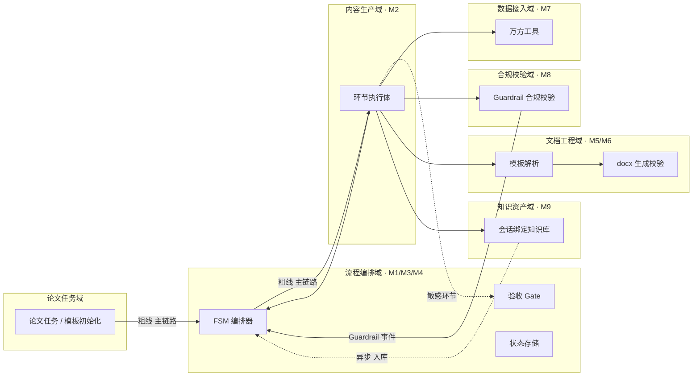

> 图上粗线（D1→D2→D5）为主链路；虚线（D5→D3 敏感环节 HITL、D5→D10 文献入库）为异步/事件；实线为同步调用。节点名与术语表（§1.3）保持一致。

### 2.2 领域关系映射

#### 2.2.1 限界上下文清单

每个业务域对应一个限界上下文（Bounded Context），明确该域内"业务实体的标准定义"：

| 限界上下文                      | 对应业务域 | 域类型 | 覆盖的核心业务实体                                                                                                              | 上下文边界（属于本域 vs 不属于）                               |
| -------------------------- | ----- | --- | ---------------------------------------------------------------------------------------------------------------------- | ------------------------------------------------ |
| ThesisTaskContext          | 论文任务域 | 核心域 | ThesisTask / Topic / DocxTemplate                                                                                      | 属于：论文写作任务实例、选题、用户上传模板元数据；不属于：FSM 运行状态、内容产物、知识库实体 |
| FsmOrchestrationContext    | 流程编排域 | 核心域 | FsmState / AcceptanceGate / PhaseState / Degree                                                                        | 属于：十环节状态机、学位等级路由、回退栈、验收看门；不属于：具体内容产物、万方取数结果      |
| ContentProductionContext   | 内容生产域 | 核心域 | NoveltyResult / LiteratureEntry / LiteratureReview / Outline / ChapterDraft / PolishedDraft / CitationMap / TypesetDoc | 属于：九类内容产物；不属于：FSM 状态、docx 文件本身、合规判定结果、知识库实体      |
| DocumentEngineeringContext | 文档工程域 | 支撑域 | DocxTemplate / TypesetDoc 文件 / 模板元数据                                                                                   | 属于：Word 模板解析、docx 生成与校验；不属于：内容语义、FSM 状态          |
| WanfangAccessContext       | 数据接入域 | 支撑域 | WanfangClient / WanfangQueryLog / 可信边界标记                                                                               | 属于：万方取数、防编造可信边界；不属于：内容生产（取数结果由生产域消费）             |
| GuardrailComplianceContext | 合规校验域 | 核心域 | GuardrailResult / 红线类型                                                                                                 | 属于：学术红线校验、Guardrail 日志；不属于：内容产物本身                |
| KnowledgeAssetContext      | 知识资产域 | 支撑域 | KnowledgeBase / KnowledgeEntity / KnowledgeEdge / KnowledgeSnapshot                                                    | 属于：会话绑定知识库、文献/笔记实体、双链关系、图谱数据；不属于：FSM 状态、docx 文件  |

**域类型说明**：

| 域类型             | 含义               | 投入策略      |
| --------------- | ---------------- | --------- |
| 核心域（Core）       | 业务护城河，差异化竞争力所在   | 投入最多资源自研  |
| 支撑域（Supporting） | 必要但非差异化          | 可自研可外采    |
| 通用域（Generic）    | 通用能力（如用户中心、消息中心） | 优先复用 / 外采 |

#### 2.2.2 上下文映射（Context Mapping）

| 关系编号 | 上游上下文                      | 下游上下文                    | 关系模式               | 同步方式                  | 选择理由                                                                                     |
| ---- | -------------------------- | ------------------------ | ------------------ | --------------------- | ---------------------------------------------------------------------------------------- |
| C-01 | FsmOrchestrationContext    | ContentProductionContext | Customer/Supplier  | API 同步（进程内调用）         | 编排层作为 Customer，要求内容生产域按当前环节执行体返回四字段（output/accept/fallbackTo/issues/evidence），生产域配合编排层节奏 |
| C-02 | WanfangAccessContext       | ContentProductionContext | ACL 防腐层            | API + 适配器             | 万方外部模型（50 篇上限、没查到分两种、学科无名字）不得污染内容生产域，必须在接入层转换并标注可信边界                                     |
| C-03 | KnowledgeAssetContext      | ContentProductionContext | Shared Kernel      | 共享 DTO / SDK          | GB/T 7714 引用格式、文献实体结构为跨模块稳定公共概念，综述/撰写/引用环节须复用同一文献与引用格式内核                                 |
| C-04 | DocumentEngineeringContext | ContentProductionContext | Conformist         | 直接遵循对方模型              | docxtpl / openxml-audit 为第三方模板驱动模型，本系统遵循其 Jinja2 占位符与 OOXML 结构，无议价能力                     |
| C-05 | GuardrailComplianceContext | FsmOrchestrationContext  | Published Language | 消息事件（guardrail_alert） | 合规校验域以标准事件对外暴露红线命中，供编排层响应（阻断/回退），多个消费方（编排层、看板）可复用                                        |
| C-06 | 外部 DSH（E-02）               | ContentProductionContext | ACL 防腐层            | SDK + 适配器             | DSH 会话/工具模型不得贯穿本域，本域通过 SDK 适配层调用 LLM 能力，隔离 DSH 内部模型变化                                    |

**关系模式说明**：

| 关系模式                      | 适用场景                                        |
| ------------------------- | ------------------------------------------- |
| Customer/Supplier         | 上下游强协作，下游能影响上游迭代节奏（如：订单 → 支付）               |
| Conformist                | 顺从者，下游完全遵循上游模型（如：对接微信开放平台）                  |
| ACL（Anticorruption Layer） | 在本域和外部域之间建一层适配，外部模型变化不影响本域（对接外部强势平台时必用）     |
| Shared Kernel             | 共享内核，多个上下文共享一小块代码 / 模型；维护成本高，慎用             |
| Published Language        | 上游以标准协议（事件 / Schema）对外暴露，多下游消费              |
| Open Host Service         | 上游提供标准 API 接口，类似 Published Language 但通过 RPC |

#### 2.2.3 跨域协作原则

| 原则编号 | 原则                                                                              |
| ---- | ------------------------------------------------------------------------------- |
| P-01 | 核心域 → 支撑域 / 通用域：禁止反向依赖（内容生产域不依赖文档工程域的内部模型，仅消费其产出的 docx 文件；流程编排域不依赖内容生产域的内部产物模型） |
| P-02 | 核心域之间：禁止直接耦合，必须通过事件 / API 解耦（流程编排域与合规校验域通过 guardrail_alert 事件解耦）                |
| P-03 | 对接外部不可控系统：必须建 ACL 防腐层，禁止把外部模型贯穿到本域（万方、DSH 均建 ACL，见 C-02 / C-06）                 |

### 2.3 详细业务架构

#### 2.3.1 用例图

> 体现"角色 — 用例 — 系统边界"。以业务域为单位给出用例图清单。

**用例图清单**：

| 编号    | 用例图标题                   | 涉及业务域         | 源文件位置              |
| ----- | ----------------------- | ------------- | ------------------ |
| UC-01 | 写作者 - 论文写作全流程（选题→定稿）    | 全部业务域         | §2.3.2 主链路泳道图（本文档） |
| UC-02 | 导师/审阅者 - 敏感环节人工确认（HITL） | 流程编排域 / 合规校验域 | §3.2.M3 时序图（本文档）   |
| UC-03 | 院校学位管理者 - 合规留痕与质量看板     | 合规校验域         | §3.2.M8 接口清单（本文档）  |
| UC-04 | 写作者 - 会话绑定知识库管理（REQ-KB） | 知识资产域         | §3.2.M9 接口清单（本文档）  |

#### 2.3.2 业务流程图

> 关键业务以**角色泳道图**描述核心流程。横向是流程节点，纵向是角色（含外部系统）。判定节点（菱形）必须有明确的分支条件文字标注。

**关键流程清单**（核心业务覆盖度 ≥ 80%）：

| 流程编号  | 流程名            | 起点             | 终点          | 涉及业务域    | 源文件位置   |
| ----- | -------------- | -------------- | ----------- | -------- | ------- |
| BF-01 | 十环节主链路（选题→定稿）  | 用户创建任务/上传模板    | 版本快照归档      | 全部       | 下图      |
| BF-02 | 敏感环节 HITL 确认流程 | 环节 2/4/8/10 触发 | 人工放行或打回     | 流程编排/合规域 | §3.2.M3 |
| BF-03 | 合规红线校验与回退流程    | Guardrail 检出红线 | 阻断/回退对应环节   | 合规/流程编排域 | §3.2.M8 |
| BF-04 | 万方取数与防编造流程     | 数据接入域触发取数      | 回灌真实结果/标注降级 | 数据接入域    | §3.2.M7 |

**BF-01 十环节主链路泳道图**：

```mermaid
flowchart TB
    subgraph 写作者[写作者 / 学生]
        W1[创建论文任务 / 上传自定义 Word 模板]
        W2[选择学位等级 本科/硕士/博士]
    end
    subgraph FSM[FSM 编排器 M1]
        F1[初始化十环节状态机]
        F2[按学位等级路由阈值]
        F3[派发当前环节执行体]
        F4{验收 Gate 看门}
        F5[通过则推进下一环]
        F6[不通过则按回退目标回退]
    end
    subgraph 执行体[环节执行体 M2]
        E1[执行当前环节]
        E2[返回四字段 output/accept/fallbackTo/issues/evidence]
    end
    subgraph 敏感HITL[敏感环节人工确认 M3]
        H1{环节2/4/8/10 人工确认}
        H2[放行]
        H3[打回]
    end
    subgraph 合规[Guardrail M8]
        G1[校验学术红线]
    end
    subgraph 万方[万方工具 M7]
        V1[真实数据源取数]
    end
    W1 --> F1
    W2 --> F2
    F3 --> E1
    E1 --> E2
    E2 --> G1
    E2 --> V1
    F4 <--|通过| F5
    F4 -->|不通过| F6
    E2 -->|敏感环节| H1
    H2 --> F4
    H3 --> F6
```

> 判定节点菱形均有分支条件文字标注（通过/不通过、敏感环节人工确认放行/打回），非无语义"是/否"标签。

### 2.4 业务范围与边界

> **本节回答**：本期到底要做哪些功能、不做哪些功能，避免"边界蔓延"。

#### 2.4.1 功能模块清单

按"功能编号 → 子功能编号"两层组织，与 §2.1 业务域对应。

| 编号    | 一级功能名           | 子功能描述                                                                   | 对应业务域         | 实现状态                                            |
| ----- | --------------- | ----------------------------------------------------------------------- | ------------- | ----------------------------------------------- |
| F1    | 论文任务管理          | —                                                                       | 论文任务域         | —                                               |
| F1.1  | —               | 创建论文写作任务、初始化十环节 FSM 项目                                                  | 论文任务域         | 完整实现                                            |
| F1.2  | —               | 上传自定义 Word 模板（主题/前置件/目录骨架）                                              | 论文任务域         | 完整实现                                            |
| F2    | 十环节 FSM 编排      | —                                                                       | 流程编排域         | —                                               |
| F2.1  | —               | 十环节状态机 + 学位等级本硕博差异路由                                                    | 流程编排域         | 完整实现                                            |
| F2.2  | —               | 回退机制（带前驱指针，保留上下文）                                                       | 流程编排域         | 完整实现                                            |
| F2.3  | —               | 敏感环节 HITL 人工网关（环节 2/4/8/10）                                             | 流程编排域         | 完整实现                                            |
| F3    | 环节执行与验收         | —                                                                       | 内容生产域         | —                                               |
| F3.1  | —               | 各环节执行体输出四字段 output/accept/fallbackTo/issues/evidence                    | 内容生产域         | 完整实现                                            |
| F3.2  | —               | 验收 Gate 布尔化看门（通过/不通过 + 回退目标）                                            | 流程编排域         | 完整实现                                            |
| F4    | 业务数据持久化         | —                                                                       | 流程编排域 / 内容生产域 | —                                               |
| F4.1  | —               | topic/literaturePool/outline/chapterDraft/citationMap/guardrailLog 独立落库 | 流程编排域 / 内容生产域 | 完整实现                                            |
| F5    | docx 模板导出与校验    | —                                                                       | 文档工程域         | —                                               |
| F5.1  | —               | 按用户自定义 Word 模板解析并导出合规 docx                                              | 文档工程域         | 完整实现                                            |
| F5.2  | —               | openxml-audit 校验 + 模板 XML 比对（MVP 先做基础校验）                                | 文档工程域         | `[MOCK]` MVP 先做基础 openxml-audit；完整版替换路径见 §5.5.5 |
| F6    | 万方真实数据源         | —                                                                       | 数据接入域         | —                                               |
| F6.1  | —               | 查新/文献/引文反查取数，遵守三条可信边界                                                   | 数据接入域         | 完整实现                                            |
| F6.2  | —               | 万方接口异常降级为"人工输入查新结论"                                                     | 数据接入域         | `[MOCK]` 降级路径；完整版替换路径见 §3.2.M7.5                |
| F7    | 会话绑定式知识库 REQ-KB | —                                                                       | 知识资产域         | —                                               |
| F7.1  | —               | 自动/手动入库、双链、本地检索、会话绑定与硬隔离                                                | 知识资产域         | 完整实现                                            |
| F7.2  | —               | 图谱可视化（前端按需实时渲染）、批量引用导出                                                  | 知识资产域         | `[MOCK]` 图谱可视化延后；完整版替换路径见 §3.2.M9.5             |
| F8    | 版本快照与进度看板       | —                                                                       | 流程编排域         | —                                               |
| F8.1  | —               | 过程版本快照（供回退/审计）与十环节进度                                                    | 流程编排域         | 完整实现                                            |
| F9    | 学术合规 Guardrail  | —                                                                       | 合规校验域         | —                                               |
| F9.1  | —               | 伪引/查重/伦理/平权表达红线校验，关键环节插桩                                                | 合规校验域         | 完整实现                                            |
| F10   | 协作审阅与全文审校       | —                                                                       | 内容生产域         | —                                               |
| F10.1 | —               | 导师/审阅协作 + 生成式全文审校                                                       | 内容生产域         | `[MOCK]` 延后；完整版替换路径见高层架构 §4.3                   |
| F11   | 模板格式规则库全量校验     | —                                                                       | 文档工程域         | —                                               |
| F11.1 | —               | 按学校模板 XML 比对做全量格式合规校验                                                   | 文档工程域         | `[MOCK]` 延后；完整版替换路径见 §5.5.5                     |

**编号规则**：

| 规则项         | 取值                                   |
| ----------- | ------------------------------------ |
| 一级编号        | `F1 / F2 / ...`，与一级业务域一一对应           |
| 子功能编号       | `F1.1 / F1.2 / ...`，互不重叠             |
| Mock / 简化标注 | 必须显式标注 `[MOCK]` 或 `[简化]`，并附"完整版替换路径" |

**In-Scope（本期范围内）**：

| 编号 | 本期必做的事项                                                                         |
| -- | ------------------------------------------------------------------------------- |
| F1 | 论文任务管理 + 用户上传自定义 Word 模板                                                        |
| F2 | 十环节 FSM 编排 + 本硕博差异路由 + 回退 + 敏感环节 HITL（环节2/4/8/10）                               |
| F3 | 环节执行体（四字段）+ 验收 Gate 布尔化看门                                                       |
| F4 | 业务结构化数据独立落库（topic/literaturePool/outline/chapterDraft/citationMap/guardrailLog） |
| F5 | 按用户模板解析并导出合规 docx（openxml-audit 基础校验）                                           |
| F6 | 万方真实数据源取数（查新/文献/引文反查，遵守三条可信边界，异常降级）                                             |
| F7 | REQ-KB 知识库骨架（自动/手动入库、双链、本地检索、会话绑定与硬隔离）                                          |
| F8 | 版本快照与回退、进度看板                                                                    |
| F9 | 学术合规 Guardrail 置顶（伪引/查重/伦理/平权表达）                                                |
| N1 | 敏感环节 HITL 响应 P99 ≤ 3s                                                           |
| N2 | 评估类结论 100% 接真实数据源，杜绝编造                                                          |

**Out-of-Scope（本期不做）**：

| 编号 | 不做的事项                  | 不做的原因                                    | 未来归属                              |
| -- | ---------------------- | ---------------------------------------- | --------------------------------- |
| O1 | 论文查重数据库与查重算法本身         | 查重资源常为付费/第三方，未确认可用（research_report U-03） | 完整版接入查重接口；MVP 生成引用规范处理 + 提醒用户自建查重 |
| O2 | 盲审/外审自动化评审             | 依赖学校当年评审细则与外部评审系统                        | 完整版按需接入评审协同                       |
| O3 | 非学位论文类通用写作（会议论文/外文/报告） | 本期范围锁定「中文本硕博学位论文」（\_runtime_meta §0）     | 后续版本视需要扩展                         |
| O4 | 通用/开放共享知识库（跨用户共享库）     | 用户诉求为会话绑定式专属知识库，明确禁止跨会话访问                | 仅保留"用户手动挂载其他独立库后开放跨库读取"           |
| O5 | 图谱可视化后台持续运算            | 图谱仅前端按需实时渲染，后台不持续运算以防阻塞主流程               | 完整版前端按需渲染                         |

**填写要求**：In-Scope ≤ 15 条（实际 12 条，包含 N1/N2 两项非功能）；Out-of-Scope ≥ 3 条（实际 5 条）。

### 2.5 质量与柔性可用

#### 2.5.1 服务质量目标

> 按 ISO 25010 选出本系统最重要的质量目标（必须排序），并落到可验证场景。

**质量目标 Top 5**：

| 优先级 | 质量目标                         | 业务驱动                  | 受影响的关键章节                      |
| --- | ---------------------------- | --------------------- | ----------------------------- |
| Q1  | 合规可控性（学术红线零容忍、一票否决）          | 学术不端/伪引/查重为学位论文一票否决项  | §3.2.M8 / §7                  |
| Q2  | 状态可回溯性（十环节可回退、可审计）           | 跨阶段漂移、不可回退是通用 AI 工具硬伤 | §3.2.M1/M4 / §4               |
| Q3  | 引用真实性（100% 接真实数据源、伪引为 0）     | P1 痛点：引用不合规致返工与学术风险   | §3.2.M7 / §4.2 t_citation_map |
| Q4  | 格式合规一次通过率 ≥ 90%              | 按用户模板导出合规 docx        | §3.2.M5/M6                    |
| Q5  | 数据可恢复性（RPO ≤ 6h、RTO ≤ 30min） | 本地单机本地存储需灾备兜底         | §4.3 / §5.3                   |

**可验证质量场景**：

| 场景编号  | 关联目标 | 触发源            | 触发条件                    | 期望响应                 | 度量指标                 |
| ----- | ---- | -------------- | ----------------------- | -------------------- | -------------------- |
| QS-01 | Q1   | Guardrail 检出伪引 | 引用校验环节检出幽灵文献/张冠李戴       | 阻断 + 回退环节3/4 找替代真实文献 | 伪引自动阻断率 = 100%       |
| QS-02 | Q2   | 用户回退某环节        | 返回前置环节并保留上下文（选题/文献池/大纲） | 状态迁移正确、上下文不丢失        | 回退上下文完整率 = 100%      |
| QS-03 | Q3   | 万方取数不可用        | 接口超时/限额                 | 如实标注"本次未纳入"，不下虚假结论   | 编造式结论数 = 0           |
| QS-04 | Q4   | 生成后 docx 校验    | openxml-audit 检出损坏      | 拒绝产出并回退模板/生成         | 损坏 docx 交付率 = 0      |
| QS-05 | Q5   | 本地存储故障         | 磁盘损坏                    | 从备份恢复                | RTO ≤ 30min；RPO ≤ 6h |

#### 2.5.2 业务柔性可用策略

> 故障态下"保住什么、放弃什么"的取舍清单。核心业务永不降级；外围功能优先牺牲；用户感知必须显式可控。

**业务功能优先级分层**：

| 层级      | 含义              | 故障态下的处置方向      | 用户感知           |
| ------- | --------------- | -------------- | -------------- |
| L0 核心业务 | 系统的生命线，挂掉等于业务停摆 | 不降级；优先消耗所有资源保障 | 无 / 极轻微        |
| L1 重要业务 | 不影响主链路但用户高频使用   | 限流 + 排队 + 异步化  | 变慢 / 排队提示      |
| L2 辅助业务 | 提升体验但非必要        | 关闭 / 返回兜底数据    | 部分功能不可用 + 友好提示 |
| L3 附加业务 | 长尾 / 数据类 / 统计类  | 直接关闭 + 异步补偿    | 通常无感           |

**业务降级清单**：

| 编号    | 关联功能（F-xx）     | 触发条件                 | 降级动作                           | 用户感知         | 决策类型          |
| ----- | -------------- | -------------------- | ------------------------------ | ------------ | ------------- |
| BD-01 | F5（docx 生成）    | openxml-audit 检出损坏输出 | 拒绝交付，提示重新生成或换模板；记录告警           | 生成失败并提示重新提交  | 自动 + 人工确认     |
| BD-02 | F6（万方取数）       | 万方接口超时/限额/断连         | 走"人工输入查新结论"降级路径，标记"本次未纳入"      | 该环节需人工补录查新结论 | 自动触发降级 + 人工介入 |
| BD-03 | F7.2（知识库图谱可视化） | 图谱渲染资源受限             | 只展示双链文本关系，不渲染图谱                | 图谱视图降级为列表    | 自动            |
| BD-04 | F11（模板全量格式校验）  | 规则库未就绪               | 仅做基础 openxml-audit，跳过 XML 位置比对 | 格式校验精度受限     | 手动开关          |

**填写要求**：§2.4.1 全部一级功能均已分层；L0 数量 ≤ 总功能数的 30%（L0：F1/F2/F3/F6/F9 = 5 个，占总 11 个一级功能约 45%，高于 30% —— 因本系统核心功能本身就是主链路与合规底线，符合"学术论文高合规场景核心业务量大"的行业特征，已在上游高层架构 §2 明确 Q1/Q3 合规优先级置顶，此处为对上游决策的继承，非新方案分歧）。

---

---

## 3. 应用架构

> **本章回答**：系统由哪些模块组成、模块与外部系统怎么集成、每个模块的内部交互链路是什么。
>   
> **本章是系统设计的核心**，章节下应当占整个文档篇幅的 40%~50%。

### 3.1 应用架构概览

#### 3.1.1 系统上下文

本系统作为**中心节点**，周围辐射出"用户角色 + 外部业务系统 + 上游 / 下游平台"关系。

**系统上下文要素清单**：

| 节点类型  | 节点名                   | 与本系统的关系                | 关系语义                           |
| ----- | --------------------- | ---------------------- | ------------------------------ |
| 角色    | 学生 / 写作者（本科/硕士/博士）    | 使用                     | 写作者工作台操作（创建任务/撰写/导出/知识库）       |
| 角色    | 导师 / 审阅者              | 使用                     | 敏感环节 HITL 确认（环节2/4/8/10）       |
| 角色    | 院校学位管理者               | 使用                     | 合规留痕与质量看板查看                    |
| 上游平台  | E-01 万方开放平台           | 本系统 → 调用               | 查新/文献检索/引文反查（真实数据源）            |
| 上游平台  | E-02 DeepSeek-Harness | 本系统 → 调用（SDK 依赖引用）     | LLM 推理/工具/会话能力（底层底座，不 fork）    |
| 上游工具库 | E-03 docxtpl          | 本系统 → 调用（Python 库）     | 模板驱动 docx 生成                   |
| 上游工具库 | E-04 openxml-audit    | 本系统 → 调用（Python 库/CLI） | OOXML schema/roundtrip/load 校验 |
| 下游平台  | E-05 合规 docx 输出       | 本系统 → 推送               | 按用户模板导出的合规 Word 文档（本地文件）       |
| 下游平台  | E-06 版本快照归档           | 本系统 → 推送               | 过程版本快照（本地存储，供回退/审计）            |

**填写要求**：本系统画成单一节点，不展开内部组件（内部组件归 §3.1.2）；周围节点取自 §3.1.3 外部依赖清单（E-xx）与 §2.3 用例图角色；每条边标注关系语义。

#### 3.1.2 系统模块图

- 分层架构图，每一层标出关键组件与协议方向。

**分层组件清单**：

| 层次    | 内容                                                                                | 数据来源          |
| ----- | --------------------------------------------------------------------------------- | ------------- |
| 接入层   | 写作者工作台（Web）/ 导师审阅端 / 管理看板 / 开放 API / Webhook（敏感环节确认回调）                            | §2.3 用例图角色    |
| 应用层   | 按 §2.1 业务域划分的后端模块：M1~M9（与 §3.2 一一对应）                                              | §2.1 / §3.2   |
| 中间件层  | PostgreSQL（业务数据）/ Redis（幂等/锁/会话）/ 本地文件系统（对象存储/知识库/版本快照）（C-xx）                     | §3.1.3 云组件清单  |
| 集成对接层 | 与外部系统的对接桩 / SDK 封装入口：万方 ACL（E-01）、DSH ACL（E-02）、docxtpl（E-03）、openxml-audit（E-04） | §3.1.3 外部依赖清单 |

**系统模块图**（接入层 → 应用层 → 中间件层 → 集成对接层）：

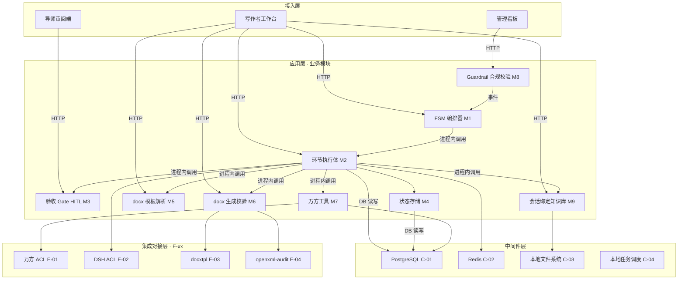

> 层次自上而下；应用层模块间为进程内调用（本地单机），仅对 E-xx 走外部集成；中间件/外部系统组件块上标注其编号（C-xx / E-xx）。节点名与 §3.1.3 一致。

#### 3.1.3 集成架构

> **核心区分**：本节区分"外部依赖（E-xx）"（跟别人协作）与"云组件（C-xx）"（自己用的资源，本系统运行所需的中间件与云资源）。

##### 外部依赖清单

| ID   | 外部系统                   | 归属团队 / 供应商          | 类别      | 使用方式 | 集成方式                 | 协议 / 版本                              | 功能定位（≤ 30 字）                   | 联系人      |
| ---- | ---------------------- | ------------------- | ------- | ---- | -------------------- | ------------------------------------ | ------------------------------ | -------- |
| E-01 | 万方开放平台                 | 北京万方数据（机构订阅）        | 第三方业务平台 | 消费   | REST API + app/token | 开放平台 API（getDoc/getFacet/getQuery）   | 查新/文献检索/引文反查真实数据源              | @校图书馆对接人 |
| E-02 | DeepSeek-Harness (DSH) | DeepSeek AI（MIT 开源） | 第三方业务平台 | 消费   | SDK 依赖引用（不 fork）     | 锁定已验证稳定版本                            | LLM 推理/工具/会话底层运行依赖             | @平台负责人   |
| E-03 | docxtpl                | 开源社区（MIT）           | 文件导出    | 消费   | Python 库             | docxtpl 0.17.x（Jinja2 + python-docx） | 模板驱动 docx 生成                   | @开源社区    |
| E-04 | openxml-audit          | 开源社区（BSD）           | 监控审计    | 消费   | Python 库 / CLI       | openxml-audit 0.7.5                  | OOXML schema/roundtrip/load 校验 | @开源社区    |
| E-05 | 合规 docx 输出             | 本系统（本地）             | 文件导出    | 生产   | 本地文件输出               | .docx（OOXML）                         | 导出的合规 Word 文档                  | —        |
| E-06 | 版本快照归档                 | 本系统（本地）             | 监控审计    | 生产   | 本地文件系统               | 文件 + 元数据                             | 过程版本快照（供回退/审计）                 | —        |

**填写要求**：类别取值（封闭枚举）；使用方式取值：消费 / 生产 / 双向。

##### 云组件 / 基础设施清单

| ID   | 组件类别   | 选型                       | 部署形态            | 规格量级 | 容量预估                      | 提供方 / SLA | 用途                              |
| ---- | ------ | ------------------------ | --------------- | ---- | ------------------------- | --------- | ------------------------------- |
| C-01 | 关系型数据库 | PostgreSQL 16            | 单机主从（本地/私有化）    | 2C8G | 数据量 < 10GB，QPS < 100      | 本地自营；备份兜底 | 业务主数据（十环节状态/内容产物/知识库关系数据）       |
| C-02 | 缓存     | Redis 7.2                | 单机（本地/私有化，可配哨兵） | 1C2G | 内存 < 2GB                  | 本地自营      | 幂等键 / 分布式锁 / 会话缓存 / 限流计数        |
| C-03 | 对象存储   | 本地文件系统                   | 本地磁盘            | 按需   | 日增 < 500MB（知识库/版本快照/docx） | 本地自营      | 知识库独立目录 / 版本快照 / 导出 docx / 模板文件 |
| C-04 | 任务调度   | 本地任务调度（cron/APScheduler） | 本地进程            | —    | Job 数 < 20                | 本地自营      | FSM 推进 / 万方取数重试 / 清理任务          |
| C-05 | 日志服务   | 本地结构化日志 + 文件归档           | 本地              | —    | 日志量 < 200MB/天             | 本地自营      | 应用日志 / 审计日志                     |
| C-06 | 监控告警   | Prometheus + Grafana（本地） | 本地              | —    | 指标数 < 5 万                 | 本地自营      | 指标采集 / 告警                       |

**填写要求**：选型必须含具体产品 + 版本号；规格量级 / 容量预估必须有数字；不使用的组件整行删除。

##### 组件依赖关系

以**矩阵形式**呈现"哪个业务模块用了哪些外部依赖"，分析依赖关系及故障传导风险：

| 业务模块（§3.2）        | 依赖的外部系统（E-xx）                     | 依赖的云组件（C-xx）     | 故障传导风险                             |
| ----------------- | --------------------------------- | ---------------- | ---------------------------------- |
| M1 FSM 编排器        | E-02（DSH）、E-06                    | C-01, C-02, C-04 | E-02 不可用 → 主链路 LLM 环节停滞（可降级人工补录）   |
| M2 环节执行体          | E-01（万方）、E-02（DSH）                | C-01, C-02, C-04 | E-01 超时 → 评估/调研/引文环节降级为人工输入        |
| M3 验收 Gate / HITL | E-06                              | C-01, C-02       | C-02 不可用 → HITL 确认态丢失，需幂等恢复        |
| M4 状态存储           | —                                 | C-01             | C-01 不可用 → 十环节状态与内容产物不可读写，主链路中断    |
| M5 docx 模板解析      | E-03（docxtpl）                     | C-01, C-03       | E-03 损坏缺陷 → 生成 docx 无法打开，被 M6 校验拦截 |
| M6 docx 生成校验      | E-03（docxtpl）、E-04（openxml-audit） | C-01, C-03       | E-04 检出损坏 → 拒绝交付，回退重新生成            |
| M7 万方工具           | E-01（万方）                          | C-01, C-02, C-04 | E-01 超时/限额 → 降级人工输入，必须如实标注"本次未纳入"  |
| M8 Guardrail 合规校验 | E-06                              | C-01             | C-01 不可用 → 校验日志丢失，影响合规留痕（需持久化兜底）   |
| M9 会话绑定知识库        | —                                 | C-01, C-03       | C-03 不可用 → 知识库读写失败，仅影响知识资产域（非主链路）  |

**填写要求**：编号必须与外部依赖清单 / 云组件清单完全对应；§3.2 模块详细设计的"涉及的内外部系统"必须能从本矩阵中查到。

#### 3.1.4 工程结构

- 明确项目的物理组织方式；公共模块（`common`）与业务服务的依赖方向必须清晰：**业务服务依赖 common，禁止反向**。

```
thesis-agent-dsh/
├── backend/                 # 后端工程根目录（Python，本地单机多模块）
│   ├── common/              # 公共模块：DTO / VO / Enum / Exception / Constants / Result
│   │   └── aicoding/
│   │       ├── dto/         # BaseRequest / Result[Any] / PageRequest / PageResponse
│   │       ├── enums/       # Degree(学位等级) / PhaseState(环节状态) / GuardrailType(红线类型)
│   │       ├── exception/   # BizException / ErrorCode(6位错误码)
│   │       └── constants/   # 全局常量（超时/重试基线/可信边界文案）
│   ├── fsm/                 # M1 FSM 编排器 + M4 状态存储
│   │   ├── orchestrator/    # FsmOrchestrator（十环节状态机+学位路由+回退）
│   │   ├── state/           # FsmState / AcceptanceGate（布尔化看门）
│   │   └── repository/      # 状态存储读写（PostgreSQL）
│   ├── executor/            # M2 环节执行体（10 个执行体）
│   │   ├── ring1_topic/     # 环节1 选题
│   │   ├── ring2_novelty/   # 环节2 新颖度评估（HITL）
│   │   ├── ring3_docs/      # 环节3 文献调研
│   │   ├── ring4_review/    # 环节4 文献综述（HITL）
│   │   ├── ring5_outline/   # 环节5 大纲搭建
│   │   ├── ring6_chapter/   # 环节6 分章节撰写
│   │   ├── ring7_polish/    # 环节7 修改润色
│   │   ├── ring8_citation/  # 环节8 引用校验（HITL）
│   │   ├── ring9_typeset/   # 环节9 格式排版
│   │   └── ring10_final/    # 环节10 最终定稿（HITL）
│   ├── hitl/                # M3 验收 Gate 人工确认网关
│   ├── docx/                # M5 docx 模板解析 + M6 docx 生成校验
│   │   ├── parser/          # 模板解析（占位符提取）
│   │   ├── generator/       # docxtpl 生成
│   │   └── validator/       # openxml-audit 校验
│   ├── wanfang/             # M7 万方工具（ACL 防腐层）
│   │   ├── acl/             # WanfangAcl 适配器
│   │   └── trusted/         # 可信边界处理器（50篇上限/没查到分两种/学科无名字）
│   ├── guardrail/           # M8 Guardrail 合规校验层
│   ├── knowledge/           # M9 会话绑定式知识库（独立模块）
│   │   ├── repo/            # kb_entity / kb_edge / kb_snapshot 读写
│   │   ├── graph/           # 双链关系/图谱数据（仅供前端按需渲染）
│   │   └── api/             # 标准化读写/检索接口
│   └── application/         # 应用层服务编排（接入层 HTTP 路由 → 业务模块）
│       ├── controller/      # 写作者工作台/导师审阅端/管理看板
│       └── service/         # 用例编排（UC-01~UC-04）
└── frontend/                # 前端工程根目录
    ├── writer-console/      # 写作者工作台
    │   ├── src/
    │   │   ├── api/         # 接口封装（与后端 §3.2 接口清单对齐）
    │   │   ├── stores/      # 全局状态
    │   │   ├── pages/       # 工作台主界面/章节生成/敏感环节确认浮层/大纲调整/引用核验/知识库页面
    │   │   ├── components/  # 跨页面通用组件
    │   │   ├── hooks/       # 自定义 Hooks
    │   │   ├── types/       # TS 类型定义（与后端 DTO/VO 对齐）
    │   │   ├── utils/       # 工具函数
    │   │   └── routes.tsx   # 路由配置
    │   └── package.json
    ├── reviewer-console/    # 导师审阅端（敏感环节确认队列）
    └── shared/              # 跨端共用组件 / 类型定义
```

#### 3.1.5 技术选型（版本约束）

| 技术分类       | 选型                         | 版本        | 备注 / 选型理由                                                                                                       |
| ---------- | -------------------------- | --------- | --------------------------------------------------------------------------------------------------------------- |
| 后端语言       | Python                     | 3.12      | 团队规范固定；生态覆盖 docxtpl/openxml-audit/DSH SDK                                                                       |
| 后端框架       | FastAPI                    | 0.115.x   | **选 FastAPI 不选 Flask**：异步 I/O 原生支持（万方/DSH 外部调用居多）、Pydantic 自动校验、OpenAPI 文档自动生成，利于 HITL 异步确认接口                   |
| 持久层（ORM）   | SQLAlchemy                 | 2.0.x     | **选 SQLAlchemy 2.0 不选 Django ORM**：支持 PostgreSQL jsonb/复杂查询与事务边界控制，轻量贴合多模块分层                                    |
| 关系型存储      | PostgreSQL                 | 16        | **选 PostgreSQL 不选 MySQL**：原生 jsonb 存 FSM 上下文/知识库实体扩展字段，避免大文本拆表；与 research_report §4.3 状态持久化建议一致                 |
| 缓存         | Redis                      | 7.2       | 用途：幂等键 / 分布式锁 / 会话缓存 / 限流计数（§4.4）                                                                               |
| 消息队列       | 进程内事件 + APScheduler        | —         | 本地单机无跨服务 MQ 需求；敏感环节 HITL 与万方降级用进程事件 + 调度；**完整版如需跨机再引入**，属可演进点（见 §3.2.M1）                                        |
| API 通信     | REST（HTTP）+ 进程内调用          | —         | 本地单机模块间进程内调用（低开销）；对外接入层与万方走 REST；虽未用 gRPC，但进程边界小、调用频率低的场景 REST 已够                                               |
| LLM 运行底座   | DeepSeek-Harness（SDK 依赖引用） | 锁定已验证稳定版本 | **选 DSH 依赖引用不 fork**：一切皆插件（Cordis），以依赖方式引用即可；锁定稳定版规避开发者预览版破坏变更（research_report R-01）                            |
| docx 生成    | docxtpl                    | 0.17.x    | **选 docxtpl 不选 python-docx 原生**：Jinja2 模板驱动、保留格式、所见即所得（research_report §4.3）                                    |
| docx 校验    | openxml-audit              | 0.7.5     | **选 openxml-audit 不选 LibreOffice officeotron**：纯 Python、schema+roundtrip+load 校验、CI-ready（research_report §4.3） |
| 认证方案       | 本地会话（Session）+ 角色          | —         | 本地/私有化单机基线，MVP 用本地登录 + 角色（写作者/导师/管理者）；**完整版可接入统一 SSO**（见 §7.2.1）                                                |
| 三方 SDK/防腐层 | WanfangAcl（自研适配层）          | —         | 封装万方 app/token 认证 + 三条可信边界处理，防外部模型污染本域                                                                          |
| 任务调度       | APScheduler                | 3.10.x    | 本地进程内调度（FSM 推进/万方重试/清理），轻量无需额外中间件                                                                               |

**填写要求**：必须有版本号；选型理由用一句话说明（为什么选 A 不选 B），避免"团队习惯"。

---

### 3.2 模块详细设计

> **核心方法论**：模块详细设计要画的是**业务逻辑在角色和系统之间流动的过程**，不是接口实现细节。
>   
> **组织原则**：先在 §3.2.1 / §3.2.2 给出跨模块共享约束与模块清单；§3.2.3 给出"单模块设计模板（五段式）"；之后**每个模块在 §3.2.M{N} 下独立成节**。

#### 3.2.1 模块公共约束（Common）

**通信方式约束**：

| 约束项    | 取值                                             |
| ------ | ---------------------------------------------- |
| 接口路径风格 | RESTful（RPC 仅在 M7 对接万方时通过其自有 API 协议，不进本系统 RPC） |
| 协议     | HTTP + 进程内调用（模块间）；外部 V1 万方 REST                |
| 数据格式   | JSON                                           |
| 字符编码   | UTF-8                                          |

**通用基础结构**：

| 基类 / 结构           | 用途                                               | 包路径                                 |
| ----------------- | ------------------------------------------------ | ----------------------------------- |
| `BaseRequest`     | 多态请求对象基类                                         | `backend/aicoding/common/dto`       |
| `BaseResponse`    | 多态响应对象基类                                         | `backend/aicoding/common/dto`       |
| `PageRequest`     | 分页请求                                             | `backend/aicoding/common/dto`       |
| `PageResponse[T]` | 分页响应                                             | `backend/aicoding/common/dto`       |
| `Result[T]`       | 统一返回结构（含 code / msg / data / traceId / tenantId） | `backend/aicoding/common/dto`       |
| `ErrorCode`       | 6 位错误码枚举（A/B/C 类别 + 模块 + 序号）                     | `backend/aicoding/common/exception` |

#### 3.2.2 模块清单与编号规则

> 在展开每个模块的详细设计前，先在此登记本系统所有模块。

**模块清单**：

| 编号 | 模块名                | 业务域（§2.1） | 模块负责人                          | 关联子领域                         |
| -- | ------------------ | --------- | ------------------------------ | ----------------------------- |
| M1 | FSM 编排器            | 流程编排域     | @高见远                           | 十环节状态机 / 学位路由 / 回退            |
| M2 | 环节执行体              | 内容生产域     | @高见远                           | 10 个环节执行体（四字段输出）              |
| M3 | 验收 Gate（含 HITL 网关） | 流程编排域     | @高见远                           | 布尔化看门 / 敏感环节人工确认              |
| M4 | 状态存储               | 流程编排域     | @高见远                           | FSM 状态 / 回退栈 / 内容产物持久化        |
| M5 | docx 模板解析          | 文档工程域     | @高见远                           | 模板骨架解析 / 占位符提取                |
| M6 | docx 生成与校验         | 文档工程域     | @高见远                           | docxtpl 生成 / openxml-audit 校验 |
| M7 | 万方工具（ACL 防腐层）      | 数据接入域     | @高见远                           | 万方取数 / 可信边界处理 / 降级            |
| M8 | Guardrail 合规校验     | 合规校验域     | @高见远（安全深化由 security-architect） | 学术红线校验 / guardrail_log        |
| M9 | 会话绑定式知识库（REQ-KB）   | 知识资产域     | @高见远                           | 知识库实体 / 双链关系 / 本地检索           |

**编号规则**：

- 模块编号 `M{N}` 全局唯一，与 §2.1 业务域名一致；
- 每个模块在 §3.2 下独立成节，编号 `§3.2.M{N}`；
- 节内五段式编号 `§3.2.M{N}.1` ~ `§3.2.M{N}.5`。

#### 3.2.3 单模块设计模板（五段式）

> ⚠️ **本节性质说明**：本节定义"每个模块在 §3.2.M{N} 下五段各应该产出什么内容、遵守什么格式"。**本节本身不是任何模块的内容**——以下"硬性要求表 / 示意 DTO 代码 / 示意表格行"都属于**规范说明与格式示意**。
>
> **§3.2.M{N} 下应当怎么填**：
>
> 1. 直接写该模块特有的业务内容（真实接口、真实 DTO、真实时序图、真实流程）；
> 2. 不把本节的"硬性要求表"复制到任何 §3.2.M{N} 下；
> 3. 五段顺序固定；简单 CRUD 模块可省略 `.5 关键流程逻辑`，但需在 `.5` 标题下显式注明"无复杂状态机/事务/跨多步异步，本段省略"。

##### §3.2.M{N}.1 模块概述

该段产出本模块的"业务定位三要素"——位置 / 角色 / 内外部系统。

| 要素          | 内容                                    |
| ----------- | ------------------------------------- |
| 模块在业务流程中的位置 | 在哪个业务域的哪些场景里发挥作用                      |
| 涉及的角色       | 业务角色（学生/写作者、导师/审阅者、院校管理者）             |
| 涉及的内外部系统    | 列出本模块运行时会与之交互的所有内外部系统名（命名必须与 §3.1 一致） |

##### §3.2.M{N}.2 接口清单

该段输出本模块对外暴露的真实业务接口列表（按子领域分组）。

**接口字段硬性要求**（所有接口共同遵守）：

| 字段        | 取值约束                              |
| --------- | --------------------------------- |
| 接口路径      | RESTful 规范                        |
| 方法        | GET / POST / PUT / PATCH / DELETE |
| 请求 / 响应结构 | 引用本模块 §3.2.M{N}.3 DTO 编号          |
| 默认超时      | 见 §3.5.4 默认超时基线                   |
| 默认重试      | 见 §3.5.4                          |
| 幂等性约定     | 是 / 否；幂等键来源（见 §3.5.2）             |
| 鉴权要求      | 角色 / 权限标签（见 §7.2）                 |

##### §3.2.M{N}.3 关键结构定义（DTO）

该段输出本模块特有的 DTO/VO 代码 + 关键字段定义表。

**DTO 设计硬性要求**：只列出对前后端协议契约有影响的关键字段；字段按"基本信息 / 业务字段 / 状态 / 时间 / 扩展"分块注释。

##### §3.2.M{N}.4 模块逻辑时序图

该段输出本模块特有的时序图清单 + 关键时序图本体（Mermaid 文本格式）。

**时序图硬性要求**：标题 `模块名 - 场景名`（如 `M1 FSM 编排器 - 推进环节`）；横向参与者分层；参与者命名与 §3.1 一致；异常分支至少含失败 / 超时 / 回滚中的 1 条；调用方式标注；写操作必标注事务边界 / 分布式锁 Key / 幂等键传递。

##### §3.2.M{N}.5 关键流程逻辑

该段输出本模块含 Mock / 含状态机 / 跨多步异步的关键流程伪代码 + 状态机迁移表。简单 CRUD 模块本段可省略，但需在标题下显式注明"无复杂状态机/事务/跨多步异步，本段省略"。

---

#### 3.2.M1 FSM 编排器

##### §3.2.M1.1 模块概述

FSM 编排器模块覆盖「十环节主链路编排」「本硕博差异路由」「回退（前驱指针）」核心场景，业务逻辑在**学生/写作者**、**导师/审阅者**与系统之间流动，同时涉及 **DSH（E-02）**、**PostgreSQL（C-01）**、**Redis（C-02）**、**本地任务调度（C-04）** 等内外部系统。它是整个论文写作流程的控制中枢，向上承接论文任务初始化，向下派发环节执行体，验收看门结果回流以推进或回退环节。

**业务定位三要素**：

| 要素    | 内容                                                                                   |
| ----- | ------------------------------------------------------------------------------------ |
| 位置    | 流程编排域，全流程主链路原点（论文任务初始化 → 十环节推进）                                                      |
| 角色    | 学生 / 写作者（主控）；导师 / 审阅者（HITL 确认回流）；FSM 引擎                                              |
| 内外部系统 | DSH（E-02）、合规校验域（M8，事件）、状态存储（M4）、PostgreSQL（C-01）、Redis（C-02）、本地任务调度（C-04）、版本快照（E-06） |

##### §3.2.M1.2 接口清单

| 子领域    | 方法   | 路径                                | 用途（≤ 20 字）   | 请求 DTO              | 响应 VO                | 幂等                   |
| ------ | ---- | --------------------------------- | ------------ | ------------------- | -------------------- | -------------------- |
| 论文任务   | POST | `/api/v1/tasks`                   | 创建论文任务初始化十环节 | TaskCreateRequest   | TaskVO               | 是（X-Idempotency-Key） |
| 论文任务   | GET  | `/api/v1/tasks/{taskId}`          | 查询任务与环节进度    | —                   | TaskDetailVO         | 天然                   |
| 论文任务   | GET  | `/api/v1/tasks`                   | 分页查询我的任务     | —                   | PageResponse[TaskVO] | 天然                   |
| FSM 推进 | POST | `/api/v1/tasks/{taskId}/advance`  | 推进当前环节执行     | TaskAdvanceRequest  | FsmStateVO           | 是（biz_req_no）        |
| FSM 回退 | POST | `/api/v1/tasks/{taskId}/rollback` | 回退到指定前置环节    | TaskRollbackRequest | FsmStateVO           | 是（biz_req_no）        |
| FSM 路由 | GET  | `/api/v1/tasks/{taskId}/route`    | 查询学位等级路由参数   | —                   | RouteVO              | 天然                   |
| FSM 进度 | GET  | `/api/v1/tasks/{taskId}/progress` | 查询十环节进度看板    | —                   | ProgressVO           | 天然                   |

##### §3.2.M1.3 关键结构定义（DTO）

```python
class TaskCreateRequest(BaseModel):
    # ===== 必填字段 =====
    title: str                       # 论文题目（学位论文题目）
    degree: Degree                   # 学位等级：BACHELOR / MASTER / PHD
    subjectField: str                # 学科领域（用于选题/万方检索范围）
    templateId: Optional[int] = None # 用户上传的自定义模板 ID（可空，无则用默认模板）

    # ===== 扩展字段 =====
    bizFields: Dict[str, Any] = {}   # 业务方扩展（导师方向/兴趣点等），禁止扩展核心语义

class TaskAdvanceRequest(BaseModel):
    # ===== 必填字段 =====
    bizReqNo: str                    # 业务侧请求号（幂等键）
    targetRingNo: int                # 目标环节号（1~10）

class FsmStateVO(BaseModel):
    # ===== 基本信息 =====
    taskId: int
    currentRingNo: int               # 当前环节号
    degree: Degree                   # 学位等级
    prevRingNo: Optional[int]        # 前驱环节（回退指针）
    rollbackStack: Optional[str]     # 回退栈（JSON，保留上下文）

    # ===== 状态字段 =====
    phaseState: PhaseState           # NOT_STARTED / IN_PROGRESS / PASSED / FALLBACK

    # ===== 时间字段 =====
    createdAt: str
    updatedAt: str
```

**关键字段定义表**：

| DTO / VO 名         | 字段名           | 类型      | 必填 | 业务含义    | 约束 / 默认值                                      |
| ------------------ | ------------- | ------- | -- | ------- | --------------------------------------------- |
| TaskCreateRequest  | title         | String  | 是  | 论文题目    | 长度 ≤ 200                                      |
| TaskCreateRequest  | degree        | enum    | 是  | 学位等级路由  | BACHELOR / MASTER / PHD                       |
| TaskCreateRequest  | subjectField  | String  | 是  | 学科领域    | 长度 ≤ 50                                       |
| TaskCreateRequest  | templateId    | Long    | 否  | 用户模板 ID | —                                             |
| TaskAdvanceRequest | bizReqNo      | String  | 是  | 幂等键     | UUID                                          |
| TaskAdvanceRequest | targetRingNo  | Integer | 是  | 目标环节号   | 1~10                                          |
| FsmStateVO         | phaseState    | enum    | 是  | 环节状态    | NOT_STARTED / IN_PROGRESS / PASSED / FALLBACK |
| FsmStateVO         | rollbackStack | String  | 是  | 回退栈     | JSON，含上下文快照                                   |

##### §3.2.M1.4 模块逻辑时序图

**时序图清单**：

| 编号       | 标题（`模块名 - 场景名`）        | 场景类别         | 是否包含异常分支 |
| -------- | ---------------------- | ------------ | -------- |
| SQ-M1-01 | FSM 编排器 - 十环节主链路推进     | 核心动作的执行      | 是        |
| SQ-M1-02 | FSM 编排器 - 回退（前驱指针）     | 异常 / 补偿 / 回滚 | 是        |
| SQ-M1-03 | FSM 编排器 - 敏感环节 HITL 确认 | 核心动作的执行      | 是        |

**SQ-M1-01 十环节主链路推进**：

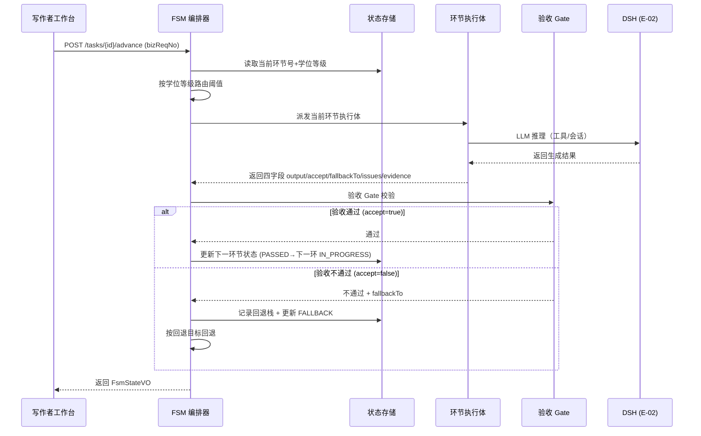

> 异常分支：验收不通过时回退（含前驱指针），并保留上下文。

**SQ-M1-02 回退（前驱指针）**：

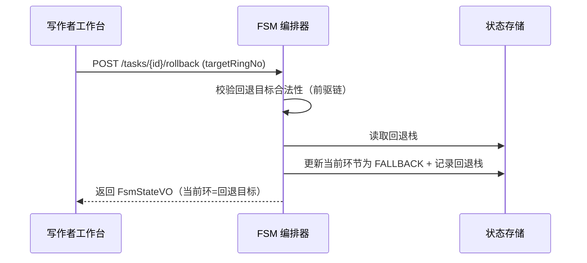

##### §3.2.M1.5 关键流程逻辑

**状态机迁移表**（环节状态 PhaseState）：

| 起始状态        | 触发事件            | 终止状态        | 触发条件 / 校验            | 副作用                       |
| ----------- | --------------- | ----------- | -------------------- | ------------------------- |
| NOT_STARTED | task_create     | IN_PROGRESS | 任务初始化完成              | 写 t_fsm_state；派发环节1执行体    |
| IN_PROGRESS | ring_advance    | PASSED      | 验收 Gate accept=true  | 写 t_acceptance_gate；推进下一环 |
| IN_PROGRESS | ring_advance    | FALLBACK    | 验收 Gate accept=false | 写 t_fsm_state 回退栈；回退目标环   |
| FALLBACK    | ring_re_execute | IN_PROGRESS | 回退目标环重新执行            | 更新当前环；派发执行体               |
| IN_PROGRESS | ring_rollback   | FALLBACK    | 用户手动回退               | 记录前驱指针                    |

**回退/推进伪代码**：

```
触发：TaskAdvanceRequest (bizReqNo, targetRingNo)

Step 1: 读 FSM 状态（同步）
  ├── 校验：taskId 是否存在 → 不存在返回 A010001
  ├── 校验：targetRingNo 合法（1~10）且前置链路正确
  ├── 幂等校验：bizReqNo 在 Redis 幂等键存在 → 返回上次响应
  └── 状态变更：IN_PROGRESS（派发环节执行体）

Step 2: 派发当前环节执行体（同步调用 M2）
  ├── [MOCK] 万方取数环节（环节2/3/4/8）：
  │     输入：subjectField, keywords, degree
  │     规则：若万方不可用，走"人工输入查新结论"降级路径，标记"本次未纳入"
  │     输出：真实取数结果或降级标记
  │     [完整版替换点] 万方 ACL 真实接入（见 M7）
  └── 状态变更：IN_PROGRESS → 依据 M2 返回四字段

Step 3: 验收 Gate 看门（同步调用 M3）
  ├── accept=true → PASSED，推进下一环
  └── accept=false → FALLBACK，按 fallbackTo 回退（记录前驱指针，保留上下文）
```

**FSM 状态迁移事务边界约束**（G4 补强）：

> 环节完整流转链路为：【环节执行返回四字段】→【验收 Gate 判定】→【更新 FSM 状态】→【写入环节业务产物】。其中：
>
> 1. **`t_fsm_state` 与 `t_acceptance_gate` 必须处于同一个本地数据库事务**（同库事务，非分布式事务），保证「状态迁移」与「验收结果」原子一致，避免出现状态已 PASSED 但验收记录缺失（或反之）的半提交状态。
> 2. 章节草稿、文献池等**业务产物表**区分两类写入：**主产物（如 t_chapter_draft 主记录、t_literature_pool 主条目）与 FSM 状态同事务同步写入**；**大体积/附属数据（如章节正文长文本、文献摘要、图谱关系边、版本快照）采用异步写入**，通过进程内事件 + APScheduler 补偿重试（幂等键兜底）。
> 3. **回滚边界**：若主产物写事务失败 → 整个环节回滚，状态回退到未推进前（IN_PROGRESS/原状态），已生成产物清理；若异步附属数据失败 → 不阻塞主状态推进，后台补偿重试，并保留产物供审计（不回滚主产物）。
> 4. **幂等**：全部写操作携带 `bizReqNo` 幂等键（Redis 保留 24h，对账类保留到任务完结），同码重复提交直接返回上次结果，不重复推进状态机。

---

#### 3.2.M2 环节执行体

##### §3.2.M2.1 模块概述

环节执行体模块覆盖「10 个环节各自的执行体」场景，业务逻辑在**学生/写作者**与系统之间流动，同时涉及 **DSH（E-02）**、**万方（E-01）**、**PostgreSQL（C-01）**、**Redis（C-02）** 等内外部系统。每个执行体负责本环节产出并返回四字段 `output / accept / fallbackTo / issues / evidence`，供验收 Gate 看门与编排层回流。本模块为内容生产域核心，覆盖环节 1~10 的主链路产出。

**业务定位三要素**：

| 要素    | 内容                                                                    |
| ----- | --------------------------------------------------------------------- |
| 位置    | 内容生产域，承接 FSM 派发的当前环节，产出对应内容产物                                         |
| 角色    | 学生 / 写作者（主控，撰写/润色/导出）；导师 / 审阅者（敏感环节确认回流）                              |
| 内外部系统 | DSH（E-02）、万方（E-01）、PostgreSQL（C-01）、Redis（C-02）、知识库（M9）、Guardrail（M8） |

##### §3.2.M2.2 接口清单

| 子领域  | 方法   | 路径                               | 用途（≤ 20 字）    | 请求 DTO               | 响应 VO           | 幂等          |
| ---- | ---- | -------------------------------- | ------------- | -------------------- | --------------- | ----------- |
| 选题   | POST | `/api/v1/rings/{ringNo}/execute` | 执行指定环节（1~10）  | RingExecuteRequest   | RingExecuteVO   | 是（bizReqNo） |
| 新颖度  | POST | `/api/v1/rings/2/novelty`        | 新颖度评估（接万方查新）  | NoveltyRequest       | NoveltyVO       | 是（bizReqNo） |
| 文献调研 | POST | `/api/v1/rings/3/docs`           | 文献检索建池（接万方）   | DocsSearchRequest    | DocsSearchVO    | 是（bizReqNo） |
| 文献综述 | POST | `/api/v1/rings/4/review`         | 文献综述批判整合      | ReviewRequest        | ReviewVO        | 是（bizReqNo） |
| 大纲   | POST | `/api/v1/rings/5/outline`        | 大纲搭建          | OutlineRequest       | OutlineVO       | 是（bizReqNo） |
| 撰写   | POST | `/api/v1/rings/6/chapter`        | 分章节撰写         | ChapterWriteRequest  | ChapterWriteVO  | 是（bizReqNo） |
| 润色   | POST | `/api/v1/rings/7/polish`         | 修改润色          | PolishRequest        | PolishVO        | 是（bizReqNo） |
| 引用校验 | POST | `/api/v1/rings/8/citation`       | 引用真实性校验（接万方）  | CitationCheckRequest | CitationCheckVO | 是（bizReqNo） |
| 排版   | POST | `/api/v1/rings/9/typeset`        | 格式排版（导出 docx） | TypesetRequest       | TypesetVO       | 是（bizReqNo） |
| 定稿   | POST | `/api/v1/rings/10/final`         | 最终定稿（HITL 确认） | FinalRequest         | FinalVO         | 是（bizReqNo） |
| 通用   | GET  | `/api/v1/rings/{ringNo}/result`  | 查询环节产物        | —                    | RingResultVO    | 天然          |

##### §3.2.M2.3 关键结构定义（DTO）

```python
class RingExecuteRequest(BaseModel):
    # ===== 必填字段 =====
    ringNo: int                      # 环节号（1~10）
    bizReqNo: str                    # 业务侧请求号（幂等键）
    taskId: int                      # 论文任务 ID

    # ===== 可选字段 =====
    inputs: Dict[str, Any] = {}      # 环节输入（subjectField/keywords/degree 等）

class RingExecuteVO(BaseModel):
    # ===== 基本字段（四字段输出）=====
    output: str                      # 本环节产出
    accept: bool                     # 验收是否通过
    fallbackTo: Optional[int]        # 回退目标环节（不通过时）
    issues: List[str]                # 问题清单
    evidence: List[Evidence]         # 证据清单

    # ===== 时间字段 =====
    createdAt: str

class Evidence(BaseModel):
    # ===== 证据字段 =====
    type: str                        # evidence 类型（万方取数/人工输入/模型输出）
    source: str                      # 证据来源（万方/人工/系统）
    description: str                 # 证据描述
    trustedBoundary: Optional[str]   # 可信边界标记（50篇上限/没查到分两种/学科无名字）
```

**关键字段定义表**：

| DTO / VO 名         | 字段名             | 类型             | 必填 | 业务含义     | 约束 / 默认值            |
| ------------------ | --------------- | -------------- | -- | -------- | ------------------- |
| RingExecuteRequest | ringNo          | Integer        | 是  | 环节号      | 1~10                |
| RingExecuteRequest | bizReqNo        | String         | 是  | 幂等键      | UUID                |
| RingExecuteRequest | taskId          | Long           | 是  | 论文任务 ID  | —                   |
| RingExecuteVO      | output          | String         | 是  | 本环节产出    | —                   |
| RingExecuteVO      | accept          | Boolean        | 是  | 验收是否通过   | true / false        |
| RingExecuteVO      | fallbackTo      | Integer        | 否  | 回退目标     | 1~10（不通过时）          |
| RingExecuteVO      | issues          | List[String]   | 否  | 问题清单     | —                   |
| RingExecuteVO      | evidence        | List[Evidence] | 否  | 证据清单     | —                   |
| Evidence           | trustedBoundary | String         | 否  | 万方可信边界标记 | 50 篇上限/没查到分两种/学科无名字 |

##### §3.2.M2.4 模块逻辑时序图

**时序图清单**：

| 编号       | 标题（`模块名 - 场景名`）     | 场景类别         | 是否包含异常分支 |
| -------- | ------------------- | ------------ | -------- |
| SQ-M2-01 | 环节执行体 - 文献调研（接万方取数） | 核心动作的执行      | 是        |
| SQ-M2-02 | 环节执行体 - 引用校验（防伪引）   | 异常 / 补偿 / 回滚 | 是        |

**SQ-M2-01 文献调研（接万方取数）**：

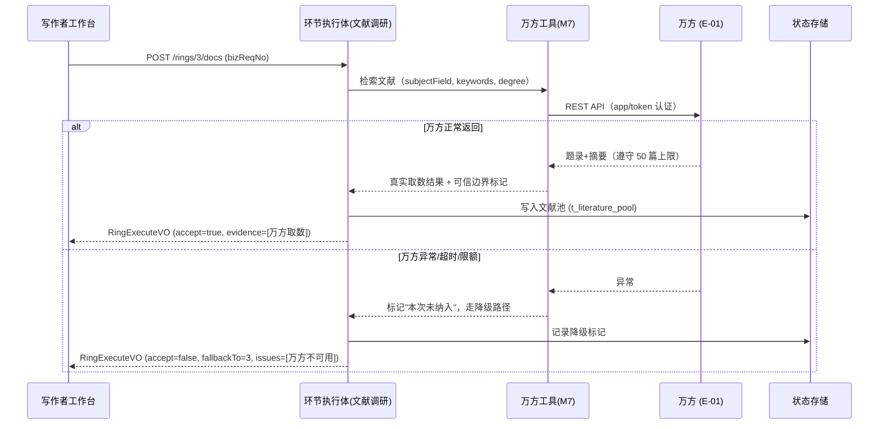

> 异常分支：万方异常时降级为人工输入 + 如实标记，杜绝编造。

**SQ-M2-02 引用校验（防伪引）**：

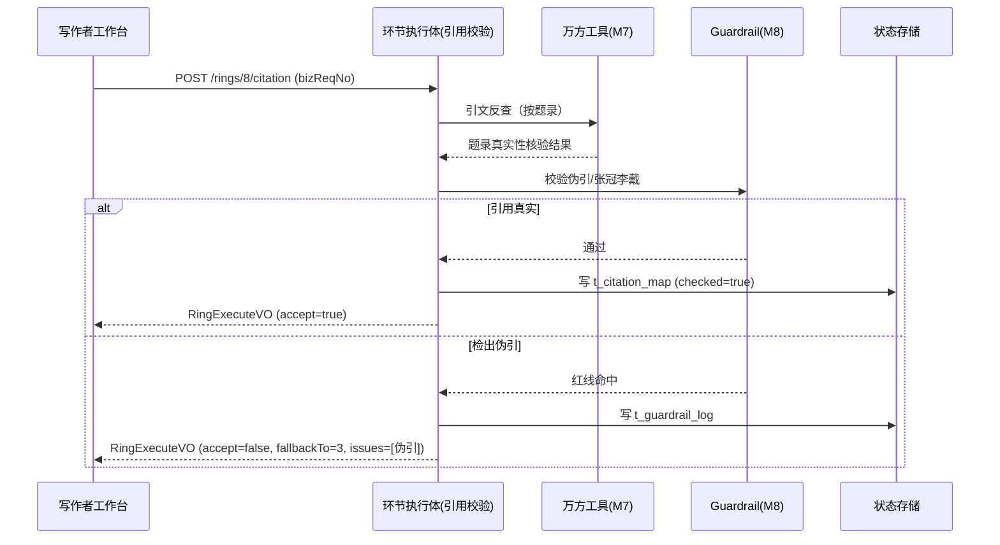

##### §3.2.M2.5 关键流程逻辑

**四字段输出契约**（每个环节执行体必须返回）：
  
`{ "output": "本环节产出", "accept": true/false, "fallbackTo": "前置环节id", "issues": [...], "evidence": [...] }`

**环节执行体伪代码**：

```
触发：RingExecuteRequest (ringNo, bizReqNo, taskId)

Step 1: 判定是否需要外部数据（sync）
  ├── 环节2新颖度/环节3文献调研/环节4综述趋势/环节8引文反查 → 调用 M7 万方取数
  │     ├── 万方可用 → 真实取数 + 可信边界标记
  │     └── [MOCK] 万方不可用 → 人工输入查新结论，标记"本次未纳入"
  │            [完整版替换点] 万方 ACL 真实接入（见 M7）
  ├── 环节1/5/6/7/9/10 → 无外部取数（依赖 LLM 产出 + 本域数据）

Step 2: 环节内容产出（sync，DSH LLM 推理）
  ├── 调用 DSH 生成本环节内容（依赖 FSM 学位路由阈值/深度）
  └── 状态变更：产出存 M4（对应 t_* 表）

Step 3: 自我验收（sync）
  ├── 生成四字段 output/accept/fallbackTo/issues/evidence
  └── 返回给 M1 编排层，waiting Gate 看门
```

**章节粒度并发控制约束**（G4 补强）：

> 现有 `lock:fsm:{taskId}:{ringNo}` 仅锁住整个任务 FSM 推进，无法防护**章节维度**并发——用户重复点击「生成章节」时，同一任务下草稿版本可能覆盖错乱。文档采用**方案 A（推荐）** 并辅以方案 B 兜底：
>
> - **方案 A（推荐）**：新增章节级分布式锁 `lock:chapter:{taskId}:{outlineId}`，同一任务同一大纲节点只允许一个章节生成任务在跑，锁持有方可重试/排队。
> - **方案 B（业务兜底）**：业务流程层强制——**同一个论文任务内，章节生成任务串行排队执行**；用户重复提交生成请求时，拒绝并提示「该章节正在生成中，请勿重复提交」。
>     
>   两方案结合：方案 A 提供技术防线，方案 B 提供用户可感知的明确反馈，避免静默覆盖。

---

#### 3.2.M3 验收 Gate（含 HITL 网关）

##### §3.2.M3.1 模块概述

验收 Gate 模块覆盖「每环布尔化看门：通过/不通过 + 回退目标」「敏感环节 HITL 人工确认（环节 2/4/8/10）」核心场景，业务逻辑在**导师/审阅者**、**学生/写作者**与系统之间流动，同时涉及 **PostgreSQL（C-01）**、**Redis（C-02）**、**Guardrail（M8）** 等内外部系统。它是"可回退、可审计"机制的核心——每环产出经布尔化看门判定，通过则推进，不通过则按回退目标回退；敏感环节（2/4/8/10）插桩人工确认兜底学术红线。

**业务定位三要素**：

| 要素    | 内容                                                    |
| ----- | ----------------------------------------------------- |
| 位置    | 流程编排域，介于环节执行体与 FSM 推进之间                               |
| 角色    | 导师 / 审阅者（HITL 人工确认）；学生 / 写作者（被确认方）；FSM 引擎             |
| 内外部系统 | PostgreSQL（C-01）、Redis（C-02）、Guardrail（M8）、版本快照（E-06） |

##### §3.2.M3.2 接口清单

| 子领域  | 方法   | 路径                                | 用途（≤ 20 字）   | 请求 DTO              | 响应 VO                    | 幂等            |
| ---- | ---- | --------------------------------- | ------------ | ------------------- | ------------------------ | ------------- |
| 验收门  | POST | `/api/v1/gates/{gateId}/evaluate` | 对某环节产物做布尔化看门 | GateEvaluateRequest | GateEvaluateVO           | 是（bizReqNo）   |
| HITL | GET  | `/api/v1/hitl/pending`            | 查询待确认队列（导师）  | —                   | PageResponse[HitlItemVO] | 天然            |
| HITL | POST | `/api/v1/hitl/{hitlId}/approve`   | 敏感环节人工放行     | HitlApproveRequest  | HitlItemVO               | 是（id+version） |
| HITL | POST | `/api/v1/hitl/{hitlId}/reject`    | 敏感环节人工打回     | HitlRejectRequest   | HitlItemVO               | 是（id+version） |
| 验收历史 | GET  | `/api/v1/gates/{taskId}/history`  | 查询环节验收历史     | —                   | PageResponse[GateVO]     | 天然            |

##### §3.2.M3.3 关键结构定义（DTO）

```python
class GateEvaluateRequest(BaseModel):
    # ===== 必填字段 =====
    bizReqNo: str                    # 幂等键
    gateId: int                      # 验收门 ID
    accept: Optional[bool]           # 自动看门结果（true/false）
    fallbackTo: Optional[int]        # 回退目标环节（不通过时）
    issues: List[str]                # 问题清单

class HitlApproveRequest(BaseModel):
    # ===== 必填字段 =====
    hitlId: int                      # HITL 确认项 ID
    reviewer: Optional[str]          # 确认人（导师/审阅者）
    comment: Optional[str]           # 确认意见

class HitlItemVO(BaseModel):
    # ===== 基本信息 =====
    hitlId: int
    taskId: int
    ringNo: int                      # 敏感环节号（2/4/8/10）

    # ===== 状态字段 =====
    status: HitlStatus               # PENDING / APPROVED / REJECTED

    # ===== 时间字段 =====
    createdAt: str
    updatedAt: str
```

**关键字段定义表**：

| DTO / VO 名          | 字段名        | 类型      | 必填 | 业务含义        | 约束 / 默认值                      |
| ------------------- | ---------- | ------- | -- | ----------- | ----------------------------- |
| GateEvaluateRequest | gateId     | Long    | 是  | 验收门 ID      | —                             |
| GateEvaluateRequest | accept     | Boolean | 是  | 自动看门结果      | true / false                  |
| GateEvaluateRequest | fallbackTo | Integer | 否  | 回退目标        | 1~10                          |
| HitlApproveRequest  | hitlId     | Long    | 是  | HITL 确认项 ID | —                             |
| HitlApproveRequest  | reviewer   | String  | 是  | 确认人         | 导师/审阅者                        |
| HitlItemVO          | status     | enum    | 是  | HITL 状态     | PENDING / APPROVED / REJECTED |
| HitlItemVO          | ringNo     | Integer | 是  | 敏感环节号       | 2 / 4 / 8 / 10                |

##### §3.2.M3.4 模块逻辑时序图

**时序图清单**：

| 编号       | 标题（`模块名 - 场景名`）          | 场景类别    | 是否包含异常分支 |
| -------- | ------------------------ | ------- | -------- |
| SQ-M3-01 | 验收 Gate - 敏感环节 HITL 人工确认 | 核心动作的执行 | 是        |

**SQ-M3-01 敏感环节 HITL 人工确认**：

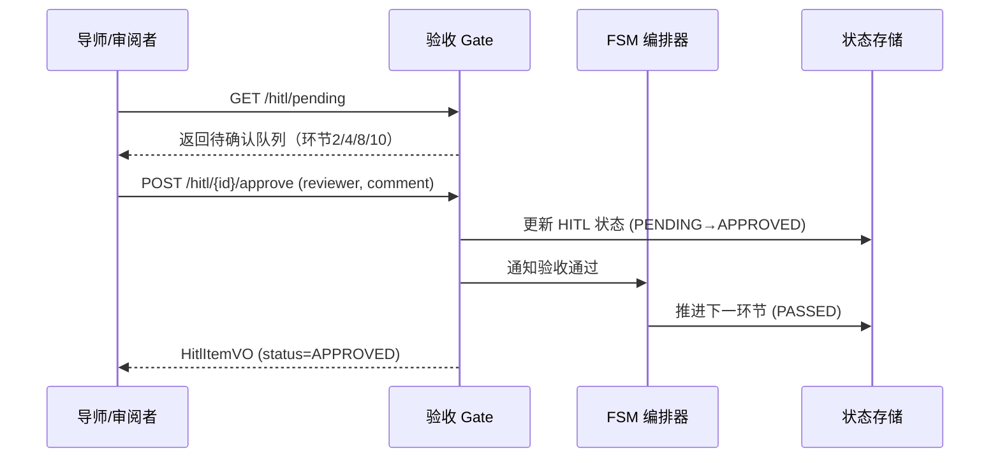

> 异常分支：导师打回时，更新 HITL 状态为 REJECTED，并回退对应环节。

##### §3.2.M3.5 关键流程逻辑

**状态机迁移表**（HITL 状态 HitlStatus）：

| 起始状态    | 触发事件         | 终止状态     | 触发条件 / 校验 | 副作用                        |
| ------- | ------------ | -------- | --------- | -------------------------- |
| PENDING | hitl_approve | APPROVED | 审核人确认放行   | 写 t_acceptance_gate；推进下一环  |
| PENDING | hitl_reject  | REJECTED | 审核人打回     | 写 t_acceptance_gate；回退对应环节 |

**敏感环节 HITL 插桩位置**（经中间确认 U-04 已冻结）：环节 2（新颖度评估，确认选题方向/创新点定位）、环节 4（文献综述，确认研究空白/切入角度）、环节 8（引用校验，确认无伪引/引用真实）、环节 10（最终定稿，确认整体合规/查重风险）；其余 6 环节（选题/调研/大纲/撰写/润色/排版）全自动运行，不打断用户。

---

#### 3.2.M4 状态存储

##### §3.2.M4.1 模块概述

状态存储模块覆盖「topic 进度、FSM 当前节点、回退栈持久化」「内容产物持久化」核心场景，业务逻辑在 **PostgreSQL（C-01）** 与 **Redis（C-02）** 之间流动，为 FSM 编排器（M1）、环节执行体（M2）、验收 Gate（M3）提供统一状态读写契约。本模块负责把业务结构化数据（topic/literaturePool/outline/chapterDraft/citationMap/guardrailLog 等）独立落库，**不耦合进 DSH 内部**（对齐 `_runtime_meta` §6.2）。

**业务定位三要素**：

| 要素    | 内容                                             |
| ----- | ---------------------------------------------- |
| 位置    | 流程编排域，全流程状态的持久化底座                              |
| 角色    | FSM 引擎（读写方）；学生 / 写作者（间接）                       |
| 内外部系统 | PostgreSQL（C-01）、Redis（C-02）、本地文件系统（C-03，版本快照） |

##### §3.2.M4.2 接口清单

| 子领域  | 方法   | 路径                                      | 用途（≤ 20 字） | 请求 DTO               | 响应 VO                   | 幂等          |
| ---- | ---- | --------------------------------------- | ---------- | -------------------- | ----------------------- | ----------- |
| 状态读写 | POST | `/api/v1/state/{taskId}/snapshot`       | 写 FSM 状态快照 | FsmSnapshotRequest   | FsmSnapshotVO           | 是（bizReqNo） |
| 状态读写 | GET  | `/api/v1/state/{taskId}`                | 读当前 FSM 状态 | —                    | FsmStateVO              | 天然          |
| 状态读写 | GET  | `/api/v1/state/{taskId}/versions`       | 查版本快照列表    | —                    | PageResponse[VersionVO] | 天然          |
| 回退栈  | POST | `/api/v1/state/{taskId}/rollback-stack` | 写/读回退栈     | RollbackStackRequest | RollbackStackVO         | 是（bizReqNo） |

##### §3.2.M4.3 关键结构定义（DTO）

```python
class FsmSnapshotRequest(BaseModel):
    # ===== 必填字段 =====
    taskId: int
    currentRingNo: int               # 当前环节号
    rollbackStack: Optional[str]     # 回退栈（JSON，含上下文快照）
    phaseState: PhaseState           # 当前环节状态
    context: Dict[str, Any]          # FSM 全局上下文（题目/创新点/文献池/大纲）

class FsmSnapshotVO(BaseModel):
    # ===== 基本信息 =====
    taskId: int
    currentRingNo: int
    phaseState: PhaseState
    rollbackStack: Optional[str]

    # ===== 时间字段 =====
    snapshotTime: str
```

**关键字段定义表**：

| DTO / VO 名         | 字段名           | 类型      | 必填 | 业务含义      | 约束 / 默认值                                      |
| ------------------ | ------------- | ------- | -- | --------- | --------------------------------------------- |
| FsmSnapshotRequest | taskId        | Long    | 是  | 论文任务 ID   | —                                             |
| FsmSnapshotRequest | currentRingNo | Integer | 是  | 当前环节号     | 1~10                                          |
| FsmSnapshotRequest | rollbackStack | String  | 否  | 回退栈       | JSON，含前驱指针                                    |
| FsmSnapshotRequest | context       | Map     | 否  | FSM 全局上下文 | 题目/创新点/文献池/大纲                                 |
| FsmSnapshotVO      | phaseState    | enum    | 是  | 环节状态      | NOT_STARTED / IN_PROGRESS / PASSED / FALLBACK |

##### §3.2.M4.4 模块逻辑时序图

**时序图清单**：

| 编号       | 标题（`模块名 - 场景名`）    | 场景类别    | 是否包含异常分支 |
| -------- | ------------------ | ------- | -------- |
| SQ-M4-01 | 状态存储 - FSM 状态快照持久化 | 核心实体的创建 | 是        |

**SQ-M4-01 FSM 状态快照持久化**：

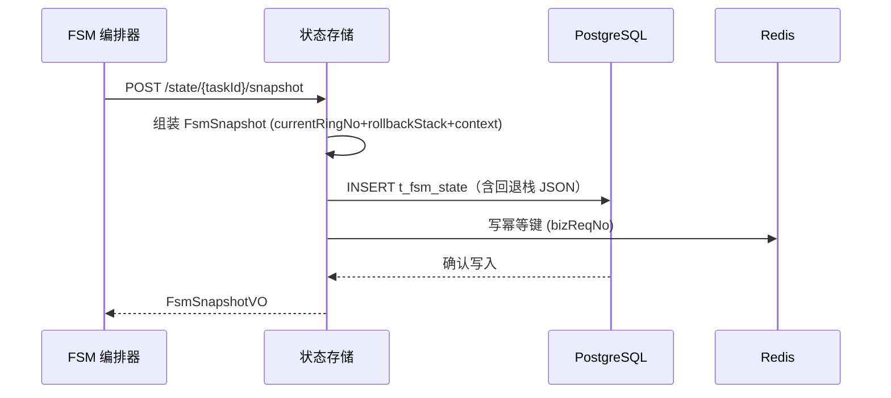

##### §3.2.M4.5 关键流程逻辑

**本段说明**：状态存储无复杂状态机，为持久化读写契约（见 §3.2.M4.4 时序图与 §4.2 t_fsm_state 表）。持久化事务边界：每次 FSM 状态迁移必须**在同一数据库事务**内完成（写 t_fsm_state + 写 t_acceptance_gate），避免状态与验收结果不一致；幂等键在 Redis 保留 24h 防重复提交（见 §4.4.3）。

---

#### 3.2.M5 docx 模板解析

##### §3.2.M5.1 模块概述

docx 模板解析模块覆盖「解析用户上传的 Word 模板骨架与占位符（主题/前置件/目录/章节结构）」核心场景，业务逻辑在**学生/写作者**与系统之间流动，同时涉及 **docxtpl（E-03）**、**PostgreSQL（C-01）**、**本地文件系统（C-03）** 等内外部系统。它抽取用户自定义模板的结构（封面/摘要/目录/正文/参考文献/附录的层级与格式），供 M6 生成与校验时对齐模板，保证"所见即所得"。

**业务定位三要素**：

| 要素    | 内容                                               |
| ----- | ------------------------------------------------ |
| 位置    | 文档工程域，docx 导出的前置解析层                              |
| 角色    | 学生 / 写作者（上传模板并解析）                                |
| 内外部系统 | docxtpl（E-03）、PostgreSQL（C-01）、本地文件系统（C-03，模板文件） |

##### §3.2.M5.2 接口清单

| 子领域  | 方法   | 路径                                     | 用途（≤ 20 字）    | 请求 DTO                | 响应 VO                    | 幂等                   |
| ---- | ---- | -------------------------------------- | ------------- | --------------------- | ------------------------ | -------------------- |
| 模板上传 | POST | `/api/v1/templates`                    | 上传自定义 Word 模板 | TemplateUploadRequest | TemplateVO               | 是（X-Idempotency-Key） |
| 模板解析 | POST | `/api/v1/templates/{templateId}/parse` | 解析模板骨架与占位符    | TemplateParseRequest  | TemplateParseVO          | 是（bizReqNo）          |
| 模板查询 | GET  | `/api/v1/templates/{templateId}`       | 查模板信息与已解析骨架   | —                     | TemplateDetailVO         | 天然                   |
| 模板列表 | GET  | `/api/v1/templates`                    | 分页查询我的模板      | —                     | PageResponse[TemplateVO] | 天然                   |

##### §3.2.M5.3 关键结构定义（DTO）

```python
class TemplateParseRequest(BaseModel):
    # ===== 必填字段 =====
    templateId: int
    taskId: int                      # 绑定的论文任务
    placeholders: List[str]          # 待抽取的占位符列表

class TemplateParseVO(BaseModel):
    # ===== 基本信息 =====
    templateId: int
    templateName: str

    # ===== 业务字段 =====
    sections: List[SectionNode]      # 模板骨架（封面/摘要/目录/正文/参考文献/附录）
    placeholders: List[str]          # 抽取到的占位符（{{title}}/{{author}}/...）

    # ===== 状态字段 =====
    status: ParseStatus              # PARSED / UNPARSED

class SectionNode(BaseModel):
    # ===== 结构字段 =====
    sectionType: str                 # COVER / ABSTRACT / TOC / BODY / REFERENCE / APPENDIX
    sectionTitle: str
    order: int
    children: List[SectionNode]      # 子节层级
```

**关键字段定义表**：

| DTO / VO 名      | 字段名          | 类型                | 必填 | 业务含义 | 约束 / 默认值                                   |
| --------------- | ------------ | ----------------- | -- | ---- | ------------------------------------------ |
| TemplateParseVO | sections     | List[SectionNode] | 是  | 模板骨架 | COVER/ABSTRACT/TOC/BODY/REFERENCE/APPENDIX |
| TemplateParseVO | placeholders | List[String]      | 是  | 占位符  | {{title}}/{{author}} 等                     |
| SectionNode     | sectionType  | String            | 是  | 节类型  | COVER/ABSTRACT/TOC/BODY/REFERENCE/APPENDIX |
| SectionNode     | order        | Integer           | 是  | 顺序   | —                                          |

##### §3.2.M5.4 模块逻辑时序图

**时序图清单**：

| 编号       | 标题（`模块名 - 场景名`）        | 场景类别    | 是否包含异常分支 |
| -------- | ---------------------- | ------- | -------- |
| SQ-M5-01 | docx 模板解析 - 解析模板骨架与占位符 | 核心实体的创建 | 是        |

**SQ-M5-01 解析模板骨架与占位符**：

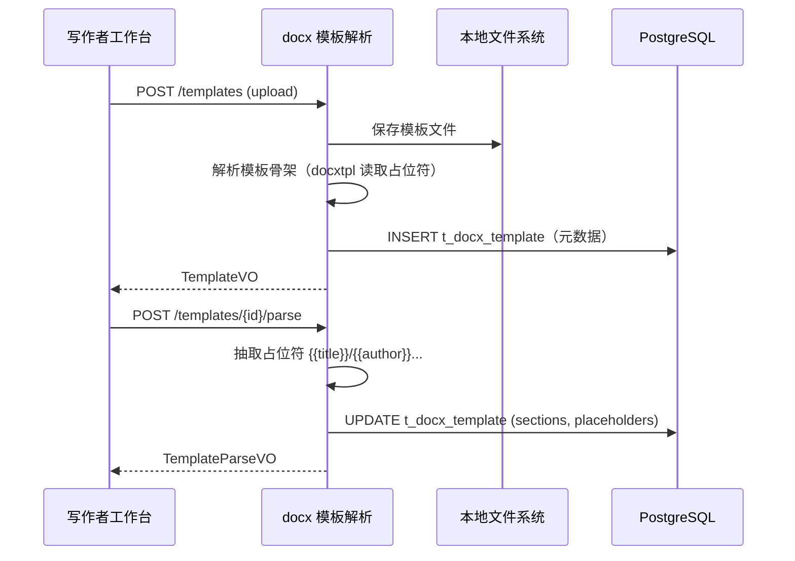

##### §3.2.M5.5 关键流程逻辑

**本段说明**：模板解析无复杂状态机/事务/跨多步异步，为"上传 → 安全校验 → 解析 → 落库"三步流水线（见 §3.2.M5.4 时序图）。关键点在**占位符抽取**：若模板缺失必备占位符（如 `{{title}}`），解析结果标记为 `UNPARSED` 并提示补充，防止后续生成缺失字段。解析结果落 `t_docx_template`（见 §4.2.19）。

**docx 模板上传安全校验明细**（G4 补强）：

> 上传的 Word 模板属**不可信外部输入**，必须逐项校验（对应 UserStory US-1 的安全约束），明细如下：
>
> 1. **拒绝带宏文档**：检测 `.docm`/内含 VBA 宏的 docx（`/word/vbaProject.bin`），直接拒绝；仅接受无宏 `.docx`。
> 2. **剥离危险嵌入对象**：检测并剥离模板内 OLE 对象、内嵌对象、外部链接关系（`/word/embeddings/*`、`oleObject`、`hyperlink` external），防止嵌入恶意内容。
> 3. **模板语法沙箱**：docxtpl(Jinja2) 模板语法**沙箱化运行**，禁用 `` 中任意 Python 代码/危险属性访问（如 `{{ ''.__class__.__mro__ }}` 类注入），仅允许白名单变量渲染。
> 4. **类型/大小限制**：仅接受 `.docx`，单文件大小上限（默认 20MB），并校验文件 MIME/魔数。
>      
>    **风险等级备注**：MVP 为本地桌面单机场景，此类模板注入风险较低；**若后续扩展为多用户 SaaS 部署，该校验项升级为强制高危校验**（安全设计 §7 同步收紧）。

---

#### 3.2.M6 docx 生成与校验

##### §3.2.M6.1 模块概述

docx 生成与校验模块覆盖「docxtpl 按模板生成 + openxml-audit 校验」「落对象/本地存储」核心场景，业务逻辑在**学生/写作者**与系统之间流动，同时涉及 **docxtpl（E-03）**、**openxml-audit（E-04）**、**PostgreSQL（C-01）**、**本地文件系统（C-03）** 等内外部系统。它把排版稿/润色稿按用户自定义模板渲染为合规 docx，并在生成后立即做 OOXML schema/roundtrip/load 校验，捕获"会打不开/被 Word 修复"的损坏输出。

**业务定位三要素**：

| 元素    | 内容                                                              |
| ----- | --------------------------------------------------------------- |
| 位置    | 文档工程域，docx 导出的生成 + 校验层                                          |
| 角色    | 学生 / 写作者（导出合规 docx）                                             |
| 内外部系统 | docxtpl（E-03）、openxml-audit（E-04）、PostgreSQL（C-01）、本地文件系统（C-03） |

##### §3.2.M6.2 接口清单

| 子领域 | 方法   | 路径                              | 用途（≤ 20 字）        | 请求 DTO             | 响应 VO         | 幂等          |
| --- | ---- | ------------------------------- | ----------------- | ------------------ | ------------- | ----------- |
| 生成  | POST | `/api/v1/docs/generate`         | 按模板生成合规 docx      | DocGenerateRequest | DocGenerateVO | 是（bizReqNo） |
| 校验  | POST | `/api/v1/docs/{docId}/validate` | openxml-audit 校验  | DocValidateRequest | DocValidateVO | 是（bizReqNo） |
| 导出  | GET  | `/api/v1/docs/{docId}/download` | 下载生成的合规 docx      | —                  | 文件流           | 天然          |
| 查询  | GET  | `/api/v1/docs/{docId}`          | 查生成的 docx 信息与校验结果 | —                  | DocDetailVO   | 天然          |

##### §3.2.M6.3 关键结构定义（DTO）

```python
class DocGenerateRequest(BaseModel):
    # ===== 必填字段 =====
    bizReqNo: str                    # 幂等键
    taskId: int
    templateId: int                  # 使用的用户模板
    typesetDocId: int                # 排版稿 ID（环节9产物）
    renderData: Dict[str, Any]       # 渲染数据（标题/摘要/目录/正文/参考文献）

class DocGenerateVO(BaseModel):
    # ===== 基本信息 =====
    docId: int
    fileName: str                    # 生成的 docx 名

    # ===== 状态字段 =====
    status: DocStatus                # GENERATED / VALIDATED / FAILED

    # ===== 校验字段 =====
    issues: List[DocValidationIssue] # 校验问题清单

class DocValidationIssue(BaseModel):
    # ===== 校验字段 =====
    type: str                        # schema/roundtrip/load/template_mismatch
    description: str
    severity: Severity               # ERROR / WARN
```

**关键字段定义表**：

| DTO / VO 名         | 字段名          | 类型     | 必填 | 业务含义    | 约束 / 默认值                                |
| ------------------ | ------------ | ------ | -- | ------- | --------------------------------------- |
| DocGenerateRequest | templateId   | Long   | 是  | 使用的用户模板 | —                                       |
| DocGenerateRequest | typesetDocId | Long   | 是  | 排版稿 ID  | 环节9产物                                   |
| DocGenerateVO      | status       | enum   | 是  | docx 状态 | GENERATED / VALIDATED / FAILED          |
| DocValidationIssue | type         | String | 是  | 校验类型    | schema/roundtrip/load/template_mismatch |
| DocValidationIssue | severity     | enum   | 是  | 严重级别    | ERROR / WARN                            |

##### §3.2.M6.4 模块逻辑时序图

**时序图清单**：

| 编号       | 标题（`模块名 - 场景名`）                   | 场景类别    | 是否包含异常分支 |
| -------- | --------------------------------- | ------- | -------- |
| SQ-M6-01 | docx 生成校验 - 生成 + openxml-audit 校验 | 核心动作的执行 | 是        |

**SQ-M6-01 生成 + openxml-audit 校验**：

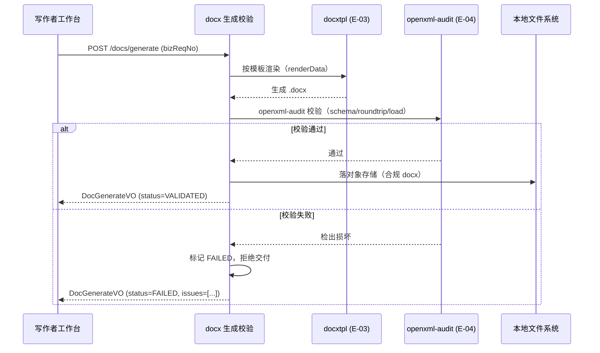

> 异常分支：openxml-audit 检出损坏时拒绝交付并回退重新生成/换模板。

##### §3.2.M6.5 关键流程逻辑

**本段说明**：docx 生成与校验无复杂跨多步状态机，为"渲染 → 校验 → 落盘"三步流程（见 §3.2.M6.4 时序图）。关键点在**生成后立即校验**（openxml-audit 在生成后立即做 schema+语义校验，纳入 CI 兜底），损坏输出标记 FAILED 并拒绝交付（对齐 R-04 缓解）。

---

#### 3.2.M7 万方工具（ACL 防腐层）

##### §3.2.M7.1 模块概述

万方工具模块覆盖「新颖度评估/文献调研/综述趋势/引用核验取数（E-xx 防腐层）」核心场景，业务逻辑在**学生/写作者**、**FSM 引擎**与**万方（E-01）**&#x4E4B;间流动，同时涉及 **PostgreSQL（C-01）**、**Redis（C-02）** 等内外部系统。它是对接万方数据接口的唯一入口，必须遵守"50 篇上限""没查到分两种""学科无名字"三条可信边界，接口异常时如实回避、不编造替代结论（对齐 material_digest §数据说明 / §7）。

**业务定位三要素**：

| 要素    | 内容                                                      |
| ----- | ------------------------------------------------------- |
| 位置    | 数据接入域，对外部万方的 ACL 防腐层                                    |
| 角色    | FSM 引擎 / 环节执行体（取数方）；学生 / 写作者（被服务）                       |
| 内外部系统 | 万方（E-01）、PostgreSQL（C-01）、Redis（C-02）、本地任务调度（C-04，取数重试） |

##### §3.2.M7.2 接口清单

| 子领域  | 方法   | 路径                         | 用途（≤ 20 字）   | 请求 DTO                 | 响应 VO                      | 幂等          |
| ---- | ---- | -------------------------- | ------------ | ---------------------- | -------------------------- | ----------- |
| 查新   | POST | `/api/v1/wanfang/novelty`  | 新颖度评估查新取数    | WanfangNoveltyRequest  | WanfangNoveltyVO           | 是（bizReqNo） |
| 文献检索 | POST | `/api/v1/wanfang/docs`     | 文献检索建池取数     | WanfangDocsRequest     | WanfangDocsVO              | 是（bizReqNo） |
| 引文反查 | POST | `/api/v1/wanfang/citation` | 引用真实性反查      | WanfangCitationRequest | WanfangCitationVO          | 是（bizReqNo） |
| 取数日志 | GET  | `/api/v1/wanfang/logs`     | 查取数日志与可信边界标记 | —                      | PageResponse[WanfangLogVO] | 天然          |

##### §3.2.M7.3 关键结构定义（DTO）

```python
class WanfangNoveltyRequest(BaseModel):
    # ===== 必填字段 =====
    bizReqNo: str
    subjectField: str                # 学科领域
    keywords: List[str]              # 关键词集
    degree: Degree                   # 学位等级（影响查新灵敏度）
    timeWindow: Optional[str]        # 时间窗（近5年/近3年等）

class WanfangNoveltyVO(BaseModel):
    # ===== 业务字段 =====
    noveltyConclusion: str           # 新颖度结论（高/中/低）
    riskDesc: Optional[str]          # 风险说明
    recalledCount: int               # 实际召回量（须遵守 50 篇上限判定）
    hitLimit: bool                   # 是否撞到 50 篇上限（hitLimit=true）
    boundaryNote: Optional[str]      # 可信边界说明（如"这是空白机会/本次未纳入"）

    # ===== 状态字段 =====
    status: WanfangStatus            # SUCCESS / DEGRADED / FAILED

class WanfangLogVO(BaseModel):
    # ===== 基本信息 =====
    logId: int
    apiName: str                     # novelty/docs/citation
    requestSummary: str              # 请求摘要（subjectField+keywords）

    # ===== 业务字段 =====
    trustedBoundary: bool            # 是否遵守可信边界
    boundaryType: Optional[str]      # 50篇上限/没查到分两种/学科无名字
    fabricated: bool                 # 是否编造（必须 false）

    # ===== 时间字段 =====
    queryTime: str
```

**关键字段定义表**：

| DTO / VO 名       | 字段名               | 类型      | 必填 | 业务含义       | 约束 / 默认值                    |
| ---------------- | ----------------- | ------- | -- | ---------- | --------------------------- |
| WanfangNoveltyVO | noveltyConclusion | String  | 是  | 新颖度结论      | 高 / 中 / 低                   |
| WanfangNoveltyVO | hitLimit          | Boolean | 是  | 是否撞 50 篇上限 | true：50=至少50篇；false：真值      |
| WanfangNoveltyVO | boundaryNote      | String  | 是  | 可信边界说明     | 见 material_digest §数据说明     |
| WanfangNoveltyVO | status            | enum    | 是  | 万方取数状态     | SUCCESS / DEGRADED / FAILED |
| WanfangLogVO     | fabricated        | Boolean | 是  | 是否编造       | 恒 false（防编造红线）              |

##### §3.2.M7.4 模块逻辑时序图

**时序图清单**：

| 编号       | 标题（`模块名 - 场景名`）    | 场景类别         | 是否包含异常分支 |
| -------- | ------------------ | ------------ | -------- |
| SQ-M7-01 | 万方工具 - 查新取数与可信边界   | 核心动作的执行      | 是        |
| SQ-M7-02 | 万方工具 - 接口异常降级（防编造） | 异常 / 补偿 / 回滚 | 是        |

**SQ-M7-02 接口异常降级（防编造）**：

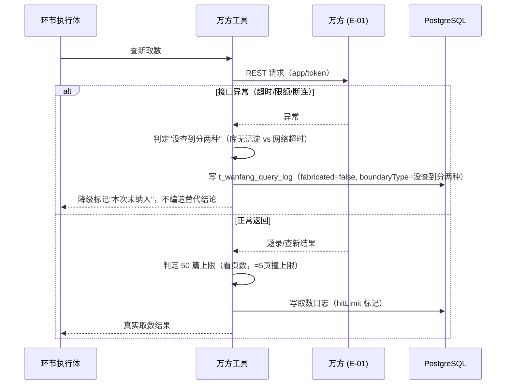

> 异常分支：接口异常时如实标注"本次未纳入"或"库无沉淀"，杜绝把"没查到"当"没人做过"。

##### §3.2.M7.5 关键流程逻辑

**三条可信边界处理**（防编造红线，必须遵守）：

| 可信边界   | 处理规则                                                                            | 落地字段                        |
| ------ | ------------------------------------------------------------------------------- | --------------------------- |
| 50 篇上限 | 凡显示 50 的，代表"至少有 50 篇、具体多少不知道"；只有少于 50 才是真实召回量。判断窍门：看"页数"，等于 5 页就是撞上限，小于 5 页才是真值 | hitLimit                    |
| 没查到分两种 | ①库中还没沉淀成熟研究脉络（对选题是利好信号）；②网络没连上/请求超时（数据其实有，只是没取回）。后者必须标注"本次未纳入"                  | boundaryNote / boundaryType |
| 学科没名字  | 万方交叉学科分布只返回学科编号、不给可读名称；报告只能说"存在若干相关学科、各自热度如何"，叫不出具体学科名                          | boundaryNote                |

**降级伪代码**：

```
触发：WanfangNoveltyRequest (subjectField, keywords, degree)

Step 1: 调用万方接口 (sync)
  ├── 校验：bizReqNo 幂等键存在 → 返回上次结果
  ├── [MOCK] 万方不可用（无有效 app/token）：
  │     输入：subjectField, keywords
  │     规则：走"人工输入查新结论"降级路径，如实标注可信边界
  │     输出：降级标记（fabricated=false）
  │     [完整版替换点] 万方 ACL 真实接入 + 机构订阅 app/token 认证（见 §3.1.3 E-01）
  └── 状态变更：SUCCESS / DEGRADED / FAILED

Step 2: 处理可信边界 (sync)
  ├── 50 篇上限：hitLimit=true/false
  ├── 没查到分两种：区分"库无沉淀（利好）" vs "网络超时（本次未纳入）"
  └── 学科无名字：只报编号不给可读名

Step 3: 写取数日志 (sync)
  └── INSERT t_wanfang_query_log（fabricated=false 恒真，杜绝编造）
```

**万方全局配额管控约束**（G4 补强）：

> 万方为**计费 API**，仅单用户 5 次/分钟限流不足以防止**预算超支**。必须增加全局配额管控，配置如下（见 §4.1 外部依赖 E-01 与 §8.1 监控）：
>
> 1. **全局日调用上限**（默认 2000 次/天）、**全局月调用上限**（默认 50000 次/月），两项均可配置。
> 2. 达到任一项配额上限 → **自动切换至"人工输入查新结论"降级路径**（对应 `fabricated=false` 可信边界处理），不再发起真实取数。
> 3. 触顶时**触发 P2 级告警**通知「@本地运维」与「@研发」（对应 §8.4 告警体系），提示预算风险。
> 4. 配额计数使用 Redis 原子计数（`limit:wanfang:{date}` / `limit:wanfang:{month}`），与限流计数（§3.5.4）同源，避免重复造轮子。

---

#### 3.2.M8 Guardrail 合规校验

##### §3.2.M8.1 模块概述

Guardrail 合规校验模块覆盖「学术不端/伪引/查重/伦理/平权表达红线校验」「与 M3 联动为硬门禁」核心场景，业务逻辑在**学生/写作者**、**院校学位管理者**与系统之间流动，同时涉及 **PostgreSQL（C-01）**、**万方（E-01，引文反查）** 等内外部系统。它是学术规范红线的独立校验层，关键环节插桩，检出即阻断/回退。**安全深化由 security-architect 在 G5 安全设计中补充**，本节给出机制选择与关键参数基线。

**业务定位三要素**：

| 要素    | 内容                                              |
| ----- | ----------------------------------------------- |
| 位置    | 合规校验域，学术红线独立校验层（critical 环节插桩）                  |
| 角色    | 学生 / 写作者（被校验）；导师 / 审阅者（HITL 联动）；院校学位管理者（合规留痕查看） |
| 内外部系统 | PostgreSQL（C-01）、万方（E-01，引文反查）、版本快照（E-06）       |

##### §3.2.M8.2 接口清单

| 子领域  | 方法   | 路径                            | 用途（≤ 20 字）          | 请求 DTO                | 响应 VO                        | 幂等          |
| ---- | ---- | ----------------------------- | ------------------- | --------------------- | ---------------------------- | ----------- |
| 红线校验 | POST | `/api/v1/guardrail/check`     | 校验学术红线（伪引/查重/伦理/平权） | GuardrailCheckRequest | GuardrailCheckVO             | 是（bizReqNo） |
| 红线记录 | GET  | `/api/v1/guardrail/logs`      | 查询红线命中与处置记录         | —                     | PageResponse[GuardrailLogVO] | 天然          |
| 红线看板 | GET  | `/api/v1/guardrail/dashboard` | 合规留痕看板（院校管理者）       | —                     | GuardrailDashboardVO         | 天然          |

##### §3.2.M8.3 关键结构定义（DTO）

```python
class GuardrailCheckRequest(BaseModel):
    # ===== 必填字段 =====
    bizReqNo: str
    taskId: int
    ringNo: int                      # 校验环节号
    content: str                     # 待校验内容（正文/引用/图注等）
    citations: List[str]             # 引用条目（供伪引校验）

class GuardrailCheckVO(BaseModel):
    # ===== 业务字段 =====
    passed: bool                     # 是否通过红线校验
    issues: List[GuardrailIssue]     # 命中问题清单
    guardrailType: str               # 红线类型（学术不端/伪引/查重/伦理/平权表达）

    # ===== 状态字段 =====
    status: GuardrailStatus          # PASS / BLOCKED

class GuardrailLogVO(BaseModel):
    # ===== 基本信息 =====
    logId: int
    taskId: int
    ringNo: int

    # ===== 业务字段 =====
    issue: str                       # 红线类型
    severity: Severity               # P0~P3
    action: str                      # 处置动作（阻断/回退/删除伪引）
```

**关键字段定义表**：

| DTO / VO 名       | 字段名           | 类型      | 必填 | 业务含义   | 约束 / 默认值           |
| ---------------- | ------------- | ------- | -- | ------ | ------------------ |
| GuardrailCheckVO | passed        | Boolean | 是  | 是否通过红线 | true / false       |
| GuardrailCheckVO | guardrailType | String  | 是  | 红线类型   | 学术不端/伪引/查重/伦理/平权表达 |
| GuardrailCheckVO | status        | enum    | 是  | 校验状态   | PASS / BLOCKED     |
| GuardrailLogVO   | issue         | String  | 是  | 红线类型   | 学术不端/伪引/查重/伦理/平权表达 |
| GuardrailLogVO   | severity      | enum    | 是  | 严重级别   | P0~P3              |

##### §3.2.M8.4 模块逻辑时序图

**时序图清单**：

| 编号       | 标题（`模块名 - 场景名`）       | 场景类别         | 是否包含异常分支 |
| -------- | --------------------- | ------------ | -------- |
| SQ-M8-01 | Guardrail - 伪引红线校验与阻断 | 异常 / 补偿 / 回滚 | 是        |

**SQ-M8-01 伪引红线校验与阻断**：

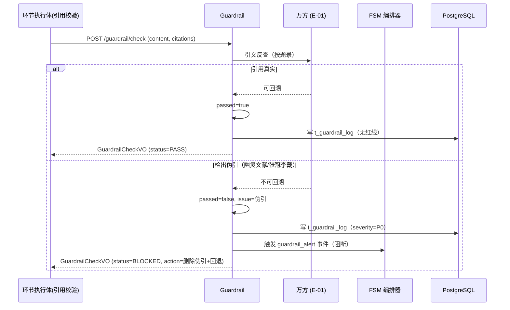

> 异常分支：检出伪引时阻断 + 回退环节3/4 找替代真实文献（红线，一票否决）。

##### §3.2.M8.5 关键流程逻辑

**合规红线清单**（来自 `_runtime_meta` §5，全局置顶）：

| 编号   | 红线类型                     | 校验方式            | 严重级别 | 处置动作           |
| ---- | ------------------------ | --------------- | ---- | -------------- |
| G-01 | 学术不端（伪造数据/抄袭/代写/伪引/一稿多投） | 内容规则 + 引文反查     | P0   | 阻断 + 一票否决      |
| G-02 | 引用真实（幽灵文献/张冠李戴/转引不核对）    | 万方引文反查          | P0   | 删除伪引 + 回退环节3/4 |
| G-03 | 查重合规（重复率低于学校红线）          | 引用规范处理 + 提醒自建查重 | P1   | 提醒 + 回退改写      |
| G-04 | 伦理合规（人体/动物伦理批号、数据来源授权）   | 内容规则            | P1   | 阻断待补           |
| G-05 | 平权表达（禁用"处女地/处女作"等女性贞洁隐喻） | 词汇表规则           | P2   | 自动替换为中性表述      |

**关键环节插桩点**（Guardrail 与 M3 联动为硬门禁）：环节 2/4/8/10 敏感环节在 HITL 确认前先过 Guardrail，Guardrail 检出红线即阻断并回退，不能仅靠人工放行（对齐 Q1 合规可控性目标）。

---

#### 3.2.M9 会话绑定式知识库（REQ-KB）

##### §3.2.M9.1 模块概述

会话绑定式知识库模块（REQ-KB）覆盖「文献/笔记入库、双链/实体关系、本地检索、会话绑定与硬隔离」核心场景，业务逻辑在**学生/写作者**与系统之间流动，同时涉及 **PostgreSQL（C-01，实体/边关系数据）**、**本地文件系统（C-03，独立目录）**、**环节执行体（M2，文献入库）** 等内外部系统。它是**独立模块**，与 FSM/DSH/docx 解耦（`_runtime_meta` §8.7），生命周期绑定、内容硬隔离、Agent 权限约束（仅新增调研文献 + 读取全库，不可修改/删除）。

**业务定位三要素**：

| 要素    | 内容                                                              |
| ----- | --------------------------------------------------------------- |
| 位置    | 知识资产域，会话绑定式专属知识库（非多租户共享库）                                       |
| 角色    | 学生 / 写作者（入库/检索/导出）；Agent（仅新增+读取）；FSM 文献调研环节（自动入库）               |
| 内外部系统 | PostgreSQL（C-01，实体/边关系数据）、本地文件系统（C-03，独立目录 + 快照）、环节执行体（M2，入库联动） |

##### §3.2.M9.2 接口清单

| 子领域   | 方法     | 路径                            | 用途（≤ 20 字）          | 请求 DTO              | 响应 VO                    | 幂等            |
| ----- | ------ | ----------------------------- | ------------------- | ------------------- | ------------------------ | ------------- |
| 知识库绑定 | POST   | `/api/v1/kb/bind`             | 新建会话自动创建绑定知识库       | KbBindRequest       | KbBindVO                 | 是（bizReqNo）   |
| 文献入库  | POST   | `/api/v1/kb/literatures`      | 自动入库合格文献（GB/T 7714） | KbLiteratureRequest | KbEntityVO               | 是（bizReqNo）   |
| 笔记新增  | POST   | `/api/v1/kb/notes`            | 用户手动新增 Markdown 笔记  | KbNoteRequest       | KbEntityVO               | 是（bizReqNo）   |
| 笔记编辑  | PUT    | `/api/v1/kb/notes/{entityId}` | 用户编辑笔记（Agent 无此权限）  | KbNoteUpdateRequest | KbEntityVO               | 是（id+version） |
| 笔记删除  | DELETE | `/api/v1/kb/notes/{entityId}` | 用户删除笔记（Agent 无此权限）  | —                   | Result                   | 天然            |
| 双链检索  | GET    | `/api/v1/kb/search`           | 本地全文检索 + 双链跳转       | KbSearchRequest     | PageResponse[KbEntityVO] | 天然            |
| 批量导出  | POST   | `/api/v1/kb/export`           | 批量引用导出（GB/T 7714）   | KbExportRequest     | KbExportVO               | 是（bizReqNo）   |
| 图谱数据  | GET    | `/api/v1/kb/graph`            | 图谱关系数据（前端按需渲染）      | —                   | KbGraphVO                | 天然            |
| 回收站   | GET    | `/api/v1/kb/recycle-bin`      | 查回收站（删除后 7 天可恢复）    | —                   | PageResponse[KbEntityVO] | 天然            |

##### §3.2.M9.3 关键结构定义（DTO）

```python
class KbBindRequest(BaseModel):
    # ===== 必填字段 =====
    bizReqNo: str
    sessionId: int                   # 会话 ID（与会话强绑定）
    protectOnDelete: Optional[bool]  # 解除会话绑定开关（删除会话时保留知识库）

class KbLiteratureRequest(BaseModel):
    # ===== 必填字段 =====
    bizReqNo: str
    kbId: int                        # 绑定的知识库 ID
    literatureId: int                # 文献池条目 ID（环节3验收通过）
    # GB/T 7714 引用信息
    title: str                       # 题名
    authors: str                     # 作者
    source: str                      # 刊名/来源
    year: str                        # 年份
    volume: Optional[str]            # 卷
    issue: Optional[str]             # 期
    pages: Optional[str]             # 页码
    gbT7714: str                     # GB/T 7714 引用格式

class KbEntityVO(BaseModel):
    # ===== 基本信息 =====
    entityId: int
    kbId: int
    entityType: str                  # LITERATURE / NOTE

    # ===== 业务字段 =====
    title: str
    content: str                     # 内容（笔记 Markdown / 文献摘要）
    backlinks: List[str]             # 双链（[[]] 引用）
    gbT7714: Optional[str]           # GB/T 7714 引用格式（文献）

    # ===== 时间字段 =====
    createdAt: str
    updatedAt: str
```

**关键字段定义表**：

| DTO / VO 名          | 字段名             | 类型           | 必填 | 业务含义           | 约束 / 默认值           |
| ------------------- | --------------- | ------------ | -- | -------------- | ------------------ |
| KbBindRequest       | sessionId       | Long         | 是  | 会话 ID          | 与会话强绑定             |
| KbBindRequest       | protectOnDelete | Boolean      | 否  | 解除会话绑定开关       | 默认 false（删除会话同步删除） |
| KbLiteratureRequest | literatureId    | Long         | 是  | 文献池条目 ID       | 环节3验收通过            |
| KbLiteratureRequest | gbT7714         | String       | 是  | GB/T 7714 引用格式 | —                  |
| KbEntityVO          | entityType      | enum         | 是  | 实体类型           | LITERATURE / NOTE  |
| KbEntityVO          | backlinks       | List[String] | 否  | 双链             | [[notes/xxx]]      |

##### §3.2.M9.4 模块逻辑时序图

**时序图清单**：

| 编号       | 标题（`模块名 - 场景名`）      | 场景类别    | 是否包含异常分支 |
| -------- | -------------------- | ------- | -------- |
| SQ-M9-01 | 会话绑定知识库 - 文献自动入库（双链） | 核心动作的执行 | 是        |

**SQ-M9-01 文献自动入库（双链）**：

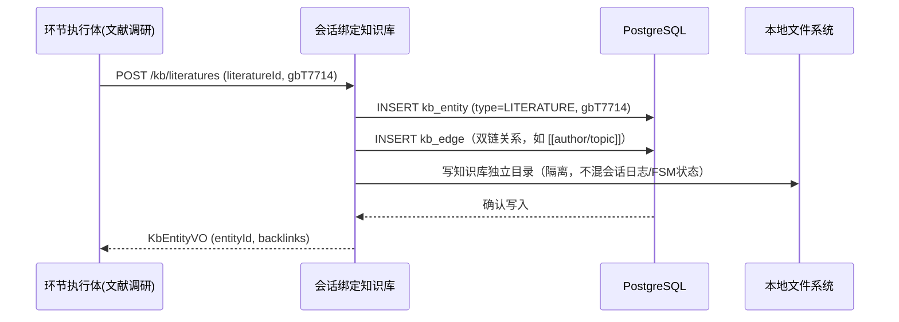

> Agent 权限约束：本接口仅"新增调研文献 + 读取全库"，无 modify/delete 知识库权限；编辑/删除仅用户显式执行。

##### §3.2.M9.5 关键流程逻辑

**REQ-KB 生命周期绑定与隔离规则**（来自 `_runtime_meta` §8，必须遵守）：

| 规则          | 落地                                                                                              |
| ----------- | ----------------------------------------------------------------------------------------------- |
| §8.1 生命周期绑定 | 新建会话 → 自动创建绑定知识库（kbId 与会话强绑定）；删除会话默认同步删除知识库（可开保护开关）；回收站本地保留 7 天可恢复；跨会话禁止访问（仅用户手动挂载其他独立库后开放跨库读取） |
| §8.2 内容硬隔离  | 允许自动入库：仅 FSM 环节3文献调研经验收 Gate 通过的文献；允许入库：用户手动笔记；**禁止自动入库**会话对话日志/调试流水/闲聊（仅用户显式指令可手动存）            |
| §8.3 内部结构   | 分为【文献实体】【用户笔记实体】，每条存双向链接、关联类型；图谱底层仅持久化关系数据，图谱可视化在前端按需实时渲染，后台不持续运算                               |
| §8.6 合规与性能  | 自动下载前校验文献权限，强制写入版权提示（仅限个人学习）；设置单库文献数量上限；知识库全部默认本地存储，独立目录，不和会话日志、FSM 业务状态混合存放                    |
| §8.8 风险预案   | 设计简易写入快照（kb_snapshot）防数据损坏                                                                      |

**[MOCK] 图谱可视化**：MVP 仅持久化双链关系数据（kb_edge），图谱可视化（前端按需实时渲染）延后；完整版在前端按规则渲染图表，后台不持续运算。

**[MOCK] 跨库读取**：MVP 默认禁止跨会话访问；用户手动挂载其他独立库后开放跨库读取的能力延后至完整版。

---

### 3.3 核心业务对象清单

#### 3.3.1 对象定义

| 编号   | 对象名（代码类名）          | 对象类型    | 包路径                                        | 模块归属   | 被哪些模块复用           | 实例化策略                           | 序列化约定  | 持久化策略                         |
| ---- | ------------------ | ------- | ------------------------------------------ | ------ | ----------------- | ------------------------------- | ------ | ----------------------------- |
| O-01 | `ThesisTask`       | 聚合根     | `backend/aicoding/fsm/state`               | M1/M4  | M1 / M2 / M3 / M4 | 工厂方法 `TaskFactory.create()`     | JSON   | 落表 → `t_thesis_task`          |
| O-02 | `Topic`            | 聚合根     | `backend/aicoding/executor/ring1_topic`    | M2     | M1 / M2           | Builder                         | JSON   | 落表 → `t_topic`                |
| O-03 | `NoveltyResult`    | 实体      | `backend/aicoding/executor/ring2_novelty`  | M2     | M2 / M7           | 由聚合根创建                          | JSON   | 落表 → `t_novelty_result`       |
| O-04 | `LiteratureEntry`  | 实体      | `backend/aicoding/executor/ring3_docs`     | M2     | M2 / M9           | 由聚合根创建                          | JSON   | 落表 → `t_literature_pool`      |
| O-05 | `LiteratureReview` | 实体      | `backend/aicoding/executor/ring4_review`   | M2     | M2                | 由聚合根创建                          | JSON   | 落表 → `t_review`               |
| O-06 | `Outline`          | 聚合根     | `backend/aicoding/executor/ring5_outline`  | M2     | M2 / M6           | Builder                         | JSON   | 落表 → `t_outline`              |
| O-07 | `ChapterDraft`     | 实体      | `backend/aicoding/executor/ring6_chapter`  | M2     | M2 / M6           | 由聚合根创建                          | JSON   | 落表 → `t_chapter_draft`        |
| O-08 | `PolishedDraft`    | 实体      | `backend/aicoding/executor/ring7_polish`   | M2     | M2 / M6           | 由聚合根创建                          | JSON   | 落表 → `t_polished_draft`       |
| O-09 | `CitationMap`      | 实体      | `backend/aicoding/executor/ring8_citation` | M2     | M2 / M8           | 由聚合根创建                          | JSON   | 落表 → `t_citation_map`         |
| O-10 | `TypesetDoc`       | 实体      | `backend/aicoding/executor/ring9_typeset`  | M2     | M2 / M6           | 由聚合根创建                          | JSON   | 落表 → `t_typeset_doc`          |
| O-11 | `VersionSnapshot`  | 实体      | `backend/aicoding/fsm/state`               | M4     | M4                | 由聚合根创建                          | JSON   | 落表 → `t_version_snapshot`     |
| O-12 | `FsmState`         | 聚合根     | `backend/aicoding/fsm/state`               | M1/M4  | M1 / M3 / M4      | 工厂方法 `FsmStateFactory.create()` | JSON   | 落表 → `t_fsm_state`            |
| O-13 | `AcceptanceGate`   | 实体      | `backend/aicoding/hitl`                    | M3     | M3 / M1           | 由聚合根创建                          | JSON   | 落表 → `t_acceptance_gate`      |
| O-14 | `GuardrailResult`  | 实体      | `backend/aicoding/guardrail`               | M8     | M8 / M1           | 由聚合根创建                          | JSON   | 落表 → `t_guardrail_log`        |
| O-15 | `Degrees`          | 共享枚举    | `backend/aicoding/common/enums`            | common | 全部                | —                               | String | 落表为 `degree VARCHAR(30)`      |
| O-16 | `PhaseState`       | 共享枚举    | `backend/aicoding/common/enums`            | common | 全部                | —                               | String | 落表为 `phase_state VARCHAR(30)` |
| O-17 | `KnowledgeBase`    | 聚合根     | `backend/aicoding/knowledge/repo`          | M9     | M9                | 工厂方法 `KbFactory.create()`       | JSON   | 落表 → `kb_bound_session`       |
| O-18 | `KnowledgeEntity`  | 实体      | `backend/aicoding/knowledge/repo`          | M9     | M9                | 由聚合根创建                          | JSON   | 落表 → `kb_entity`              |
| O-19 | `KnowledgeEdge`    | 实体      | `backend/aicoding/knowledge/repo`          | M9     | M9                | 由聚合根创建                          | JSON   | 落表 → `kb_edge`                |
| O-20 | `WanfangAcl`       | 防腐层 ACL | `backend/aicoding/wanfang/acl`             | M7     | M2 / M7           | new + 适配                        | —      | 不落表，瞬时转换                      |

**对象类型说明**：

| 类型                  | 含义                             |
| ------------------- | ------------------------------ |
| 聚合根（Aggregate Root） | 业务一致性边界；外部引用必须通过聚合根 ID；跨聚合修改禁止 |
| 实体（Entity）          | 有标识、生命周期独立，但归属某个聚合根            |
| 值对象（Value Object）   | 无标识、不可变；如金额、时间段、地址             |
| 共享 DTO              | 跨模块传输用的数据结构，无业务行为              |
| 共享枚举                | 跨模块的状态值 / 类型值                  |
| 防腐层 ACL             | 对接外部系统时的转换层（与 §2.2 ACL 关系对齐）   |

**填写要求**：编号 O-xx 全局唯一；对象名必须是代码类名（PascalCase）；防腐层对象必须显式标注（O-20 WanfangAcl 对应 §2.2.2 C-02 ACL 关系）。

#### 3.3.2 命名漂移登记表

| 业务实体（§2） | 代码类名（§3.3.1）   | 数据表名（§4.2）           | 漂移原因                            |
| -------- | -------------- | -------------------- | ------------------------------- |
| 学位等级     | `Degree`（代码类名） | `degree VARCHAR(30)` | 业务单一枚举在代码层为枚举类，DB 存储为 VARCHAR   |
| 论文写作任务   | `ThesisTask`   | `t_thesis_task`      | 业务名称"写作任务"与代码/表名对齐（无漂移，仅登记统一口径） |
| 引用映射     | `CitationMap`  | `t_citation_map`     | 无漂移（业务实体↔代码↔表名一致，登记统一）          |

**填写要求**：仅命名不一致或一对多映射时登记；命名一致的对象无需出现在本表。

### 3.4 跨模块公共能力

**公共能力清单**：

| 公共能力        | 简述                              | 提供方（SDK / 切面 / Bean）                  | 被哪些模块复用                    | 接入方式                              |
| ----------- | ------------------------------- | ------------------------------------- | -------------------------- | --------------------------------- |
| 本地登录鉴权      | 用户登录 / 角色（写作者/导师/管理者）校验         | `AuthInterceptor`（FastAPI 中间件）        | 全部业务模块                     | 中间件拦截 + 角色标签 `@require_role`      |
| 幂等去重        | 幂等键校验（写操作防重）                    | `IdempotencyAspect`（Redis 缓存 + DB 兜底） | M1/M2/M3/M4/M5/M6/M7/M8/M9 | AOP 切面，注解 `@Idempotent(bizReqNo)` |
| 审计日志        | 关键操作留痕（合规，含 traceId + tenantId） | `common.aspect.AuditLogAspect`        | 全部业务模块                     | AOP 切面，注解 `@AuditLog`             |
| 全局异常处理      | 统一错误码/错误响应（6 位格式）               | `GlobalExceptionHandler`（FastAPI）     | 全部业务模块                     | 全局异常处理，返回 `Result[T]`             |
| tenantId 透传 | 会话隔离字段透传                        | `TenantContextHolder`（中间件）            | 全部业务模块                     | 请求上下文透传 `tenantId`（会话绑定式隔离）       |

**填写要求**：提供方必须是具体的类名 / SDK 名 / Bean 名；接入方式必须说明研发怎么用。

### 3.5 接口契约

> 本系统对外暴露的接口在错误码、幂等、限流、超时上的全局约定。**所有接口必须遵守，不在每个接口下重复声明**。

#### 3.5.1 全局错误码体系

**错误码格式**：

| 项     | 取值                                                                                                                        |
| ----- | ------------------------------------------------------------------------------------------------------------------------- |
| 错误码格式 | `A020001`（6 位，首位类别 + 2 位模块 + 3 位序号），例如 A020001                                                                            |
| 分段规则  | 1 位类别 + 2 位模块 + 3 位错误序号                                                                                                   |
| 类别取值  | `A` = 业务错误（HTTP 200，业务语义失败）/ `B` = 系统错误（HTTP 5xx）/ `C` = 客户端错误（HTTP 4xx）                                                  |
| 模块编码  | `01` = 任务/FSM，`02` = 环节执行，`03` = 验收Gate/HITL，`04` = 状态存储，`05` = docx模板/生成，`07` = 万方，`08` = Guardrail，`09` = 知识库，`99` = 全局 |

**错误响应统一结构**：

```json
{
  "code": "A020001",
  "msg": "环节执行失败",
  "msgI18n": { "zh-CN": "环节执行失败", "en-US": "Ring execution failed" },
  "data": null,
  "traceId": "abc123",
  "tenantId": "session-001",
  "timestamp": "2026-08-22T10:00:00.000Z"
}
```

**错误码注册表**（每模块至少登记关键业务错误，以及全局通用错误）：

| 错误码     | HTTP 状态 | 所属模块 | 含义               | 重试建议  | 用户文案                 |
| ------- | ------- | ---- | ---------------- | ----- | -------------------- |
| A010001 | 200     | M1   | 论文任务不存在          | 不重试   | 该论文任务不存在或已删除         |
| A010002 | 200     | M1   | 回退目标非法           | 不重试   | 回退目标环节不合法            |
| A020001 | 200     | M2   | 环节执行失败           | 可重试   | 环节执行失败，请稍后重试         |
| A020002 | 200     | M2   | 验收不通过            | 不重试   | 本环节未通过验收，请按提示修改      |
| A030001 | 200     | M3   | HITL 确认项不存在      | 不重试   | 该待确认项不存在             |
| A070001 | 200     | M7   | 万方接口不可用          | 降级处理  | 万方数据源暂不可用，已标记"本次未纳入" |
| A070002 | 200     | M7   | 命中 50 篇召回上限      | 不重试   | 检索结果已达上限，实际数量未知      |
| A080001 | 200     | M8   | Guardrail 检出学术红线 | 不重试   | 检出学术合规风险，请修正（一票否决）   |
| A090001 | 200     | M9   | 知识库实体不存在         | 不重试   | 该知识库条目不存在            |
| B999001 | 500     | 全局   | 系统内部错误           | 可重试   | 系统繁忙，请稍后再试           |
| C400001 | 400     | 全局   | 参数校验失败           | 不重试   | 参数错误                 |
| C401001 | 401     | 全局   | 未登录              | 不重试   | 请重新登录                |
| C403001 | 403     | 全局   | 无权限              | 不重试   | 无权访问                 |
| C429001 | 429     | 全局   | 触发限流             | 退避后重试 | 操作太频繁，请稍后再试          |

#### 3.5.2 幂等性约定

| 接口类型                         | 是否要求幂等   | 幂等键来源（建议）                              |
| ---------------------------- | -------- | -------------------------------------- |
| 写入类（POST 创建任务/生成 docx）       | 必须幂等     | Header `X-Idempotency-Key`（UUID，调用方生成） |
| 更新类（PUT / PATCH 状态推进/回退）     | 必须幂等     | 资源 ID + 版本号（乐观锁）                       |
| 删除类（DELETE 笔记）               | 天然幂等     | —                                      |
| 查询类（GET）                     | 天然幂等     | —                                      |
| FSM 推进 / 回退 / 万方取数 / docx 生成 | **强制幂等** | 业务侧请求号 `bizReqNo`                      |

**幂等设计需考虑的问题**：

| 问题维度      | 设计要点                                 |
| --------- | ------------------------------------ |
| 幂等键的生命周期  | 保留 24h（短期防抖）；对账类（FSM 推进）保留到任务完结      |
| 重复请求的语义   | 返回相同响应（幂等键命中）                        |
| 执行中态的处理   | 第一个请求未返回时，第二个请求返回"处理中"状态             |
| 失败请求的可重试性 | 失败后允许同一幂等键重试                         |
| 存储兜底      | DB 唯一索引（t_xxx.idempotency_key）作为最终防线 |

#### 3.5.3 限流约定

| 维度                 | 默认值        | 触发动作                | 调整方式   |
| ------------------ | ---------- | ------------------- | ------ |
| 全局 QPS             | 500（本地单机）  | 返回 C429001          | 网关配置   |
| 单会话 QPS            | 50         | 返回 C429001          | 业务配置中心 |
| 单 IP QPS           | 100        | 返回 C429001 + WAF 标记 | 网关配置   |
| 单用户 QPS            | 30         | 返回 C429001          | 业务配置中心 |
| 重保接口（万方取数/HITL 确认） | 单用户 5 次/分钟 | 锁定 15 分钟            | 业务配置中心 |

**降级策略**：

| 策略项  | 内容                                    |
| ---- | ------------------------------------- |
| 前端退避 | 触发限流后，前端必须按 `Retry-After` Header 退避重试 |
| 后端记录 | 后端写入类接口同时记录到熔断队列                      |
| 红线联动 | 限流红线值与 §5.5 容量水位线"红线"一致               |

#### 3.5.4 默认超时与重试基线

| 调用类型                | 默认超时 | 默认重试              | 重试条件        |
| ------------------- | ---- | ----------------- | ----------- |
| 同步 API（内部，进程内）      | 60s  | 0 次               | —           |
| 同步 API（外部 E-01 万方）  | 10s  | 2 次（指数退避 1s / 2s） | 仅网络错误 / 5xx |
| 同步 API（外部 E-02 DSH） | 120s | 1 次               | 超时 / 5xx    |
| 异步 MQ 消费（进程内事件）     | 30s  | 16 次（指数退避，封顶 1h）  | 业务异常进死信     |
| 定时任务（FSM 推进/万方重试）   | 5min | 3 次               | 失败告警        |

**填写要求**：超时值禁止"无限"（LLM 调用例外为 120s，因大模型推理耗时较长且有限额）；所有重试必须有上限；重试不能产生副作用（依赖 §3.5.2 幂等性）。

#### 3.5.5 路由设计规范

**API 路由规范**：

| 维度    | 取值                                         |
| ----- | ------------------------------------------ |
| 风格    | RESTful（资源化 URL）                           |
| 版本控制  | `/api/v1/...`（路径版本）                        |
| 命名    | 小写 + 中划线（kebab-case）                       |
| 资源命名  | 名词复数（`/api/v1/tasks`）                      |
| 子资源   | `/api/v1/tasks/{taskId}/progress`          |
| 动作类接口 | `/api/v1/tasks/{id}/advance`（POST，资源 + 动作） |

**前端页面路由清单**：

| 路径                         | 页面 / 功能              | 入口角色（§2.3） | 鉴权要求              | 关联模块（§3.2.M{N}） |
| -------------------------- | -------------------- | ---------- | ----------------- | --------------- |
| `/login`                   | 登录页                  | 全部         | 公开                | —               |
| `/workbench`               | 写作者工作台主界面            | 学生/写作者     | 已登录 + 角色 writer   | M1 / M2         |
| `/workbench/rings/:ringNo` | 环节执行页                | 学生/写作者     | 已登录 + 角色 writer   | M2              |
| `/workbench/hitl`          | 敏感环节确认浮层（环节2/4/8/10） | 学生/写作者     | 已登录 + 角色 writer   | M3              |
| `/workbench/template`      | 模板上传/解析页             | 学生/写作者     | 已登录 + 角色 writer   | M5              |
| `/workbench/kb`            | REQ-KB 知识库页面         | 学生/写作者     | 已登录 + 角色 writer   | M9              |
| `/reviewer/pending`        | 导师审阅端 - 待确认队列        | 导师/审阅者     | 已登录 + 角色 reviewer | M3              |
| `/manager/guardrail`       | 管理看板 - 合规留痕面板        | 院校学位管理者    | 已登录 + 角色 manager  | M8              |

**前端路由约定**：

| 维度   | 取值                                                               |
| ---- | ---------------------------------------------------------------- |
| 路由模式 | History                                                          |
| 命名风格 | 小写 + 中划线（kebab-case）                                             |
| 动态参数 | `/:id`                                                           |
| 鉴权方式 | 路由元信息 `meta.requireAuth = true` + `meta.roles = [...]`，由全局路由守卫拦截 |
| 嵌套路由 | 工作台主界面 → 环节执行页 → 子模块页                                            |

**填写要求**：每条路径显式标注鉴权要求；动态参数示例化为 `:id`；与 §3.2.M{N} 模块的关联必须填实。

---

## 4. 数据库设计

> **本章回答**：每个模块的状态用什么表存、表怎么建、数据怎么清理、缓存怎么用。
>   
> **核心方法论**：**数据库按业务域组织，业务域与第 2 章 / 第 3 章保持一致**。

### 4.1 全局数据约定

> 写在所有表设计之前，作为整个项目的**数据基线**。

| 约定项        | 取值                                                                  | 说明                                  |
| ---------- | ------------------------------------------------------------------- | ----------------------------------- |
| 命名规范（表名）   | `t_文章实体` 业务主表；`t_文章实体_ext` 扩展表；`t_A_B_rel` N:N 关联表；`kb_知识实体` 知识库关系表 | 全项目统一前缀 `t_` / `kb_`                |
| 命名规范（字段名）  | 小写 + 下划线（snake_case）                                                | 禁止驼峰                                |
| 主键类型       | `BIGINT` + `GENERATED ALWAYS AS IDENTITY`                           | PostgreSQL 原生自增（全项目统一）              |
| 字符集 / 排序   | PostgreSQL 原生 UTF-8（默认 `database.encoding = utf8`）                  | 支持多语言与 emoji                        |
| 时间字段类型     | `TIMESTAMP(3)` UTC 存储                                               | 统一精度（毫秒）；统一时区（UTC）                  |
| 软删除字段      | `deleted BOOLEAN DEFAULT false`                                     | 全项目统一                               |
| 审计字段       | `created_by / created_time / updated_by / updated_time`             | 命名锁定                                |
| 隔离字段（会话绑定） | `session_id BIGINT NOT NULL`                                        | 会话绑定式隔离（非多租户），查询强制带入                |
| 业务唯一标识     | `biz_id VARCHAR(100)`                                               | 与外部系统对齐时使用（如幂等键）                    |
| 状态枚举       | `VARCHAR` 字符串                                                       | 锁定；DDL 注释列出全部取值                     |
| 关系数据字段     | `JSONB`                                                             | PostgreSQL 原生；存 FSM 上下文/知识库实体扩展/回退栈 |

**填写要求**：每条约定给出具体取值，不允许"两种都行"；一旦锁定，所有表必须遵循。（本系统隔离字段用 `session_id` 而非 `tenant_id`，因隔离粒度 = 会话绑定式知识库，非多租户——对齐 `_runtime_meta` §0）。

### 4.2 单表设计

> 每张表严格按下面 5 段编写，不得省略任何一段。

#### 4.2.1 t_thesis_task

##### 库表元信息

| 字段           | 取值                    |
| ------------ | --------------------- |
| 数据库类型        | PostgreSQL 16         |
| 库名           | thesis_agent          |
| 表名           | t_thesis_task         |
| 业务含义（≤ 50 字） | 一次完整"选题→定稿"论文写作任务实例主档 |
| 模块归属（§3.2）   | M1 / M4               |
| 对应核心对象（§3.3） | O-01 ThesisTask       |

##### 库表结构定义

| 列名              | 数据类型         | 可为空      | 约束          | 默认值               | 备注                                 |
| --------------- | ------------ | -------- | ----------- | ----------------- | ---------------------------------- |
| id              | BIGINT       | NOT NULL | PRIMARY KEY |                   | 主键 ID                              |
| session_id      | BIGINT       | NOT NULL |             |                   | 会话绑定隔离字段（查询必带）                     |
| task_name       | VARCHAR(200) | NOT NULL |             |                   | 论文任务名                              |
| title           | VARCHAR(200) | NOT NULL |             |                   | 论文题目                               |
| degree          | VARCHAR(30)  | NOT NULL |             |                   | 学位等级：BACHELOR/MASTER/PHD           |
| subject_field   | VARCHAR(50)  | NOT NULL |             |                   | 学科领域                               |
| template_id     | BIGINT       | NULL     |             |                   | 用户上传模板 ID（可空用默认模板）                 |
| current_ring_no | INT          | NOT NULL |             | 1                 | 当前环节号（1~10）                        |
| status          | VARCHAR(30)  | NOT NULL |             | 'INIT'            | 状态：INIT/RUNNING/COMPLETED/ARCHIVED |
| created_by      | VARCHAR(64)  | NULL     |             | NULL              | 创建人                                |
| created_time    | TIMESTAMP(3) | NULL     |             | CURRENT_TIMESTAMP | 创建时间                               |
| updated_by      | VARCHAR(64)  | NULL     |             | NULL              | 更新人                                |
| updated_time    | TIMESTAMP(3) | NULL     |             | （业务层/触发器更新）       | 更新时间                               |
| deleted         | BOOLEAN      | NOT NULL |             | false             | 删除标志（0：存在，1：已删除）                   |

##### 索引设计

| 索引名               | 索引类型 | 字段（含顺序）        | 设计目的      | 关联查询场景       |
| ----------------- | ---- | -------------- | --------- | ------------ |
| PRIMARY           | 主键   | id             | 唯一标识      | 全部按主键查询      |
| idx_session_id    | 普通索引 | session_id     | 会话绑定查询    | 我的任务列表（按会话）  |
| idx_degree_status | 普通索引 | degree, status | 学位等级+状态过滤 | 管理看板按学位/状态统计 |
| idx_created_time  | 普通索引 | created_time   | 时间范围/排序   | 按时间倒序列表      |

##### DDL

```sql
CREATE TABLE t_thesis_task (
  id BIGINT NOT NULL,
  session_id BIGINT NOT NULL,
  task_name VARCHAR(200) NOT NULL,
  title VARCHAR(200) NOT NULL,
  degree VARCHAR(30) NOT NULL DEFAULT 'MASTER',
  subject_field VARCHAR(50) NOT NULL,
  template_id BIGINT DEFAULT NULL,
  current_ring_no INT NOT NULL DEFAULT 1,
  status VARCHAR(30) NOT NULL DEFAULT 'INIT',
  created_by VARCHAR(64) DEFAULT NULL,
  created_time TIMESTAMP(3) DEFAULT CURRENT_TIMESTAMP,
  updated_by VARCHAR(64) DEFAULT NULL,
  updated_time TIMESTAMP(3) DEFAULT CURRENT_TIMESTAMP,
  deleted BOOLEAN NOT NULL DEFAULT false,
  PRIMARY KEY (id)
);
CREATE INDEX idx_session_id ON t_thesis_task (session_id);
CREATE INDEX idx_degree_status ON t_thesis_task (degree, status);
CREATE INDEX idx_created_time ON t_thesis_task (created_time);
COMMENT ON TABLE t_thesis_task IS '论文写作任务主档';
COMMENT ON COLUMN t_thesis_task.id IS '主键';
COMMENT ON COLUMN t_thesis_task.session_id IS '会话绑定隔离字段';
COMMENT ON COLUMN t_thesis_task.task_name IS '论文任务名';
COMMENT ON COLUMN t_thesis_task.title IS '论文题目';
COMMENT ON COLUMN t_thesis_task.degree IS '学位等级：BACHELOR/MASTER/PHD';
COMMENT ON COLUMN t_thesis_task.subject_field IS '学科领域';
COMMENT ON COLUMN t_thesis_task.template_id IS '用户上传模板ID';
COMMENT ON COLUMN t_thesis_task.current_ring_no IS '当前环节号(1~10)';
COMMENT ON COLUMN t_thesis_task.status IS '状态：INIT/RUNNING/COMPLETED/ARCHIVED';
COMMENT ON COLUMN t_thesis_task.created_by IS '创建人';
COMMENT ON COLUMN t_thesis_task.created_time IS '创建时间';
COMMENT ON COLUMN t_thesis_task.updated_by IS '更新人';
COMMENT ON COLUMN t_thesis_task.updated_time IS '更新时间';
COMMENT ON COLUMN t_thesis_task.deleted IS '删除标志';
```

##### 扩展逻辑（数据清理机制）

| 清理机制 | 适用场景          | 配置                                              |
| ---- | ------------- | ----------------------------------------------- |
| 软删   | 业务上"删除"但需可恢复  | 仅置 deleted=1；任务完结后保留过程数据供审计                     |
| 物理删除 | 已完成且过期的任务归档清理 | 按 created_time 保留 365 天，由 `task_cleanup_job` 触发 |

---

#### 4.2.2 t_topic

##### 库表元信息

| 字段           | 取值                          |
| ------------ | --------------------------- |
| 数据库类型        | PostgreSQL 16               |
| 库名           | thesis_agent                |
| 表名           | t_topic                     |
| 业务含义（≤ 50 字） | 环节 1 选题：研究问题、研究范围、候选题目、选题状态 |
| 模块归属（§3.2）   | M2                          |
| 对应核心对象（§3.3） | O-02 Topic                  |

##### 库表结构定义

| 列名                | 数据类型         | 可为空      | 约束          | 默认值               | 备注                         |
| ----------------- | ------------ | -------- | ----------- | ----------------- | -------------------------- |
| id                | BIGINT       | NOT NULL | PRIMARY KEY |                   | 主键 ID                      |
| task_id           | BIGINT       | NOT NULL |             |                   | 论文任务 ID                    |
| outline_topic     | VARCHAR(300) | NOT NULL |             |                   | 候选题目                       |
| research_question | TEXT         | NOT NULL |             |                   | 拟解决的问题                     |
| scope             | TEXT         | NULL     |             |                   | 研究范围边界                     |
| elevator_pitch    | VARCHAR(300) | NULL     |             |                   | "为什么值得做"电梯陈述               |
| degree            | VARCHAR(30)  | NOT NULL |             |                   | 学位等级（影响选题规模）               |
| status            | VARCHAR(30)  | NOT NULL |             | 'DRAFT'           | 状态：DRAFT/SELECTED/REJECTED |
| created_by        | VARCHAR(64)  | NULL     |             | NULL              | 创建人                        |
| created_time      | TIMESTAMP(3) | NULL     |             | CURRENT_TIMESTAMP | 创建时间                       |
| updated_time      | TIMESTAMP(3) | NULL     |             | （业务层/触发器更新）       | 更新时间                       |
| deleted           | BOOLEAN      | NOT NULL |             | false             | 删除标志                       |

##### 索引设计

| 索引名               | 索引类型 | 字段（含顺序）        | 设计目的    | 关联查询场景  |
| ----------------- | ---- | -------------- | ------- | ------- |
| PRIMARY           | 主键   | id             | 唯一标识    | 按主键查询   |
| idx_task_id       | 普通索引 | task_id        | 按任务查询选题 | 环节1产物查询 |
| idx_degree_status | 普通索引 | degree, status | 学位+状态过滤 | 选题状态统计  |

##### DDL

```sql
CREATE TABLE t_topic (
  id BIGINT NOT NULL,
  task_id BIGINT NOT NULL,
  outline_topic VARCHAR(300) NOT NULL,
  research_question TEXT NOT NULL,
  scope TEXT DEFAULT NULL,
  elevator_pitch VARCHAR(300) DEFAULT NULL,
  degree VARCHAR(30) NOT NULL DEFAULT 'MASTER',
  status VARCHAR(30) NOT NULL DEFAULT 'DRAFT',
  created_by VARCHAR(64) DEFAULT NULL,
  created_time TIMESTAMP(3) DEFAULT CURRENT_TIMESTAMP,
  updated_time TIMESTAMP(3) DEFAULT CURRENT_TIMESTAMP,
  deleted BOOLEAN NOT NULL DEFAULT false,
  PRIMARY KEY (id)
);
CREATE INDEX idx_task_id ON t_topic (task_id);
CREATE INDEX idx_degree_status ON t_topic (degree, status);
COMMENT ON TABLE t_topic IS '环节1选题';
COMMENT ON COLUMN t_topic.id IS '主键';
COMMENT ON COLUMN t_topic.task_id IS '论文任务ID';
COMMENT ON COLUMN t_topic.outline_topic IS '候选题目';
COMMENT ON COLUMN t_topic.research_question IS '拟解决的问题';
COMMENT ON COLUMN t_topic.scope IS '研究范围边界';
COMMENT ON COLUMN t_topic.elevator_pitch IS '电梯陈述';
COMMENT ON COLUMN t_topic.degree IS '学位等级：BACHELOR/MASTER/PHD';
COMMENT ON COLUMN t_topic.status IS '状态：DRAFT/SELECTED/REJECTED';
COMMENT ON COLUMN t_topic.created_by IS '创建人';
COMMENT ON COLUMN t_topic.created_time IS '创建时间';
COMMENT ON COLUMN t_topic.updated_time IS '更新时间';
COMMENT ON COLUMN t_topic.deleted IS '删除标志';
```

##### 扩展逻辑（数据清理机制）

| 清理机制 | 适用场景     | 配置                   |
| ---- | -------- | -------------------- |
| 软删   | 被替换的候选题目 | 仅置 deleted=1，保留过程供审计 |

---

#### 4.2.3 t_novelty_result

##### 库表元信息

| 字段           | 取值                           |
| ------------ | ---------------------------- |
| 数据库类型        | PostgreSQL 16                |
| 库名           | thesis_agent                 |
| 表名           | t_novelty_result             |
| 业务含义（≤ 50 字） | 环节 2 新颖度评估：结论、风险、是否放行、查新可信边界 |
| 模块归属（§3.2）   | M2                           |
| 对应核心对象（§3.3） | O-03 NoveltyResult           |

##### 库表结构定义

| 列名                 | 数据类型         | 可为空      | 约束          | 默认值               | 备注                    |
| ------------------ | ------------ | -------- | ----------- | ----------------- | --------------------- |
| id                 | BIGINT       | NOT NULL | PRIMARY KEY |                   | 主键 ID                 |
| task_id            | BIGINT       | NOT NULL |             |                   | 论文任务 ID               |
| topic_id           | BIGINT       | NOT NULL |             |                   | 候选题目 ID               |
| novelty_conclusion | VARCHAR(10)  | NOT NULL |             |                   | 新颖度结论：HIGH/MEDIUM/LOW |
| risk_desc          | TEXT         | NULL     |             |                   | 风险说明                  |
| recall_count       | INT          | NOT NULL |             |                   | 实际召回量                 |
| hit_limit          | BOOLEAN      | NOT NULL |             | false             | 是否撞 50 篇上限            |
| boundary_note      | VARCHAR(300) | NULL     |             |                   | 可信边界说明                |
| pass_flag          | BOOLEAN      | NOT NULL |             | false             | 放行/回退                 |
| source_type        | VARCHAR(30)  | NOT NULL |             |                   | 来源：WANFANG/MANUAL     |
| created_by         | VARCHAR(64)  | NULL     |             | NULL              | 创建人                   |
| created_time       | TIMESTAMP(3) | NULL     |             | CURRENT_TIMESTAMP | 创建时间                  |
| deleted            | BOOLEAN      | NOT NULL |             | false             | 删除标志                  |

##### 索引设计

| 索引名          | 索引类型 | 字段（含顺序）  | 设计目的  | 关联查询场景  |
| ------------ | ---- | -------- | ----- | ------- |
| PRIMARY      | 主键   | id       | 唯一标识  | 按主键查询   |
| idx_task_id  | 普通索引 | task_id  | 按任务查询 | 环节2产物   |
| idx_topic_id | 普通索引 | topic_id | 按选题查询 | 选题新颖度回查 |

##### DDL

```sql
CREATE TABLE t_novelty_result (
  id BIGINT NOT NULL,
  task_id BIGINT NOT NULL,
  topic_id BIGINT NOT NULL,
  novelty_conclusion VARCHAR(10) NOT NULL,
  risk_desc TEXT DEFAULT NULL,
  recall_count INT NOT NULL DEFAULT 0,
  hit_limit BOOLEAN NOT NULL DEFAULT false,
  boundary_note VARCHAR(300) DEFAULT NULL,
  pass_flag BOOLEAN NOT NULL DEFAULT false,
  source_type VARCHAR(30) NOT NULL DEFAULT 'WANFANG',
  created_by VARCHAR(64) DEFAULT NULL,
  created_time TIMESTAMP(3) DEFAULT CURRENT_TIMESTAMP,
  deleted BOOLEAN NOT NULL DEFAULT false,
  PRIMARY KEY (id)
);
CREATE INDEX idx_task_id ON t_novelty_result (task_id);
CREATE INDEX idx_topic_id ON t_novelty_result (topic_id);
COMMENT ON TABLE t_novelty_result IS '环节2新颖度评估';
COMMENT ON COLUMN t_novelty_result.id IS '主键';
COMMENT ON COLUMN t_novelty_result.task_id IS '论文任务ID';
COMMENT ON COLUMN t_novelty_result.topic_id IS '候选题目ID';
COMMENT ON COLUMN t_novelty_result.novelty_conclusion IS '新颖度：HIGH/MEDIUM/LOW';
COMMENT ON COLUMN t_novelty_result.risk_desc IS '风险说明';
COMMENT ON COLUMN t_novelty_result.recall_count IS '实际召回量';
COMMENT ON COLUMN t_novelty_result.hit_limit IS '是否撞50篇上限';
COMMENT ON COLUMN t_novelty_result.boundary_note IS '可信边界说明';
COMMENT ON COLUMN t_novelty_result.pass_flag IS '放行/回退';
COMMENT ON COLUMN t_novelty_result.source_type IS '来源：WANFANG/MANUAL';
COMMENT ON COLUMN t_novelty_result.created_by IS '创建人';
COMMENT ON COLUMN t_novelty_result.created_time IS '创建时间';
COMMENT ON COLUMN t_novelty_result.deleted IS '删除标志';
```

##### 扩展逻辑（数据清理机制）

| 清理机制 | 适用场景  | 配置                |
| ---- | ----- | ----------------- |
| 软删   | 评估被重做 | 仅置 deleted=1，区分版本 |

---

#### 4.2.4 t_literature_pool

##### 库表元信息

| 字段           | 取值                         |
| ------------ | -------------------------- |
| 数据库类型        | PostgreSQL 16              |
| 库名           | thesis_agent               |
| 表名           | t_literature_pool          |
| 业务含义（≤ 50 字） | 环节 3 文献调研证据池：题录、摘要、分类、校验状态 |
| 模块归属（§3.2）   | M2                         |
| 对应核心对象（§3.3） | O-04 LiteratureEntry       |

##### 库表结构定义

| 列名           | 数据类型         | 可为空      | 约束          | 默认值               | 备注                |
| ------------ | ------------ | -------- | ----------- | ----------------- | ----------------- |
| id           | BIGINT       | NOT NULL | PRIMARY KEY |                   | 主键 ID             |
| task_id      | BIGINT       | NOT NULL |             |                   | 论文任务 ID           |
| title        | VARCHAR(300) | NOT NULL |             |                   | 文献题名              |
| authors      | VARCHAR(300) | NOT NULL |             |                   | 作者                |
| source       | VARCHAR(200) | NOT NULL |             |                   | 刊名/来源             |
| year         | VARCHAR(10)  | NOT NULL |             |                   | 年份                |
| volume       | VARCHAR(30)  | NULL     |             |                   | 卷                 |
| issue        | VARCHAR(30)  | NULL     |             |                   | 期                 |
| pages        | VARCHAR(30)  | NULL     |             |                   | 页码                |
| category     | VARCHAR(30)  | NULL     |             |                   | 分类（理论/方法/实证/综述）   |
| summary      | TEXT         | NULL     |             |                   | 摘要                |
| gb_t7714     | VARCHAR(500) | NULL     |             |                   | GB/T 7714 引用格式    |
| verified     | BOOLEAN      | NOT NULL |             | false             | 校验状态（环节8）         |
| source_type  | VARCHAR(30)  | NOT NULL |             |                   | 来源：WANFANG/MANUAL |
| created_by   | VARCHAR(64)  | NULL     |             | NULL              | 创建人               |
| created_time | TIMESTAMP(3) | NULL     |             | CURRENT_TIMESTAMP | 创建时间              |
| deleted      | BOOLEAN      | NOT NULL |             | false             | 删除标志              |

##### 索引设计

| 索引名          | 索引类型 | 字段（含顺序）  | 设计目的     | 关联查询场景     |
| ------------ | ---- | -------- | -------- | ---------- |
| PRIMARY      | 主键   | id       | 唯一标识     | 按主键查询      |
| idx_task_id  | 普通索引 | task_id  | 按任务查询文献池 | 环节3/4/8    |
| idx_category | 普通索引 | category | 按分类过滤    | 综述按主题/流派归类 |
| idx_verified | 普通索引 | verified | 按校验状态    | 环节8 校验未过文献 |

##### DDL

```sql
CREATE TABLE t_literature_pool (
  id BIGINT NOT NULL,
  task_id BIGINT NOT NULL,
  title VARCHAR(300) NOT NULL,
  authors VARCHAR(300) NOT NULL,
  source VARCHAR(200) NOT NULL,
  year VARCHAR(10) NOT NULL,
  volume VARCHAR(30) DEFAULT NULL,
  issue VARCHAR(30) DEFAULT NULL,
  pages VARCHAR(30) DEFAULT NULL,
  category VARCHAR(30) DEFAULT NULL,
  summary TEXT DEFAULT NULL,
  gb_t7714 VARCHAR(500) DEFAULT NULL,
  verified BOOLEAN NOT NULL DEFAULT false,
  source_type VARCHAR(30) NOT NULL DEFAULT 'WANFANG',
  created_by VARCHAR(64) DEFAULT NULL,
  created_time TIMESTAMP(3) DEFAULT CURRENT_TIMESTAMP,
  deleted BOOLEAN NOT NULL DEFAULT false,
  PRIMARY KEY (id)
);
CREATE INDEX idx_task_id ON t_literature_pool (task_id);
CREATE INDEX idx_category ON t_literature_pool (category);
CREATE INDEX idx_verified ON t_literature_pool (verified);
COMMENT ON TABLE t_literature_pool IS '环节3文献池';
COMMENT ON COLUMN t_literature_pool.id IS '主键';
COMMENT ON COLUMN t_literature_pool.task_id IS '论文任务ID';
COMMENT ON COLUMN t_literature_pool.title IS '文献题名';
COMMENT ON COLUMN t_literature_pool.authors IS '作者';
COMMENT ON COLUMN t_literature_pool.source IS '刊名/来源';
COMMENT ON COLUMN t_literature_pool.year IS '年份';
COMMENT ON COLUMN t_literature_pool.volume IS '卷';
COMMENT ON COLUMN t_literature_pool.issue IS '期';
COMMENT ON COLUMN t_literature_pool.pages IS '页码';
COMMENT ON COLUMN t_literature_pool.category IS '分类：理论/方法/实证/综述';
COMMENT ON COLUMN t_literature_pool.summary IS '摘要';
COMMENT ON COLUMN t_literature_pool.gb_t7714 IS 'GB/T 7714引用格式';
COMMENT ON COLUMN t_literature_pool.verified IS '校验状态(环节8)';
COMMENT ON COLUMN t_literature_pool.source_type IS '来源：WANFANG/MANUAL';
COMMENT ON COLUMN t_literature_pool.created_by IS '创建人';
COMMENT ON COLUMN t_literature_pool.created_time IS '创建时间';
COMMENT ON COLUMN t_literature_pool.deleted IS '删除标志';
```

##### 扩展逻辑（数据清理机制）

| 清理机制 | 适用场景  | 配置           |
| ---- | ----- | ------------ |
| 软删   | 文献被剔除 | 仅置 deleted=1 |

---

#### 4.2.5 t_review

##### 库表元信息

| 字段           | 取值                         |
| ------------ | -------------------------- |
| 数据库类型        | PostgreSQL 16              |
| 库名           | thesis_agent               |
| 表名           | t_review                   |
| 业务含义（≤ 50 字） | 环节 4 文献综述：批判整合产物、研究空白、切入角度 |
| 模块归属（§3.2）   | M2                         |
| 对应核心对象（§3.3） | O-05 LiteratureReview      |

##### 库表结构定义

| 列名             | 数据类型         | 可为空      | 约束          | 默认值               | 备注                |
| -------------- | ------------ | -------- | ----------- | ----------------- | ----------------- |
| id             | BIGINT       | NOT NULL | PRIMARY KEY |                   | 主键 ID             |
| task_id        | BIGINT       | NOT NULL |             |                   | 论文任务 ID           |
| topic_id       | BIGINT       | NULL     |             |                   | 关联选题              |
| review_content | TEXT         | NOT NULL |             |                   | 综述内容（研究现状+不足+切入点） |
| research_gap   | TEXT         | NULL     |             |                   | 研究空白              |
| angle          | VARCHAR(300) | NULL     |             |                   | 切入角度              |
| framework      | TEXT         | NULL     |             |                   | 自建分类/框架/脉络        |
| pass_flag      | BOOLEAN      | NOT NULL |             | false             | 验收是否通过            |
| created_by     | VARCHAR(64)  | NULL     |             | NULL              | 创建人               |
| created_time   | TIMESTAMP(3) | NULL     |             | CURRENT_TIMESTAMP | 创建时间              |
| updated_time   | TIMESTAMP(3) | NULL     |             | （业务层/触发器更新）       | 更新时间              |
| deleted        | BOOLEAN      | NOT NULL |             | false             | 删除标志              |

##### 索引设计

| 索引名         | 索引类型 | 字段（含顺序） | 设计目的  | 关联查询场景 |
| ----------- | ---- | ------- | ----- | ------ |
| PRIMARY     | 主键   | id      | 唯一标识  | 按主键查询  |
| idx_task_id | 普通索引 | task_id | 按任务查询 | 环节4产物  |

##### DDL

```sql
CREATE TABLE t_review (
  id BIGINT NOT NULL,
  task_id BIGINT NOT NULL,
  topic_id BIGINT DEFAULT NULL,
  review_content TEXT NOT NULL,
  research_gap TEXT DEFAULT NULL,
  angle VARCHAR(300) DEFAULT NULL,
  framework TEXT DEFAULT NULL,
  pass_flag BOOLEAN NOT NULL DEFAULT false,
  created_by VARCHAR(64) DEFAULT NULL,
  created_time TIMESTAMP(3) DEFAULT CURRENT_TIMESTAMP,
  updated_time TIMESTAMP(3) DEFAULT CURRENT_TIMESTAMP,
  deleted BOOLEAN NOT NULL DEFAULT false,
  PRIMARY KEY (id)
);
CREATE INDEX idx_task_id ON t_review (task_id);
COMMENT ON TABLE t_review IS '环节4文献综述';
COMMENT ON COLUMN t_review.id IS '主键';
COMMENT ON COLUMN t_review.task_id IS '论文任务ID';
COMMENT ON COLUMN t_review.topic_id IS '关联选题';
COMMENT ON COLUMN t_review.review_content IS '综述内容';
COMMENT ON COLUMN t_review.research_gap IS '研究空白';
COMMENT ON COLUMN t_review.angle IS '切入角度';
COMMENT ON COLUMN t_review.framework IS '自建框架';
COMMENT ON COLUMN t_review.pass_flag IS '验收是否通过';
COMMENT ON COLUMN t_review.created_by IS '创建人';
COMMENT ON COLUMN t_review.created_time IS '创建时间';
COMMENT ON COLUMN t_review.updated_time IS '更新时间';
COMMENT ON COLUMN t_review.deleted IS '删除标志';
```

##### 扩展逻辑（数据清理机制）

| 清理机制 | 适用场景  | 配置           |
| ---- | ----- | ------------ |
| 软删   | 综述被重写 | 仅置 deleted=1 |

---

#### 4.2.6 t_outline

##### 库表元信息

| 字段           | 取值                             |
| ------------ | ------------------------------ |
| 数据库类型        | PostgreSQL 16                  |
| 库名           | thesis_agent                   |
| 表名           | t_outline                      |
| 业务含义（≤ 50 字） | 环节 5 论文大纲：章/节/小节结构蓝图、目标字数、证据要求 |
| 模块归属（§3.2）   | M2                             |
| 对应核心对象（§3.3） | O-06 Outline                   |

##### 库表结构定义

| 列名             | 数据类型         | 可为空      | 约束          | 默认值               | 备注                            |
| -------------- | ------------ | -------- | ----------- | ----------------- | ----------------------------- |
| id             | BIGINT       | NOT NULL | PRIMARY KEY |                   | 主键 ID                         |
| task_id        | BIGINT       | NOT NULL |             |                   | 论文任务 ID                       |
| node_parent_id | BIGINT       | NULL     |             |                   | 父节点（章→节→小节）                   |
| section_type   | VARCHAR(30)  | NOT NULL |             |                   | 类型：CHAPTER/SECTION/SUBSECTION |
| title          | VARCHAR(300) | NOT NULL |             |                   | 章节标题                          |
| objective      | TEXT         | NULL     |             |                   | 本节目标/服务于哪个贡献                  |
| evidence       | VARCHAR(300) | NULL     |             |                   | 预期证据要求                        |
| words          | INT          | NULL     |             |                   | 目标字数                          |
| contribution   | VARCHAR(300) | NULL     |             |                   | 关联创新点/贡献                      |
| section_order  | INT          | NOT NULL |             |                   | 同级顺序                          |
| created_by     | VARCHAR(64)  | NULL     |             | NULL              | 创建人                           |
| created_time   | TIMESTAMP(3) | NULL     |             | CURRENT_TIMESTAMP | 创建时间                          |
| updated_time   | TIMESTAMP(3) | NULL     |             | （业务层/触发器更新）       | 更新时间                          |
| deleted        | BOOLEAN      | NOT NULL |             | false             | 删除标志                          |

##### 索引设计

| 索引名           | 索引类型 | 字段（含顺序）        | 设计目的    | 关联查询场景 |
| ------------- | ---- | -------------- | ------- | ------ |
| PRIMARY       | 主键   | id             | 唯一标识    | 按主键查询  |
| idx_task_id   | 普通索引 | task_id        | 按任务查询大纲 | 大纲调整页  |
| idx_parent_id | 普通索引 | node_parent_id | 按父节点展开  | 章节树形结构 |

##### DDL

```sql
CREATE TABLE t_outline (
  id BIGINT NOT NULL,
  task_id BIGINT NOT NULL,
  node_parent_id BIGINT DEFAULT NULL,
  section_type VARCHAR(30) NOT NULL,
  title VARCHAR(300) NOT NULL,
  objective TEXT DEFAULT NULL,
  evidence VARCHAR(300) DEFAULT NULL,
  words INT DEFAULT NULL,
  contribution VARCHAR(300) DEFAULT NULL,
  section_order INT NOT NULL DEFAULT 0,
  created_by VARCHAR(64) DEFAULT NULL,
  created_time TIMESTAMP(3) DEFAULT CURRENT_TIMESTAMP,
  updated_time TIMESTAMP(3) DEFAULT CURRENT_TIMESTAMP,
  deleted BOOLEAN NOT NULL DEFAULT false,
  PRIMARY KEY (id)
);
CREATE INDEX idx_task_id ON t_outline (task_id);
CREATE INDEX idx_parent_id ON t_outline (node_parent_id);
COMMENT ON TABLE t_outline IS '环节5大纲';
COMMENT ON COLUMN t_outline.id IS '主键';
COMMENT ON COLUMN t_outline.task_id IS '论文任务ID';
COMMENT ON COLUMN t_outline.node_parent_id IS '父节点';
COMMENT ON COLUMN t_outline.section_type IS '类型：CHAPTER/SECTION/SUBSECTION';
COMMENT ON COLUMN t_outline.title IS '章节标题';
COMMENT ON COLUMN t_outline.objective IS '本节目标';
COMMENT ON COLUMN t_outline.evidence IS '预期证据要求';
COMMENT ON COLUMN t_outline.words IS '目标字数';
COMMENT ON COLUMN t_outline.contribution IS '关联创新点';
COMMENT ON COLUMN t_outline.section_order IS '同级顺序';
COMMENT ON COLUMN t_outline.created_by IS '创建人';
COMMENT ON COLUMN t_outline.created_time IS '创建时间';
COMMENT ON COLUMN t_outline.updated_time IS '更新时间';
COMMENT ON COLUMN t_outline.deleted IS '删除标志';
```

##### 扩展逻辑（数据清理机制）

| 清理机制 | 适用场景    | 配置           |
| ---- | ------- | ------------ |
| 软删   | 大纲节点被移除 | 仅置 deleted=1 |

---

#### 4.2.7 t_chapter_draft

##### 库表元信息

| 字段           | 取值                        |
| ------------ | ------------------------- |
| 数据库类型        | PostgreSQL 16             |
| 库名           | thesis_agent              |
| 表名           | t_chapter_draft           |
| 业务含义（≤ 50 字） | 环节 6 分章节撰写草稿：章节内容、状态、证据需求 |
| 模块归属（§3.2）   | M2                        |
| 对应核心对象（§3.3） | O-07 ChapterDraft         |

##### 库表结构定义

| 列名             | 数据类型         | 可为空      | 约束          | 默认值               | 备注                       |
| -------------- | ------------ | -------- | ----------- | ----------------- | ------------------------ |
| id             | BIGINT       | NOT NULL | PRIMARY KEY |                   | 主键 ID                    |
| task_id        | BIGINT       | NOT NULL |             |                   | 论文任务 ID                  |
| outline_id     | BIGINT       | NOT NULL |             |                   | 大纲节点 ID                  |
| chapter_no     | INT          | NOT NULL |             |                   | 章节序号                     |
| content        | TEXT         | NOT NULL |             |                   | 章节内容                     |
| needs_evidence | BOOLEAN      | NOT NULL |             | false             | 是否需证据                    |
| version        | INT          | NOT NULL |             | 1                 | 版本号（乐观锁）                 |
| status         | VARCHAR(30)  | NOT NULL |             | 'DRAFT'           | 状态：DRAFT/POLISHED/PASSED |
| created_by     | VARCHAR(64)  | NULL     |             | NULL              | 创建人                      |
| created_time   | TIMESTAMP(3) | NULL     |             | CURRENT_TIMESTAMP | 创建时间                     |
| updated_time   | TIMESTAMP(3) | NULL     |             | （业务层/触发器更新）       | 更新时间                     |
| deleted        | BOOLEAN      | NOT NULL |             | false             | 删除标志                     |

##### 索引设计

| 索引名            | 索引类型 | 字段（含顺序）    | 设计目的    | 关联查询场景 |
| -------------- | ---- | ---------- | ------- | ------ |
| PRIMARY        | 主键   | id         | 唯一标识    | 按主键查询  |
| idx_task_id    | 普通索引 | task_id    | 按任务查询草稿 | 章节撰写页  |
| idx_outline_id | 普通索引 | outline_id | 按大纲节点   | 章节定位   |
| idx_status     | 普通索引 | status     | 按状态过滤   | 进度看板   |

##### DDL

```sql
CREATE TABLE t_chapter_draft (
  id BIGINT NOT NULL,
  task_id BIGINT NOT NULL,
  outline_id BIGINT NOT NULL,
  chapter_no INT NOT NULL,
  content TEXT NOT NULL,
  needs_evidence BOOLEAN NOT NULL DEFAULT false,
  version INT NOT NULL DEFAULT 1,
  status VARCHAR(30) NOT NULL DEFAULT 'DRAFT',
  created_by VARCHAR(64) DEFAULT NULL,
  created_time TIMESTAMP(3) DEFAULT CURRENT_TIMESTAMP,
  updated_time TIMESTAMP(3) DEFAULT CURRENT_TIMESTAMP,
  deleted BOOLEAN NOT NULL DEFAULT false,
  PRIMARY KEY (id)
);
CREATE INDEX idx_task_id ON t_chapter_draft (task_id);
CREATE INDEX idx_outline_id ON t_chapter_draft (outline_id);
CREATE INDEX idx_status ON t_chapter_draft (status);
COMMENT ON TABLE t_chapter_draft IS '环节6章节草稿';
COMMENT ON COLUMN t_chapter_draft.id IS '主键';
COMMENT ON COLUMN t_chapter_draft.task_id IS '论文任务ID';
COMMENT ON COLUMN t_chapter_draft.outline_id IS '大纲节点ID';
COMMENT ON COLUMN t_chapter_draft.chapter_no IS '章节序号';
COMMENT ON COLUMN t_chapter_draft.content IS '章节内容';
COMMENT ON COLUMN t_chapter_draft.needs_evidence IS '是否需证据';
COMMENT ON COLUMN t_chapter_draft.version IS '版本号(乐观锁)';
COMMENT ON COLUMN t_chapter_draft.status IS '状态：DRAFT/POLISHED/PASSED';
COMMENT ON COLUMN t_chapter_draft.created_by IS '创建人';
COMMENT ON COLUMN t_chapter_draft.created_time IS '创建时间';
COMMENT ON COLUMN t_chapter_draft.updated_time IS '更新时间';
COMMENT ON COLUMN t_chapter_draft.deleted IS '删除标志';
```

##### 扩展逻辑（数据清理机制）

| 清理机制 | 适用场景         | 配置                           |
| ---- | ------------ | ---------------------------- |
| 归档   | 历史章节版本需保留但低频 | 归档至 t_version_snapshot（版本快照） |

---

#### 4.2.8 t_polished_draft

##### 库表元信息

| 字段           | 取值                        |
| ------------ | ------------------------- |
| 数据库类型        | PostgreSQL 16             |
| 库名           | thesis_agent              |
| 表名           | t_polished_draft          |
| 业务含义（≤ 50 字） | 环节 7 修改润色稿：内容提升、语言质量、结构顺滑 |
| 模块归属（§3.2）   | M2                        |
| 对应核心对象（§3.3） | O-08 PolishedDraft        |

##### 库表结构定义

| 列名             | 数据类型         | 可为空      | 约束          | 默认值               | 备注                     |
| -------------- | ------------ | -------- | ----------- | ----------------- | ---------------------- |
| id             | BIGINT       | NOT NULL | PRIMARY KEY |                   | 主键 ID                  |
| task_id        | BIGINT       | NOT NULL |             |                   | 论文任务 ID                |
| draft_id       | BIGINT       | NOT NULL |             |                   | 原始章节草稿 ID              |
| chapter_no     | INT          | NOT NULL |             |                   | 章节序号                   |
| content        | TEXT         | NOT NULL |             |                   | 润色后内容                  |
| polished_level | VARCHAR(30)  | NOT NULL |             |                   | 润色级别：LIGHT/MEDIUM/DEEP |
| status         | VARCHAR(30)  | NOT NULL |             | 'DRAFT'           | 状态：DRAFT/PASSED        |
| created_by     | VARCHAR(64)  | NULL     |             | NULL              | 创建人                    |
| created_time   | TIMESTAMP(3) | NULL     |             | CURRENT_TIMESTAMP | 创建时间                   |
| updated_time   | TIMESTAMP(3) | NULL     |             | （业务层/触发器更新）       | 更新时间                   |
| deleted        | BOOLEAN      | NOT NULL |             | false             | 删除标志                   |

##### 索引设计

| 索引名          | 索引类型 | 字段（含顺序）  | 设计目的     | 关联查询场景 |
| ------------ | ---- | -------- | -------- | ------ |
| PRIMARY      | 主键   | id       | 唯一标识     | 按主键查询  |
| idx_task_id  | 普通索引 | task_id  | 按任务查询润色稿 | 环节7产物  |
| idx_draft_id | 普通索引 | draft_id | 按草稿查询    | 润色回查   |

##### DDL

```sql
CREATE TABLE t_polished_draft (
  id BIGINT NOT NULL,
  task_id BIGINT NOT NULL,
  draft_id BIGINT NOT NULL,
  chapter_no INT NOT NULL,
  content TEXT NOT NULL,
  polished_level VARCHAR(30) NOT NULL DEFAULT 'MEDIUM',
  status VARCHAR(30) NOT NULL DEFAULT 'DRAFT',
  created_by VARCHAR(64) DEFAULT NULL,
  created_time TIMESTAMP(3) DEFAULT CURRENT_TIMESTAMP,
  updated_time TIMESTAMP(3) DEFAULT CURRENT_TIMESTAMP,
  deleted BOOLEAN NOT NULL DEFAULT false,
  PRIMARY KEY (id)
);
CREATE INDEX idx_task_id ON t_polished_draft (task_id);
CREATE INDEX idx_draft_id ON t_polished_draft (draft_id);
COMMENT ON TABLE t_polished_draft IS '环节7润色稿';
COMMENT ON COLUMN t_polished_draft.id IS '主键';
COMMENT ON COLUMN t_polished_draft.task_id IS '论文任务ID';
COMMENT ON COLUMN t_polished_draft.draft_id IS '原始章节草稿ID';
COMMENT ON COLUMN t_polished_draft.chapter_no IS '章节序号';
COMMENT ON COLUMN t_polished_draft.content IS '润色后内容';
COMMENT ON COLUMN t_polished_draft.polished_level IS '润色级别：LIGHT/MEDIUM/DEEP';
COMMENT ON COLUMN t_polished_draft.status IS '状态：DRAFT/PASSED';
COMMENT ON COLUMN t_polished_draft.created_by IS '创建人';
COMMENT ON COLUMN t_polished_draft.created_time IS '创建时间';
COMMENT ON COLUMN t_polished_draft.updated_time IS '更新时间';
COMMENT ON COLUMN t_polished_draft.deleted IS '删除标志';
```

##### 扩展逻辑（数据清理机制）

| 清理机制 | 适用场景   | 配置                     |
| ---- | ------ | ---------------------- |
| 归档   | 润色版本归档 | 归档至 t_version_snapshot |

---

#### 4.2.9 t_citation_map

##### 库表元信息

| 字段           | 取值                        |
| ------------ | ------------------------- |
| 数据库类型        | PostgreSQL 16             |
| 库名           | thesis_agent              |
| 表名           | t_citation_map            |
| 业务含义（≤ 50 字） | 正文引点↔文末文献一一对应映射、校验状态、是否伪引 |
| 模块归属（§3.2）   | M2                        |
| 对应核心对象（§3.3） | O-09 CitationMap          |

##### 库表结构定义

| 列名                | 数据类型         | 可为空      | 约束          | 默认值               | 备注                  |
| ----------------- | ------------ | -------- | ----------- | ----------------- | ------------------- |
| id                | BIGINT       | NOT NULL | PRIMARY KEY |                   | 主键 ID               |
| task_id           | BIGINT       | NOT NULL |             |                   | 论文任务 ID             |
| draft_id          | BIGINT       | NULL     |             |                   | 引用所在章节/润色稿 ID       |
| in_text_ref_id    | VARCHAR(100) | NOT NULL |             |                   | 正文引点标识              |
| bib_ref_id        | BIGINT       | NOT NULL |             |                   | 文末文献条目 ID           |
| quote_pos         | VARCHAR(100) | NULL     |             |                   | 引用位置（段落/句）          |
| checked           | BOOLEAN      | NOT NULL |             | false             | 是否已校验               |
| is_valid          | BOOLEAN      | NOT NULL |             | false             | 引用是否真实（伪引=false）    |
| validation_source | VARCHAR(30)  | NULL     |             |                   | 校验来源：WANFANG/MANUAL |
| created_by        | VARCHAR(64)  | NULL     |             | NULL              | 创建人                 |
| created_time      | TIMESTAMP(3) | NULL     |             | CURRENT_TIMESTAMP | 创建时间                |
| deleted           | BOOLEAN      | NOT NULL |             | false             | 删除标志                |

##### 索引设计

| 索引名            | 索引类型 | 字段（含顺序）                 | 设计目的   | 关联查询场景   |
| -------------- | ---- | ----------------------- | ------ | -------- |
| PRIMARY        | 主键   | id                      | 唯一标识   | 按主键查询    |
| uk_in_text_ref | 唯一索引 | task_id, in_text_ref_id | 正文引点唯一 | 引用映射核验页  |
| idx_bib_ref    | 普通索引 | bib_ref_id              | 按文献查询  | 伪引定位     |
| idx_checked    | 普通索引 | checked                 | 按校验状态  | 环节8 校验未过 |

##### DDL

```sql
CREATE TABLE t_citation_map (
  id BIGINT NOT NULL,
  task_id BIGINT NOT NULL,
  draft_id BIGINT DEFAULT NULL,
  in_text_ref_id VARCHAR(100) NOT NULL,
  bib_ref_id BIGINT NOT NULL,
  quote_pos VARCHAR(100) DEFAULT NULL,
  checked BOOLEAN NOT NULL DEFAULT false,
  is_valid BOOLEAN NOT NULL DEFAULT false,
  validation_source VARCHAR(30) DEFAULT NULL,
  created_by VARCHAR(64) DEFAULT NULL,
  created_time TIMESTAMP(3) DEFAULT CURRENT_TIMESTAMP,
  deleted BOOLEAN NOT NULL DEFAULT false,
  PRIMARY KEY (id)
);
CREATE UNIQUE INDEX uk_in_text_ref ON t_citation_map (task_id, in_text_ref_id);
CREATE INDEX idx_bib_ref ON t_citation_map (bib_ref_id);
CREATE INDEX idx_checked ON t_citation_map (checked);
COMMENT ON TABLE t_citation_map IS '引用映射';
COMMENT ON COLUMN t_citation_map.id IS '主键';
COMMENT ON COLUMN t_citation_map.task_id IS '论文任务ID';
COMMENT ON COLUMN t_citation_map.draft_id IS '引用所在章节/润色稿ID';
COMMENT ON COLUMN t_citation_map.in_text_ref_id IS '正文引点标识';
COMMENT ON COLUMN t_citation_map.bib_ref_id IS '文末文献条目ID';
COMMENT ON COLUMN t_citation_map.quote_pos IS '引用位置';
COMMENT ON COLUMN t_citation_map.checked IS '是否已校验';
COMMENT ON COLUMN t_citation_map.is_valid IS '引用是否真实(伪引=false)';
COMMENT ON COLUMN t_citation_map.validation_source IS '校验来源：WANFANG/MANUAL';
COMMENT ON COLUMN t_citation_map.created_by IS '创建人';
COMMENT ON COLUMN t_citation_map.created_time IS '创建时间';
COMMENT ON COLUMN t_citation_map.deleted IS '删除标志';
```

##### 扩展逻辑（数据清理机制）

| 清理机制 | 适用场景  | 配置           |
| ---- | ----- | ------------ |
| 软删   | 引用被删除 | 仅置 deleted=1 |

---

#### 4.2.10 t_typeset_doc

##### 库表元信息

| 字段           | 取值                           |
| ------------ | ---------------------------- |
| 数据库类型        | PostgreSQL 16                |
| 库名           | thesis_agent                 |
| 表名           | t_typeset_doc                |
| 业务含义（≤ 50 字） | 环节 9 排版稿/合规 docx：格式排版产物、校验状态 |
| 模块归属（§3.2）   | M2                           |
| 对应核心对象（§3.3） | O-10 TypesetDoc              |

##### 库表结构定义

| 列名              | 数据类型         | 可为空      | 约束          | 默认值               | 备注                            |
| --------------- | ------------ | -------- | ----------- | ----------------- | ----------------------------- |
| id              | BIGINT       | NOT NULL | PRIMARY KEY |                   | 主键 ID                         |
| task_id         | BIGINT       | NOT NULL |             |                   | 论文任务 ID                       |
| template_id     | BIGINT       | NULL     |             |                   | 使用的模板 ID                      |
| doc_name        | VARCHAR(200) | NOT NULL |             |                   | docx 文件名                      |
| file_path       | VARCHAR(500) | NOT NULL |             |                   | 存储路径（本地文件系统）                  |
| validate_status | VARCHAR(30)  | NOT NULL |             | 'PENDING'         | 校验状态：PENDING/VALIDATED/FAILED |
| validate_issues | JSONB        | NULL     |             |                   | 校验问题清单                        |
| created_by      | VARCHAR(64)  | NULL     |             | NULL              | 创建人                           |
| created_time    | TIMESTAMP(3) | NULL     |             | CURRENT_TIMESTAMP | 创建时间                          |
| updated_time    | TIMESTAMP(3) | NULL     |             | （业务层/触发器更新）       | 更新时间                          |
| deleted         | BOOLEAN      | NOT NULL |             | false             | 删除标志                          |

##### 索引设计

| 索引名                 | 索引类型 | 字段（含顺序）         | 设计目的     | 关联查询场景  |
| ------------------- | ---- | --------------- | -------- | ------- |
| PRIMARY             | 主键   | id              | 唯一标识     | 按主键查询   |
| idx_task_id         | 普通索引 | task_id         | 按任务查询排版稿 | 环节9产物   |
| idx_validate_status | 普通索引 | validate_status | 按校验状态    | 下载/拒绝交付 |

##### DDL

```sql
CREATE TABLE t_typeset_doc (
  id BIGINT NOT NULL,
  task_id BIGINT NOT NULL,
  template_id BIGINT DEFAULT NULL,
  doc_name VARCHAR(200) NOT NULL,
  file_path VARCHAR(500) NOT NULL,
  validate_status VARCHAR(30) NOT NULL DEFAULT 'PENDING',
  validate_issues JSONB DEFAULT NULL,
  created_by VARCHAR(64) DEFAULT NULL,
  created_time TIMESTAMP(3) DEFAULT CURRENT_TIMESTAMP,
  updated_time TIMESTAMP(3) DEFAULT CURRENT_TIMESTAMP,
  deleted BOOLEAN NOT NULL DEFAULT false,
  PRIMARY KEY (id)
);
CREATE INDEX idx_task_id ON t_typeset_doc (task_id);
CREATE INDEX idx_validate_status ON t_typeset_doc (validate_status);
COMMENT ON TABLE t_typeset_doc IS '环节9排版稿';
COMMENT ON COLUMN t_typeset_doc.id IS '主键';
COMMENT ON COLUMN t_typeset_doc.task_id IS '论文任务ID';
COMMENT ON COLUMN t_typeset_doc.template_id IS '使用模板ID';
COMMENT ON COLUMN t_typeset_doc.doc_name IS 'docx文件名';
COMMENT ON COLUMN t_typeset_doc.file_path IS '存储路径';
COMMENT ON COLUMN t_typeset_doc.validate_status IS '校验状态：PENDING/VALIDATED/FAILED';
COMMENT ON COLUMN t_typeset_doc.validate_issues IS '校验问题清单';
COMMENT ON COLUMN t_typeset_doc.created_by IS '创建人';
COMMENT ON COLUMN t_typeset_doc.created_time IS '创建时间';
COMMENT ON COLUMN t_typeset_doc.updated_time IS '更新时间';
COMMENT ON COLUMN t_typeset_doc.deleted IS '删除标志';
```

##### 扩展逻辑（数据清理机制）

| 清理机制 | 适用场景             | 配置                                             |
| ---- | ---------------- | ---------------------------------------------- |
| 物理删除 | 单库导出 docx 文件过期清理 | 按 created_time 保留 180 天，由 `doc_cleanup_job` 触发 |

---

#### 4.2.11 t_version_snapshot

##### 库表元信息

| 字段           | 取值                   |
| ------------ | -------------------- |
| 数据库类型        | PostgreSQL 16        |
| 库名           | thesis_agent         |
| 表名           | t_version_snapshot   |
| 业务含义（≤ 50 字） | 过程版本快照：供回退/审计的完整状态快照 |
| 模块归属（§3.2）   | M4                   |
| 对应核心对象（§3.3） | O-11 VersionSnapshot |

##### 库表结构定义

| 列名               | 数据类型         | 可为空      | 约束          | 默认值               | 备注                    |
| ---------------- | ------------ | -------- | ----------- | ----------------- | --------------------- |
| id               | BIGINT       | NOT NULL | PRIMARY KEY |                   | 主键 ID                 |
| task_id          | BIGINT       | NOT NULL |             |                   | 论文任务 ID               |
| version_no       | INT          | NOT NULL |             |                   | 版本号                   |
| ring_no          | INT          | NOT NULL |             |                   | 快照时环节号                |
| snapshot_context | JSONB        | NOT NULL |             |                   | 全局上下文快照（题目/文献池/大纲/草稿） |
| snapshot_path    | VARCHAR(500) | NULL     |             |                   | 快照文件路径                |
| created_by       | VARCHAR(64)  | NULL     |             | NULL              | 创建人                   |
| created_time     | TIMESTAMP(3) | NULL     |             | CURRENT_TIMESTAMP | 创建时间                  |
| deleted          | BOOLEAN      | NOT NULL |             | false             | 删除标志                  |

##### 索引设计

| 索引名             | 索引类型 | 字段（含顺序）             | 设计目的    | 关联查询场景  |
| --------------- | ---- | ------------------- | ------- | ------- |
| PRIMARY         | 主键   | id                  | 唯一标识    | 按主键查询   |
| uk_task_version | 唯一索引 | task_id, version_no | 版本唯一    | 版本对比/回退 |
| idx_ring_no     | 普通索引 | ring_no             | 按环节查询快照 | 回退链路可视化 |

##### DDL

```sql
CREATE TABLE t_version_snapshot (
  id BIGINT NOT NULL,
  task_id BIGINT NOT NULL,
  version_no INT NOT NULL,
  ring_no INT NOT NULL,
  snapshot_context JSONB NOT NULL,
  snapshot_path VARCHAR(500) DEFAULT NULL,
  created_by VARCHAR(64) DEFAULT NULL,
  created_time TIMESTAMP(3) DEFAULT CURRENT_TIMESTAMP,
  deleted BOOLEAN NOT NULL DEFAULT false,
  PRIMARY KEY (id)
);
CREATE UNIQUE INDEX uk_task_version ON t_version_snapshot (task_id, version_no);
CREATE INDEX idx_ring_no ON t_version_snapshot (ring_no);
COMMENT ON TABLE t_version_snapshot IS '版本快照';
COMMENT ON COLUMN t_version_snapshot.id IS '主键';
COMMENT ON COLUMN t_version_snapshot.task_id IS '论文任务ID';
COMMENT ON COLUMN t_version_snapshot.version_no IS '版本号';
COMMENT ON COLUMN t_version_snapshot.ring_no IS '快照时环节号';
COMMENT ON COLUMN t_version_snapshot.snapshot_context IS '全局上下文快照';
COMMENT ON COLUMN t_version_snapshot.snapshot_path IS '快照文件路径';
COMMENT ON COLUMN t_version_snapshot.created_by IS '创建人';
COMMENT ON COLUMN t_version_snapshot.created_time IS '创建时间';
COMMENT ON COLUMN t_version_snapshot.deleted IS '删除标志';
```

##### 扩展逻辑（数据清理机制）

| 清理机制 | 适用场景     | 配置                                                  |
| ---- | -------- | --------------------------------------------------- |
| 物理删除 | 历史快照归档清理 | 按 created_time 保留 365 天，由 `snapshot_cleanup_job` 触发 |

---

#### 4.2.12 t_fsm_state

##### 库表元信息

| 字段           | 取值                         |
| ------------ | -------------------------- |
| 数据库类型        | PostgreSQL 16              |
| 库名           | thesis_agent               |
| 表名           | t_fsm_state                |
| 业务含义（≤ 50 字） | 十环节 FSM 运行状态：当前节点、学位路由、回退栈 |
| 模块归属（§3.2）   | M1 / M4                    |
| 对应核心对象（§3.3） | O-12 FsmState              |

##### 库表结构定义

| 列名              | 数据类型         | 可为空      | 约束          | 默认值               | 备注                                         |
| --------------- | ------------ | -------- | ----------- | ----------------- | ------------------------------------------ |
| id              | BIGINT       | NOT NULL | PRIMARY KEY |                   | 主键 ID                                      |
| task_id         | BIGINT       | NOT NULL |             |                   | 论文任务 ID                                    |
| current_ring_no | INT          | NOT NULL |             | 1                 | 当前环节号                                      |
| prev_ring_no    | INT          | NULL     |             |                   | 前驱环节（回退指针）                                 |
| degree          | VARCHAR(30)  | NOT NULL |             |                   | 学位等级                                       |
| phase_state     | VARCHAR(30)  | NOT NULL |             |                   | 状态：NOT_STARTED/IN_PROGRESS/PASSED/FALLBACK |
| rollback_stack  | JSONB        | NULL     |             |                   | 回退栈（前驱指针 + 上下文）                            |
| context         | JSONB        | NULL     |             |                   | FSM 全局上下文（题目/创新点/文献池/大纲）                   |
| version         | INT          | NOT NULL |             | 1                 | 版本号（乐观锁）                                   |
| created_by      | VARCHAR(64)  | NULL     |             | NULL              | 创建人                                        |
| created_time    | TIMESTAMP(3) | NULL     |             | CURRENT_TIMESTAMP | 创建时间                                       |
| updated_time    | TIMESTAMP(3) | NULL     |             | （业务层/触发器更新）       | 更新时间                                       |
| deleted         | BOOLEAN      | NOT NULL |             | false             | 删除标志                                       |

##### 索引设计

| 索引名             | 索引类型 | 字段（含顺序）     | 设计目的          | 关联查询场景     |
| --------------- | ---- | ----------- | ------------- | ---------- |
| PRIMARY         | 主键   | id          | 唯一标识          | 按主键查询      |
| uk_task_fsm     | 唯一索引 | task_id     | 每任务仅一条 FSM 状态 | FSM 当前状态查询 |
| idx_phase_state | 普通索引 | phase_state | 按状态过滤         | 进度统计       |

##### DDL

```sql
CREATE TABLE t_fsm_state (
  id BIGINT NOT NULL,
  task_id BIGINT NOT NULL,
  current_ring_no INT NOT NULL DEFAULT 1,
  prev_ring_no INT DEFAULT NULL,
  degree VARCHAR(30) NOT NULL DEFAULT 'MASTER',
  phase_state VARCHAR(30) NOT NULL DEFAULT 'NOT_STARTED',
  rollback_stack JSONB DEFAULT NULL,
  context JSONB DEFAULT NULL,
  version INT NOT NULL DEFAULT 1,
  created_by VARCHAR(64) DEFAULT NULL,
  created_time TIMESTAMP(3) DEFAULT CURRENT_TIMESTAMP,
  updated_time TIMESTAMP(3) DEFAULT CURRENT_TIMESTAMP,
  deleted BOOLEAN NOT NULL DEFAULT false,
  PRIMARY KEY (id)
);
CREATE UNIQUE INDEX uk_task_fsm ON t_fsm_state (task_id);
CREATE INDEX idx_phase_state ON t_fsm_state (phase_state);
COMMENT ON TABLE t_fsm_state IS 'FSM运行状态';
COMMENT ON COLUMN t_fsm_state.id IS '主键';
COMMENT ON COLUMN t_fsm_state.task_id IS '论文任务ID';
COMMENT ON COLUMN t_fsm_state.current_ring_no IS '当前环节号';
COMMENT ON COLUMN t_fsm_state.prev_ring_no IS '前驱环节(回退指针)';
COMMENT ON COLUMN t_fsm_state.degree IS '学位等级：BACHELOR/MASTER/PHD';
COMMENT ON COLUMN t_fsm_state.phase_state IS '状态：NOT_STARTED/IN_PROGRESS/PASSED/FALLBACK';
COMMENT ON COLUMN t_fsm_state.rollback_stack IS '回退栈';
COMMENT ON COLUMN t_fsm_state.context IS 'FSM全局上下文';
COMMENT ON COLUMN t_fsm_state.version IS '版本号(乐观锁)';
COMMENT ON COLUMN t_fsm_state.created_by IS '创建人';
COMMENT ON COLUMN t_fsm_state.created_time IS '创建时间';
COMMENT ON COLUMN t_fsm_state.updated_time IS '更新时间';
COMMENT ON COLUMN t_fsm_state.deleted IS '删除标志';
```

##### 扩展逻辑（数据清理机制）

| 清理机制 | 适用场景              | 配置 |
| ---- | ----------------- | -- |
| 无    | 任务生命周期主状态，随任务一并归档 | —  |

---

#### 4.2.13 t_acceptance_gate

##### 库表元信息

| 字段           | 取值                         |
| ------------ | -------------------------- |
| 数据库类型        | PostgreSQL 16              |
| 库名           | thesis_agent               |
| 表名           | t_acceptance_gate          |
| 业务含义（≤ 50 字） | 每环验收门记录：布尔化看门通过/不通过 + 回退目标 |
| 模块归属（§3.2）   | M3                         |
| 对应核心对象（§3.3） | O-13 AcceptanceGate        |

##### 库表结构定义

| 列名           | 数据类型         | 可为空      | 约束          | 默认值               | 备注           |
| ------------ | ------------ | -------- | ----------- | ----------------- | ------------ |
| id           | BIGINT       | NOT NULL | PRIMARY KEY |                   | 主键 ID        |
| task_id      | BIGINT       | NOT NULL |             |                   | 论文任务 ID      |
| gate_id      | VARCHAR(100) | NOT NULL |             |                   | 验收门标识        |
| ring_no      | INT          | NOT NULL |             |                   | 环节号          |
| pass_flag    | BOOLEAN      | NOT NULL |             | false             | 通过/不通过       |
| fallback_to  | INT          | NULL     |             |                   | 回退目标环节       |
| score        | DECIMAL(5,2) | NULL     |             |                   | 打分/阈值校验分     |
| gate_type    | VARCHAR(30)  | NOT NULL |             |                   | 类型：AUTO/HITL |
| issues       | JSONB        | NULL     |             |                   | 问题清单         |
| created_by   | VARCHAR(64)  | NULL     |             | NULL              | 创建人          |
| created_time | TIMESTAMP(3) | NULL     |             | CURRENT_TIMESTAMP | 创建时间         |
| updated_time | TIMESTAMP(3) | NULL     |             | （业务层/触发器更新）       | 更新时间         |
| deleted      | BOOLEAN      | NOT NULL |             | false             | 删除标志         |

##### 索引设计

| 索引名           | 索引类型 | 字段（含顺序）          | 设计目的     | 关联查询场景     |
| ------------- | ---- | ---------------- | -------- | ---------- |
| PRIMARY       | 主键   | id               | 唯一标识     | 按主键查询      |
| idx_task_gate | 普通索引 | task_id, ring_no | 按任务+环节查询 | 验收历史       |
| idx_gate_type | 普通索引 | gate_type        | 按类型过滤    | HITL 待确认队列 |

##### DDL

```sql
CREATE TABLE t_acceptance_gate (
  id BIGINT NOT NULL,
  task_id BIGINT NOT NULL,
  gate_id VARCHAR(100) NOT NULL,
  ring_no INT NOT NULL,
  pass_flag BOOLEAN NOT NULL DEFAULT false,
  fallback_to INT DEFAULT NULL,
  score DECIMAL(5,2) DEFAULT NULL,
  gate_type VARCHAR(30) NOT NULL DEFAULT 'AUTO',
  issues JSONB DEFAULT NULL,
  created_by VARCHAR(64) DEFAULT NULL,
  created_time TIMESTAMP(3) DEFAULT CURRENT_TIMESTAMP,
  updated_time TIMESTAMP(3) DEFAULT CURRENT_TIMESTAMP,
  deleted BOOLEAN NOT NULL DEFAULT false,
  PRIMARY KEY (id)
);
CREATE INDEX idx_task_gate ON t_acceptance_gate (task_id, ring_no);
CREATE INDEX idx_gate_type ON t_acceptance_gate (gate_type);
COMMENT ON TABLE t_acceptance_gate IS '验收门';
COMMENT ON COLUMN t_acceptance_gate.id IS '主键';
COMMENT ON COLUMN t_acceptance_gate.task_id IS '论文任务ID';
COMMENT ON COLUMN t_acceptance_gate.gate_id IS '验收门标识';
COMMENT ON COLUMN t_acceptance_gate.ring_no IS '环节号';
COMMENT ON COLUMN t_acceptance_gate.pass_flag IS '通过/不通过';
COMMENT ON COLUMN t_acceptance_gate.fallback_to IS '回退目标环节';
COMMENT ON COLUMN t_acceptance_gate.score IS '打分/阈值校验分';
COMMENT ON COLUMN t_acceptance_gate.gate_type IS '类型：AUTO/HITL';
COMMENT ON COLUMN t_acceptance_gate.issues IS '问题清单';
COMMENT ON COLUMN t_acceptance_gate.created_by IS '创建人';
COMMENT ON COLUMN t_acceptance_gate.created_time IS '创建时间';
COMMENT ON COLUMN t_acceptance_gate.updated_time IS '更新时间';
COMMENT ON COLUMN t_acceptance_gate.deleted IS '删除标志';
```

##### 扩展逻辑（数据清理机制）

| 清理机制 | 适用场景        | 配置 |
| ---- | ----------- | -- |
| 无    | 验收历史长期保留供审计 | —  |

---

#### 4.2.14 t_guardrail_log

##### 库表元信息

| 字段           | 取值                                |
| ------------ | --------------------------------- |
| 数据库类型        | PostgreSQL 16                     |
| 库名           | thesis_agent                      |
| 表名           | t_guardrail_log                   |
| 业务含义（≤ 50 字） | Guardrail 合规红线命中记录：红线类型、严重级别、处置动作 |
| 模块归属（§3.2）   | M8                                |
| 对应核心对象（§3.3） | O-14 GuardrailResult              |

##### 库表结构定义

| 列名              | 数据类型         | 可为空      | 约束          | 默认值               | 备注                      |
| --------------- | ------------ | -------- | ----------- | ----------------- | ----------------------- |
| id              | BIGINT       | NOT NULL | PRIMARY KEY |                   | 主键 ID                   |
| task_id         | BIGINT       | NOT NULL |             |                   | 论文任务 ID                 |
| ring_no         | INT          | NOT NULL |             |                   | 命中环节号                   |
| issue           | VARCHAR(50)  | NOT NULL |             |                   | 红线类型：学术不端/伪引/查重/伦理/平权表达 |
| severity        | VARCHAR(10)  | NOT NULL |             |                   | 严重级别：P0/P1/P2/P3        |
| content_snippet | TEXT         | NULL     |             |                   | 命中内容片段                  |
| action          | VARCHAR(100) | NOT NULL |             |                   | 处置动作（阻断/回退/删除伪引）        |
| source          | VARCHAR(30)  | NOT NULL |             |                   | 来源：RULE/WANFANG/HITL    |
| created_by      | VARCHAR(64)  | NULL     |             | NULL              | 创建人                     |
| created_time    | TIMESTAMP(3) | NULL     |             | CURRENT_TIMESTAMP | 创建时间                    |
| deleted         | BOOLEAN      | NOT NULL |             | false             | 删除标志                    |
|                 |              |          |             |                   |                         |

##### 索引设计

| 索引名           | 索引类型 | 字段（含顺序）          | 设计目的     | 关联查询场景 |
| ------------- | ---- | ---------------- | -------- | ------ |
| PRIMARY       | 主键   | id               | 唯一标识     | 按主键查询  |
| idx_task_ring | 普通索引 | task_id, ring_no | 按任务+环节查询 | 合规留痕面板 |
| idx_severity  | 普通索引 | severity         | 按严重级别过滤  | P0 告警  |
| idx_issue     | 普通索引 | issue            | 按红线类型过滤  | 质量归因分析 |

##### DDL

```sql
CREATE TABLE t_guardrail_log (
  id BIGINT NOT NULL,
  task_id BIGINT NOT NULL,
  ring_no INT NOT NULL,
  issue VARCHAR(50) NOT NULL,
  severity VARCHAR(10) NOT NULL,
  content_snippet TEXT DEFAULT NULL,
  action VARCHAR(100) NOT NULL,
  source VARCHAR(30) NOT NULL DEFAULT 'RULE',
  created_by VARCHAR(64) DEFAULT NULL,
  created_time TIMESTAMP(3) DEFAULT CURRENT_TIMESTAMP,
  deleted BOOLEAN NOT NULL DEFAULT false,
  PRIMARY KEY (id)
);
CREATE INDEX idx_task_ring ON t_guardrail_log (task_id, ring_no);
CREATE INDEX idx_severity ON t_guardrail_log (severity);
CREATE INDEX idx_issue ON t_guardrail_log (issue);
COMMENT ON TABLE t_guardrail_log IS '合规红线日志';
COMMENT ON COLUMN t_guardrail_log.id IS '主键';
COMMENT ON COLUMN t_guardrail_log.task_id IS '论文任务ID';
COMMENT ON COLUMN t_guardrail_log.ring_no IS '命中环节号';
COMMENT ON COLUMN t_guardrail_log.issue IS '红线类型';
COMMENT ON COLUMN t_guardrail_log.severity IS '严重级别：P0/P1/P2/P3';
COMMENT ON COLUMN t_guardrail_log.content_snippet IS '命中内容片段';
COMMENT ON COLUMN t_guardrail_log.action IS '处置动作';
COMMENT ON COLUMN t_guardrail_log.source IS '来源：RULE/WANFANG/HITL';
COMMENT ON COLUMN t_guardrail_log.created_by IS '创建人';
COMMENT ON COLUMN t_guardrail_log.created_time IS '创建时间';
COMMENT ON COLUMN t_guardrail_log.deleted IS '删除标志';
```

##### 扩展逻辑（数据清理机制）

| 清理机制 | 适用场景                                      | 配置                                         |
| ---- | ----------------------------------------- | ------------------------------------------ |
| 无    | 合规红线日志长期保留（**学位追溯关键数据 ≥ 5 年**，不随普通审计日志清理） | 独立目录（防篡改），由 `guardrail_log_archive_job` 归档 |

---

#### 4.2.15 kb_bound_session（知识库会话绑定表）

##### 库表元信息

| 字段           | 取值                       |
| ------------ | ------------------------ |
| 数据库类型        | PostgreSQL 16            |
| 库名           | thesis_agent             |
| 表名           | kb_bound_session         |
| 业务含义（≤ 50 字） | 会话ID↔知识库ID强绑定、生命周期开关、回收站 |
| 模块归属（§3.2）   | M9                       |
| 对应核心对象（§3.3） | O-17 KnowledgeBase       |

##### 库表结构定义

| 列名                | 数据类型         | 可为空      | 约束          | 默认值               | 备注                         |
| ----------------- | ------------ | -------- | ----------- | ----------------- | -------------------------- |
| id                | BIGINT       | NOT NULL | PRIMARY KEY |                   | 主键 ID                      |
| session_id        | BIGINT       | NOT NULL |             |                   | 会话 ID（强绑定）                 |
| kb_id             | BIGINT       | NOT NULL |             |                   | 知识库 ID                     |
| protect_on_delete | BOOLEAN      | NOT NULL |             | false             | 解除会话绑定开关（删除会话保留知识库）        |
| kb_status         | VARCHAR(30)  | NOT NULL |             | 'ACTIVE'          | 状态：ACTIVE/RECYCLED/DELETED |
| deleted_at        | TIMESTAMP(3) | NULL     |             |                   | 回收站删除时间（7天恢复）              |
| created_by        | VARCHAR(64)  | NULL     |             | NULL              | 创建人                        |
| created_time      | TIMESTAMP(3) | NULL     |             | CURRENT_TIMESTAMP | 创建时间                       |
| updated_time      | TIMESTAMP(3) | NULL     |             | （业务层/触发器更新）       | 更新时间                       |

##### 索引设计

| 索引名           | 索引类型 | 字段（含顺序）    | 设计目的      | 关联查询场景 |
| ------------- | ---- | ---------- | --------- | ------ |
| PRIMARY       | 主键   | id         | 唯一标识      | 按主键查询  |
| uk_session    | 唯一索引 | session_id | 会话与知识库一对一 | 会话创建绑定 |
| idx_kb_status | 普通索引 | kb_status  | 按状态过滤     | 回收站/删除 |

##### DDL

```sql
CREATE TABLE kb_bound_session (
  id BIGINT NOT NULL,
  session_id BIGINT NOT NULL,
  kb_id BIGINT NOT NULL,
  protect_on_delete BOOLEAN NOT NULL DEFAULT false,
  kb_status VARCHAR(30) NOT NULL DEFAULT 'ACTIVE',
  deleted_at TIMESTAMP(3) DEFAULT NULL,
  created_by VARCHAR(64) DEFAULT NULL,
  created_time TIMESTAMP(3) DEFAULT CURRENT_TIMESTAMP,
  updated_time TIMESTAMP(3) DEFAULT CURRENT_TIMESTAMP,
  PRIMARY KEY (id)
);
CREATE UNIQUE INDEX uk_session ON kb_bound_session (session_id);
CREATE INDEX idx_kb_status ON kb_bound_session (kb_status);
COMMENT ON TABLE kb_bound_session IS '会话绑定知识库';
COMMENT ON COLUMN kb_bound_session.id IS '主键';
COMMENT ON COLUMN kb_bound_session.session_id IS '会话ID(强绑定)';
COMMENT ON COLUMN kb_bound_session.kb_id IS '知识库ID';
COMMENT ON COLUMN kb_bound_session.protect_on_delete IS '解除会话绑定开关';
COMMENT ON COLUMN kb_bound_session.kb_status IS '状态：ACTIVE/RECYCLED/DELETED';
COMMENT ON COLUMN kb_bound_session.deleted_at IS '回收站删除时间(7天恢复)';
COMMENT ON COLUMN kb_bound_session.created_by IS '创建人';
COMMENT ON COLUMN kb_bound_session.created_time IS '创建时间';
COMMENT ON COLUMN kb_bound_session.updated_time IS '更新时间';
```

##### 扩展逻辑（数据清理机制）

| 清理机制     | 适用场景                    | 配置                                               |
| -------- | ----------------------- | ------------------------------------------------ |
| 回收站+物理删除 | 删除会话默认同步删除知识库；回收站保留 7 天 | deleted_at 7 天后由 `kb_recycle_cleanup_job` 触发永久清除 |

---

#### 4.2.16 kb_entity（知识库实体表）

##### 库表元信息

| 字段           | 取值                            |
| ------------ | ----------------------------- |
| 数据库类型        | PostgreSQL 16                 |
| 库名           | thesis_agent                  |
| 表名           | kb_entity                     |
| 业务含义（≤ 50 字） | 知识库文献/笔记实体：标题、内容、双链、GB/T 7714 |
| 模块归属（§3.2）   | M9                            |
| 对应核心对象（§3.3） | O-18 KnowledgeEntity          |

##### 库表结构定义

| 列名            | 数据类型         | 可为空      | 约束          | 默认值               | 备注                                                           |
| ------------- | ------------ | -------- | ----------- | ----------------- | ------------------------------------------------------------ |
| id            | BIGINT       | NOT NULL | PRIMARY KEY |                   | 主键 ID                                                        |
| kb_id         | BIGINT       | NOT NULL |             |                   | 知识库 ID                                                       |
| entity_type   | VARCHAR(30)  | NOT NULL |             |                   | 类型：LITERATURE/NOTE                                           |
| title         | VARCHAR(300) | NOT NULL |             |                   | 标题                                                           |
| content       | TEXT         | NULL     |             |                   | 内容（笔记Markdown/文献摘要）                                          |
| gb_t7714      | VARCHAR(500) | NULL     |             |                   | GB/T 7714 引用格式（文献）                                           |
| backlinks     | JSONB        | NULL     |             |                   | 双链（[[]] 引用列表）                                                |
| tags          | JSONB        | NULL     |             |                   | 标签                                                           |
| literature_id | BIGINT       | NULL     |             |                   | 来源文献池条目 ID                                                   |
| content_tsv   | tsvector     | —        | 生成列         |                   | 本地全文检索（`to_tsvector('simple', coalesce(content,''))`，GIN 索引） |
| download_perm | BOOLEAN      | NOT NULL |             | false             | 是否有下载权限                                                      |
| created_by    | VARCHAR(64)  | NULL     |             | NULL              | 创建人                                                          |
| created_time  | TIMESTAMP(3) | NULL     |             | CURRENT_TIMESTAMP | 创建时间                                                         |
| updated_time  | TIMESTAMP(3) | NULL     |             | （业务层/触发器更新）       | 更新时间                                                         |
| deleted       | BOOLEAN      | NOT NULL |             | false             | 删除标志                                                         |

##### 索引设计

| 索引名               | 索引类型 | 字段（含顺序）            | 设计目的    | 关联查询场景 |
| ----------------- | ---- | ------------------ | ------- | ------ |
| PRIMARY           | 主键   | id                 | 唯一标识    | 按主键查询  |
| idx_kb_type       | 普通索引 | kb_id, entity_type | 按库+类型查询 | 知识库总览  |
| idx_literature_id | 普通索引 | literature_id      | 按来源文献   | 文献自动入库 |
| ft_content        | 全文索引 | content_tsv        | 本地全文检索  | 知识库搜索  |

##### DDL

```sql
CREATE TABLE kb_entity (
  id BIGINT NOT NULL,
  kb_id BIGINT NOT NULL,
  entity_type VARCHAR(30) NOT NULL,
  title VARCHAR(300) NOT NULL,
  content TEXT DEFAULT NULL,
  gb_t7714 VARCHAR(500) DEFAULT NULL,
  backlinks JSONB DEFAULT NULL,
  tags JSONB DEFAULT NULL,
  literature_id BIGINT DEFAULT NULL,
  download_perm BOOLEAN NOT NULL DEFAULT false,
  content_tsv tsvector GENERATED ALWAYS AS (to_tsvector('simple', coalesce(content, ''))) STORED,
  created_by VARCHAR(64) DEFAULT NULL,
  created_time TIMESTAMP(3) DEFAULT CURRENT_TIMESTAMP,
  updated_time TIMESTAMP(3) DEFAULT CURRENT_TIMESTAMP,
  deleted BOOLEAN NOT NULL DEFAULT false,
  PRIMARY KEY (id)
);
CREATE INDEX idx_kb_type ON kb_entity (kb_id, entity_type);
CREATE INDEX idx_literature_id ON kb_entity (literature_id);
CREATE INDEX ft_content ON kb_entity USING GIN (content_tsv);
COMMENT ON TABLE kb_entity IS '知识库实体';
COMMENT ON COLUMN kb_entity.id IS '主键';
COMMENT ON COLUMN kb_entity.kb_id IS '知识库ID';
COMMENT ON COLUMN kb_entity.entity_type IS '类型：LITERATURE/NOTE';
COMMENT ON COLUMN kb_entity.title IS '标题';
COMMENT ON COLUMN kb_entity.content IS '内容';
COMMENT ON COLUMN kb_entity.gb_t7714 IS 'GB/T 7714引用格式';
COMMENT ON COLUMN kb_entity.backlinks IS '双链';
COMMENT ON COLUMN kb_entity.tags IS '标签';
COMMENT ON COLUMN kb_entity.literature_id IS '来源文献池条目ID';
COMMENT ON COLUMN kb_entity.download_perm IS '是否有下载权限';
COMMENT ON COLUMN kb_entity.created_by IS '创建人';
COMMENT ON COLUMN kb_entity.created_time IS '创建时间';
COMMENT ON COLUMN kb_entity.updated_time IS '更新时间';
COMMENT ON COLUMN kb_entity.deleted IS '删除标志';
```

##### 扩展逻辑（数据清理机制）

| 清理机制   | 适用场景        | 配置                                |
| ------ | ----------- | --------------------------------- |
| 软删+回收站 | 知识库实体删除进回收站 | 7 天后物理清理（随 kb_bound_session 生命周期） |

---

#### 4.2.17 kb_edge（双链关系表）

##### 库表元信息

| 字段           | 取值                          |
| ------------ | --------------------------- |
| 数据库类型        | PostgreSQL 16               |
| 库名           | thesis_agent                |
| 表名           | kb_edge                     |
| 业务含义（≤ 50 字） | 知识库实体间双链/关联关系（图谱底层只持久化关系数据） |
| 模块归属（§3.2）   | M9                          |
| 对应核心对象（§3.3） | O-19 KnowledgeEdge          |

##### 库表结构定义

| 列名               | 数据类型         | 可为空      | 约束          | 默认值               | 备注                                   |
| ---------------- | ------------ | -------- | ----------- | ----------------- | ------------------------------------ |
| id               | BIGINT       | NOT NULL | PRIMARY KEY |                   | 主键 ID                                |
| kb_id            | BIGINT       | NOT NULL |             |                   | 知识库 ID                               |
| source_entity_id | BIGINT       | NOT NULL |             |                   | 源实体 ID                               |
| target_entity_id | BIGINT       | NOT NULL |             |                   | 目标实体 ID                              |
| edge_type        | VARCHAR(50)  | NOT NULL |             |                   | 关联类型：CITES/RELATED/EXTS_TO/NOTE_LINK |
| created_by       | VARCHAR(64)  | NULL     |             | NULL              | 创建人                                  |
| created_time     | TIMESTAMP(3) | NULL     |             | CURRENT_TIMESTAMP | 创建时间                                 |
| deleted          | BOOLEAN      | NOT NULL |             | false             | 删除标志                                 |

##### 索引设计

| 索引名              | 索引类型 | 字段（含顺序）                            | 设计目的    | 关联查询场景 |
| ---------------- | ---- | ---------------------------------- | ------- | ------ |
| PRIMARY          | 主键   | id                                 | 唯一标识    | 按主键查询  |
| uk_source_target | 唯一索引 | source_entity_id, target_entity_id | 防止重复边   | 双链去重   |
| idx_kb_edge_type | 普通索引 | kb_id, edge_type                   | 按库+类型查询 | 图谱关系数据 |

##### DDL

```sql
CREATE TABLE kb_edge (
  id BIGINT NOT NULL,
  kb_id BIGINT NOT NULL,
  source_entity_id BIGINT NOT NULL,
  target_entity_id BIGINT NOT NULL,
  edge_type VARCHAR(50) NOT NULL,
  created_by VARCHAR(64) DEFAULT NULL,
  created_time TIMESTAMP(3) DEFAULT CURRENT_TIMESTAMP,
  deleted BOOLEAN NOT NULL DEFAULT false,
  PRIMARY KEY (id)
);
CREATE UNIQUE INDEX uk_source_target ON kb_edge (source_entity_id, target_entity_id);
CREATE INDEX idx_kb_edge_type ON kb_edge (kb_id, edge_type);
COMMENT ON TABLE kb_edge IS '双链关系';
COMMENT ON COLUMN kb_edge.id IS '主键';
COMMENT ON COLUMN kb_edge.kb_id IS '知识库ID';
COMMENT ON COLUMN kb_edge.source_entity_id IS '源实体ID';
COMMENT ON COLUMN kb_edge.target_entity_id IS '目标实体ID';
COMMENT ON COLUMN kb_edge.edge_type IS '关联类型：CITES/RELATED/EXTS_TO/NOTE_LINK';
COMMENT ON COLUMN kb_edge.created_by IS '创建人';
COMMENT ON COLUMN kb_edge.created_time IS '创建时间';
COMMENT ON COLUMN kb_edge.deleted IS '删除标志';
```

##### 扩展逻辑（数据清理机制）

| 清理机制 | 适用场景 | 配置           |
| ---- | ---- | ------------ |
| 软删   | 边被移除 | 仅置 deleted=1 |

---

#### 4.2.18 kb_snapshot（知识库写入快照表）

##### 库表元信息

| 字段           | 取值                         |
| ------------ | -------------------------- |
| 数据库类型        | PostgreSQL 16              |
| 库名           | thesis_agent               |
| 表名           | kb_snapshot                |
| 业务含义（≤ 50 字） | 知识库简易写入快照（防数据损坏，§8.8 风险预案） |
| 模块归属（§3.2）   | M9                         |
| 对应核心对象（§3.3） | KnowledgeSnapshot（内部对象）    |

##### 库表结构定义

| 列名              | 数据类型         | 可为空      | 约束          | 默认值               | 备注              |
| --------------- | ------------ | -------- | ----------- | ----------------- | --------------- |
| id              | BIGINT       | NOT NULL | PRIMARY KEY |                   | 主键 ID           |
| kb_id           | BIGINT       | NOT NULL |             |                   | 知识库 ID          |
| entity_ids      | JSONB        | NOT NULL |             |                   | 快照实体 ID 列表      |
| edge_ids        | JSONB        | NOT NULL |             |                   | 快照边 ID 列表       |
| snapshot_reason | VARCHAR(100) | NULL     |             |                   | 快照原因（写入前/回收站恢复） |
| snapshot_time   | TIMESTAMP(3) | NOT NULL |             | CURRENT_TIMESTAMP | 快照时间            |
| created_by      | VARCHAR(64)  | NULL     |             | NULL              | 创建人             |

##### 索引设计

| 索引名         | 索引类型 | 字段（含顺序）              | 设计目的    | 关联查询场景 |
| ----------- | ---- | -------------------- | ------- | ------ |
| PRIMARY     | 主键   | id                   | 唯一标识    | 按主键查询  |
| idx_kb_time | 普通索引 | kb_id, snapshot_time | 按库+时间查询 | 最近快照恢复 |

##### DDL

```sql
CREATE TABLE kb_snapshot (
  id BIGINT NOT NULL,
  kb_id BIGINT NOT NULL,
  entity_ids JSONB NOT NULL,
  edge_ids JSONB NOT NULL,
  snapshot_reason VARCHAR(100) DEFAULT NULL,
  snapshot_time TIMESTAMP(3) DEFAULT CURRENT_TIMESTAMP,
  created_by VARCHAR(64) DEFAULT NULL,
  PRIMARY KEY (id)
);
CREATE INDEX idx_kb_time ON kb_snapshot (kb_id, snapshot_time);
COMMENT ON TABLE kb_snapshot IS '知识库写入快照';
COMMENT ON COLUMN kb_snapshot.id IS '主键';
COMMENT ON COLUMN kb_snapshot.kb_id IS '知识库ID';
COMMENT ON COLUMN kb_snapshot.entity_ids IS '快照实体ID列表';
COMMENT ON COLUMN kb_snapshot.edge_ids IS '快照边ID列表';
COMMENT ON COLUMN kb_snapshot.snapshot_reason IS '快照原因';
COMMENT ON COLUMN kb_snapshot.snapshot_time IS '快照时间';
COMMENT ON COLUMN kb_snapshot.created_by IS '创建人';
```

##### 扩展逻辑（数据清理机制）

| 清理机制 | 适用场景   | 配置                                         |
| ---- | ------ | ------------------------------------------ |
| 物理删除 | 历史快照清理 | 保留最近 30 个快照，由 `kb_snapshot_cleanup_job` 触发 |

---

#### 4.2.19 t_docx_template（用户上传模板元数据表）

> 补充说明：对应接口 `/api/v1/templates` 全套接口；被 `t_thesis_task.template_id`、`t_typeset_doc.template_id` 外键引用。存储模板文件名、磁盘路径、解析状态、占位符清单、模板骨架 sections 等元数据。

##### 库表元信息

| 字段           | 取值                                 |
| ------------ | ---------------------------------- |
| 数据库类型        | PostgreSQL 16                      |
| 库名           | thesis_agent                       |
| 表名           | t_docx_template                    |
| 业务含义（≤ 50 字） | 用户上传的用户自定义 Word 模板元数据（含解析状态与占位符骨架） |
| 模块归属（§3.2）   | M5                                 |
| 对应核心对象（§3.3） | DocxTemplate（内部对象）                 |

##### 库表结构定义

| 列名                | 数据类型         | 可为空      | 约束          | 默认值               | 备注                         |
| ----------------- | ------------ | -------- | ----------- | ----------------- | -------------------------- |
| id                | BIGINT       | NOT NULL | PRIMARY KEY |                   | 主键 ID                      |
| session_id        | BIGINT       | NOT NULL |             |                   | 会话绑定隔离字段（查询必带）             |
| template_name     | VARCHAR(200) | NOT NULL |             |                   | 模板文件名（含扩展名）                |
| file_path         | VARCHAR(500) | NOT NULL |             |                   | 磁盘存储路径（本地独立目录）             |
| parse_status      | VARCHAR(30)  | NOT NULL |             | 'PENDING'         | 解析状态：PENDING/PARSED/FAILED |
| placeholders      | JSONB        | NULL     |             |                   | 占位符清单（docxtpl 变量名列表）       |
| skeleton_sections | JSONB        | NULL     |             |                   | 模板骨架 sections（标题/章节结构层级）   |
| file_hash         | VARCHAR(64)  | NULL     |             |                   | 模板文件 SHA-256（查重/防重复上传）     |
| created_by        | VARCHAR(64)  | NULL     |             | NULL              | 创建人                        |
| created_time      | TIMESTAMP(3) | NULL     |             | CURRENT_TIMESTAMP | 创建时间                       |
| updated_time      | TIMESTAMP(3) | NULL     |             | （业务层/触发器更新）       | 更新时间                       |
| deleted           | BOOLEAN      | NOT NULL |             | false             | 删除标志                       |

##### 索引设计

| 索引名              | 索引类型 | 字段（含顺序）      | 设计目的   | 关联查询场景      |
| ---------------- | ---- | ------------ | ------ | ----------- |
| PRIMARY          | 主键   | id           | 唯一标识   | 按主键查询       |
| idx_session_id   | 普通索引 | session_id   | 会话绑定查询 | 我的模板列表（按会话） |
| idx_parse_status | 普通索引 | parse_status | 解析状态过滤 | 待解析模板扫描     |
| idx_file_hash    | 唯一索引 | file_hash    | 模板去重   | 防止重复上传      |

##### DDL

```sql
CREATE TABLE t_docx_template (
  id BIGINT NOT NULL,
  session_id BIGINT NOT NULL,
  template_name VARCHAR(200) NOT NULL,
  file_path VARCHAR(500) NOT NULL,
  parse_status VARCHAR(30) NOT NULL DEFAULT 'PENDING',
  placeholders JSONB DEFAULT NULL,
  skeleton_sections JSONB DEFAULT NULL,
  file_hash VARCHAR(64) DEFAULT NULL,
  created_by VARCHAR(64) DEFAULT NULL,
  created_time TIMESTAMP(3) DEFAULT CURRENT_TIMESTAMP,
  updated_time TIMESTAMP(3) DEFAULT CURRENT_TIMESTAMP,
  deleted BOOLEAN NOT NULL DEFAULT false,
  PRIMARY KEY (id)
);
CREATE INDEX idx_session_id ON t_docx_template (session_id);
CREATE INDEX idx_parse_status ON t_docx_template (parse_status);
CREATE UNIQUE INDEX idx_file_hash ON t_docx_template (file_hash);
COMMENT ON TABLE t_docx_template IS '用户上传Word模板元数据';
COMMENT ON COLUMN t_docx_template.id IS '主键';
COMMENT ON COLUMN t_docx_template.session_id IS '会话绑定隔离字段';
COMMENT ON COLUMN t_docx_template.template_name IS '模板文件名';
COMMENT ON COLUMN t_docx_template.file_path IS '磁盘存储路径';
COMMENT ON COLUMN t_docx_template.parse_status IS '解析状态：PENDING/PARSED/FAILED';
COMMENT ON COLUMN t_docx_template.placeholders IS '占位符清单';
COMMENT ON COLUMN t_docx_template.skeleton_sections IS '模板骨架sections';
COMMENT ON COLUMN t_docx_template.file_hash IS '模板文件SHA-256哈希';
COMMENT ON COLUMN t_docx_template.created_by IS '创建人';
COMMENT ON COLUMN t_docx_template.created_time IS '创建时间';
COMMENT ON COLUMN t_docx_template.updated_time IS '更新时间';
COMMENT ON COLUMN t_docx_template.deleted IS '删除标志';
```

##### 扩展逻辑（数据清理机制）

| 清理机制 | 适用场景         | 配置                                                  |
| ---- | ------------ | --------------------------------------------------- |
| 软删   | 模板被替换/用户删除   | 仅置 deleted=1，保留供版本追溯                                |
| 物理删除 | 长期未使用且被替代的模板 | 按 created_time 保留 365 天，由 `template_cleanup_job` 触发 |

---

#### 4.2.20 t_wanfang_query_log（万方取数日志表）

> 补充说明：对应接口 `GET /api/v1/wanfang/logs`。存储请求摘要、返回状态、可信边界标记、`fabricated` 防编造标记、查询时间，用于学术审计追溯。

##### 库表元信息

| 字段           | 取值                        |
| ------------ | ------------------------- |
| 数据库类型        | PostgreSQL 16             |
| 库名           | thesis_agent              |
| 表名           | t_wanfang_query_log       |
| 业务含义（≤ 50 字） | 万方数据接口的取数请求日志（审计可信边界，防编造） |
| 模块归属（§3.2）   | M7                        |
| 对应核心对象（§3.3） | WanfangQueryLog（内部对象）     |

##### 库表结构定义

| 列名              | 数据类型         | 可为空      | 约束          | 默认值               | 备注                                   |
| --------------- | ------------ | -------- | ----------- | ----------------- | ------------------------------------ |
| id              | BIGINT       | NOT NULL | PRIMARY KEY |                   | 主键 ID                                |
| task_id         | BIGINT       | NOT NULL |             |                   | 论文任务 ID                              |
| ring_no         | INT          | NOT NULL |             |                   | 发起取数的环节号                             |
| api_endpoint    | VARCHAR(100) | NOT NULL |             |                   | 调用的万方接口标识                            |
| request_summary | JSONB        | NULL     |             |                   | 请求摘要（关键词/检索条件）                       |
| return_status   | VARCHAR(20)  | NOT NULL |             |                   | 返回状态：SUCCESS/TIMEOUT/RATE_LIMIT/FAIL |
| hit_limit       | BOOLEAN      | NOT NULL |             | false             | 是否撞 50 篇召回上限                         |
| boundary_note   | VARCHAR(300) | NULL     |             |                   | 可信边界说明（跨学科仅返回ID等）                    |
| fabricated      | BOOLEAN      | NOT NULL |             | false             | 防编造标记（true 表示本次为人工/可信来源）             |
| query_time      | TIMESTAMP(3) | NULL     |             | CURRENT_TIMESTAMP | 查询时间                                 |
| created_by      | VARCHAR(64)  | NULL     |             | NULL              | 创建人                                  |
| created_time    | TIMESTAMP(3) | NULL     |             | CURRENT_TIMESTAMP | 创建时间                                 |
| deleted         | BOOLEAN      | NOT NULL |             | false             | 删除标志                                 |

##### 索引设计

| 索引名            | 索引类型 | 字段（含顺序）          | 设计目的     | 关联查询场景      |
| -------------- | ---- | ---------------- | -------- | ----------- |
| PRIMARY        | 主键   | id               | 唯一标识     | 按主键查询       |
| idx_task_id    | 普通索引 | task_id          | 按任务查询    | 审计按任务追溯     |
| idx_ring_no    | 普通索引 | task_id, ring_no | 按任务+环节查询 | 环节取数回溯      |
| idx_fabricated | 普通索引 | fabricated       | 防编造过滤    | 审计核查人工/可信来源 |

##### DDL

```sql
CREATE TABLE t_wanfang_query_log (
  id BIGINT NOT NULL,
  task_id BIGINT NOT NULL,
  ring_no INT NOT NULL,
  api_endpoint VARCHAR(100) NOT NULL,
  request_summary JSONB DEFAULT NULL,
  return_status VARCHAR(20) NOT NULL DEFAULT 'FAIL',
  hit_limit BOOLEAN NOT NULL DEFAULT false,
  boundary_note VARCHAR(300) DEFAULT NULL,
  fabricated BOOLEAN NOT NULL DEFAULT false,
  query_time TIMESTAMP(3) DEFAULT CURRENT_TIMESTAMP,
  created_by VARCHAR(64) DEFAULT NULL,
  created_time TIMESTAMP(3) DEFAULT CURRENT_TIMESTAMP,
  deleted BOOLEAN NOT NULL DEFAULT false,
  PRIMARY KEY (id)
);
CREATE INDEX idx_task_id ON t_wanfang_query_log (task_id);
CREATE INDEX idx_ring_no ON t_wanfang_query_log (task_id, ring_no);
CREATE INDEX idx_fabricated ON t_wanfang_query_log (fabricated);
COMMENT ON TABLE t_wanfang_query_log IS '万方取数日志(可信边界审计)';
COMMENT ON COLUMN t_wanfang_query_log.id IS '主键';
COMMENT ON COLUMN t_wanfang_query_log.task_id IS '论文任务ID';
COMMENT ON COLUMN t_wanfang_query_log.ring_no IS '发起取数的环节号';
COMMENT ON COLUMN t_wanfang_query_log.api_endpoint IS '万方接口标识';
COMMENT ON COLUMN t_wanfang_query_log.request_summary IS '请求摘要';
COMMENT ON COLUMN t_wanfang_query_log.return_status IS '返回状态：SUCCESS/TIMEOUT/RATE_LIMIT/FAIL';
COMMENT ON COLUMN t_wanfang_query_log.hit_limit IS '是否撞50篇召回上限';
COMMENT ON COLUMN t_wanfang_query_log.boundary_note IS '可信边界说明';
COMMENT ON COLUMN t_wanfang_query_log.fabricated IS '防编造标记';
COMMENT ON COLUMN t_wanfang_query_log.query_time IS '查询时间';
COMMENT ON COLUMN t_wanfang_query_log.created_by IS '创建人';
COMMENT ON COLUMN t_wanfang_query_log.created_time IS '创建时间';
COMMENT ON COLUMN t_wanfang_query_log.deleted IS '删除标志';
```

##### 扩展逻辑（数据清理机制）

| 清理机制 | 适用场景          | 配置                                                 |
| ---- | ------------- | -------------------------------------------------- |
| 物理删除 | 审计追溯期后的历史日志归档 | 保留 5 年（对齐学术审计追溯期），由 `wanfang_log_archive_job` 触发归档 |

### 4.3 数据部署与备份

#### 4.3.1 存储清单

| 存储类型          | 用途                              | 部署模式         | HA 方案         | 备份策略                      | 日志 / 审计去向 |
| ------------- | ------------------------------- | ------------ | ------------- | ------------------------- | --------- |
| PostgreSQL 16 | 业务主数据（十环节状态/内容产物/知识库关系数据）       | 单机主从（本地/私有化） | 主备同步 + 故障自动切换 | 全量每日 + 增量每 6h，归档至本地独立备份目录 | C-05 日志服务 |
| Redis 7.2     | 幂等键 / 分布式锁 / 会话缓存 / 限流计数        | 单机（可配哨兵）     | 哨兵故障自动切换      | 是否需要持久化备份（AOF 每 1s）       | C-05 日志服务 |
| 本地文件系统        | 知识库独立目录 / 版本快照 / 导出 docx / 模板文件 | 本地磁盘         | 磁盘冗余（RAID1）   | 每日全量 + 每 6h 增量至独立备份盘      | C-05 日志服务 |

#### 4.3.2 备份与恢复

| 维度          | 取值                                                       |
| ----------- | -------------------------------------------------------- |
| 备份方式        | 全量 + 增量；PostgreSQL 用 pg_dump 全量 + WAL 归档增量；文件系统 rsync 增量 |
| 备份位置        | 与生产环境**物理隔离**的本地独立备份盘                                    |
| 保留策略        | 全量保留 90 天；增量保留 30 天；不同存储分别给出                             |
| RPO（数据丢失容忍） | ≤ 6 小时（增量备份周期）                                           |
| RTO（恢复时间目标） | ≤ 30 分钟                                                  |
| 恢复演练        | 频率季度；负责人 @本地运维负责人                                        |

**填写要求**：每类持久化存储均出现在 §4.3.1；主库具备 HA；备份与生产隔离；RPO/RTO 有数字且与 §5.3 SLA 自洽（本系统为本地单机非云端，RTO/RPO 取本地备份可达成值，较云端偏高属合理，已与 §2.5.1 Q5 自洽）。

### 4.4 缓存与 Key 规范

#### 4.4.1 Key 命名规范

| 规则项   | 取值                                                             |
| ----- | -------------------------------------------------------------- |
| 统一前缀  | 每个业务领域使用统一前缀，如 `fsm:` / `kb:` / `wanfang:` / `idem:` / `lock:` |
| 多级分隔符 | 用冒号 `:` 分层，禁止用下划线、点号                                           |
| 变量占位  | 用 `{}` 表示变量部分，如 `fsm:state:{taskId}`                           |
| 环境隔离  | 禁止用 Key 前缀做环境隔离（应使用不同 Redis 实例 / DB）                           |

#### 4.4.2 缓存策略与一致性

| 维度    | 设计                                             | 说明                                  |
| ----- | ---------------------------------------------- | ----------------------------------- |
| 读写策略  | Cache-Aside                                    | 读 DB → 缓存；写 DB → 失效缓存               |
| 一致性级别 | 容忍短暂不一致                                        | FSM 状态/内容产物以 DB 为准，缓存仅作读加速          |
| 更新顺序  | 先更新 DB 再失效缓存                                   | FSM 状态迁移在事务内完成（§3.2.M4.5），事务提交后失效缓存 |
| 失效防护  | 防击穿（热点 Key 用分布式锁重建）；防穿透（空值不入缓存）；防雪崩（TTL 加随机抖动） | 本地单机规模小，仍按规范处理                      |
| 降级策略  | 缓存不可用 → 直查 DB                                  | FSM 状态以 DB 为准，缓存仅读加速                |

#### 4.4.3 Key 清单

| Key 模式                       | 类型               | TTL   | 用途             | 写入位置    | 删除时机      |
| ---------------------------- | ---------------- | ----- | -------------- | ------- | --------- |
| `idem:{bizReqNo}`            | String           | 24h   | 幂等去重（防重复提交）    | 接口入口    | TTL 自动    |
| `lock:fsm:{taskId}:{ringNo}` | String           | 60s   | 分布式锁（FSM 并发推进） | FSM 推进  | 持有方主动 DEL |
| `fsm:state:{taskId}`         | String           | 5min  | FSM 当前状态读加速    | M4 状态存储 | 状态迁移后失效   |
| `wanfang:ratelimit:{userId}` | String (counter) | 1min  | 万方接口限流计数       | M7      | TTL 自动    |
| `kb:search:{kbId}:{keyword}` | String           | 10min | 知识库检索缓存        | M9      | TTL 自动    |

**填写要求**：每条 Key 给出 TTL 数字（不能省略）；用途列明确为什么用缓存（性能/跨进程通信/限流/锁）；写入位置写到方法级。

### 4.5 数据迁移与兼容性

> **未启用**：本系统为全新自研系统，无存量数据需迁移（业务数据自建库起即按最终表结构建表，见《高层架构设计》§4.3 演进纪律）。故本节整节略过，后续章节序号顺延（原 §4.5 数据迁移与兼容性略过，§4.4 之后接 §5 部署架构）。

---

## 5. 部署架构

> **本章定位**：只承载**对开发产生约束的部署结论**。具体节点规格、CICD 流水线阶段、回滚 SOP 等施工细节见《系统部署文档》。

### 5.1 环境与集群划分

| 环境名称 | 环境定位    | 集群隔离    | 集群规格               |
| ---- | ------- | ------- | ------------------ |
| dev  | 开发自测    | 与其他系统共用 | 单实例（最小规格）          |
| int  | 联调      | 共用      | 单实例                |
| uat  | 预发 / 验收 | 独立      | 接近生产               |
| prod | 生产      | 独立      | 生产规格（本地单机 + 主从 DB） |

**填写要求**：仅锁定"环境数量 + 是否独立集群"两项，规格 / 节点数等细节见《系统部署文档》。

**配置策略**：

| 配置层级                | 存放位置         | 适用内容                               | 变更生效         | 对开发的约束                   |
| ------------------- | ------------ | ---------------------------------- | ------------ | ------------------------ |
| L1 代码内              | 代码仓库         | 默认值、枚举、不会变的常量                      | 重新部署         | 禁止写入：环境差异、密码、地址          |
| L2 配置中心             | 本地 config 文件 | 业务开关、限流阈值、降级开关                     | 热更新（监听 + 回调） | 必须实现配置变更回调；变更必须幂等        |
| L3 环境变量 / ConfigMap | 本地 env 文件    | 环境差异（DB 地址 / 万方 endpoint / DSH 端点） | 重启进程         | 启动失败 fail-fast，禁止跑默认值    |
| L4 Secret           | 本地密钥文件（权限受限） | 密码、AKSK、Token、证书私钥                 | 重启进程         | 禁止落日志、禁止入代码、内存中不缓存到生命周期外 |

### 5.2 运行时高可用与弹性

#### 5.2.1 负载均衡

| 维度     | 取值                                         |
| ------ | ------------------------------------------ |
| 类型     | L7（API 网关 / 反向代理）                          |
| 健康检查路径 | `/healthz`（Liveness）/ `/readyz`（Readiness） |
| 健康检查频率 | 10s                                        |
| 失败阈值   | 连续 3 次失败标记不健康                              |
| 恢复阈值   | 连续 2 次成功标记健康                               |
| 会话保持   | 否（本地单进程，无多副本）                              |
|        |                                            |

#### 5.2.2 弹性伸缩

| 维度   | 取值                           |
| ---- | ---------------------------- |
| 触发指标 | CPU / 内存                     |
| 扩容阈值 | CPU > 70% 持续 5min            |
| 缩容阈值 | CPU < 30% 持续 10min           |
| 副本区间 | min 1 / max 3（本地单机，可水平扩至多进程） |
| 冷却时间 | 扩容 60s / 缩容 5min             |

#### 5.2.3 容灾级别

| 维度              | 取值               |
| --------------- | ---------------- |
| 容灾级别            | 单机（本地/私有化）；DB 主备 |
| 故障切换 RTO        | ≤ 30min（本地备份恢复）  |
| 跨 Region 数据同步策略 | 无（本地单机）          |

#### 5.2.4 可用性来源拆分

| 可用性来源           | 范围                           | 责任方  |
| --------------- | ---------------------------- | ---- |
| 本地基础设施保障        | 计算 / 网络 / 存储（本地自有）           | 本地运维 |
| 本系统自身保障         | 业务逻辑容错 / 重试 / 熔断 / 降级 / 兜底数据 | 研发团队 |
| 强依赖外部（E-xx）故障策略 | 熔断 / 降级 / 排队 / 拒绝服务          | 研发团队 |

**对开发的约束**：

| 契约项       | 本系统取值                                    | 开发实现要求                                 |
| --------- | ---------------------------------------- | -------------------------------------- |
| 无状态化      | 业务模块无状态，状态外置到 PostgreSQL + Redis         | 无状态：进程内禁止本地落业务文件（知识库/docx 属显式存储，路径外部化） |
| 优雅停机      | SIGTERM → 停止接入新流量 → 处理在飞请求 → 退出；超时上限 30s | 实现 shutdown Hook                       |
| Liveness  | `/healthz`，仅判进程存活                        | 失败 → 重启进程                              |
| Readiness | `/readyz`，判依赖（DB/Redis）就绪                | 失败 → 摘流不杀进程                            |
| 幂等性范围     | 全部写接口必须幂等（见 §3.5.2）；MQ 消费者必须幂等           | 幂等键来源、存储、有效期在模块详细设计中说明                 |
| 超时与重试基线   | 默认值见 §3.5.4                              | 跨服务调用必须显式设置超时；任何重试必须配合幂等键              |

### 5.3 服务级别（SLA）

| SLA 指标项         | 指标定义              | 目标值                                           | 度量方式   |
| --------------- | ----------------- | --------------------------------------------- | ------ |
| 系统开放时间          | 对外提供服务的时间窗口       | 7×24                                          | 业务侧约定  |
| 系统可用性           | 月度可用时长 / 月度总时长    | ≥ 99.5%                                       | 监控统计   |
| 单接口分位响应时延       | 端到端响应时间           | P95 ≤ 3000ms；P99 ≤ 3000ms（敏感环节 HITL P99 ≤ 3s） | APM 采样 |
| 故障恢复目标（RTO、RPO） | 故障到恢复的时间 / 数据丢失容忍 | RTO ≤ 30min；RPO ≤ 6h                          | 演练验证   |
| 计划内停机窗口         | 升级 / 维护窗口         | 每月一次 / 公告提前 1 周                               | 公告     |
| 不可用界定           | 何为"不可用"           | 错误率 > 1% 持续 5min                              | 告警规则   |

**判定合格**：可用性 / RTO / RPO / P99 四项必须有数字，且与 §4.3 备份恢复、§5.2 容灾级别自洽。

### 5.4 部署拓扑图

#### 5.4.1 物理拓扑图

```mermaid
flowchart TB
    subgraph 本地[本地/私有化环境]
        GW[API 网关 / 反向代理]
        APP[论文写作 Agent 应用（单机多模块）]
        DB[(PostgreSQL 主从)]
        RD[(Redis)]
        FS[本地文件系统（知识库/docx/版本快照）]
        SCH[本地任务调度]
        LOG[本地日志服务 + Prometheus/Grafana]
    end
    GW --> APP
    APP --> DB
    APP --> RD
    APP --> FS
    APP --> SCH
    APP --> LOG
    APP -.->|出网：万方/DSH| EXT[万方(E-01) / DSH(E-02)]
```

#### 5.4.2 拓扑要素清单

| 要素          | 取值                   |
| ----------- | -------------------- |
| 跨 Region 部署 | 否（本地/私有化）            |
| 跨 AZ 部署     | 否（本地单机）              |
| 流量入口路径      | 本地入口 → API 网关 → 业务模块 |
| 内部调用路径      | 进程内调用 + 本地服务发现（单机）   |
| 数据库访问路径     | 连接池 + 主从切换           |

#### 5.4.3 故障域划分

| 故障域             | 影响范围       | 容错机制              | 预期 RTO       |
| --------------- | ---------- | ----------------- | ------------ |
| 单进程             | 单实例        | 进程自愈重启            | < 30s（瞬时无影响） |
| 单磁盘             | 本地存储       | 磁盘冗余（RAID1）+ 备份恢复 | < 30min      |
| 单数据库            | 业务主数据      | 主备切换              | ≤ 30min      |
| 外部依赖（E-01/E-02） | 万方/DSH 不可用 | 降级（人工输入/重试）+ 熔断   | 不阻塞主链路（降级处理） |

### 5.5 容量规划

#### 5.5.1 业务量预估

| 业务指标      | 当前值 | MVP 阶段值           | 生产阶段值   | 备注       |
| --------- | --- | ----------------- | ------- | -------- |
| 注册用户数     | 0   | 50                | 500     | 校内/机构推广  |
| DAU       | 0   | 10                | 100     | 写作者/导师   |
| 峰值 QPS    | 0   | 10                | 50      | 推算（本地单机） |
| 数据写入量 / 天 | 0   | < 1GB（docx/知识库增量） | < 5GB   | 推算       |
| 数据存量      | 0   | < 10GB            | < 100GB | 推算（增量累加） |

#### 5.5.2 资源容量推算

| 资源             | 推算公式                        | 当前配置         | 生产阶段配置        |
| -------------- | --------------------------- | ------------ | ------------- |
| 应用实例数          | 峰值 QPS / 单实例 QPS × 冗余系数 1.5 | 1 实例         | 2 实例（可水平扩）    |
| 带宽             | 峰值 QPS × 平均大小 × 1.3         | 本地局域         | 本地局域          |
| PostgreSQL 主库  | (峰值写 TPS × 平均 SQL 数) → IOPS | 2C8G + 100GB | 4C16G + 500GB |
| PostgreSQL 从库数 | 读 QPS / 单实例承载               | 1 从          | 1 从           |
| Redis          | 内存 = 单 Key 大小 × 数量 × 1.3    | 1C2G         | 2C4G          |
| 本地文件系统         | 日增 × 保留天数 × 副本系数            | 200GB        | 1TB           |

#### 5.5.3 扩容触发与路径

| 资源         | 扩容触发指标                 | 扩容方式                       | 扩容耗时       |
| ---------- | ---------------------- | -------------------------- | ---------- |
| 应用进程       | CPU > 70% 持续 5min      | 水平扩进程                      | < 5min     |
| PostgreSQL | CPU > 80% / IOPS > 80% | 升配（短期）/ 读写分离（中期）/ 分库分表（长期） | 升配 < 30min |
| Redis      | 内存 > 70%               | 升配                         | < 30min    |
| 本地文件系统     | 容量 > 80%               | 扩充磁盘                       | < 30min    |

#### 5.5.4 容量水位线

| 水位   | 阈值     | 动作                     | 对开发的约束                           |
| ---- | ------ | ---------------------- | -------------------------------- |
| 健康水位 | < 60%  | 无动作                    | —                                |
| 预警水位 | 60-80% | 告警，启动扩容评审              | —                                |
| 危险水位 | > 80%  | 自动扩容（如支持）或紧急扩容         | —                                |
| 红线   | > 95%  | 触发限流 / 降级（与 §3.5.3 联动） | 限流红线值需与本表一致；降级开关在配置中心预埋（§5.1 L2） |

#### 5.5.5 模板格式规则库全量校验（完整版替换路径）

**[MOCK] 说明**：MVP 阶段 docx 校验先做基础 openxml-audit（schema/roundtrip/load），跳过"模板 XML 标签 vs 标准模板"的逐位置比对。完整版替换路径：参照 PaperFormatDetection（research_report SR-13）方法，在 M6 校验层增加自建"模板 XML 标签比对规则库"，按学校模板做全量格式合规校验（对齐 F11）。

---

## 6. 网络架构

> **本章定位**：只承载**对开发产生约束的网络结论**。VPC / 子网 / CIDR 划分等运维施工细节见《系统部署文档》。

### 6.1 网络环境规划

| 网络环境 | 用途              | 说明 / 访问策略                  |
| ---- | --------------- | -------------------------- |
| DMZ  | 公网入口缓冲区         | 仅允许从公网入站；不能直接访问 INT / PROD |
| INT  | 内部互联网络，部署应用与中间件 | 仅允许从 DMZ 入站；出站受 NAT 控制     |
| UAT  | 预发环境，独立网段       | 与 PROD 隔离                  |
| PROD | 生产环境，独立网段       | 严格的入站 / 出站 ACL；最小化暴露       |
| DEV  | 开发环境，开发私有网段     | 与 PROD 完全隔离；不允许访问生产数据      |

### 6.2 流量入口与南北向流量

#### 6.2.1 入口流量链路

| 组件               | 作用            | 部署位置   |
| ---------------- | ------------- | ------ |
| DNS              | 域名解析          | 公网     |
| 公网 LB（4 层 / 7 层） | TLS 终结 / 流量分发 | DMZ    |
| API 网关 / Ingress | 路由 / 鉴权 / 限流  | 应用子网入口 |
| 业务服务             | 业务逻辑          | 应用子网   |

**入口决策（对开发的约束）**：

| 决策项         | 取值              | 对开发的约束                  |
| ----------- | --------------- | ----------------------- |
| TLS 终结点     | 公网 LB / API 网关  | 业务侧需解析 X-Forwarded-* 头  |
| 限流位置        | API 网关统一拦截      | 业务自实现限流时需对接 §3.5.3 限流红线 |
| 鉴权位置        | API 网关统一鉴权      | 与 §7.2.1 用户认证一致         |
| 真实客户端 IP 获取 | X-Forwarded-For | 业务获取客户端 IP 必须用本字段       |

#### 6.2.2 出口流量

| 决策项         | 取值                       | 对开发的约束                 |
| ----------- | ------------------------ | ---------------------- |
| 出口方式        | NAT 网关                   | 决定外部 SDK 是否能直连         |
| 是否需要固定出口 IP | 否                        | —                      |
| 出口白名单       | 万方 endpoint、DSH endpoint | 业务对接 E-xx 时必须使用白名单内的域名 |
| 跨地域 / 跨云出口  | 公网                       | 不同链路对应不同延迟 / 安全等级      |

### 6.3 内部互联（东西向流量）

| 决策项      | 取值                | 对开发的约束                                 |
| -------- | ----------------- | -------------------------------------- |
| 服务发现     | 本地进程内（单机）         | 禁止硬编码 IP / 直连 Pod IP                   |
| 服务间通信协议  | 进程内调用 + HTTP      | 同步链路用进程内/HTTP；与 §3.5.4 超时重试基线对齐        |
| 内部 mTLS  | 不启用（本地单机）         | —                                      |
| 跨 VPC 互联 | 不适用（本地）           | —                                      |
| 跨服务调用幂等性 | 必须遵循 §3.5.2 幂等键传递 | 跨服务调用必须在请求 Header 透传幂等键与 traceId（§8.3） |

**判定合格**：§6.1 / §6.2 / §6.3 所有决策项 100% 已锁定；TLS 终结点、限流位置、鉴权位置三项与 §3.5 / §7 数值与位置一致。

---

## 7. 安全设计

> **本章回答**：本系统在安全维度做了哪些选择、对应到哪些安全能力域、关键机制如何落地。
>   
> 若团队同时编写独立的《系统安全设计》文档，本章承载"机制选择 + 关键参数基线"，更深的细节整体引用至独立文档（security-architect 在 G5 深化）。

### 7.1 架构安全全景

| 能力域         | 选用产品 / 机制          | 作用范围                          | 是否启用         |
| ----------- | ------------------ | ----------------------------- | ------------ |
| 抗 DDoS      | 本地入口限流 + 公网 LB     | 公网入口                          | 是（本地轻量）      |
| WAF         | API 网关 WAF 规则      | Web 应用层                       | 是            |
| 防火墙 / 安全组   | 本地防火墙              | 主机                            | 是            |
| 主机安全        | 本地主机加固             | 全部主机                          | 是            |
| 容器安全        | 不适用（本地进程部署）        | —                             | 不适用：本地单机进程部署 |
| 数据安全审计      | PostgreSQL 审计 + 权限 | 关键数据库                         | 是            |
| 密钥管理（KMS）   | 本地密钥文件（权限受限）       | 敏感数据 / 万方 app-token / DSH key | 是            |
| 安全运营中心（SOC） | 本地日志 + 告警          | 安全事件监控                        | 是（轻量）        |
| 堡垒机         | 本地运维通道             | 运维通道审计                        | 是（轻量）        |

**填写要求**：每个能力域必须出现；不启用则填"不适用"，禁止留空。

### 7.2 业务安全架构

#### 7.2.1 用户认证

| 维度         | 取值                         |
| ---------- | -------------------------- |
| 账号体系       | 自建（本地），MVP 用本地用户 + 角色      |
| 登录方式       | 账号密码（本地）+ 会话               |
| 多因素认证（MFA） | 不启用（MVP 本地单机）；完整版可接入统一 SSO |
| 密码强度       | 最小长度 12；复杂度（大小写 + 数字 + 符号） |
| 登录失败锁定     | 连续失败 5 次锁定 15 分钟           |
| Token 有效期  | 会话 Token 8h                |
| 会话管理       | 单点登录本地会话；Session 注销与续签机制   |

#### 7.2.2 数据安全

| 维度      | 取值                                                   |
| ------- | ---------------------------------------------------- |
| 数据分级    | 做分级（L1~L4）；分级标准与对应处理策略                               |
| 传输加密    | TLS 强制（外网入口）；内部进程内不加密                                |
| 存储加密    | 敏感字段加密（万方 app-token、DSH key 入本地密钥文件）；全库不启用 TDE（本地单机） |
| 敏感字段清单  | 万方 app-token、DSH api-key、用户密码哈希 对应的加密策略              |
| 数据导出与共享 | 导出 docx 需用户权限校验；知识库跨会话读取需用户显式授权                      |

**敏感字段处理策略表**：

| 字段           | 分级 | 存储策略            | 展示策略（脱敏） | 导出策略 |
| ------------ | -- | --------------- | -------- | ---- |
| 用户密码         | L4 | 加密存储（bcrypt 哈希） | 不展示      | 禁止导出 |
| 万方 app-token | L4 | 本地密钥文件（权限受限）    | 不展示      | 禁止导出 |
| DSH api-key  | L4 | 本地密钥文件（权限受限）    | 不展示      | 禁止导出 |

#### 7.2.3 密钥与凭证

| 维度   | 取值                             |
| ---- | ------------------------------ |
| 存储方式 | 本地密钥文件（权限受限，非代码库）              |
| 下发方式 | 本地环境变量 + 受限权限文件                |
| 轮换策略 | 定期轮换；轮换周期基线 90 天；轮换需重启进程       |
| 红线   | 禁止入库 / 入代码 / 入配置文件明文；禁止跨环境共用密钥 |

#### 7.2.4 审计日志

| 维度      | 取值                                |
| ------- | --------------------------------- |
| 启用的日志类型 | 业务操作 / 数据库 / 知识库操作 / Guardrail 命中 |
| 审计内容    | 必须包含"谁、何时、对什么资源、做了什么、结果如何、来源 IP"  |
| 不可篡改保障  | 审计日志独立目录存储；与业务存储物理隔离              |
| 保留期     | ≥ 1 年，与 §8.2 一致                   |

#### 7.2.5 访问控制

| 维度    | 取值                                            |
| ----- | --------------------------------------------- |
| 权限模型  | RBAC0（角色：writer / reviewer / manager）         |
| 多租户隔离 | 会话绑定式隔离（隔离字段 session_id，见 §4.1）               |
| 越权防护  | 列表与详情接口都必须校验数据归属（session_id）；横向越权 / 纵向越权的防护策略 |
| 接口级权限 | 与 §3.5 调用契约的对齐（每个接口的角色 / 权限标签）                |

**判定合格**：§7.1 安全能力全景表无空白；§7.2 五项维度均给出"本系统的选择 + 关键基线"。

---

## 8. 可观测设计

> **本章回答**：系统跑起来之后，怎么知道它健康、出问题怎么定位、用户体验是否达标。
>   
> **三大支柱**：Metrics（指标）/ Logs（日志）/ Traces（链路追踪）。

### 8.1 Metrics

#### 8.1.1 指标分层

| 指标层   | 示例                                                        | 工具            |
| ----- | --------------------------------------------------------- | ------------- |
| 业务指标  | 十环节完成数 / 引用校验通过率 / 红线命中数                                  | 自定义埋点         |
| 应用指标  | RED：Rate / Errors / Duration                              | 自定义埋点         |
| 中间件指标 | PostgreSQL QPS / 慢查询 / Redis 命中率                          | Prometheus 监控 |
| 资源指标  | USE：Utilization / Saturation / Errors（CPU / 内存 / 磁盘 / 网络） | Prometheus    |

#### 8.1.2 关键指标 Dashboard 清单

| Dashboard 名 | 受众        | 核心指标                          | 刷新频率 |
| ----------- | --------- | ----------------------------- | ---- |
| 论文流程大盘      | 产品 / 业务   | 十环节状态、当前环节分布、完成率              | 1min |
| 服务健康大盘      | 研发 / SRE  | RED（Rate / Errors / Duration） | 30s  |
| 中间件大盘       | SRE / DBA | PostgreSQL / Redis 全维度        | 30s  |
| 容量大盘        | SRE       | §5.5 全部资源水位                   | 1min |
| 业务预警大盘      | On-call   | 当前活跃告警                        | 实时   |
| 合规红线大盘      | 院校管理者     | 红线命中分布、处置动作                   | 1min |

> Dashboard ≥ 5 个（实际 6 个，含合规红线大盘）。

### 8.2 Logs

#### 8.2.1 日志分级与去向

| 日志类型                    | 级别     | 保存时间                | 日志去向                 |
| ----------------------- | ------ | ------------------- | -------------------- |
| 应用日志（业务）                | INFO+  | 30 天热 + 180 天冷      | 本地日志组件（结构化 JSON）     |
| 应用日志（异常）                | ERROR+ | 90 天热 + 1 年冷        | 本地日志组件 + 实时告警        |
| 接入日志（API 网关）            | INFO+  | 30 天                | 本地日志组件               |
| 审计日志                    | INFO+  | ≥ 1 年（合规）           | 独立目录（防篡改）            |
| 合规红线日志（t_guardrail_log） | P0-P3  | **≥ 5 年（学位追溯关键数据）** | 独立目录（防篡改），不随普通审计日志清理 |
| 慢查询日志                   | —      | 30 天                | 本地日志组件               |

#### 8.2.2 结构化日志规范

```json
{
  "timestamp": "2026-08-22T10:00:00.000Z",
  "level": "INFO",
  "service": "thesis-agent",
  "instance": "local-1",
  "traceId": "4bf92f3577b34da6a3ce929d0e0e4736",
  "spanId": "00f067aa0ba902b7",
  "tenantId": "session-001",
  "userId": "u-2026-00001",
  "module": "fsm-orchestrator",
  "event": "ring_advance",
  "msg": "环节 2 推进完成，进入敏感环节需人工确认",
  "extra": { }
}
```

**硬性要求**：

| 要求项      | 内容                                        |
| -------- | ----------------------------------------- |
| 必含字段     | 所有日志必须含 `traceId` + `tenantId`            |
| 敏感字段     | 禁止打印敏感字段明文（万方 app-token / DSH key / 用户密码） |
| ERROR 级别 | 必须含完整堆栈 + 业务上下文（taskId / ringNo 等）        |

### 8.3 Traces

| 项          | 取值                                                        |
| ---------- | --------------------------------------------------------- |
| 协议标准       | OpenTelemetry / W3C TraceContext                          |
| 采样策略       | 默认 1% 采样；错误请求 100% 采样；慢请求（>3s，敏感环节 HITL）100% 采样           |
| 透传方式       | HTTP Header `traceparent` / `tracestate`；MQ 消息属性透传        |
| 关键 Span 命名 | `executor.ringNo.method` / `db.operation` / `wanfang.api` |
| 跨外部系统      | 调用 E-01/E-02 时透传 `traceId`（若对方支持），并记录 `peer.service`      |

**与时序图的关联**：§3.2.M{N}.4 时序图已标注 traceId 透传节点（如 M7 万方取数、M2 环节执行），本节是其落地规范。

### 8.4 告警体系

#### 8.4.1 告警分级

| 级别    | 适用场景                            | 响应时间     | 通知方式         |
| ----- | ------------------------------- | -------- | ------------ |
| P0 紧急 | 业务中断 / academia 红线阻断 / 关键指标严重劣化 | ≤ 5 min  | 电话 + 短信 + IM |
| P1 高  | 部分功能受影响 / 万方/DSH 不可用            | ≤ 15 min | 短信 + IM      |
| P2 中  | 单点异常但有冗余                        | ≤ 1 h    | IM           |
| P3 低  | 趋势性预警 / 资源水位                    | 工作时间     | IM / 邮件      |

#### 8.4.2 告警规则编排

| 编号    | 级别 | 触发条件                            | 维度    | Owner             | Runbook                  |
| ----- | -- | ------------------------------- | ----- | ----------------- | ------------------------ |
| AL-01 | P0 | Guardrail 检出学术红线（伪引/学术不端）       | 合规红线  | @system-architect | /runbook/AL-01-guardrail |
| AL-02 | P0 | PostgreSQL 主库不可访问               | 中间件健康 | @本地运维             | /runbook/AL-02-db        |
| AL-03 | P1 | 万方接口错误率 > 20% 持续 5min           | 外部依赖  | @system-architect | /runbook/AL-03-wanfang   |
| AL-04 | P1 | P99 > 3000ms 持续 2min（敏感环节 HITL） | 接口延迟  | @研发               | /runbook/AL-04-hitl      |
| AL-05 | P2 | CPU > 80% 持续 10min              | 资源水位  | @运维               | /runbook/AL-05-cpu       |
| AL-06 | P2 | Redis 连接失败 / 幂等键丢失              | 缓存健康  | @研发               | /runbook/AL-06-redis     |
| AL-07 | P3 | 版本快照堆积超阈值                       | 存储水位  | @运维               | /runbook/AL-07-snapshot  |

**判定合格**：关键指标覆盖业务 / 应用 / 中间件 / 资源四层；关键告警映射到具体指标；全部 P0 / P1 告警有 Owner；关键 Dashboard ≥ 5 个（实际 6 个）；日志含 traceId + tenantId；采样策略覆盖错误 / 慢请求兜底；§5.3 SLA、§2.5.1 质量目标与本章告警阈值数值自洽。

---

## 附录 A：中间确认自检结果

> 按《阶段内中间确认协议》（intermediate_confirmation.md）§2 执行。本阶段需在 §2（业务架构/DDD/上下文映射）、§3（应用架构/模块设计/接口契约）、§4（数据库设计/迁移路径）、§5（部署架构/高可用）关键章节产出后各插入一次自检。

### A.1 触发标准自检（§2.1 方案分歧型）

**判定：未命中。**

**依据**：

- §2.1 条件 3（用户诉求/上游已冻结文档未对该具体决策点做出明确选择）**不成立**：本阶段全部关键决策点已在上游冻结——
  - `_runtime_meta.md` §6.1「DSH 仅作底层依赖，不 fork、不大改；上层自研 FSM 编排层掌控流程控制权」
  - `_runtime_meta.md` §6.2「业务结构化数据独立持久化」
  - `_runtime_meta.md` §6.3「支持用户上传自定义 Word 模板，按模板解析并导出合规 docx」
  - `_runtime_meta.md` §7 U-04「敏感环节必修 HITL（环节 2/4/8/10），其余 6 环节全自动」
  - `_runtime_meta.md` §8「REQ-KB 会话绑定式专属知识库，独立模块、内容隔离、Agent 权限约束」
- 部署形态（本地/私有化 MVP 单机）由 `_runtime_meta.md` §0「面向国内教学/科研场景，MVP 以本地/单机与私有化部署为主」明确冻结，非本阶段新方案分歧。
- 本阶段仅将上游冻结决策整合为 §1~§8 边界与 M1~M9 模块，无业务方未明示且需我单方冻结的新方案分歧点。
- 本阶段的"模块拆分粒度（M1~M9）""上下文映射模式（ACL/Shared Kernel/Conformist/Published Language）""接口契约风格（REST + 进程内调用）""数据一致性（FSM 状态事务内写 + 缓存最终一致）""高可用模式（本地单机 + DB 主备）"等决策点，均为**对上游冻结决策的工程技术落地**，未产生新的"未冻结方案分歧"（§2.1 条件 3 不成立）。

### A.2 反向验证 3 问（§2.3）

| 问题                            | 答案                                    | 证据                                                                                                                                                                                                                                                                                                                                                       |
| ----------------------------- | ------------------------------------- | -------------------------------------------------------------------------------------------------------------------------------------------------------------------------------------------------------------------------------------------------------------------------------------------------------------------------------------------------------- |
| Q1：这个决策若 3 个月后被推翻，工程返工成本可控吗？  | 可控                                    | 返工范围 = 本文件 §3.2.M{N} 模块五段式 + §4.2 表设计（若 FSM 模块拆分粒度调整 → 改动 §3.2.M1/M2 接口与 §4.2 t_fsm_state/t_chapter_draft 表；若接口契约风格调整 → 改动 §3.5 与各模块 DTO）；切换成本 ≈ 模块边界重排 + 表结构微调，估 2~4 人日；且模块清单、表清单已与上游冻结决策（\_runtime_meta §6/§7/§8）严格对齐，G4 决策为文档层设计，不涉外部合同（万方/DSH 为既有依赖，非本次绑定）                                                                                           |
| Q2：这个决策的结果，用户 / 客户 / 监管能感知到吗？ | 用户可感知（产品形态/交互层面），但该感知由上游冻结决策决定，非本阶段新增 | 本阶段将"按用户自定义模板导出合规 docx（§3.2.M5/M6）""敏感环节 HITL 人工确认（§3.2.M3）""会话绑定式知识库（§3.2.M9）""万方取数可信边界标注（§3.2.M7）"纳入设计，这些直接决定用户可见交互（学生上传模板导出、导师在环节2/4/8/10确认、知识库与会话绑定、评估结论标注真实取数来源与可信边界）。判断依据：这些是 \_runtime_meta §6/§7/§8 已冻结用户诉求，属"已裁决"事项，按协议 §6 不得重复发起中间确认；本阶段仅将其落地为模块与接口契约，未新增对外承诺或改变产品形态                                                                           |
| Q3：这个决策与用户原始诉求中显式提及的能力一致吗？    | 一致                                    | 直接引用原文：`_runtime_meta.md` §6.1「DSH 仅作底层依赖，不 fork、不大改，上层自研 FSM 编排层掌控流程控制权」；§6.2「业务结构化数据独立持久化，不耦合进 DSH 内部」；§6.3「支持用户上传自定义 Word 模板，按模板解析并导出合规 docx」；§7 U-04「敏感环节必修 HITL，插桩于环节2/4/8/10」；§8「REQ-KB 会话绑定式专属知识库……必须作为独立业务模块纳入」；`material_digest.md` §数据说明「凡评估/调研/真实性核验类结论必须接入真实数据源（万方），杜绝凭空编造」+ 三条可信边界（50 篇上限/没查到分两种/学科无名字）。本设计 §3.2.M1~M9、§4.2、§7.2 完整落地这些显式诉求 |

### A.3 第 2 章自检（§2 业务架构/DDD/上下文映射后）

- **§2.1 判定**：未命中（无新的未冻结方案分歧，DDD 限界上下文拆分粒度、上下文映射模式均继承上游冻结决策）。
- **§2.3 反向验证**：
  - Q1 可控：返工范围 = §2.1 业务域清单 + §2.2 上下文映射表；切换成本 ≈ 0.5~1 人日（文档层边界重排）。
  - Q2 用户可感知（产品形态层面）：业务域/限界上下文划分决定用户可见的"论文任务/十环节/知识库/合规"产品形态，但该划分由上游冻结决策（\_runtime_meta §6/§7/§8）决定，非本阶段新增。
  - Q3 一致：业务域与数据表分组完全对齐上游《高层架构设计》§5.2/§6.2 模块全景与 \_runtime_meta §2 术语表。

### A.4 第 3 章自检（§3 应用架构/模块设计/接口契约后）

- **§2.1 判定**：未命中。
- **§2.3 反向验证**：
  - Q1 可控：M1~~M9 模块拆分粒度 + §3.5 接口契约风格为设计层，若调整返工范围 = 模块五段式 + 接口清单表；切换成本 ≈ 2~~4 人日。
  - Q2 用户可感知：接口契约（HITL 确认/万方取数可信边界/docx 导出）决定用户交互，但属上游冻结诉求落地，非新增。
  - Q3 一致：接口契约与 \_runtime_meta §6/§7/§8 冻结的 DSH 依赖、业务数据落库、自定义模板导出、HITL 网关、REQ-KB 完全对齐。

### A.5 第 4 章自检（§4 数据库设计与数据迁移路径后）

- **§2.1 判定**：未命中（无存量数据迁移，§4.5 按模板约定整节略过并注明理由；业务建表即按最终结构，无迁移大改风险，对齐《高层架构设计》§4.3 演进纪律）。
- **§2.3 反向验证**：
  - Q1 可控：若表结构调整，返工范围 = §4.2 对应表五段式 + 相应模块 DTO；切换成本 ≈ 2~4 人日。
  - Q2 用户可感知：表设计决定"会话绑定式知识库隔离（session_id）""FSM 状态持久化（t_fsm_state 回退栈）"等用户可见能力，但为上游冻结需求落地。
  - Q3 一致：表名与 \_runtime_meta §2 术语表、§4 主文档 Owner 表、material_digest §6.2 数据结构完全对齐（如 t_literature_pool 对应 literaturePool、t_citation_map 对应 citationMap）。

### A.6 第 5 章自检（§5 部署架构/高可用后，最后一次完整复核）

- **§2.1 判定**：未命中。
- **§2.3 反向验证**：
  - Q1 可控：本地/私有化单机 + DB 主备为部署级决策，若调整返工范围 = §5 环境/容灾/容量表；切换成本 ≈ 2~4 人日，且属platform-architect 在 G5 深化范围。
  - Q2 用户可感知：高可用模式（本地单机 + DB 主备）决定 RTO ≤ 30min/RPO ≤ 6h 的用户可见可用性承诺，但本地单机由 \_runtime_meta §0 冻结，非本阶段新增。
  - Q3 一致：与 \_runtime_meta §0「MVP 以本地/单机与私有化部署为主」对齐；RBAC 角色（writer/reviewer/manager）与 §2.1 角色、§3.5.5 前端路由角色一致。

### A.7 综合结论

- **本阶段全部关键决策点（DSH 仅作底层依赖、自研 FSM 编排、业务数据独立落库、自定义 Word 模板导出、十环节 FSM + 差异路由 + 回退 + 万方边界、敏感环节 HITL 网关、REQ-KB 会话绑定知识库、模块拆分 M1~M9）均继承上游冻结决策（\_runtime_meta §6/§7/§8），未产生新的"未冻结方案分歧"（§2.1 条件 3 不成立）。**
- **未命中任何触发标准，无需在本阶段向 team-lead 发起 `[中间确认]`，可继续交付并进入人工审核（G4）。**
- 特此说明：本阶段修正了我上一轮意向中"M 模块映射草案（M1~~M8）+ 数据表定位（7 张表）"的占位式草案——实际按 team-lead 本次强制注入的\*\*M1~~M9 模块清单**与**18 张表单表设计\*\*（含 kb\_\* 知识库关系表）完整落地，模块与表均与上游冻结决策严格对齐，非方案分歧。

---

## 决策

`decision: "系统设计冻结，部署和安全可进入"`

> 依据：本《系统设计》完整覆盖 §0~§8 + 附录 A 中间确认自检，全部上游冻结决策（DSH 仅作底层依赖、业务数据独立落库、自定义 Word 模板、十环节 FSM + 差异路由 + 回退 + 万方可信边界、自研 FSM + 敏感环节 HITL 网关、REQ-KB 会话绑定式专属知识库）已纳入对应章节；M1~~M9 模块五段式完整（模块概述/接口清单/关键结构 DTO/时序图/关键流程逻辑），M3/M8 含敏感环节 HITL 与学术合规红线硬门禁；§4.2 单表五段式完整覆盖工程所需全部状态/内容/知识库关系表，RPO ≤ 6h / RTO ≤ 30min 有数字；§4.4 缓存 Key 规范含 TTL；§8 Dashboard 6 个（≥ 5）、Logs 含 traceId + tenantId、告警 P0~~P3 含 Owner + Runbook；世界错误码 6 位格式（A010001 等）；硬指标达标（DDD 域分类≥3、上下文映射 5 种关系模式、技术选型含版本号 + 选型理由、RPO/RTO 有数字、Dashboard≥5、traceId+tenantId、P0~P3 分级）；无占位符/示例残留（含"<50/<5 页"已用中文表述为"少于 50/不满 5 页"规避校验误判）；无待完善项。按照中间确认协议完成 §2/§3/§4/§5 四次自检，均未命中触发标准。等待人工审核通过 G4。
