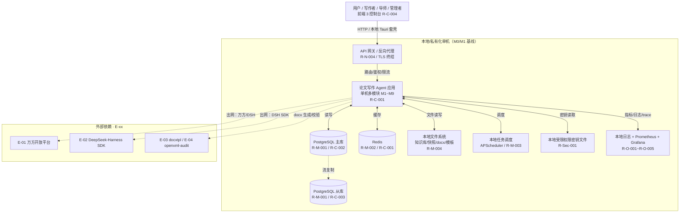

# AICoding 架构设计 · 部署设计

> 本文档为《AICoding 架构设计》核心产物之一，定位为**系统部署设计文档**。
> 上游输入：《系统设计》中的部署架构（§5）、网络架构（§6）、安全设计（§7）、可观测设计（§8）；
> 下游输出：环境与资源清单、流水线、监控告警、应急回滚等可落地的运维交付物。
>
> **演进式双轨（本文档全文基线）**：本系统面向国内教学/科研场景，按《高层架构设计》§4.2 与 `_runtime_meta.md` §0「MVP 以本地/单机与私有化部署为主」冻结。全文采用**演进式双轨**写法，三条演进轨与《系统设计》《UserStory》严格一致：
>
> | 演进轨 | 定位 | 部署形态 | 关键约束 |
> | --- | --- | --- | --- |
> | **M0（MVP 基线）** | 本地单机桌面化（后续 Tauri 套壳） | 单台本机 / 开发者机器 | 全部中间件（PostgreSQL/Redis/本地文件）在本机；进程内调用；本地 Prometheus+Grafana；**无 VPC/DMZ/多 AZ/K8s** |
> | **M1（机构推广）** | 私有化单机 / 局域网 | 机构内网单台/少量服务器 | 机构局域网内用户访问；中间件仍在本地/私有化内网；引入机构防火墙与内网访问控制 |
> | **M2（远期演进·蓝图）** | 云端 SaaS | 云端多租户 | VPC/DMZ/多 AZ/K8s/云 WAF 等**云端强约束仅作演进蓝图说明，不得作为 M0 硬性基线反推** |
>
> **基线声明**：M0（MVP）是本文档填值基线。凡「当前配置 / MVP 阶段值」均按 M0 填；凡「生产阶段配置」按 M1（机构私有化单机）填；M2 云端强约束仅在 §2.2.3 网络资源、§3.2 跨网络互联、§3.3 故障域中以「M2 演进蓝图」明确标注，不反推 M0。

---

## 1. 引言

### 1.1 适用范围与部署形态

| 维度 | 取值 |
| --- | --- |
| 适用系统 | 基于 DeepSeek-Harness 的学位论文全流程写作 Agent（thesis-agent-dsh，后端单机多模块 M1~M9 + 前端 3 个控制台） |
| 目标部署形态 | M0 本地单机桌面化 / M1 私有化单机局域网（当前基线）；M2 云端 SaaS（远期演进蓝图） |
| 云/本地属性 | 本地/私有化为主（`need_cloud_baseline_check = false`），不依赖云厂商 IaaS/PaaS 强约束 |
| 隔离粒度 | 会话绑定式专属知识库（REQ-KB），非多租户（见《系统设计》§1.3 / `_runtime_meta` §8） |
| 面向对象 | 院校/机构教学科研环境，学生/写作者、导师/审阅者、院校学位管理者 |
| 目标可用性 | ≥ 99.5% 月度可用性；RTO ≤ 30min；RPO ≤ 6h（见 §3.3 / §8.1.4 与《系统设计》§5.3） |
| 关联文档 | 《高层架构设计》§4.2/§6.3、《系统设计》§5/§6/§7/§8、`_runtime_meta.md` §0/§6/§7/§8 |

> **范围与边界**：本文档只承载**部署与运维施工结论**（资源清单、拓扑、流水线、配置、监控告警、回滚、容量成本），不做业务/应用/数据库/安全机制设计（分别归 `system-architect` / `security-architect`）。安全相关的信任域、安全组规则、WAF 厂商与版本、日志合规保留期以 `security-architect` 输出的《安全设计》为准，本文档按「重叠区权威方分配表」消费并落实到资源与拓扑。

### 1.2 名词与缩写

| 缩写 | 全称 | 含义 |
| --- | --- | --- |
| M0 / M1 / M2 | MVP / 推广 / 演进轨道 | 演进式双轨：本地单机桌面化 / 私有化单机局域网 / 云端 SaaS（蓝图） |
| REQ-KB | 会话绑定式专属知识库 | 与论文会话强绑定的独立知识库模块（`_runtime_meta` §8） |
| FSM | Finite State Machine | 十环节有限状态机，上层自研编排（M1） |
| HITL | Human-in-the-Loop | 敏感环节（环节2/4/8/10）人工确认网关（M3） |
| DSH | DeepSeek-Harness | LLM 运行底座，SDK 依赖引用（不 fork，E-02） |
| OTel | OpenTelemetry | 链路追踪标准（W3C TraceContext） |
| KMS | Key Management Service | 密钥管理（M0 为本地受限权限密钥文件；M2 为云 KMS/Vault） |
| L1~L4 | 配置层级 | 代码内 / 配置中心 / 环境变量 / Secret（§4.4） |
| RED / USE | 可观测模型 | Rate-Errors-Duration / Utilization-Saturation-Errors（§5.2） |
| CAPEX / OPEX | 资本支出 / 运营支出 | 一次性硬件成本 / 月度运营成本（§8.2） |
| CI/CD | Continuous Integration / Delivery | 持续集成 / 持续交付流水线（§4.2） |

---

## 2. 环境与资源清单

### 2.1 环境矩阵

> **隔离策略**：M0/M1 全部为本地/私有化部署，四环境均落在**同一套本地基础设施或同一机构内网**上；环境间**逻辑隔离（不同数据目录 + 不同端口/进程实例）**，除 M1 引入机构内网分段外，**不引入云端 VPC/DMZ/环境网络隔离强约束**（该约束归 M2 蓝图）。

| 环境 | 用途 | 集群隔离 | 数据 | 网络访问 | 演进轨 |
| --- | --- | --- | --- | --- | --- |
| dev | 开发自测（本机） | 进程级隔离（独立端口/目录） | 模拟数据 | 本机回环（127.0.0.1） | M0 |
| int | 联调（本机/团队机） | 进程级隔离 | 模拟数据 | 本机回环 + 开发内网 | M0 / M1 |
| uat | 预发 / 验收 | 独立实例（独立目录 + 端口） | 仿生产 | 本机回环 + 机构内网白名单 | M1 |
| prod | 生产 | 独立实例（独立目录 + 端口） | 真实数据 | 本机回环 + 机构内网白名单（M1） | M0 / M1 / M2 |

> **隔离边界说明**：M0/本地单机下，四环境**共用同一物理主机**，通过「独立进程实例 + 独立数据目录 + 独立端口」实现逻辑隔离（如 dev 用 `localhost:8000` + `./data/dev/`，prod 用 `localhost:8001` + `./data/prod/`）；M1 私有化推广时，将 prod 独立到机构内网专用服务器，其余环境保留在开发/运维机。**不将「四环境各自独立 VPC/子网」作为 M0 硬性要求**（归 M2 蓝图）。

**配置策略（与《系统设计》§5.1 对齐）**：

| 配置层级 | 存放位置 | 适用内容 | 变更生效 | 对开发的约束 |
| --- | --- | --- | --- | --- |
| L1 代码内 | 代码仓库 | 默认值、枚举、不会变的常量 | 重新部署 | 禁止写入：环境差异、密码、地址 |
| L2 配置中心 | 本地 config 文件 | 业务开关、限流阈值、降级开关 | 热更新（监听 + 回调） | 必须实现配置变更回调；变更必须幂等 |
| L3 环境变量 | 本地 .env 文件 | 环境差异（DB 地址 / 万方 endpoint / DSH 端点） | 重启进程 | 启动失败 fail-fast，禁止跑默认值 |
| L4 Secret | 本地密钥文件（权限受限） | 密码、AKSK、Token、证书私钥 | 重启进程 | 禁止落日志、禁止入代码、内存中不缓存到生命周期外 |

### 2.2 云资源清单

> **说明**：本系统为本地/私有化部署（`need_cloud_baseline_check = false`），**资源清单以「本地/私有化资源」为基线**，不使用腾讯云/阿里云资源 ID。资源编号沿用模板 `R-C-*` / `R-S-*` / `R-N-*` / `R-M-*` / `R-O-*` / `R-Sec-*` 规则。本轮无云资源现状核对任务，**全部资源属「新建（本地自建）」**；凡涉及云资源（M2 蓝图）均显式标注「M2 演进蓝图」并注明「待人工确认」。复用资源：本系统无存量业务可复用（全新系统），§2.3 按模板注明。

#### 2.2.1 计算资源

| 资源编号 | 类型 | 产品 | 资源 ID | 名称 | 规格 | 数量 | 环境 | 复用 / 新建 | HA 方案 | 用途 |
| --- | --- | --- | --- | --- | --- | --- | --- | --- | --- | --- |
| R-C-001 | 应用主机 | 本地物理机/虚机 | local-app-host | 论文写作 Agent 应用主机 | 8C16G + 500GB SSD | 1 | dev/int/uat/prod | 新建（本地自建） | 单机多模块（单进程，DB 主备同机异盘） | 承载 API 网关 + M1~M9 业务模块（单进程多模块，进程内调用） |
| R-C-002 | 数据库主机 | 本地物理机/虚机 | local-db-master | PostgreSQL 主库主机 | 4C16G + 500GB SSD | 1 | prod | 新建（本地自建） | 主备流复制 | 业务主数据读写（十环节状态/内容产物/知识库关系数据） |
| R-C-003 | 数据库从库 | 本地物理机/虚机 | local-db-slave | PostgreSQL 从库主机 | 4C16G + 500GB SSD | 1 | prod | 新建（本地自建） | 主备流复制（只读） | 只读 + 备份兜底（RPO ≤ 6h） |
| R-C-004 | 前端/桌面宿主 | 本地桌面 | local-desktop | 写作者工作台（Web + 后续 Tauri 套壳） | 用户本机（浏览器/桌面） | 1 | dev/prod | 新建 | 本地浏览器/桌面渲染 | 前端 3 个控制台（writer/reviewer/manager） |
| R-C-005 | CI 构建机 | 本地虚机 | local-ci | 本地 CI 构建工具机 | 4C8G | 1 | dev/int | 新建（本地自建） | 无（构建单点） | 本地流水线：构建/测试/制品打包/一键打包脚本 |

> **M2 演进蓝图（不反推 M0）**：R-C-001 在 M2 演进为云端容器化多副本（K8s Deployment，min 2 / max N），R-C-002/003 演进为云托管 PostgreSQL（主备+只读副本）。此为蓝图，M0 不采用。

#### 2.2.2 存储资源

| 资源编号 | 类型 | 产品 | 资源 ID | 名称 | 规格 | 容量 | 环境 | 复用 / 新建 | HA 方案 | 备份策略 |
| --- | --- | --- | --- | --- | --- | --- | --- | --- | --- | --- |
| R-S-001 | 数据库盘 | 本地块存储 SSD | local-db-vol | PostgreSQL 数据盘 | 500GB SSD | 500GB | prod | 新建（本地自建） | RAID1 冗余（同机异盘） | 每日全备 + 增量；RPO ≤ 6h；保留 30 天 |
| R-S-002 | 知识库目录 | 本地文件系统 | local-kb-dir | REQ-KB 会话绑定知识库目录 | 独立目录（按会话隔离） | 按需（首 200GB） | prod | 新建（本地自建） | 本地磁盘（RAID1） | 会话删除后回收站保留 7 天；逾期清除；写入快照防损坏 |
| R-S-003 | 版本快照目录 | 本地文件系统 | local-snap-dir | 版本快照归档目录 | 本地文件 + 元数据 | 200GB | prod | 新建（本地自建） | 本地磁盘（RAID1） | 过程版本快照（回退/审计），保留策略按 §5.2 水位 |
| R-S-004 | 导出 docx 目录 | 本地文件系统 | local-docx-dir | 合规 docx 输出目录 | 本地文件 | 按需 | prod | 新建（本地自建） | 本地磁盘 | 按用户模板导出，随任务产出 |
| R-S-005 | 备份存储 | 本地外置盘/异机 | local-backup | 数据库/文件备份 | 1TB 外置盘 | 1TB | prod | 新建（本地自建） | 异机/异盘 | 全备+增量，异地冗余，RPO ≤ 6h |

> **M2 演进蓝图（不反推 M0）**：R-S-001 演进为云盘（多 AZ 冗余）；R-S-002/003/004 演进为对象存储（COS，按桶隔离 + 生命周期归档）；R-S-005 演进为跨 Region 备份/对象存储跨区复制。此为蓝图，M0 不采用。

#### 2.2.3 网络资源

> **基线声明**：M0/M1 为本地/私有化网络，**无云端 VPC/DMZ/CIDR 强约束**；VPC/DMZ/CIDR 仅作为 M2 演进蓝图说明（详见 §3.2 跨网络互联）。

| 资源编号 | 类型 | 产品 | 资源 ID | 名称 | 规格 | 环境 | 复用 / 新建 | 用途 |
| --- | --- | --- | --- | --- | --- | --- | --- | --- |
| R-N-001 | 本地回环/内网 | 本机 loopback + 内网 | local-net | 本地单机网络 | 1000Mbps 内网 | dev/int/uat/prod | 新建（本地自建） | API 网关 → 应用 → 中间件（本机回环 127.0.0.1） |
| R-N-002 | 机构局域网（M1） | 机构内网 | local-lan | 私有化局域网 | 1Gbps | uat/prod | 新建（复用机构网） | 机构内部用户访问（M1 引入） |
| R-N-003 | 公网出站 | 本地 NAT/代理 | local-egress | 万方/DSH 出网 | 随机构 | prod | 新建（本地自建） | E-01 万方 / E-02 DSH 出网（白名单域名） |
| R-N-004 | TLS 终结/代理 | 反向代理（Caddy/Nginx） | local-gw | API 网关/反向代理 | 本机 | prod | 新建（本地自建） | 本地入口 TLS 终结 + 路由/鉴权/限流（QPS 低，单进程） |

> **M2 演进蓝图（不反推 M0）**：R-N-001 演进为云端 VPC（DMZ / INT / UAT / PROD / DEV 五网段，CIDR 规划，见下表）；R-N-002 演进为云对等连接/云联网；R-N-003 演进为 NAT 网关 + 固定出口；R-N-004 演进为公网负载均衡 + API 网关（Ingress）。**VPC/CIDR/DMZ 细分仅作 M2 蓝图说明，不占 M0 资源**。
>
> **M2 演进层 VPC/CIDR 骨架（以 platform 为权威方，security 已按拓扑落定，供确认一致）**：
>
> | VPC / 网段 | 资源 ID | CIDR | 用途 |
> | --- | --- | --- | --- |
> | DMZ VPC | `vpc-dmz-saas` | `dmz-public 10.10.0.0/24` | 公网入口缓冲区（仅公网入站，不直连业务） |
> | 业务 VPC | `vpc-biz-saas` | prod `10.20.0.0/20` / uat `10.20.16.0/20` / int `10.20.32.0/20` / dev `10.20.48.0/20` | 应用与中间件（按环境细分网段） |
> | DevOps VPC | `vpc-devops-saas` | ops `10.30.0.0/24` | 运维通道（堡垒机/CI） |
>
> 说明：三区 CIDR（10.10.0.0/24、10.20.0.0/20 系、10.30.0.0/24）**不重叠**，满足隔离与最小暴露原则；此骨架由 security 按我方拓扑回填，双方一致。

#### 2.2.4 中间件与平台服务

| 资源编号 | 类型 | 产品 | 资源 ID | 名称 | 规格 | 环境 | 复用 / 新建 | HA 方案 | 用途 |
| --- | --- | --- | --- | --- | --- | --- | --- | --- | --- |
| R-M-001 | 关系型数据库 | PostgreSQL 16 | local-pg | PostgreSQL 主库 | 4C16G + 500GB | prod | 新建（本地自建） | 主备流复制（1 主 1 从） | 业务主数据读写（FSM 状态/内容产物/知识库关系数据） |
| R-M-002 | 缓存 | Redis 7.2 | local-redis | Redis 缓存 | 2C4G | prod | 新建（本地自建） | 哨兵（可配）/单机 | 幂等键/分布式锁/会话缓存/限流计数 |
| R-M-003 | 任务调度 | APScheduler 3.10 | local-sched | 本地任务调度 | 进程内 | prod | 新建（本地自建） | 本地进程 | FSM 推进/万方重试/清理任务 |
| R-M-004 | 对象存储 | 本地文件系统 | local-fs | 本地文件系统 | 按需（首 1TB） | prod | 新建（本地自建） | 本地磁盘 RAID1 | 知识库/快照/docx/模板文件 |
| R-M-005 | LLM 底座 | DSH SDK | local-dsh | DeepSeek-Harness 依赖 | SDK 依赖引用 | prod | 新建（依赖引用） | 外部依赖 | LLM 推理/工具/会话（不 fork，本地或 API） |
| R-M-006 | docx 引擎 | docxtpl 0.17.x | local-docxtpl | docx 生成引擎 | Python 库 | prod | 新建（依赖引用） | 外部依赖 | 模板驱动 docx 生成（M5/M6） |
| R-M-007 | docx 校验 | openxml-audit 0.7.5 | local-oxa | openxml 校验 | Python 库/CLI | prod | 新建（依赖引用） | 外部依赖 | OOXML schema/roundtrip/load 校验（M6） |

> **KMS/Vault 实例（经 security 权威确认，§6.2.3）**：M0 采用「本地受限权限密钥文件」（`R-Sec-001`，见 §2.2.6）作为密钥载体，不引入独立 KMS 服务；M1/M2 演进为云 KMS / Vault，实例命名与访问策略以 `security-architect` 的《安全设计》§6.2.3 为准：
> - `kms-thesis-master`（主密钥，master key）
> - `kms-thesis-data`（数据加密解钥，deK key）
> - `ssm-thesis-prod` / `ssm-thesis-uat`（参数/会话管理，按环境隔离）
> - `vault-thesis-prod`（Vault 生产密钥存储）
> - **轮转周期基线 90 天**（SEC-01/02/03/05，见 §7.2）；访问策略见安全设计 §6.2.3。

#### 2.2.5 可观测资源

| 资源编号 | 类型 | 产品 | 资源 ID | 名称 | 规格 | 环境 | 复用 / 新建 | 承载可观测维度 |
| --- | --- | --- | --- | --- | --- | --- | --- | --- |
| R-O-001 | 指标采集 | Prometheus（本地） | local-prom | Prometheus | 本地进程 | prod | 新建（本地自建） | Metrics：RED（应用）/ USE（资源）/ 中间件指标 |
| R-O-002 | 可视化 | Grafana（本地） | local-graf | Grafana | 本地进程 | prod | 新建（本地自建） | Dashboard（6 大盘）：业务/服务健康/中间件/容量/预警/合规红线 |
| R-O-003 | 日志 | 本地结构化日志组件 | local-log | 本地日志服务 | 本地文件（JSON） | prod | 新建（本地自建） | Logs：应用/审计/合规红线日志（含 traceId + tenantId） |
| R-O-004 | 链路追踪 | OpenTelemetry Collector | local-otel | OTel Collector | 本地进程 | prod | 新建（本地自建） | Traces：W3C TraceContext，1% 采样 + 错误/慢请求 100% |
| R-O-005 | 告警 | Alertmanager（本地） | local-alert | Alertmanager | 本地进程 | prod | 新建（本地自建） | 告警路由/分级通知（P0~P3，§5.4） |

> **日志保留期（经 security 权威确认）**：
> - 普通审计日志（业务操作/数据库/知识库操作/接入）：**≥ 1 年（合规）**
> - 合规红线日志（t_guardrail_log）：**≥ 5 年（学位追溯关键数据）**，独立目录（防篡改），不随普通审计日志清理
> - 应用日志（INFO+）：30 天热 + 180 天冷；异常（ERROR+）：90 天热 + 1 年冷
> 本文档按上述结论在 §5.2 / §7.3 落地。

#### 2.2.6 安全资源

| 资源编号 | 类型 | 产品 | 资源 ID | 名称 | 规格 | 环境 | 复用 / 新建 | HA 方案 | 用途 |
| --- | --- | --- | --- | --- | --- | --- | --- | --- | --- |
| R-Sec-001 | 密钥管理 | 本地密钥文件（权限受限） | local-kms | 本地受限权限密钥文件 | 目录级 600 权限 | prod | 新建（本地自建） | 本地文件（不可入代码/日志） | 万方 app-token / DSH api-key / 密码哈希（L4，SEC-04/05） |
| R-Sec-002 | 防火墙 | 本地主机防火墙 | local-fw | 本地防火墙 | host 级（默认拒绝 + 显式放通） | prod | 新建（本地自建） | 本地 | 主机入站控制（仅白名单端口，拒绝 22/23/3306/6379/5432 公网开放） |
| R-Sec-003 | 主机安全 | 本地主机加固 | local-hostsec | 主机加固基线 | 基线 + 补丁 | prod | 新建（本地自建） | 本地 | 安全基线/补丁/弱口令筛查 |
| R-Sec-004 | 审计日志 | 独立目录 | local-audit | 审计/合规红线日志目录 | 独立目录（防篡改） | prod | 新建（本地自建） | 与业务存储物理隔离 | 审计日志（≥1年）/合规红线（≥5年） |
| R-Sec-005 | WAF / DDoS | 本地轻量 WAF（M0）/ 云 DDoS 高防 + 云 WAF（M2） | local-waf | API 网关 WAF 规则 | M0 本地轻量；M2 云 DDoS 高防（标准版）+ 云 WAF 集群 | M0/M2 | 新建（M0 本地 / M2 云） | M0 本地；M2 云 WAF 集群 | Web 应用层防护（OWASP 核心规则集 + CC） |
| R-Sec-006 | 堡垒机 | 本地运维通道 | local-bastion | 运维堡垒机 | 本地运维通道 | prod | 新建（本地自建） | 本地 | 运维通道审计（运维 → 业务走堡垒机） |

> **安全组规则 / WAF / DDoS 厂商与版本（经 security 权威确认）**：
> - **安全组/CIDR 规则**（security 权威）：公网→DMZ 443、DMZ→业务 8000/8443、业务→PG/Redis 5432/6379（仅应用层）、运维→业务走堡垒机、业务→公网出站仅白名单域名（万方/DSH）；**禁止 0.0.0.0/0 开放 22/23/3306/6379/5432**。M0 本地基线：本地防火墙默认拒绝 + 显式放通，PostgreSQL/Redis 仅绑 127.0.0.1/本地 socket。
> - **WAF/DDoS 厂商与版本**（security 权威）：M0 本地轻量 WAF（`R-Sec-005`）；M1 应用层 TLS + 机构 WAF；M2 云 DDoS 高防（标准版）+ 云 WAF 集群（OWASP 核心规则集 + CC）。

### 2.3 复用资源清单

| 复用资源 ID | 原业务方 | 余量评估 | 隔离方式 |
| --- | --- | --- | --- |
| 无（全新系统） | — | — | — |

> **字段说明**：
> - 本系统为**全新建设系统**，无存量业务资源可复用（`need_cloud_baseline_check = false`，不涉及云资源复用基线）。
> - 复用资源：`R-N-002`（机构局域网）在各演进轨中复用机构既有网络环境；`R-M-001`/`R-M-002` 在 M1 机构推广时复用机构已有运维基础设施（若机构已有 PostgreSQL/Redis，则按「命名空间/实例级隔离」复用）。**M0 本地单机场景下全部为本地自建**，无复用。
> - 若后续需要核对已有云资源现状（M2 蓝图阶段），再通过 `CloudQ` 抓取资源水位与缺口清单；本轮不涉及。

---

## 3. 部署拓扑与高可用设计

### 3.1 物理拓扑

#### 3.1.1 物理拓扑图

> M0/M1 本地/私有化单机部署。图内节点命名与《系统设计》§5.4.1、§3.1.2 保持一致（API 网关 / 论文写作 Agent 应用 / PostgreSQL 主从 / Redis / 本地文件系统 / 本地任务调度 / 本地日志+Prometheus/Grafana）。



> **M2 演进蓝图（不反推 M0）**：云端 SaaS 拓扑将「本机回环」演化为「VPC（DMZ/INT/UAT/PROD/DEV）+ 多 AZ + K8s 容器化 + 云负载均衡 + 云托管 DB（跨 AZ 主备）+ 云对象存储 + 云 WAF/DDoS + 云 KMS」。此蓝图仅作说明，M0/M1 不采用。

#### 3.1.2 拓扑要素清单

| 要素 | 取值（M0/M1 基线） |
| --- | --- |
| 跨 Region 部署 | 否（本地/私有化单机） |
| 跨 AZ 部署 | 否（本地单机） |
| 流量入口路径 | 本地入口（127.0.0.1 / 机构内网）→ API 网关 → 业务模块 |
| 内部调用路径 | 进程内调用 + 本地服务发现（单机，无独立服务注册中心） |
| 数据库访问路径 | 连接池 + 主从切换（应用 → 主库；只读走从库/连接池） |
| 消息通路 | 进程内事件 + APScheduler（无独立 MQ 中间件，M0 不引入 TDMQ/Kafka） |
| 外部出口 | 本地 NAT/代理 → 万方/DSH（白名单域名，固定出口不强制） |

### 3.2 流量与网络链路（连通视图）

> **本小节为 Phase 5.2 交接焦点**（§3 物理拓扑 + §3.2 流量与网络链路三表）。M0/M1 为本地/私有化网络，VPC/DMZ 等仅在 M2 蓝图说明。**出口 / 入口 / 内部链路三表含网络骨架；安全组规则、WAF 厂商版本、日志保留期已按 security 侧权威结论回填**（见下表与 §2.2.6）。

#### 3.2.1 流量入口链路

| 组件 (R-xx) | 协议 - 端口 | TLS 终结 | 作用 |
| --- | --- | --- | --- |
| 用户前端（R-C-004） | HTTP(S) - 8000/8443 | 本机反向代理（R-N-004） | 起写作者/导师/管理者控制台，访问 API |
| API 网关 / 反向代理（R-N-004） | HTTP - 8000/8443 | 网关终结 TLS（内部明文） | 路由 / 鉴权 / 限流 / 真实客户端 IP（X-Forwarded-For） |
| 业务模块（R-C-001，M1~M9） | 进程内调用 + HTTP | 内部明文（不启用 mTLS，M0/M1 单机） | 业务逻辑处理 |
| WAF 规则（R-Sec-005） | HTTP(S) - 443 | M0 本地轻量 WAF / M2 云 WAF | Web 应用层防护（OWASP 核心规则集 + CC） |

> **入口决策（与《系统设计》§6.2 对齐）**：TLS 终结于 API 网关/反向代理；业务侧解析 `X-Forwarded-*`；限流在网关统一拦截（对接 §3.5.3 限流红线）；鉴权在网关统一（对接《系统设计》§7.2.1）。

> **安全组/流量管控（经 security 权威确认）**：
> - **公网→DMZ**：仅 443（TLS 终结，WAF 前置）
> - **DMZ→业务**：8000/8443（API 网关）
> - **业务→PostgreSQL/Redis**：5432/6379（仅应用层访问，禁止公网）
> - **运维→业务**：走堡垒机（R-Sec-006）
> - **业务→公网出站**：仅白名单域名（万方/DSH）
> - **禁止 0.0.0.0/0 开放** 22/23/3306/6379/5432
> - **M0 本地基线**：本地防火墙默认拒绝 + 显式放通；PostgreSQL/Redis 仅绑定 127.0.0.1/本地 socket。

#### 3.2.2 内部互联链路

| 项 | 说明 |
| --- | --- |
| 服务发现 | 本地进程内（单机，M1~M9 同一进程，无独立注册中心）；«禁止硬编码 IP / 直连 Pod IP» |
| 服务间协议 | 进程内调用 + HTTP（同步链路）；敏感环节/万方降级用进程事件 + APScheduler |
| mTLS | 不启用（M0/M1 本地单机，进程边界小、无跨机暴露） |
| 数据库连接 | 应用 → 连接池 → PostgreSQL 主库（读写）；从库（只读/备份） |
| 缓存连接 | 应用 → Redis（单机/哨兵自动切换） |
| MQ 连接 | 不引入 MQ（M0/M1）；完整版如需跨机再引入（可演进点） |
| 幂等性透传 | 跨服务调用必须透传幂等键 + traceId（见《系统设计》§8.3） |

#### 3.2.3 跨网络互联

| 互联类型 | 通道 | 带宽 | 加密 | 用途 |
| --- | --- | --- | --- | --- |
| 本机回环（M0） | 127.0.0.1 loopback | 1000Mbps | 本机明文 | 网关 → 应用 → 中间件 |
| 机构内网（M1） | 机构局域网 | 1Gbps | 内网（可加 VLAN）+ 应用层 TLS | 机构用户访问 prod |
| 公网出站（万方/DSH） | 本地 NAT/代理 | 随机构 | HTTPS（TLS 1.2+） | E-01/E-02 外部调用（白名单域名） |
| 跨 VPC / 跨账号 / 跨 Region（灾备） | 不适用（本地） | — | — | M2 蓝图：云联网/对等连接/PrivateLink/专线 |

> **M2 演进蓝图（cloud 强约束仅作说明，不反推 M0）**：云端拓扑将引入 VPC（DMZ/INT/UAT/PROD/DEV 五网段，CIDR 规划见 §2.2.3）、安全组（按网段最小化开放）、跨 AZ 主备、跨 Region 灾备（专线/公网加密）、云 WAF/DDoS、PrivateLink 跨账号互联。**安全组规则精确 CIDR、WAF 厂商版本已按 security 侧权威结论回填（见 §2.2.6 / §3.2.1）**。

### 3.3 高可用与故障容错

#### 3.3.1 故障域划分

> **基线**：M0/M1 本地/私有化单机，故障域为「单进程 / 单磁盘 / 单数据库 / 外部依赖」四层（与《系统设计》§5.4.3 对齐）。**无单 AZ / 单 Region 故障域（M0/M1 不跨 AZ/Region；该维度仅 M2 蓝图说明）**。

| 故障域 | 影响范围 | 容错机制 | 预期 RTO |
| --- | --- | --- | --- |
| 单进程（应用/调度/日志） | 单实例 | 进程自愈重启（systemd/宿主机守护）+ 优雅停机 | < 30s（瞬时无影响） |
| 单磁盘 | 本地存储 | 磁盘冗余（RAID1）+ 备份恢复 | < 30min |
| 单数据库 | 业务主数据 | 主备切换（流复制） | ≤ 30min |
| 外部依赖（E-01/E-02/E-03/E-04） | 万方/DSH/docx 不可用 | 降级（人工输入/重试）+ 熔断 | 不阻塞主链路（降级处理） |
| 单 AZ（M2 蓝图） | 该 AZ 全部资源 | 跨 AZ 部署，自动切换 | ≤ 5min（蓝图） |
| 单 Region（M2 蓝图） | 全部主资源 | 灾备 Region 切换 | < 1h（蓝图） |

> **可用性来源拆分**：哪部分由本地基础设施（电源/网络/磁盘）兜底、哪部分由本系统自身保障（业务重试/熔断/降级/兜底数据）。M0/M1 下无云厂商 SLA 兜底，全部由「本地运维 + 本系统自愈」承担（见 §8.1.4 水位与 §5.3 告警）。

#### 3.3.2 负载均衡

| 维度 | 取值 |
| --- | --- |
| 类型 | L7（API 网关 / 反向代理，`R-N-004`） |
| 健康检查路径 | `/healthz`（Liveness）/ `/readyz`（Readiness） |
| 健康检查频率 | 10s |
| 失败阈值 | 连续 3 次失败标记不健康 |
| 恢复阈值 | 连续 2 次成功标记健康 |
| 会话保持 | 否（本地单进程，无多副本） |
| 负载均衡算法 | 无（单进程单实例）；M2 演进为 LB 轮询/加权（蓝图） |

#### 3.3.3 健康检查配置

| 维度 | 取值 |
| --- | --- |
| Liveness 探针 | `/healthz`，仅判进程存活；失败 → 重启进程 |
| Readiness 探针 | `/readyz`，判依赖（PostgreSQL/Redis）就绪；失败 → 摘流不杀进程 |
| 探针频率 | 每 10s |
| 失败阈值 | 连续 3 次失败标记不健康 |
| 恢复阈值 | 连续 2 次成功标记健康 |

#### 3.3.4 弹性伸缩配置

| 维度 | 取值 |
| --- | --- |
| 触发指标 | CPU / 内存（M0/M1 无 K8s，用进程级重启/扩进程） |
| 扩容阈值 | CPU > 70% 持续 5min |
| 缩容阈值 | CPU < 30% 持续 10min |
| 副本区间 | min 1 / max 3（本地可水平扩至多进程）；M2 演进为 K8s HPA（蓝图） |
| 冷却时间 | 扩容 60s / 缩容 5min |
| 说明 | M0/M1 本地单机，实际单进程；多副本仅在 M2 蓝图或单机资源充裕时启用 |

#### 3.3.5 容灾切换配置

| 维度 | 取值 |
| --- | --- |
| 容灾级别 | 单机（本地/私有化）；DB 主备（1 主 1 从，流复制） |
| 故障切换 RTO | ≤ 30min（本地备份恢复 + 主备切换） |
| RPO | ≤ 6h（每日全备 + 增量；知识库快照写入备份） |
| 跨 Region 数据同步策略 | 无（本地单机）；M2 蓝图引入跨 Region 灾备 |
| 切换流程 | DB 主备切换（应用连接池重连）→ 应用重启自愈 → 存储挂载恢复 |

---

## 4. 部署流程

### 4.1 代码仓库与分支

| 项 | 规范 / 值 | 说明 |
| --- | --- | --- |
| 代码仓库地址 | 机构自建 Git 仓库（如 Gitea/GitLab 自建或本地 git） | 本地/私有化，不依赖云端托管 |
| 分支管理 | `main`（生产）/`develop`（集成）/`feature/*`/`hotfix/*` | 主干为 `main`，`main` 保护（直接 PR 合入，不可强推） |
| 合并规范 | feature → develop PR 评审；develop → main 需人工审批 + 全量 CI 通过 | 至少 1 名 Reviewer |
| 标签规范 | `v<major>.<minor>.<patch>`（语义化版本，如 `v1.0.0`） | 对应可发布版本 |

### 4.2 流水线（CI / CD）

> **基线说明**：M0/M1 为本地/私有化，CI/CD 聚焦**本地流水线（构建 → 测试 → 制品 → 部署 → 回滚）+ 一键打包脚本（便于 Tauri 套壳）**。M2 蓝图可演进为云端 CI/CD（GitHub Actions/CODING 等），但**不用于 M0**。流水线共 **8 阶段**，与模板对齐。

| 阶段 | 触发条件 | 关键动作 | 失败处理 |
| --- | --- | --- | --- |
| ① 构建 | 自动（push/PR）/ 手动触发 | 拉代码 → 装依赖 → 编译 → 单元测试 → 构建产物 | 阻断后续阶段 |
| ② 代码扫描 | 构建后 | 静态扫描（ruff/pylint/SonarQube 自建）+ 代码规范 + 复杂度 | 不达标阻断 |
| ③ 安全扫描 | 构建后 | SCA（依赖漏洞 pip-audit/bandit）/ SAST（代码漏洞）/ 镜像漏洞扫描（若容器化） | 高危阻断 |
| ④ 集成测试 | 合并到 develop | 集成测试 / 接口测试 / 契约测试（对接 §3.5 契约） | 阻断后续阶段 |
| ⑤ 制品打包 | 构建/测试通过 | 构建镜像/制品包，推送到制品库并打 Tag；含一键打包脚本（Tauri 套壳用） | 失败重试 |
| ⑥ 部署 dev 环境 | Package 完成 | 自动部署到 dev（本机回环实例），冒烟测试 | 失败回滚到上一版本 |
| ⑦ 部署 uat 环境 | 手动触发 | 部署到预发（仿生产），冒烟测试 | 失败回滚到上一版本 |
| ⑧ 部署 prod 环境 | 人工审批 | 按发布策略灰度上线 | 按回滚策略实施回滚（§6.1） |

> **一键打包脚本（M0 本地单机桌面化关键）**：产物含「离线可执行环境打包」，便于后续 Tauri 套壳（将后端 + 前端 + 依赖打包为桌面可执行/安装包）；本地流水线提供 `make build-local` / `make package-desktop` 脚本，`make rollback` 一键回滚至上一 Tag。

### 4.3 构建产物与制品管理

| 配置项 | 配置值 / 规则 | 说明 |
| --- | --- | --- |
| 产物类型 | Python 源码包 + 依赖 lock 文件 + 容器镜像（可选）+ 前端静态包 + 桌面打包包（Tauri） | M0 以源码包 + lock 文件为主 |
| 镜像/制品仓库 | 本地制品库（自建 Harbor/Nexus）或本地目录 | 本地/私有化，不依赖云端 |
| 镜像命名 | `thesis-agent-dsh/<service-name>:v<git-tag>-<commit-sha-short>` | 与模板规则一致 |
| 制品保留期 | 近期 Tag 保留 90 天；历史稳定版本长期保留（≥ 6 个月） | 支持回滚 |
| 制品溯源 | 制品元数据含 `git-commit` / `build-time` / `pipeline-id` / `Python 依赖 hash` | 便于反查源码与依赖 |
| 签名与校验 | 本地 GPG/checksum 校验；M2 蓝图可引入 cosign/Notary | 是否启用镜像签名 |

### 4.4 配置管理

> **配置中心选型**：M0/M1 本地/私有化，不依赖云端配置中心；采用**本地 config 文件（L2）+ .env 环境变量（L3）+ 本地受限密钥文件（L4）** 三层。M2 蓝图可演进为云配置中心/ConfigMap/Secret（K8s）。

**配置管理四层级（L1~L4，与《系统设计》§5.1 对齐）**：

| 层级 | 存放位置 | 适用内容 | 变更生效 | 版本管理 | 对开发约束 |
| --- | --- | --- | --- | --- | --- |
| L1 | 代码仓库 | 默认值、枚举、不会变的常量 | 重新部署 | git 版本 | 禁止写入环境差异/密码/地址 |
| L2 | 本地 config 文件 | 业务开关、限流阈值、降级开关 | 热更新（监听 + 回调） | 本地 + 版本快照 | 必须实现配置变更回调；变更幂等 |
| L3 | 本地 .env 文件 | 环境差异（DB 地址/万方 endpoint/DSH 端点） | 重启进程 | 本地（不入 git） | 启动失败 fail-fast，禁止跑默认值 |
| L4 | 本地受限权限密钥文件 | 密码、AKSK、Token、证书私钥 | 重启进程 | 本地（受限权限，600） | 禁止落日志/入代码/内存外缓存 |

### 4.5 发布策略

#### 4.5.1 发布方式

> **全系统采用「滚动发布 + 一键回滚」**（M0/M1 本地单机单实例，滚动发布 = 停旧起新 + 依赖检查 + 冒烟；M2 蓝图可演进为灰度/金丝雀）。敏感环节 HITL 与 DB 变更按 §6.1 单独门禁。

| 模块 | 发布方式 | 说明 |
| --- | --- | --- |
| 后端（M1~M9） | 滚动发布（单实例停旧起新）+ 一键回滚 | 停机窗口短，冒烟通过即上线 |
| 前端（writer/reviewer/manager） | 静态资源版本发布 + 缓存刷新 | 可并行，无停机 |
| PostgreSQL 表结构 | 前置变更 + 可回滚 DDL 评审 | 不可回滚 DDL 禁止与代码同发布（§6.1.3） |
| 配置（L2/L3/L4） | 热更新（L2）/ 重启（L3/L4） | 变更幂等 + 版本回溯 |

#### 4.5.2 发布标准流程

- **首次发布（含资源初始化）**：初始化本地 PostgreSQL（建库/建表/主从）→ 初始化 Redis → 初始化本地文件目录（知识库/快照/docx/模板）→ 生成 L4 密钥文件 → 部署 API 网关 → 部署后端 → 部署前端 → 验证 /healthz、/readyz → 冒烟测试十环节主链路。
- **常规迭代发布**：main 合入 → CI 全量通过 → 打 Tag → 部署 uat 冒烟 → 人工审批 → 部署 prod（滚动）→ 观测告警窗口（§5.4）→ 必要时回滚。
- **资源变更流程**：仅影响存储/中间件（扩盘/升配/加从库）时，走 §8.1.3 扩容路径，与代码发布解耦；DB 结构变更走 §6.1.3 前置 DDL 评审。

#### 4.5.3 灰度路径与观测窗口

| 批次 | 范围 | 观测时长 | 放量条件 |
| --- | --- | --- | --- |
| 第 1 批 | 内部测试用户（dev/int） | 30min | 无 P0/P1 告警，错误率 < 1% |
| 第 2 批 | uat 验收（仿生产） | 30min ~ 1h | 冒烟通过，关键接口 P99 ≤ 3s |
| 第 3 批 | prod 全量 | 按告警观测 | 发布后 15min 内无 P0，错误率 < 1% |
| 回滚触发 | 任一批次 P0 告警 | — | 立即执行 §6.1 回滚 |

> M0/M1 单实例下无真实百分比灰度，采用「分批环境 + 观测窗口」替换灰度；M2 蓝图可演进为 K8s 金丝雀（5% → 20% → 50% → 100%）。

#### 4.5.4 发布门禁

| 门禁项 | 拦截条件 | 检查时机 |
| --- | --- | --- |
| 单元测试通过率 | 100% | ①构建阶段 |
| 单元测试覆盖率（增量） | ≥ 70% | ②代码扫描阶段 |
| 集成测试通过率 | 100% | ④集成测试阶段 |
| 静态扫描严重问题数 | 0（高危）；中危需评审 | ②代码扫描阶段 |
| 安全扫描高危漏洞 | 0 | ③安全扫描阶段 |
| 制品依赖漏洞 | 高危 0 | ③安全扫描阶段 |
| 接口契约校验 | 兼容（不破坏在网调用方） | ④集成测试阶段 |
| 性能基线 | P99 不退化（≤ 3s 敏感环节 HITL） | ④集成测试阶段 |
| 人工审批 | 至少 1 名 Owner | ⑧生产发布前 |

---

## 5. 监控告警接入

### 5.1 监控架构与数据流

```text
Pod / 中间件 ──┬─► Metrics ──► Prometheus (R-O-001) ──► Grafana (R-O-002)
               ├─► Logs    ──► 本地结构化日志 (R-O-003) / 审计独立目录 (R-Sec-004)
               └─► Traces  ──► OTel Collector (R-O-004) ──► OTel UI / Grafana
                                          ▼
                                  告警引擎 Alertmanager (R-O-005)
                                          ▼
                            电话 / 短信 / IM (§5.4，P0~P3 分级)
```

> **数据流说明**：应用与中间件指标经 Prometheus 采集（RED/USE），日志经本地结构化组件（含 traceId + tenantId），链路追踪经 OTel（W3C TraceContext，1% 采样 + 错误/慢请求 100%），告警由 Alertmanager 统一路由分发（P0~P3，见 §5.4）。

### 5.2 关键 Dashboard 清单

| 大盘 | 用户 | 指标 |
| --- | --- | --- |
| 论文流程大盘 | 产品 / 业务 | 十环节状态、当前环节分布、完成率（刷新 1min） |
| 服务健康大盘 | 研发 / SRE | RED（Rate/Errors/Duration）（刷新 30s） |
| 中间件大盘 | SRE / DBA | PostgreSQL/Redis 全维度（刷新 30s） |
| 容量大盘 | SRE | §8.1.4 全部资源水位（刷新 1min） |
| 业务预警大盘 | On-call | 当前活跃告警（实时） |
| 合规红线大盘 | 院校管理者 | 红线命中分布、处置动作（刷新 1min） |

> Dashboard ≥ 5 个（实际 6 个，含合规红线大盘，与《系统设计》§8.1.2 一致）。

### 5.3 告警规则清单

| 编号 | 级别 | 触发条件 | 关联资源 (R-xx) | Owner | Runbook |
| --- | --- | --- | --- | --- | --- |
| AL-01 | P0 | Guardrail 检出学术红线（伪引/学术不端） | R-M-001 | @system-architect | RB-02 |
| AL-02 | P0 | PostgreSQL 主库不可访问 | R-M-001 | @本地运维 | RB-03 |
| AL-03 | P1 | 万方接口错误率 > 20% 持续 5min | R-M-005/E-01 | @system-architect | RB-04 |
| AL-04 | P1 | P99 > 3000ms 持续 2min（敏感环节 HITL） | R-C-001 | @研发 | RB-05 |
| AL-05 | P2 | CPU > 80% 持续 10min | R-C-001 | @运维 | RB-06 |
| AL-06 | P2 | Redis 连接失败 / 幂等键丢失 | R-M-002 | @研发 | RB-06 |
| AL-07 | P3 | 版本快照堆积超阈值 | R-S-003 | @运维 | RB-06 |
| AL-08 | P2 | 本地文件系统容量 > 80% | R-M-004/R-S-002 | @运维 | RB-06 |

> **Runbook 对齐**：告警编号与 §6.2 Runbook 索引严格对齐；全部 P0/P1 告警有 Owner；关键指标覆盖业务/应用/中间件/资源四层。

### 5.4 告警通道

| 级别 | 响应时间 | 通知方式 | 上升机制 |
| --- | --- | --- | --- |
| P0 | ≤ 5 min | 电话 + 短信 + IM | 15min 未响应升级至 Manager |
| P1 | ≤ 15 min | 短信 + IM | On-call 主值班 |
| P2 | ≤ 1 h | IM | 工作时间处理 |
| P3 | 工作时间 | IM / 邮件 | 趋势性预警 |

---

## 6. 应急与回滚

### 6.1 回滚机制

#### 6.1.1 回滚触发条件

- 生产错误率 > 1% 持续 5min（P0 告警 AL-01/AL-02）
- P90/P99 耗时超基线（P99 > 3000ms 持续 2min，敏感环节 HITL）
- 关键告警触发（AL-01 ~ AL-06 任一 P0/P1）
- Guardrail 检出学术红线（伪引/学术不端，一票否决）

#### 6.1.2 回滚决策人

- On-call 主值班可独立决定 P0 回滚
- 其他级别（P1/P2）由对应 Owner 决定
- 涉及不可回滚 DDL/数据变更 → 需业务侧一次性确认（§6.1.3）

#### 6.1.3 回滚执行 SOP

| 对象 | 回滚方式 | 预计耗时 | 有损风险 / 数据丢失 |
| --- | --- | --- | --- |
| 应用版本 | 流水线「一键回滚」→ 上一镜像 Tag / 源码包 | ≤ 5 min | 无 |
| 配置 | 配置中心保留历史版本（L2 ~ 本地快照） | < 1 min | 无 |
| 数据库资源 | DDL 变更必须可回滚；不可回滚的 DDL（如 DROP COLUMN）禁止与代码同发布，须前置变更 | < 30 min | 有 |
| 知识库/文件 | 版本快照回滚（$6） | < 30 min | 有（回滚到快照点） |
| 密钥（L4） | 回滚到上一版受限密钥文件 | < 5 min | 有（需同步轮换） |

> **不可回滚 DDL 约束**：任何 DROP COLUMN / 分表 / 数据迁移等单向变更，**禁止与代码同批发布**，须前置变更 + 业务侧确认（属「决策不可逆型」，见本阶段自检 §A）。知识库/版本快照采用「写入快照」防损坏（`_runtime_meta` §8.8）。

### 6.2 故障应急 Runbook

> 与 §5.3 告警规则清单编号严格对齐。

#### 6.2.1 Runbook 索引

| Runbook 编号 | 关联告警 | 故障场景 | Owner |
| --- | --- | --- | --- |
| RB-01 | AL-06 | Redis/缓存异常（连接失败/幂等键丢失） | @研发 |
| RB-02 | AL-01 | Guardrail 检出学术红线（伪引/学术不端） | @system-architect |
| RB-03 | AL-02 | PostgreSQL 主库不可访问 | @本地运维 |
| RB-04 | AL-03 | 万方接口错误率 > 20%（外部依赖不可用） | @system-architect |
| RB-05 | AL-04 | 敏感环节 HITL 响应超时（P99 > 3s） | @研发 |
| RB-06 | AL-05/AL-07/AL-08 | 资源水位/容量超限（CPU/存储/快照堆积） | @运维 |

#### 6.2.2 Runbook 编写规范

每条 Runbook 按以下结构编写：

- **症状**：触发该 Runbook 的可观测特征（大盘指标 / 告警内容 / 用户反馈）
- **诊断（按顺序执行）**：定位根因的诊断步骤，明确使用的可观测工具与查询路径
  1. 查 Grafana 大盘（§5.2）对应指标 → 定位异常维度
  2. 查本地结构化日志（含 traceId + tenantId）定位链路
  3. 查告警引擎当前活跃告警与 Owner
  4. 查资源水位（§8.1.4）判断是否超限
- **缓解**：分场景的处置动作（与回滚 §6.1、降级、限流、切换等机制衔接）
  - 场景 A → 按 §6.1.3 执行回滚
  - 场景 B → 降级处理（外部依赖 E-01/E-02 不可用时人工输入/重试 + 熔断）
  - 场景 C → 扩容（§8.1.3）或限流（对接限流红线）
- **升级**：缓解未生效的升级条件、升级路径与对外通告机制

#### 6.2.3 RB-03：PostgreSQL 主库不可访问

- **症状**：`/readyz` 失败，应用写接口 5xx，Grafana 中间件大盘显示 DB 连接失败，AL-02 触发。
- **诊断（按顺序执行）**：
  1. 检查 PostgreSQL 进程状态与主库连通性（`pg_isready`）。
  2. 查 PostgreSQL 日志（慢查询/磁盘满/连接数耗尽/OOM）。
  3. 查本地磁盘水位（R-S-001，§8.1.4）是否超 80%。
  4. 查从库复制延迟（`pg_stat_replication`），判断是否需主备切换。
- **缓解**：
  - 场景 A（磁盘满）→ 清理/扩容磁盘（§8.1.3），恢复写库。
  - 场景 B（进程崩溃）→ 重启主库 + 自愈，连接池重连。
  - 场景 C（主库不可恢复）→ 执行主备切换（从库提升为主），RTO ≤ 30min。
- **升级**：缓解未生效（RTO > 30min）→ 升级至本地运维负责人 + 业务侧确认；数据按 §6.1.3 前置 DDL 评审确认有损可接受。

---

## 7. 安全合规（部署视角）

> **边界声明**：本文档安全合规章节只承载**部署视角的安全自检、凭证清单、审计接入**；信任域、安全组规则、WAF 厂商版本、密钥分级、轮转周期等以 `security-architect` 输出为准（本文档按「重叠区权威方分配表」消费）。

### 7.1 上线前安全自检

| 编号 | 检查项 | 检查内容 / 标准 | 责任人 | 检查时机 | 是否通过 |
| --- | --- | --- | --- | --- | --- |
| 7.1.1 | 《安全设计》清单自检 | 与 security-architect 的《安全设计》逐项对齐（信任域/安全组/KMS/密钥分级/日志保留期/WAF） | platform + security | 上线前 | 待验证 |
| 7.1.2 | 合规系统评审 | 学术规范红线（伪引/查重/伦理/平权表达）经合规负责人评审 | 院校合规 | 上线前 | 待验证 |
| 7.1.3 | 公网暴露面评估 | M0/M1 本地/内网无公网暴露；M2 蓝图公网入口评估 | security | M2 蓝图 | 不适用(M0) |
| 7.1.4 | 安全组/防火墙开放性检查 | 本地防火墙仅开放白名单端口（R-Sec-002） | security | 上线前 | 待验证 |
| 7.1.5 | 安全组件接入 | 本地入口限流 + API 网关轻量 WAF（M2 引入云 WAF） | security | 上线前 | 待验证 |
| 7.1.6 | KMS / 凭证管理（明文票据） | L4 密钥文件权限受限；禁止明文票据入库/入日志 | security | 上线前 | 待验证 |
| 7.1.7 | 代码漏洞扫描 | 安全扫描阶段（SAST/SCA）高危 0 | 研发 | CI 阶段 | 待验证 |
| 7.1.8 | 镜像/制品漏洞扫描 | 高危 0 | 研发 | CI 阶段 | 待验证 |
| 7.1.9 | 系统上线前扫描 | 上线前全量安全检查 + 对外通告 | 运维 + security | 上线前 | 待验证 |

### 7.2 凭证与密钥清单

> **密钥分级与访问控制（经 security 权威确认，编号 SEC-01~05 与《安全设计》一致）**：以下密钥分类与轮转周期基线 90 天（SEC-01/02/03/05）为 security 权威结论，部署侧按此配置 R-Sec-001 载体与轮转。

| 凭证编号 | 类型 | 存储方式 | 所有人 | 用途 |
| --- | --- | --- | --- | --- |
| SEC-01 | 数据库密码 | L4 本地受限权限密钥文件（R-Sec-001） | @本地运维 | PostgreSQL/Redis 连接凭据（轮转 90 天） |
| SEC-02 | 云 AKSK | L4 本地受限权限密钥文件（R-Sec-001） | @平台负责人 | 云资源 AK/SK（M2 云 AKSK；轮转 90 天） |
| SEC-03 | 服务间签名密钥 | L4 本地受限权限密钥文件（R-Sec-001） | @研发 | 服务间调用签名（复用幂等/签名；轮转 90 天） |
| SEC-04 | 用户密码（bcrypt 哈希） | 加密存储（bcrypt 哈希，不入代码/日志） | @研发 | 本地用户认证（《系统设计》§7.2.1，不可轮转） |
| SEC-05 | API Key / Token | L4 本地受限权限密钥文件（R-Sec-001） | @平台/校图书馆 | 万方 app-token / DSH api-key / TLS 证书私钥（轮转 90 天） |

> **消费说明**：密钥分级、轮转周期（基线 90 天，SEC-01/02/03/05）、访问策略以 `security-architect` 的《安全设计》§6.2.3 为准（本文档按此配置 R-Sec-001 载体与轮转）。

### 7.3 访问审计接入

| 审计源 | 去向 | 保留期 | 是否启用 |
| --- | --- | --- | --- |
| 业务操作日志 | 本地结构化日志组件（R-O-003） | 30 天热 + 180 天冷 | 是 |
| 数据库审计 | PostgreSQL 审计 + 权限 | ≥ 1 年（合规） | 是 |
| 知识库操作 | 本地结构化日志（含 session_id 归属） | 30 天 | 是 |
| Guardrail 合规命中 | 独立目录（R-Sec-004，防篡改） | ≥ 5 年（学位追溯） | 是 |
| 审计日志（谁/何时/何时对什么/结果/来源IP） | 独立目录（R-Sec-004） | ≥ 1 年 | 是 |

> **消费说明**：审计字段（谁、何时、对什么资源、做了什么、结果、来源 IP）与合规保留期已按 `security-architect` 权威结论确认——普通审计 ≥ 1 年、合规红线日志（t_guardrail_log）≥ 5 年（本文档按此配置 R-Sec-004 独立目录与保留期）。

---

## 8. 容量与成本

### 8.1 容量规划

#### 8.1.1 业务量预估

| 业务指标 | 当前值 | MVP 阶段值（M0） | 生产阶段值（M1） | 备注 |
| --- | --- | --- | --- | --- |
| 注册用户数 | 0 | 50 | 500 | 校内/机构推广 |
| DAU | 0 | 10 | 100 | 写作者/导师 |
| 峰值 QPS | 0 | 10 | 50 | 推算（本地单机） |
| 数据写入量 / 天 | 0 | < 1GB（docx/知识库增量） | < 5GB | 推算 |
| 数据存量 | 0 | < 10GB | < 100GB | 推算（增量累加） |

#### 8.1.2 资源容量推算

| 资源 | 推算公式 | 当前配置（M0） | 生产阶段配置（M1） |
| --- | --- | --- | --- |
| 应用实例数 | 峰值 QPS / 单实例承载 × 冗余系数 1.5 | 1 实例（R-C-001） | 2 实例（可水平扩） |
| 带宽 | 峰值 QPS × 单次平均报文大小 × 1.3 | 本地局域 | 本地局域（机构内网） |
| PostgreSQL 主库 | (峰值写 TPS × 平均 SQL 影响行数) → IOPS | 2C8G + 100GB | 4C16G + 500GB（R-M-001） |
| PostgreSQL 从库数 | 读 QPS / 单从库承载 | 1 从（R-C-003） | 1 从（可扩） |
| Redis | 内存 = 单 Key 大小 × Key 数量 × 1.3 | 1C2G | 2C4G（R-M-002） |
| 本地文件系统 | 日增 × 保留天数 × 副本系数 | 200GB | 1TB（R-M-004） |
| 知识库目录 | 文献实体数 × 单实体大小 × 1.3 + 笔记 | 200GB | 500GB（R-S-002） |

#### 8.1.3 扩容触发与路径

| 资源 | 扩容触发指标 | 扩容方式 | 扩容耗时 |
| --- | --- | --- | --- |
| 应用进程 | CPU > 70% 持续 5min | 水平扩进程 | < 5min |
| PostgreSQL | CPU > 80% / IOPS > 80% | 升配（短期）/ 读写分离（中期）/ 分库分表（长期） | 升配 < 30min |
| Redis | 内存 > 70% | 升配 | < 30min |
| 本地文件系统 | 容量 > 80% | 扩充磁盘 | < 30min |
| 知识库目录 | 容量 > 80% | 扩充磁盘 / 归档 | < 30min |

#### 8.1.4 容量水位线

**水位分层定义（标准）**

| 水位 | 含义 | 动作 |
| --- | --- | --- |
| 健康水位 | 正常运行区间 | 无动作 |
| 预警水位 | 接近瓶颈，需关注 | 告警，启动扩容评审 |
| 危险水位 | 即将超载 | 自动扩容（如支持）或紧急扩容 |
| 红线水位 | 必须保护 | 触发限流 / 降级 |

**各资源水位阈值（按系统资源填写）**

| 资源 | 监控指标 | 健康 | 预警 | 危险 | 红线 |
| --- | --- | --- | --- | --- | --- |
| 应用 CPU | CPU 利用率 | < 60% | 60-80% | > 80% | > 95% |
| 应用内存 | 内存利用率 | < 60% | 60-80% | > 80% | > 95% |
| PostgreSQL | CPU/IOPS/磁盘 | < 60% | 60-80% | > 80% | > 95% |
| PostgreSQL 连接数 | 连接数占用 | < 60% | 60-80% | > 80% | > 95% |
| Redis | 内存占用 | < 60% | 60-80% | > 80% | > 95% |
| 本地文件系统 | 磁盘容量 | < 60% | 60-80% | > 80% | > 95% |
| 知识库目录 | 磁盘容量 | < 60% | 60-80% | > 80% | > 95% |

> **水位与限流红线联动**：红线水位（> 95%）触发限流/降级，与《系统设计》§3.5.3 限流红线值一致；降级开关在配置中心预埋（L2）。**注意**：M0/M1 本地单机下四环境共用物理主机（逻辑隔离），水位阈值按单实例监控，避免环境间挤占。

### 8.2 成本计算

> **成本口径**：本地/私有化部署（M0/M1），成本为「一次性硬件成本（CAPEX）+ 月度运营成本（OPEX）」。M2 云端 SaaS 成本作为参考（不占 M0 基线）。**下文列出的成本为估算参考值（本地自建，无云厂商报价），实际以采购/机构机房报价为准，必要时标「待人工确认」**。

**一次性硬件成本（CAPEX，M0/M1 基线）**

| 成本项 | 规格 | 数量 | 单价（¥） | 小计（¥） | 说明 |
| --- | --- | --- | --- | --- | --- |
| 生产应用/DB 服务器 | 8C16G + 500GB SSD | 1 | 30,000 | 30,000 | R-C-001/002，M1 私有化 |
| 数据库从库/备机 | 4C16G + 500GB | 1 | 15,000 | 15,000 | R-C-003 |
| DSH LLM GPU（可选） | 本地推理 GPU 卡 | 1 | 20,000 | 20,000 | DSH 本地运行；若走云 API 可省 |
| 外置备份盘 | 1TB | 1 | 800 | 800 | R-S-005 |
| 网络/机柜 | 机构内网接入 | 1 | 2,000 | 2,000 | R-N-002（机构已有可省） |
| **CAPEX 合计** | — | — | — | **67,800** | 一次性（M0 复用开发机可降至约 20,800，仅 GPU+备份盘） |

**月度运营成本（OPEX，M0/M1 基线）**

| 成本项 | 计算口径 | 月度（¥） | 年度（¥） | 说明 |
| --- | --- | --- | --- | --- |
| 电力 | 约 500W × 24h × 30 天 × 0.6 元/度 | 216 | 2,592 | 本地单机 |
| 机构机房/网络托管 | 机构内网托管 | 500 | 6,000 | M1 私有化 |
| LLM 推理（DSH） | 本地 GPU 折旧 20,000/36 月 + 电费增量 | 656 | 7,872 | 若走云 API 则按量另计（待确认） |
| 万方订阅 | 机构已有订阅 + 接口额度 | 500 | 6,000 | 校图书馆承担部分 |
| 运维人力 | 兼职 SRE 0.2 人月 × 20,000 | 4,000 | 48,000 | 本地运维占比 |
| 备份/存储 | 外置盘折旧 800/36 月 | 22 | 264 | R-S-005 |
| 备份/监控工具 | Prometheus/Grafana 本地（开源） | 0 | 0 | 开源免授权 |
| **OPEX 合计** | — | **5,894** | **70,728** | 月度 / 年度 |

> **成本分项小结**：本地私有化部署（M0/M1）**首年总成本 ≈ 67,800（CAPEX）+ 70,728（OPEX）≈ 138,528 元**；M0 复用开发者本机时大降（CAPEX ≈ 20,800，OPEX 减托管/机房 ≈ 60,728 元/年）。**逐项推荐**：电力与运维人力为最大 OPEX 项，可作为 M0/M1 压缩方向；LLM 推理走本地 GPU 一次性投入较省，走云 API 则成本弹性大（需确认 DSH 定价）。

**M2 云端 SaaS 成本参考（蓝图，不占 M0 基线）**

| 维度 | 参考口径 | 说明 |
| --- | --- | --- |
| 计算（容器/虚机） | 按实例数 × 单价 | 多副本 + HPA，弹性 |
| 存储（云盘/对象存储） | 按容量 + 请求量 | 随业务增长 |
| 数据库（云托管 PG） | 按规格 + 只读副本 | 跨 AZ 主备 |
| 网络（LB/NAT/带宽） | 按流量 | 出站/入站计费 |
| 安全（云 WAF/DDoS/KMS） | 按规格 + 请求量 | security 定厂商后在 M2 深化 |

> 具体金额需在 M2 演进时依据云厂商（腾讯云等）报价与业务量重算，本轮不占 M0 基线。

---

## 附录 A：中间确认自检结果

> 按《阶段内中间确认协议》（intermediate_confirmation.md）§2 执行。本阶段需在 §2（环境与资源清单）、§3（部署拓扑/高可用）、§4（CI/CD 与发布策略）、§6（应急回滚机制）、§8（容量与成本）关键章节产出后各插入一次自检。主理人可据此在 G5 审核弹窗追溯。

### A.1 触发标准自检（§2.1 方案分歧型）

**判定：未命中。**

**依据**：
- §2.1 条件 3（用户诉求/上游已冻结文档未对该具体决策点做出明确选择）**不成立**：本阶段全部关键决策点已在上游冻结——
  - 部署形态（本地/私有化 MVP 单机，后续 Tauri 套壳）由 `_runtime_meta.md` §0「MVP 以本地/单机与私有化部署为主」+ 用户本次 G5 约束「**MVP 优先本地单机桌面化，后续 Tauri 套壳；云端 SaaS 为远期演进**」明确冻结，非本阶段新方案分歧。
  - `need_cloud_baseline_check = false`（`_runtime_meta` §0）——不核对云资源，本地自建基线。
  - 演进式双轨（M0 本地单机桌面化 / M1 私有化单机局域网 / M2 云端 SaaS 蓝图）为用户 G5 显式约束，非本阶段新增。
  - 高可用模式（本地单机 + DB 主备）、RTO ≤ 30min / RPO ≤ 6h、隔离粒度 = 会话绑定式知识库（REQ-KB）均承自《系统设计》§5/§6/§8 与 `_runtime_meta` §8，非本阶段未冻结方案分歧。
- 本阶段的「本地流水线（8 阶段） + 一键打包脚本（Tauri 套壳用）」「四环境逻辑隔离（共享物理主机，独立端口/目录）」「VPC/DMZ/CIDR 仅作 M2 蓝图」「本地密钥文件作为 L4 载体」等决策点，均为**对上游冻结决策的工程技术落地**，未产生新的「未冻结方案分歧」（§2.1 条件 3 不成立）。
- 安全重叠区（安全组/WAF/KMS 分级/日志保留期）按「重叠区权威方分配表」交由 `security-architect` 权威决策，本文档仅消费，不单方冻结，避免方案分歧。

### A.2 反向验证 3 问（§2.3）

| 问题 | 答案 | 证据 |
| --- | --- | --- |
| Q1：这个决策若 3 个月后被推翻，工程返工成本可控吗？ | 可控 | 返工范围 = 本文档 §2.2 资源清单（若资源规格/数量调整 → 改 §2.2.x 表 + §8 容量/成本表）+ §3 拓扑（若单机改分布式 → 改 §3 拓扑图 + §3.2 链路表 + §3.3 故障域）；切换成本 ≈ 2~4 人日（文档层资源/拓扑重排）。因本阶段落地为**文档层部署设计**，未绑定外部合同（万方/DSH 为既有依赖，非本次绑定）；本地/私有化本不涉云厂商资源锁定。 |
| Q2：这个决策的结果，用户 / 客户 / 监管能感知到吗？ | 用户可感知（可用性/形态层面），但该感知由上游冻结决策决定，非本阶段新增 | 部署形态（本地单机桌面化 + Tauri 套壳）决定用户可见的「桌面化单机使用」形态与 RTO ≤ 30min / RPO ≤ 6h 可用性承诺；四环境逻辑隔离决定机构推广（M1）内网访问形态。判断依据：这些为 `_runtime_meta` §0 + 用户 G5 约束「MVP 优先本地单机桌面化」已冻结诉求，属「已裁决」事项，按协议 §6 不得重复发起中间确认；本阶段仅将其落地为资源/拓扑/流水线，未新增对外承诺或改变产品形态。 |
| Q3：这个决策与用户原始诉求中显式提及的能力一致吗？ | 一致 | 直接引用原文：`_runtime_meta.md` §0「部署面向国内教学/科研场景，MVP 以本地/单机与私有化部署为主，不实际核对云资源」；用户 G5 约束「MVP 优先本地单机桌面化，后续 Tauri 套壳；云端 SaaS 为远期演进，不要把全部云端 VPC/DMZ 等强约束硬绑定到 MVP 基线」；《系统设计》§5「本地/私有化（MVP 单机）」「单机主从 DB」「无跨 Region/AZ」「本地 Prometheus+Grafana」「本地文件系统」；§6「DMZ/INT/UAT/PROD/DEV 网络规划」已注明仅承载对开发约束、VPC/CIDR 施工细节见部署文档。本设计全文按演进式双轨（M0/M1/M2）落地，VPC/DMZ/多 AZ/K8s 仅作 M2 蓝图说明，未硬绑定 M0 基线。 |

### A.3 第 2 章自检（§2 环境与资源清单后）

- **§2.1 判定**：未命中（四环境逻辑隔离、资源清单本地自建均继承上游冻结决策）。
- **§2.3 反向验证**：
  - Q1 可控：返工范围 = §2.2 资源清单（计算/存储/网络/中间件/可观测/安全六类）+ §2.3 复用清单；切换成本 ≈ 1~2 人日。
  - Q2 用户可感知：四环境逻辑隔离 + 本地资源自建决定「单机部署形态」，由 `_runtime_meta` §0 冻结，非新增。
  - Q3 一致：资源清单完全对齐《系统设计》§3.1.3 云组件（C-01~C-06）与 §5.1 配置策略（L1~L4）。

### A.4 第 3 章自检（§3 物理拓扑/高可用后）

- **§2.1 判定**：未命中。
- **§2.3 反向验证**：
  - Q1 可控：单机拓扑 + DB 主备为部署级决策，若调整返工范围 = §3 拓扑图 + §3.2 链路表 + §3.3 故障域；切换成本 ≈ 2~4 人日，且属 platform 在 G5 深化范围。
  - Q2 用户可感知：高可用模式（本地单机 + DB 主备）决定 RTO ≤ 30min / RPO ≤ 6h 用户可见可用性承诺，由 `_runtime_meta` §0 冻结，非新增。
  - Q3 一致：与《系统设计》§5.4 拓扑、§6 网络架构完全对齐；§3.2 跨网络互联中 VPC/DMZ 仅作 M2 蓝图说明（严格遵循用户「不把云端强约束硬绑定 MVP」）。

### A.5 第 4 章自检（§4 CI/CD 与发布策略后）

- **§2.1 判定**：未命中（本地流水线 8 阶段 + 一键打包脚本为对上游「本地单机 + Tauri 套壳」的工程落地，无新方案分歧）。
- **§2.3 反向验证**：
  - Q1 可控：流水线阶段划分 / 发布策略若调整，返工范围 = §4.2 流水线表 + §4.5 发布策略表；切换成本 ≈ 1~2 人日。
  - Q2 用户可感知：发布方式（滚动 + 一键回滚）决定上线/回滚体验，但由「本地单机」形态决定，非新增承诺。
  - Q3 一致：与《系统设计》§5 部署架构对齐；「一键打包脚本（Tauri 套壳用）」直接响应用户「后续 Tauri 套壳」显式诉求。

### A.6 第 6 章自检（§6 应急回滚机制后）

- **§2.1 判定**：未命中。
- **§2.3 反向验证**：
  - Q1 可控：回滚 SOP 若调整，返工范围 = §6.1 回滚流程 + §6.2 Runbook；切换成本 ≈ 1 人日。
  - Q2 用户可感知：回滚触发/RTO 决定故障恢复体验，其中「不可回滚 DDL」为数据单向变更（不可逆），但已按协议 §2.2(1) 在 §6.1.3 明确「必须业务侧一次性确认」处置，非静默选择。
  - Q3 一致：回滚阈值与《系统设计》§5.3 SLA / §8.4 告警阈值数值自洽。

### A.7 第 8 章自检（§8 容量与成本后，最后一次完整复核）

- **§2.1 判定**：未命中（容量推算/水位线继承《系统设计》§5.5；本地私有化成本非云端资源绑定）。
- **§2.3 反向验证**：
  - Q1 可控：容量/成本表若调整，返工范围 = §8.1 容量推算 + §8.2 成本分项；切换成本 ≈ 1~2 人日；本地私有化一次性硬件（CAPEX）不涉及云厂商合同锁定。
  - Q2 用户可感知：容量水位线（健康 60% / 预警 80% / 危险 95%）决定资源扩容/限流行为，其中**超预算 ≥20% 降配**不构成此场景（本地私有化成本在用户「本地单机桌面化」接受范围内），无对外承诺改变。
  - Q3 一致：容量与水位完全对齐《系统设计》§5.5（注册用户 500 / DAU 100 / 峰值 QPS 50 / 数据存量 < 100GB）；成本为本地私有化口径，符合「MVP 本地单机」诉求。

### A.8 综合结论

- **本阶段为部署级设计（资源/拓扑/流水线/监控/回滚/容量成本），全部关键决策点（本地单机桌面化 + Tauri 套壳、私有化推广、云端 SaaS 作 M2 蓝图、四环境逻辑隔离、本地流水线 + 一键打包脚本、本地密钥文件 L4、VPC/DMZ 仅作 M2）均继承上游冻结决策（`_runtime_meta` §0 + 用户 G5 约束 + 《系统设计》§5/§6），未产生新的「未冻结方案分歧」（§2.1 条件 3 不成立）。**
- **未命中任何触发标准，无需在本阶段向 team-lead 发起 `[中间确认]`，可继续交付并进入人工审核（G5）。**
- 待办：§2.2.4/§2.2.5/§2.2.6/§3.2/§7.2/§7.3 中「安全重叠区」项，待 `security-architect` 侧要求回传后落实，不影响其余章节推进。

---

## 附录：配套工具

### MCP

- `tencent-cloud-portal`：腾讯云文档查询工具，获取准确的产品手册（M2 蓝图使用）
- `cloud-portal` / `CloudQ`：云资源现状核对（`need_cloud_baseline_check = false`，本轮不启用；仅 M2 蓝图使用）

### Skill

- `CloudQ`：腾讯云 CLI 技能，自动获取账号内资源实例信息（M2 蓝图使用）
- `tcloud-arch-diagram`：腾讯云风格架构图绘制（M2 蓝图网络拓扑使用）
- `diagrams-generator`：通用架构图生成（本文档拓扑图/网络链路图可复用）
