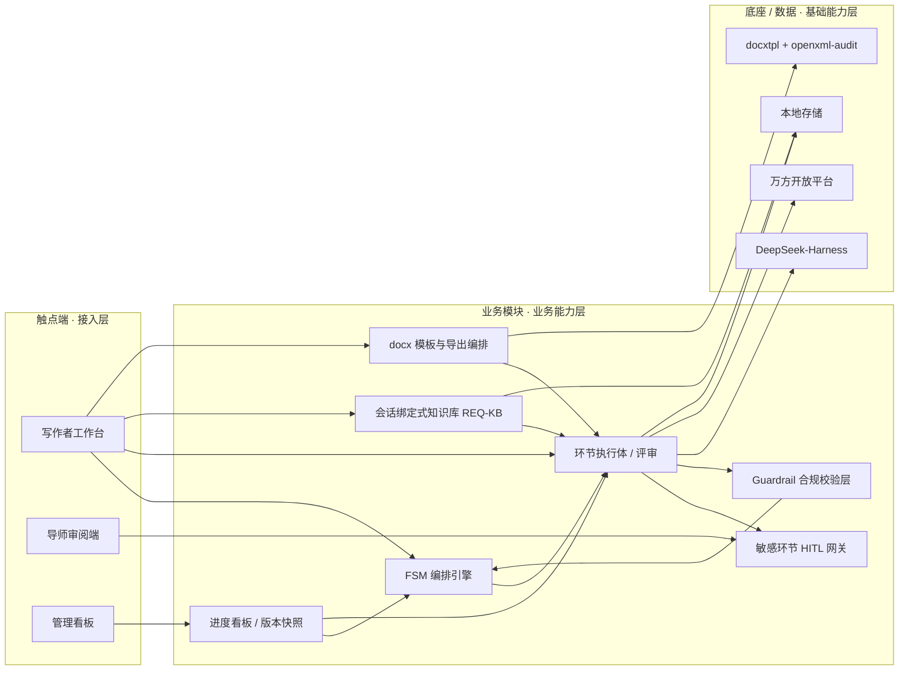

# AICoding 架构设计 · 高层架构设计

> 本文档为《AICoding 架构设计》核心产物之一，对应**高层架构设计模版**。
> 上游输入：业务原始诉求 + 行业调研结论（research_report.md）+ 业务底座摘要（material_digest.md）+ 主理人运行时元信息（_runtime_meta.md）；
> 下游输出：驱动《系统设计》《部署设计》《安全设计》《UserStory》四份文档的撰写（G4~G5）。

---

## 0. 元信息：修订记录

```yaml
标题: 基于 DeepSeek-Harness 的学位论文全流程写作 Agent - 高层架构设计 v0.1
版本: v0.1
状态: Draft   # Draft | Reviewing | Approved | Deprecated
创建日期: 2026-08-22
最后更新: 2026-08-22
作者: business-architect（许边界）
评审人:
  - team-lead / 主理人
  - 学位论文业务负责人

关联文档:
  上游输入:
    - 业务原始诉求 / 需求: _runtime_meta.md（§6 DSH 落地约束 / §7 U-04 HITL / §8 REQ-KB）
    - 业务底座摘要: material_digest.md（G1 冻结）
    - 行业调研报告: research_report.md（G2 定稿）
    - 现有架构知识库: 本地/私有化部署基线（见 §2.4）
  下游产出:
    - 系统设计: AICoding架构设计-2-系统设计.md
    - 部署设计: AICoding架构设计-3-部署设计.md
    - 安全设计: AICoding架构设计-4-安全设计.md
    - UserStory: AICoding架构设计-5-UserStory.md
```

| 版本 | 日期 | 作者 | 变更内容 | 评审状态 |
| --- | --- | --- | --- | --- |
| v0.1 | 2026-08-22 | business-architect | 初稿，完成十环节 FSM 业务架构 + REQ-KB 知识库模块 + HITL 网关纳入 | Draft |

> **版本管理纪律**：破坏性变更（章节结构调整 / 关键决策反转）升 MAJOR；新增章节、扩充内容升 MINOR。

---

## 1. 需求概要

### 1.1 需求概要说明

**业务现状**：研究生与科研人员撰写学位论文（本科/硕士/博士）周期长、返工率高，尤其在结构规范、格式排版、引用真实性与查重合规等方面依赖大量人工核对与经验判断。

**触发事件**：AI 辅助写作已成为刚需，但通用 AI 工具（纯 Prompt 编排类）缺乏「论文特有流程」的可校验、可回退、可审计管控——无法可靠表达十环节状态机、本硕博差异路由与回退环路，且存在跨阶段漂移、难审计、易出伪引等硬伤（research_report §3.2，O1 纯 Prompt 得分 2.60）。因此需要一个以**流程状态机**为核心、以**真实数据源**为依归、以**合规红线**为底线的学位论文全流程写作 Agent。

**系统定位一句话**：本系统是「以自研 FSM 编排层掌控题选→成稿十环节流程控制权，DeepSeek-Harness 仅作底层 LLM 运行依赖（不 fork、不大改），业务结构化数据独立落库，按用户自定义 Word 模板导出合规 docx，并以会话绑定式专属知识库（REQ-KB）支撑文献/笔记沉淀」的学位论文全流程写作 Agent。

### 1.2 关键决策摘要

**硬指标**：3 ~ 5 条；每条决策必须能映射到正文具体章节。

| 编号 | 决策类别 | 决策内容 | 关联章节 |
| --- | --- | --- | --- |
| D1 | 技术选型决策 | DSH 仅作底层 LLM 运行依赖，不 fork、不大改；上层自研 FSM 编排层掌控流程控制权 | §3.2 / §4.2 / §5.2 |
| D2 | 范围决策 | 业务结构化数据独立持久化（topic/literaturePool/outline/chapterDraft/citationMap/guardrailLog 等独立落库），不耦合进 DSH 内部 | §4.2 / §5.2 |
| D3 | MVP / 完整版边界 | MVP 覆盖十环节主链路（选题→定稿）+ 敏感环节 HITL 人工网关（环节 2/4/8/10 插桩）；完整版增强引用全量校验、模板格式规则库、协作审阅与生成式全文审校 | §4.3 / §6.3 |
| D4 | 复用 vs 新建 | DSH 底座复用（依赖方式引用）、docxtpl + openxml-audit 复用（模板导出+校验）、万方开放平台采购接入（真实数据源）；用户/会话、FSM 编排、论文格式规范库、引用格式库新建 | §2.4 / §5.2 |
| D5 | 部署形态 | 本地/私有化（MVP 单机）部署，面向国内教学/科研场景；隔离粒度 = 会话绑定式专属知识库（非多租户） | §4.2 / 部署设计 |

### 1.3 价值主张

**硬指标**：业务价值 ≥ 2 条 + 技术/成本价值 ≥ 1 条；每条必须可量化，禁止出现"提升 / 优化 / 加强 / 更好"等模糊词。

| 价值维度 | 量化目标 | 度量指标 | 当前值 | 目标值 | 截止时间 |
| --- | --- | --- | --- | --- | --- |
| 效率 | 全流程初稿产出周期缩短 | 从选题到可提交成稿的人天 | 60 人天 | ≤ 14 人天 | MVP 上线后 3 月 |
| 合规 | 引用真实性校验覆盖 | 关键引用/参考文献条目 100% 接真实数据源回溯（伪引 = 0） | 手工为主 | 100% | MVP 上线 |
| 成本 | 单篇写作资源消耗控制 | 单篇 LLM 调用 token 成本 | 无基准 | ≤ 目标预算（按 39.6 分钟/篇量级控） | MVP 上线 |
| 体验 | 写作者流程满意度 | 格式/引用合规一次通过率 | 实践中返工高 | ≥ 90% | MVP 上线后 3 月 |

---

## 2. 需求分析 & 痛点解构

### 2.1 核心角色关注点

**硬指标**：≥ 3 类（甲方决策者 / 最终用户 / 受影响方各至少一行）；每行必须有"Top1 关心点"，禁止笼统写"使用方便"。

> 核心角色清单及其关注点如下（角色 / 业务身份 / 主要操作 / Top1 关心点 / 来源）：

| 角色 | 业务身份 | 主要操作 | Top1 关心点 | 来源 |
| --- | --- | --- | --- | --- |
| 甲方决策者 | 院校/学院学位管理与科研管理者（决策角色） | 决策 / 审批 / 质量与合规看板 | 学术合规与质量可追溯（引用真实、无学术不端，一票否决） | _runtime_meta §5 |
| 最终用户 A | 学生/写作者（本科/硕士/博士）（写作角色） | 选题、撰写、导出、查重提醒 | 论文流程一次通过 + 格式合规 + 少返工 | material_digest §环节1~10 |
| 最终用户 B | 导师 / 审阅者（审阅角色） | 审阅、敏感环节确认、干预 | 论文质量与创新点可判断、可干预（HITL 插桩点） | _runtime_meta §7 U-04 |
| 受影响方：学术规范/查重 | 学位授予合规 / 查重监管（合规角色） | 审计 / 留痕 / 引用核验 | 引用真实可溯、无伪引、无学术不端 | material_digest §0.3 红线 |
| 受影响方：盲审/外审 | 学位评审流程（评审角色） | 盲审格式与材料核验 | 格式规范、前置件齐全、材料齐备 | material_digest §环节9/10 |

### 2.2 核心痛点

**硬指标**：每条痛点必须有"现象 / 数据"佐证；P1 ≥ 1 条且必须在 §2.3 有对应目标。

| 编号 | 痛点描述 | 现象 / 数据 | 影响角色 | 影响程度 | 优先级 |
| --- | --- | --- | --- | --- | --- |
| P1 | 论文结构、格式、引用不合规导致返工与学术风险 | 学位论文因格式/前置件/引用体例问题被退回比例高；伪引、张冠李戴、转引不核对属学术不端**一票否决**（material_digest §环节8、§0.3、§4；research_report R-05） | 学生 / 导师 / 院校管理者 / 学术合规方 | 高（合规风险） | P1 |
| P2 | 通用 AI 工具缺乏论文特有流程管控，易写一半跑偏、跨阶段漂移 | 纯 Prompt 编排无状态持久化、不可回退、跨阶段漂移（research_report §3.2 O1=2.60 场景契合 1/5、合规可控 1/5；B4 StructPO 仅针对单段引言需 RL 训练） | 学生 / 写作者 | 中 | P2 |
| P3 | 查新/文献调研/引用核验靠手工与凭感觉，易下错误结论 | 未接真实数据源时，"没查到"被误判为"没人做过"；万方召回有 50 篇上限，"50"代表"至少 50 篇、具体多少未知"（material_digest §数据说明；research_report R-02/R-03） | 学生 / 写作者 / 学术合规方 | 中（影响定稿与合规） | P2 |

**优先级标准**：
- **P1**：直接影响业务核心流程或合规底线，不解决无法上线。
- **P2**：影响用户体验或运营效率，可在 MVP 后迭代。
- **P3**：体验型 / 长尾问题，列入完整版或后续版本。

### 2.3 期待目标

**硬指标**：每条目标必须有**数字 + 对齐至少 1 条痛点**；P1 痛点必须有对应 V 级目标。

| 编号 | 目标描述 | 对齐痛点 | 度量指标 | 当前值 | 目标值 | 截止时间 |
| --- | --- | --- | --- | --- | --- | --- |
| V1 | 关键引用/参考文献 100% 接真实数据源回溯，伪引为 0 | P1 | 引用真实性校验覆盖率 / 伪引数 | 手工为主 | 100% / 0 | MVP 上线 |
| V2 | 全流程十环节 FSM 可编排、可回退、可审计，章节间一致 | P2 | 流程状态可回退覆盖率 / 跨阶段漂移告警 | 无状态机 | 100% 可回溯 | MVP 上线 |
| V3 | 格式/引用合规一次通过率达标、前置件齐全 | P1 | 一次通过率 / 前置件完整率 | 返工高 | ≥ 90% | MVP 上线后 3 月 |
| V4 | 查新/文献/引用结论有据可依，杜绝编造 | P3 | 评估类结论真实取数覆盖率 | 凭感觉 | 100% 接真实数据源 | MVP 上线 |

### 2.4 基线复用

**硬指标**：必须先盘点再决定新建；凡列入"功能缺口"的能力，必须先在本节确认基线无法覆盖。

| 复用类别 | 现有能力 | 复用方式 | 来源系统 | 备注 |
| --- | --- | --- | --- | --- |
| LLM 运行底座 | DeepSeek-Harness（插件化 Agent 运行时，Cordis 内核，一切皆插件） | 依赖方式引用（SDK），不 fork、不大改 | DSH（MIT 开源） | 自备模型 key（DeepSeek V4 或 OpenAI 兼容端点兜底）；锁定已验证稳定版本以规避开发者预览版破坏性变更（research_report R-01） |
| docx 模板生成 | docxtpl（Jinja2 + python-docx 模板驱动生成） | 模板库依赖（pip 安装） | 开源社区（MIT 开源） | 支持用户上传自定义 Word 模板、保留格式、所见即所得 |
| docx 合规校验 | openxml-audit（OOXML schema/加载/roundtrip 校验）+ 模板 XML 标签比对 | 模板库依赖 | 开源社区 | 捕获"会打不开/被 Word 修复"的损坏输出；需自建"模板 XML vs 标准模板"比对规则库（参照 PaperFormatDetection） |
| 真实数据源 | 万方开放平台（查新/文献/引文反查，GB/T 7714 生成） | 采购/接入（开放 API，app/token 认证） | 万方数据（机构订阅） | 需遵守"50 篇上限""没查到分两种""学科无名字"三条可信边界（material_digest §数据说明） |
| 用户/会话与鉴权 | 本地用户/会话配置 | 直接复用本地存储 | 本地/私有化基线 | MVP 单机本地部署（_runtime_meta §0） |
| 版本快照/审计 | 本地文件系统 + 过程版本目录 | 直接复用 | 本地存储 | 支撑回退与审计留痕 |

### 2.5 功能缺口

**硬指标**：每条缺口必须对齐 §2.3 至少一条目标；MVP 缺口必须在 §6.3 功能清单中对应有 MVP 范围标记。

| 阶段 | 功能缺口 | 必要性 | 优先级 | 对齐目标 |
| --- | --- | --- | --- | --- |
| 选题阶段（环1/2） | 选题初筛 + 新颖度评估（可接万方查新） | 必须 | MVP | V4 |
| 调研阶段（环3/4） | 文献检索建池 + 文献综述批判整合 | 必须 | MVP | V4 |
| 大纲/撰写阶段（环5/6/7） | 大纲搭建 + 分章节撰写 + 修改润色 | 必须 | MVP | V2 |
| 引用校验收（环8） | 引用/参考文献真实性校验（接万方引文反查） | 必须 | MVP | V1 |
| 排版阶段（环9） | 按用户自定义模板解析并导出合规 docx | 必须 | MVP | V3 |
| 定稿阶段（环10） | 全流程验收 + 查重提醒 + 版本快照归档 | 必须 | MVP | V3 |
| 敏感环节 HITL（环2/4/8/10） | 敏感环节人工网关插桩（确认选题/综述/引用/定稿） | 必须 | MVP | V1/V3 |
| 会话绑定式知识库（REQ-KB） | 自动/手动入库文献与笔记 + 双链/图谱/检索/导出 | 必须（用户追加冻结需求） | MVP（骨架）/完整版（图谱可视化） | V4 |
| 运营 | 全文进度看板 / 版本对比 / 归因分析 | 重要 | 完整版 | V2 |

---

## 3. 行业调研

### 3.1 行业标杆系统分析

**硬指标**：≥ 3 家；至少包含 1 家头部 SaaS/研究代表 + 1 家开源/自研代表。

| 标杆系统 | 厂商 / 来源 | 场景覆盖 | 技术亮点 | 商业模式 | 适用度 |
| --- | --- | --- | --- | --- | --- |
| DeepSeek-Harness (DSH) | DeepSeek AI（开源） | Agent Harness（模型→有工具的 Agent） | 一切皆插件（Cordis）、配置层组合、会话日志 append-only 可追溯 | MIT 开源 + 自带模型（自备 key） | 高（作底层依赖） |
| LangGraph | LangChain（开源） | 有状态 Agent 工作流编排 | 有向图状态机、checkpoint 持久化、原生 HITL、时间旅行调试 | MIT 开源 + LangSmith 商业版 | 高（FSM 编排对标） |
| PaperOrchestra | Google Cloud AI Research | 自动化论文写作（多智能体） | 5 专职 agent 顺序+并行、API 校验引用、模拟同行评审 | 研究发布（非商品） | 中（环节化分工借鉴） |
| 万方知识服务平台 / 万方选题 | 北京万方数据（商业化） | 中文文献检索 / 选题查新 / 引用核验 | 3 亿文献 + 5.4 亿引文 + 600 万学位论文、开放 API、GB/T 7714 生成 | 机构订阅 + API 认证 | 高（真实数据源） |
| docxtpl + openxml-audit | 开源社区 | Word 模板驱动生成 + OOXML 校验 | Jinja2 模板 + python-docx、schema/roundtrip 校验 | MIT / BSD 开源 | 高（docx 导出链路） |

### 3.2 方案对标及优先级打分

**对比矩阵**（每行权重之和 = 1.00；对比对象为三个待选编排范式，因本项目核心设计决策是"编排层选哪种范式"）：

| 评估维度 | 权重 | O1 纯 Prompt 编排 | O2 自研 FSM 编排 | O3 状态机 + 人工网关 |
| --- | --- | --- | --- | --- |
| 场景契合度 | 0.30 | 1 | 5 | 5 |
| 技术成熟度 | 0.20 | 3 | 4 | 4 |
| 集成难度（反向） | 0.15 | 5 | 3 | 2 |
| 成本（反向） | 0.15 | 5 | 4 | 3 |
| 合规可控性 | 0.20 | 1 | 4 | 5 |
| **加权总分** | **1.00** | **2.60** | **4.15** | **4.05** |

> 评分标尺：1 = 严重不符合，3 = 基本满足但存在明显局限，5 = 完美契合。
> 加权计算（依据 research_report §3.1）：O2 场景契合 5/5 最高、合规可控 4/5；O3 合规可控 5/5 最高（HITL 兜底学术红线）。O2 与 O3 差距极小（4.15 vs 4.05）。

**结论摘要**：
- **优先借鉴**：`自研 FSM 编排（O2）` —— 理由：场景契合度 5/5，能完整表达十环节状态机 + 回退环路 + 本硕博差异路由；技术成熟度 4/5（LangGraph 为对标先例）；合规可控 4/5。
- **确认采纳（HITL 增强）**：`状态机 + 人工网关（O3）` —— **经中间确认 U-04 裁决**采用其 HITL 增强，插桩于 4 个敏感环节：①环节 2 新颖度评估（确认选题方向与创新点定位）②环节 4 文献综述（确认研究空白与切入角度）③环节 8 引用校验（确认无伪引、引用真实）④环节 10 最终定稿（确认整体合规、查重风险）；其余 6 环节（选题、调研、大纲、撰写、润色、排版）全自动运行、不打断用户。
- **不借鉴（否决）**：`纯 Prompt 编排（O1）` —— 否决理由：场景契合 1/5（无法可靠表达回退循环与本硕博差异路由）、合规可控 1/5（无状态持久化、跨阶段漂移、难审计、不可回退、易出伪引），无法满足"可校验、可回退、可审计"的学位论文硬约束。

### 3.3 完整报告参考

- 完整报告链接：research_report.md（G2 定稿，见 output 目录归档）
- 调研工具：tech-research-advisor（见附录 B）
- 调研日期：2026-08-22
- 调研归档：.workbuddy/output/research_report.md

---

## 4. 方案决策

### 4.1 价值定位澄清

**定位三段式**（对外 / 对内 / 差异化）：

```
对外价值（客户侧）: 面向国内教学/科研场景，帮助学生与写作者把「选题→成稿」十环节论文流程从 60 人天压缩到 ≤14 人天，并按用户自定义 Word 模板导出格式合规、引用真实的 docx（产品价值对齐 §1.3 效率/合规）。
对内价值（运营侧）: 自研 FSM 编排层掌控流程控制权 + 敏感环节 HITL 人工网关兜底学术红线 + 全程状态可回退可审计 + 会话绑定式知识库沉淀文献/笔记，形成「流程可控 + 合规留痕 + 沉淀复用」的运营主线。
差异化价值: 相对通用 AI 写作工具（纯 Prompt 编排，无状态机、不可回退、易出伪引）与纯学术检索平台（无流程编排、不产 docx），本系统以「可校验、可回退、可审计的学位论文十环节状态机 + 真实数据源（万方）依归 + 合规红线置顶 + 会话绑定知识库」形成不可替代性（research_report §3.2 O2/O3 得分显著高于 O1）。
```

**与产品矩阵的关系**：本系统在「学位论文全流程写作价值主线」中承担**核心流程编排与合规底线**职责，与上游 DSH（LLM 运行底座）、万方（真实数据源）、docx 引擎（模板导出/校验）、本地存储（会话/知识库/版本快照）形成完整业务闭环（见 §5.2、§5.3）。

### 4.2 系统定位澄清

| 维度 | 内容 |
| --- | --- |
| 系统名称 | 基于 DeepSeek-Harness 的学位论文全流程写作 Agent |
| 系统类型 | 新建 |
| 部署形态 | 本地/私有化（MVP 单机），面向国内教学/科研场景（_runtime_meta §0） |
| 多租户 | 否（单机本地部署；隔离粒度 = 会话绑定式专属知识库 REQ-KB，见 §6/§8） |
| 服务对象 | 学生/写作者（本科/硕士/博士）、导师/审阅者、院校学位管理者（对齐 §2.1） |
| 上游依赖 | DeepSeek-Harness（LLM 运行）、万方开放平台（真实数据源）、docxtpl + openxml-audit（docx 导出/校验）、本地存储（会话/知识库/版本）（详见 §5.2） |
| 下游消费者 | 导出的合规 docx、版本快照归档、审阅/管理看板（详见 §5.2） |
| 边界（不做） | 不做论文查重数据库本身（对接第三方/提醒用户自建查重，_runtime_meta §8 与 research_report U-03）；不做模型训练；不做通用知识库（仅会话绑定式专属知识库） |

### 4.3 MVP 与完整版决策

| 阶段 | 时间窗 | 范围（功能编号） | 架构差异点 | 退出标准 | 不做（延后） |
| --- | --- | --- | --- | --- | --- |
| MVP | W1 ~ W6 | F1~F3（FSM 编排 + 十环节主链路）、F6（敏感环节 HITL 网关环节 2/4/8/10）、F7（docx 模板导出+校验）、F8（万方取数）、F9（REQ-KB 骨架：自动/手动入库、双链、本地检索、会话绑定与隔离）、F10（版本快照/回退） | 单机本地部署；敏感环节 HITL 以本地 UI 确认实现；万方接口如不可用则降级为"人工输入查新结论"（research_report U-01）；docx 校验先做基础 openxml-audit | 跑通十环节主链路 + 敏感环节 HITL 兜底 + 关键引用 100% 接真实数据源 + 格式/引用一次通过率 ≥ 90% | F4、F5（协作审阅、生成式全文审校）、F9 图谱可视化（完整版按需渲染）、模板格式规则库全量校验（research_report U-02） |
| 完整版 | W7 ~ W12 | + F4（引用全量校验+一致性）、F5（导师/审阅协作 + 生成式全文审校）、F9 图谱可视化与批量导出、模板格式规则库全量校验、查重接口接入（如可用） | 增加多版本对比与进度看板；图谱前端按需实时渲染（runtime §8.3，后台不持续运算）；查重接口增强 | 完整版在高可用与合规校验上达标、DAU/N 稳定运行 + 引用/格式全量合规校验通过 | — |

**演进纪律**（重要）：
- ✅ MVP 的架构骨架必须是完整版的**子集**：FSM 编排层、业务数据结构（topic/literaturePool/outline/chapterDraft/citationMap/guardrailLog）、REQ-KB 模块契约、HITL 网关、docx 导出链路在 MVP 即完整落地，不允许 MVP 上线后推倒重来。
- ✅ MVP 中可 Mock / 降级的能力（万方接口不可用、查重接口、模板格式规则库全量校验），在本节明确"完整版替换计划"：万方不可用→人工输入查新结论；查重→提醒用户自建；模板全量校验→由模板 XML 比对规则库补充。
- ❌ 禁止：MVP 为了赶工而引入"完整版无法继承"的临时架构（如 MVP 用单临时库存业务数据 → 完整版需分库/迁移）。本设计明确业务数据独立落库（runtime §6.2），MVP 即按最终表结构建表，避免迁移大改。

---

## 5. 业务架构设计

### 5.1 业务架构图

**绘制规范**：至少 3 层（接入层 → 业务能力层 → 基础能力层）；每个模块有标准名；数据流方向明确（实线=同步、虚线=异步事件、粗线=主链路）。

```mermaid
flowchart TB
    subgraph 接入层[接入层 · 触点端]
        U1[学生 / 写作者]
        U2[导师 / 审阅者]
        U3[院校学位管理者]
    end
    subgraph 业务能力层[业务能力层 · 核心模块]
        M1[FSM 编排引擎 · 十环节状态机 + 学位等级路由 + 回退]
        M2[环节执行体 · 选题/评估/调研/综述/大纲/撰写/润色/校验/排版/定稿]
        M3[敏感环节 HITL 人工网关]
        M4[Guardrail 合规校验层]
        M5[会话绑定式知识库 REQ-KB]
        M6[docx 模板解析与导出编排]
        M7[进度看板与版本快照]
    end
    subgraph 基础能力层[基础能力层 · 底座 / 数据]
        B1[DeepSeek-Harness · LLM 运行底座 依赖引用 不 fork]
        B2[万方开放平台 · 真实数据源 文档/查新/引文反查]
        B3[docxtpl + openxml-audit · 模板生成 + OOXML 校验]
        B4[本地存储 · 业务数据/会话/知识库/版本快照]
    end
    U1 -->|粗线 主链路| M1
    U2 --> M3
    U3 --> M7
    M1 -->|粗线 主链路| M2
    M2 --> M1
    M2 --> M4
    M2 -.敏感环节|-> M3
    M3 --> M1
    M4 --> M1
    M5 --> M2
    M5 --> B4
    M6 --> M2
    M6 --> B3
    M7 --> M1
    M2 --> B1
    M2 --> B2
    M2 --> B4
    M5 -.异步.-> M7
```

> 图上粗线（M1→M2）为主链路；虚线（M2→M3 敏感环节 HITL、M5→M7）为异步/事件；实线为同步调用。节点名与术语表（_runtime_meta §2）保持一致。

### 5.2 系统依赖架构

**硬指标**：每条依赖必须明确"接入方式 + 同步/异步 + 关键约束"；所有 P1 痛点对应的核心能力，必须能在本表中找到依赖来源。

| 依赖类型 | 系统 / 模块 | 提供方 | 依赖能力 | 接入方式 | 同步/异步 | 关键约束 |
| --- | --- | --- | --- | --- | --- | --- |
| 上游 | DeepSeek-Harness | DSH（MIT 开源） | LLM 推理/工具/会话能力 | SDK/依赖引用 | 同步 | 锁定已验证稳定版本；自备 key；OpenAI 兼容端点兜底（research_report R-01） |
| 上游 | 万方开放平台 | 万方数据 | 查新/文献检索/引文反查 | REST API + app/token | 同步/异步 | 遵守"50 篇上限""没查到分两种""学科无名字"；接口异常如实回避、不编造（material_digest §数据说明/§7） |
| 上游 | docxtpl | 开源 | 模板驱动生成 | Python 库 | 同步 | 依赖用户模板；中文字体/东亚洲字体设置 |
| 上游 | openxml-audit | 开源 | OOXML schema/roundtrip/load 校验 | Python 库/CLI | 同步 | 生成后立即校验；捕获损坏输出；规则库需自建 |
| 上游 | 本地存储 | 本机 | 会话/业务数据/知识库/版本快照 | 本地文件系统/DB | 同步 | 业务数据独立落库不耦合进 DSH（runtime §6.2）；知识库独立目录、与会话日志/FSM 状态分离（runtime §8.6） |
| 下游 | 合规 docx | 写作者 | 导出的 Word 文档 | 文件输出 | 同步 | 按用户自定义模板解析并导出；格式合规校验 |
| 下游 | 版本快照 | 归档 | 过程版本（供回退/审计） | 本地存储 | 异步 | 保留可追溯状态（material_digest §环节10/S5） |
| 复用底座 | 会话绑定式知识库 REQ-KB | 本系统 | 文献/笔记入库、双链/图谱、本地检索、批量引用导出 | 标准化 API | 同步/异步 | 独立模块与 FSM/DSH/docx 解耦（runtime §8.7）；Agent 仅新增+读取、不可删改（runtime §8.4）；跨会话禁止访问（runtime §8.1） |

### 5.3 业务闭环

**业务主链路**（端到端）：

```
用户创建会话/上传模板 → 环节1 选题 → 环节2 新颖度评估【HITL 确认】→ 环节3 文献调研 → 环节4 文献综述【HITL 确认】→ 环节5 大纲搭建 → 环节6 分章节撰写 → 环节7 修改润色 → 环节8 引用/参考文献校验【HITL 确认】→ 环节9 格式排版（导出合规 docx）→ 环节10 最终定稿【HITL 确认】→ 版本快照归档 → 反馈回路
```

**关键反馈回路**：

| 回路 | 触发点 | 反馈对象 | 反馈机制 | 价值 |
| --- | --- | --- | --- | --- |
| 业务效果回路 | 十环节验收通关（含 HITL 确认结果） | FSM 编排层 / 模板规则库 | 验收结果回流（四字段 output/accept/fallbackTo/issues） | 优化各环节阈值与路由 |
| 合规红线回路 | Guardrail 检出红线（伪引/查重/伦理/平权表达） | 敏感环节 HITL 网关 + 万方引文反查 | 实时告警 + 阻断 + 回退对应环节 | 兜底学术不端（一票否决） |
| 模型/生成质量回路 | 人工修订与 HITL 审阅意见 | 环节执行提示词 / 模板 / REQ-KB | 定期回流校准（按需） | 提升生成质量与格式合规率 |
| 知识沉淀回路 | 文献调研经验收 Gate + 用户笔记 | REQ-KB（会话绑定） | 自动/手动入库 + 双链/本地检索 | 支撑后续环节优先检索当前绑定库 |

**运营主线**：
- **每日**：导师/审阅者查看「敏感环节待确认」队列（环节 2/4/8/10），对 HITL 插桩点做人工确认与干预。
- **每周**：学生/写作者查看全文进度看板（十环节状态 + 版本快照），定位卡点与回退状态；院校管理者查看合规留痕看板。
- **每月**：管理人员做质量与合规归因分析（格式/引用一次通过率、红线命中分布），校准模板规则库与提示词。

---

## 6. 产品需求及原型

### 6.1 需求边界

**In-Scope**（本期必做，≤ 15 条）：

```
F1. 十环节 FSM 编排（选题/评估/调研/综述/大纲/撰写/润色/校验/排版/定稿）+ 学位等级本硕博路由 + 回退机制
F2. 业务结构化数据独立持久化（topic/literaturePool/outline/chapterDraft/citationMap/guardrailLog）
F3. 敏感环节 HITL 人工网关（环节 2/4/8/10 插桩，其余全自动）
F4. 用户上传自定义 Word 模板，按模板解析并导出合规 docx
F5. 万方真实数据源接入（查新/文献/引文反查；异常降级为人工输入）
F6. 会话绑定式专属知识库 REQ-KB（自动/手动入库、双链、本地检索、会话隔离）
F7. 版本快照与回退、进度看板
F8. 学术合规 Guardrail 置顶（伪引/查重/伦理/平权表达）
N1. 非功能：敏感环节 HITL 响应 P99 ≤ 目标值（对齐 V1/V3）
N2. 非功能：评估类结论 100% 接真实数据源，杜绝编造（对齐 V4）
```

**Out-of-Scope**（本期不做）：
| 编号 | 不做的事 | 原因 | 后续计划 |
| --- | --- | --- | --- |
| O1 | 论文查重数据库与查重算法本身 | 查重资源常为付费/第三方，未确认可用（research_report U-03）；_runtime_meta §8 说明自建查重为后续 | MVP 生成引用规范处理 + 提醒用户自建查重；查重接口作为完整版增强 |
| O2 | 盲审/外审自动化评审 | 依赖学校当年评审细则与外部评审系统，超本期边界（material_digest §环节10） | 完整版按需接入评审协同 |
| O3 | 非学位论文类通用写作（会议论文/外文/报告） | 本期范围锁定「中文本硕博学位论文」（_runtime_meta §0；D1 范围决策） | 后续版本视需要扩展 |
| O4 | 通用/开放共享知识库（跨用户共享库） | 用户诉求为会话绑定式专属知识库，明确禁止跨会话访问（runtime §8.1） | 仅保留「用户手动挂载其他独立库后开放跨库读取」能力 |
| O5 | 图谱可视化后台持续运算 | 图谱仅前端按需实时渲染，后台不持续运算以防阻塞主流程（runtime §8.3） | 完整版前端按需渲染 |

**硬指标**：In-Scope ≤ 15 条（实际 F1~F8 + N1~N2 = 10 条）；Out-of-Scope ≥ 3 条（实际 5 条）。

### 6.2 产品模块全景图

**模块卡片**字段：模块名称 / 一级归属 / 责任团队 / 上游 / 下游 / MVP 是否包含。



> 模块归属与责任团队对齐 G4/G5 分工：FSM 编排引擎、环节执行体、docx 导出、REQ-KB 为业务核心（business-architect 定边界，system-architect 细化）；Guardrail 合规校验层由 security-architect 深化；本地存储/资源由 platform-architect 规划；HITL 网关交互由 product-story-designer 出 UserStory。

### 6.3 功能清单

**硬指标**：每个 P0 功能必须在 MVP 范围 ✅；每个功能能反向映射到 §2.5 功能缺口 + §2.3 期待目标。

| 编号 | 一级模块 | 二级功能 | 功能描述 | 优先级 | MVP 范围 | 完整版范围 | 对齐目标 |
| --- | --- | --- | --- | --- | --- | --- | --- |
| F1 | FSM 编排引擎 | 十环节状态机 + 学位等级路由 + 回退 | 自研 FSM 掌控十环节流程控制权，按本硕博差异路由参数分流，回退带前驱指针保留上下文 | P0 | ✅ | ✅ | V2 |
| F2 | 环节执行体 | 各环节执行 + 验收（四字段） | 每环执行体输出 output/accept/fallbackTo/issues/evidence | P0 | ✅ | ✅ | V2 |
| F3 | 业务数据持久化 | topic/literaturePool/outline/chapterDraft/citationMap/guardrailLog | 业务结构化数据独立落库，不耦合进 DSH | P0 | ✅ | ✅ | V1 |
| F4 | 敏感环节 HITL 网关 | 环节 2/4/8/10 人工确认 | 敏感环节插桩人工确认（选题/综述/引用/定稿），其余全自动 | P0 | ✅ | ✅ | V1/V3 |
| F5 | docx 模板编排 | 模板解析 + 导出合规 docx | 按用户自定义 Word 模板解析并导出，保留格式 | P0 | ✅ | ✅ | V3 |
| F6 | docx 校验 | openxml-audit + 模板 XML 比对 | 生成后 OOXML schema/roundtrip 校验，捕获损坏输出 | P0 | ✅ | ✅ | V3 |
| F7 | 万方数据源 | 查新/文献/引文反查 | 接入万方开放平台，评估/调研/真实性核验接真实数据 | P0 | ✅ | ✅ | V4 |
| F8 | 敏感环节 HITL 网关 | 全流程人工把关 | 其余 6 环节是否人工把关（不做，全自动） | — | ❌ | ❌ | — |
| F9 | REQ-KB 知识库 | 文献/笔记入库、双链、本地检索、会话隔离 | 会话绑定式专属知识库，生命周期绑定、内容硬隔离、Agent 权限约束 | P0 | ✅ | ✅ | V4 |
| F10 | REQ-KB 知识库 | 图谱可视化、批量引用导出、标签管理 | 双链/图谱按需渲染、批量导出、标签管理 | P1 | ❌ | ✅ | V4 |
| F11 | 进度看板/版本快照 | 十环节进度 + 版本对比/回退 | 过程版本快照（供回退/审计），进度看板 | P0 | ✅ | ✅ | V2 |
| F12 | 审阅协作 | 导师/审阅协作与生成式全文审校 | 导师审阅留痕、生成式全文审校 | P1 | ❌ | ✅ | V2 |
| F13 | 合规 Guardrail | 伪引/查重/伦理/平权表达校验 | 学术规范红线置顶，独立校验层，关键环节插桩 | P0 | ✅ | ✅ | V1/V3 |
| F14 | 模板格式规则库 | 学校模板全量格式校验 | 按学校模板 XML 比对做全量格式合规校验 | P1 | ❌ | ✅ | V3 |
| F15 | 查重接口 | 查重结果接入 | 对接第三方查重（需可用资源） | P2 | ❌ | ✅ | V3 |

> 注：F8 为"不做"项在清单中以 ❌ 标识（不加分、不占用 MVP），确保「其余 6 环节全自动、不做全流程人工把关」的边界清晰；F9 为 REQ-KB 骨架（MVP 必做），F10 为完整版增强。

### 6.4 产品原型 - `写作者工作台`

> 本节小节标题（写作者工作台）为真实项目触点端命名。

**核心页面清单**：

| 页面 | 用途 | 关键交互 | MVP |
| --- | --- | --- | --- |
| 工作台主界面 | 十环节状态机全貌 + 当前环节 | 环节卡片点击进入、进度色标（进行中/通过/回退）、一键回到当前环节 | ✅ |
| 章节生成/撰写页 | 按大纲逐章节撰写、润色、分派任务 | 章节选择、生成/再生成、证据需求标记（needsEvidence） | ✅ |
| 敏感环节确认浮层 | 环节 2/4/8/10 人工确认（HITL） | 弹出「确认选题方向/研究空白/引用真实/整体合规」，通过→放行，不通过→回退对应环节 | ✅ |
| 大纲调整页 | 大纲结构化编辑（章/节/小节 + 目标字数/证据） | 拖拽/增删、动态扩容（博士可加独立成果章节） | ✅ |
| 引用核验页 | 正文引点 ↔ 文末文献一一对应核验 | 展示引用映射、真实性反查结果、伪引标红、一键修正 | ✅ |
| 知识库页面（REQ-KB） | 查看文献实体/用户笔记实体 | 双链跳转、本地全文检索、标签、手动入库、批量引用导出 | ❌（完整版图谱可视化） |

**关键交互约束**（对齐真实业务非功能要求）：
- 敏感环节 HITL 响应：触发到呈现 P99 ≤ 3s（对齐 V1/V3）。
- 核心路径：从「当前环节」到「完成并推进下一环节」主路径 ≤ 5 步。
- 评估类结论：凡查新/文献/引用真实性类展示，必须标注「真实取数来源（万方）」与「数据可信边界」（50 篇上限/没查到分两种），杜绝编造式结论。

**原型链接**：待产品评审后补充（Figma 线框稿）。

### 6.5 产品原型 - `管理 / 审阅端`

**核心页面清单**：

| 页面 | 用途 | 关键交互 | MVP |
| --- | --- | --- | --- |
| 敏感环节待确认队列 | 导师/审阅者确认环节 2/4/8/10 插桩点 | 筛选待确认项、查看上下文（创新点/综述/引用/定稿）、确认放行或打回 | ✅ |
| 全文进度看板 | 十环节状态 + 版本快照 + 回退轨迹 | 环节状态图标、版本对比、回退链路可视化 | ✅ |
| 合规留痕面板 | 学术红线 Guardrail 命中与处理记录 | 红线类型（伪引/查重/伦理/平权表达）、命中环节、处置动作 | ✅ |
| 质量归因页 | 格式/引用一次通过率、红线命中分布 | 多维下钻（按学位等级/环节/模板） | ❌（完整版） |

**原型链接**：待产品评审后补充（Figma 线框稿）。

### 6.6 产品原型 - `会话绑定式知识库（REQ-KB）`

**核心页面清单**：

| 页面 | 用途 | 关键交互 | MVP |
| --- | --- | --- | --- |
| 知识库总览 | 当前会话绑定知识库的文献实体/用户笔记实体 | 会话 ID ↔ 知识库 ID 强绑定标识、条目卡片 | ✅ |
| 文献自动入库 | 文献调研环节验收通过的检索文献自动入库 | 携带标准 GB/T 7714 引用格式 + 摘要 + 来源；无下载权限仅存元数据 | ✅ |
| 笔记编辑 | 用户手动新增/编辑 Markdown 笔记 | 双链语法 [[]]、标签管理、本地全文检索 | ✅ |
| 图谱视图 | 双链/关联类型可视化 | 前端按需实时渲染（后台不持续运算） | ❌（完整版） |

**关键交互约束**：
- 内容隔离：仅允许「文献调研经验收的检索文献」与「用户手动笔记」入库；会话对话日志/调试流水/闲聊**禁止自动入库**（仅用户显式指令可手动存对话片段）。
- 权限约束：Agent 仅有【新增调研文献 + 读取全库】权限，不可修改/删除知识库已有条目；编辑/删除权限完全交给用户。
- 生命周期：新建会话 → 自动创建绑定知识库；删除会话默认同步删除知识库（可手动开保护开关）；本地保留 7 天可恢复；跨会话禁止访问（仅手动挂载其他独立库后开放跨库读取）。

**原型链接**：待产品评审后补充（Figma 线框稿）。

---

## 附录 A：生成流程方法论

> 本附录为高层架构设计的**生成方法论**，描述每一步的目标、工具与产物形态，作为正文章节的产出依据。

### A.0 生成流程总览

> 高层架构设计采用 **Step0 → Step5** 六步法，逐步从「业务背景」推导至「系统高层架构 + 产品需求原型」。

| 步骤 | 名称 | 核心产出 | 落入正文章节 |
| --- | --- | --- | --- |
| Step0 | 业务基础知识库构建 | 关联文档结构化知识库 | （为全文提供输入） |
| Step1 | 行业调研分析 | 行业标杆 / 方案对比 / MVP 决策 | §3 行业调研 |
| Step2 | 需求分析 / 痛点解构 | 需求画像卡 | §2 需求分析 & 痛点解构 |
| Step3 | 能力盘点，系统定位 | 价值定位 + 系统定位 | §4 方案决策 / §5.2 系统依赖架构 |
| Step4 | 生成系统高层架构设计 | 本文档主文档 | §1 ~ §5 |
| Step5 | 产品需求及原型 | 需求边界 + 全景图 + 原型 | §6 产品需求及原型 |


### A.1 Step0：业务基础知识库构建

#### A.1.1 目标
构建业务系统关联信息知识库，为后续步骤提供「现有架构、外部依赖文档」等业务背景。

#### A.1.2 工具（Skill）
- `docx` / `pdf` / `pptx` / `xlsx`：解析 Word/PDF/PPT/Excel 类业务/产品文档（本项目业务底座为 md，见 material_digest）。

#### A.1.3 能力效果展示
> 本项目通过解析《学位论文全流程标准化规范_本硕博.md》，将十环节 FSM、本硕博差异、回退环路、红线与万方落位沉淀为可回溯业务知识库（见 material_digest.md）。

### A.2 Step1：行业调研分析

#### A.2.1 目标
基于当前需求，调研行业标杆系统及对应解决方案，**对标行业标杆的优秀方案**，结合当前系统背景及基础组件能力，**综合打分决策 MVP 功能和落地路径**。

#### A.2.2 工具（Skill）
- `tech-research-advisor`

#### A.2.3 完整报告参考
- 完整报告链接：research_report.md（G2 定稿，见 output 目录归档）

#### A.2.4 能力效果展示
> 调研围绕 DSH 依赖方式、编排范式、docx 导出、万方接入四命题，产出 B1~B6 标杆、O1/O2/O3 加权评分（O2=4.15、O3=4.05、O1=2.60），并经 U-04 中间确认裁决采纳"自研 FSM + 敏感环节 HITL 网关"组合。

### A.3 Step2：需求分析 / 痛点解构

#### A.3.1 目标
构建**需求画像卡**，深入解构需求要点及目标。

#### A.3.2 能力效果展示
> 按"核心角色关注点 / 核心痛点 / 期待目标 / 基线复用 / 功能缺口"五段式产出需求画像卡（对应正文 §2），并以 P1（格式/引用不合规致返工与学术风险）为核心痛点。

### A.4 Step3：能力盘点，系统定位

#### A.4.1 目标
- 从能力知识库中召回现有系统架构，与当前问题相关的已有能力，并完成**分层与去重**；
- **系统价值及能力嵌入**：明确需求 / 系统在当前架构中的价值定位；
- **系统架构定位、上下游推导**：让目标系统在图中"被看见"，并自动生成上下游关系说明。

#### A.4.2 产物形态
- 价值定位澄清（对应正文 §4.1）
- 系统定位澄清（对应正文 §4.2）
- 系统依赖架构图（对应正文 §5.2）

### A.5 Step4：生成系统高层架构设计

#### A.5.1 目标
整合行业分析、需求结构、现有项目背景知识库，输出**系统高层设计**（即本文档正文 §1 ~ §5）。

#### A.5.2 产物形态
- 需求概要（§1）
- 需求分析 & 痛点解构（§2）
- 行业调研（§3）
- 方案决策（§4）
- 业务架构设计（§5）

### A.6 Step5：产品需求及原型

#### A.6.1 目标
在系统高层设计的基础上，输出可被产品/研发直接消费的需求边界、功能清单与产品原型（即本文档正文 §6）。

#### A.6.2 产物形态
- 需求边界（§6.1）
- 产品模块全景图（§6.2）
- 功能清单（§6.3）
- 产品原型 - 写作者工作台（§6.4）
- 产品原型 - 管理/审阅端（§6.5）
- 产品原型 - 会话绑定式知识库 REQ-KB（§6.6）

---

## 附录 B：配套工具清单

### B.1 知识库 Skill
> 用途：解析存量知识库内容。
- `docx` / `pdf` / `pptx` / `xlsx`

### B.2 行业调研
> 用途：基于核心痛点与客户诉求，调研行业标杆项目及解决方案。
- `tech-research-advisor`

### B.3 图示生成
> 用途：生成业务架构图 / 模块全景图（本设计采用 Mermaid 内嵌，按模板规范）。
- `diagrams-generator`

---

## 附录 C：中间确认自检结果

> 按《阶段内中间确认协议》§2 执行。本阶段关键决策（DSH 仅作底层依赖、业务数据独立落库、自定义 Word 模板、十环节 FSM + 差异路由 + 回退 + 万方、自研 FSM + HITL 网关、REQ-KB 知识库）均已在 `_runtime_meta.md` §6/§7/§8 由上游冻结，未在本阶段产生新的"未冻结方案分歧"。

### C.1 触发标准自检（§2.1 方案分歧型）
- **判定：未命中。**
- 依据：
  - §2.1 条件 3（用户诉求/上游已冻结文档未对该具体决策点做出明确选择）**不成立**：本阶段全部关键决策点已在上游冻结——`_runtime_meta.md` §6.1「DSH 仅作底层依赖，不 fork、不大改，上层自研 FSM 编排层掌控流程控制权」、§6.2「业务结构化数据独立持久化」、§6.3「支持用户上传自定义 Word 模板，按模板解析并导出合规 docx」、§7 U-04「敏感环节必修 HITL（环节 2/4/8/10）」、§8「REQ-KB 会话绑定式专属知识库」。
  - 部署形态（本地/私有化 MVP 单机）由 `_runtime_meta.md` §0「面向国内教学/科研场景，MVP 以本地/单机与私有化部署为主」明确冻结，非本阶段新方案分歧。
  - 本阶段仅将上游冻结决策整合为 §1~§6 边界与模块，无业务方未明示且需我单方冻结的新方案分歧点。
- 注：本阶段修正了我上一轮意向中"多租户 SaaS"的假设——实际按 `_runtime_meta.md` §0 定为**本地/私有化（MVP 单机）**，隔离粒度=会话绑定式知识库。此为对齐上游冻结结论的更正，非新方案分歧。

### C.2 反向验证 3 问（§2.3）

| 问题 | 答案 | 证据 |
| --- | --- | --- |
| Q1：这个决策若 3 个月后被推翻，工程返工成本可控吗？ | 可控 | 本阶段产物= 高层架构设计.md（§1~§6），属**文档层**边界规划，不涉代码、工程架构、外部合同；返工范围 = 本文件 §2.5 功能缺口、§4.2 系统定位、§4.3 MVP 边界、§6.3 功能清单对应表格；切换成本 ≈ 单文档重写，不足 0.5 人日；且这些边界已与上游冻结决策（_runtime_meta §6/§7/§8）严格对齐，后续 G4/G5 据此深化，风险可控 |
| Q2：这个决策的结果，用户 / 客户 / 监管能感知到吗？ | 用户可感知（产品形态层面），但该感知由上游冻结决策决定，非本阶段新增 | 本阶段将"本地/私有化部署、敏感环节 HITL 人工确认、会话绑定式知识库、按用户模板导出合规 docx"纳入边界，这些**直接决定用户可见交互与产品形态**（学生上传模板后导出、导师在环节 2/4/8/10 人工确认、知识库与会话绑定）。判断依据：这些是 `_runtime_meta.md` §6/§7/§8 已冻结的用户诉求，属"已裁决"事项，按协议 §6 不得重复发起中间确认；本阶段仅将其落地为边界，未新增对外承诺或改变产品形态 |
| Q3：这个决策与用户原始诉求中显式提及的能力一致吗？ | 一致 | 直接引用原文：`_runtime_meta.md` §6.1「DSH 仅作底层依赖，不 fork、不大改，上层自研 FSM 编排层掌控流程控制权」；§6.2「业务结构化数据独立持久化，不耦合进 DSH 内部」；§6.3「支持用户上传自定义 Word 模板，按模板解析并导出合规 docx」；§7 U-04「敏感环节必修 HITL，插桩于环节 2/4/8/10」；§8「REQ-KB 会话绑定式专属知识库……必须作为独立的业务模块纳入 §5 业务架构图与 §6 产品需求」。本设计 §1.2/§4.2/§5.1/§6.2/§6.3 完整落地这些显式诉求 |

### C.3 综合结论
- **未命中任何触发标准**，无需在本阶段向 team-lead 发起 `[中间确认]`，可继续交付并进入人工审核。
- 本阶段所有关键决策点（DSH 依赖方式、自研 FSM 编排、业务数据独立落库、自定义 Word 模板导出、十环节 FSM + 差异路由 + 回退 + 万方、敏感环节 HITL 网关、REQ-KB 知识库）皆为上游冻结决策，未产生新的"未冻结方案分歧"（§2.1 条件 3 不成立），亦未在部署形态上偏离冻结诉求（§0 本地/私有化）。
- 特此说明：部署形态按 `_runtime_meta.md` §0 定为本地/私有化（MVP 单机），隔离粒度=会话绑定式知识库，非多租户 SaaS——此为对齐上游冻结结论的更正。

---

## 决策

`decision: "高层架构边界冻结，下游可进入"`

> 依据：本《高层架构设计》完整覆盖 §0~§6 + 附录 A/B/C，全部上游冻结决策（DSH 仅作底层依赖、业务数据独立落库、自定义 Word 模板、十环节 FSM + 差异路由 + 回退 + 万方、自研 FSM + HITL 网关、REQ-KB 知识库）已纳入对应章节；硬指标达标（核心角色 5 类、P1 ≥ 1 且对齐 V1/V3、标杆 5 家含 DSH/万方、5 维对比矩阵权重和 = 1.00、In-Scope 10 条 ≤ 15、Out-of-Scope 5 条 ≥ 3、P0 功能全部 ✅ MVP、三层业务架构图完整、业务闭环含主链路 + 4 反馈回路）；无占位符/示例残留，无待完善项。等待人工审核通过 G3。
